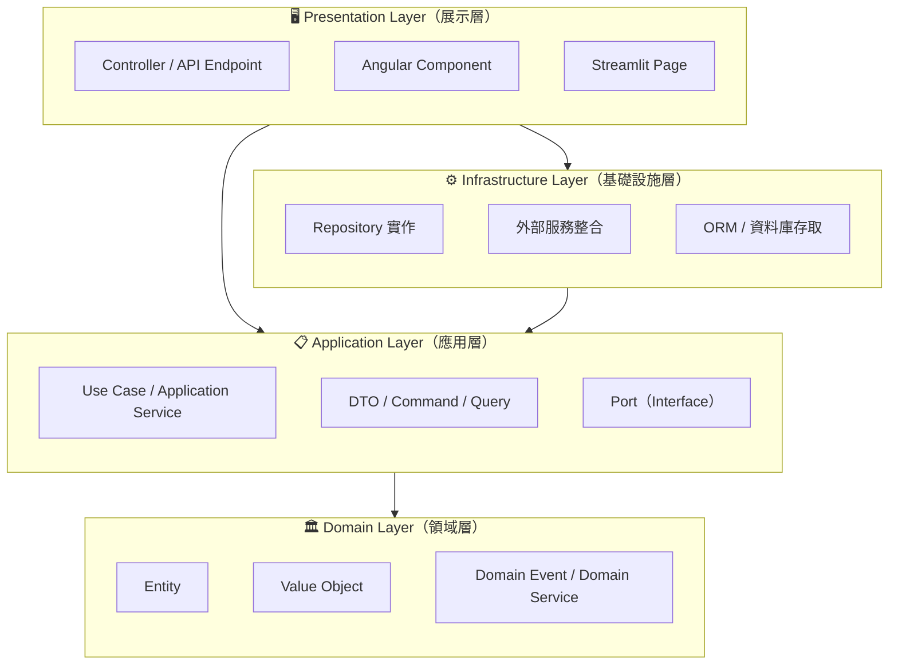
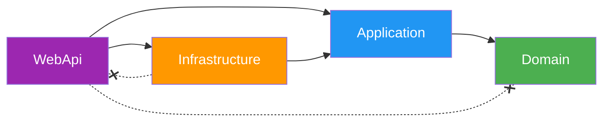
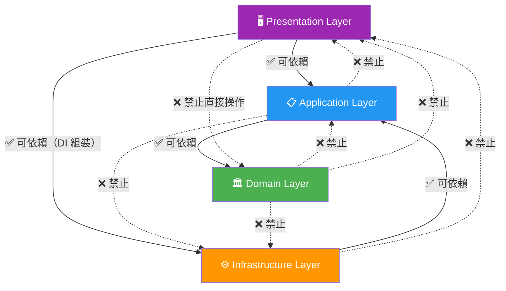

# Clean Architecture 標準

> 本文件定義公司內部 Clean Architecture 的分層規範、依賴方向規則、各技術棧專案結構，以及 Code Review 檢查清單。

---

## 1. 架構概述

### 1.1 核心理念

Clean Architecture 的目標是讓**商業邏輯獨立於框架、UI、資料庫與外部服務**，使系統具備以下特性：

- **可測試性**：商業邏輯可在不依賴外部元件的情況下進行單元測試。
- **框架獨立**：框架僅作為工具，而非系統核心。
- **可替換性**：資料庫、UI、外部服務皆可在不影響商業邏輯的前提下替換。
- **可維護性**：各層職責明確，降低變更的影響範圍。

### 1.2 同心圓架構



### 1.3 依賴規則（The Dependency Rule）

> **內層不可依賴外層。所有依賴方向必須由外向內指向。**

| 層級 | 可依賴 | 不可依賴 |
|------|--------|----------|
| Domain | 無（自身完備） | Application、Infrastructure、Presentation |
| Application | Domain | Infrastructure、Presentation |
| Infrastructure | Application、Domain | Presentation |
| Presentation | Application、Domain | — |

- 外層透過 **Dependency Injection** 將實作注入內層定義的介面（Port）。
- 內層僅定義介面，不引用外層的具體實作。

---

## 2. 分層定義

### 2.1 Domain Layer（領域層）

#### 職責

| 元件 | 說明 |
|------|------|
| **Entity** | 具有唯一識別（Identity）的領域物件，封裝核心商業規則 |
| **Value Object** | 無唯一識別、以屬性值定義相等性的不可變物件 |
| **Domain Event** | 領域中發生的重要事件，用於跨聚合根通知 |
| **Domain Service** | 不屬於任何單一 Entity 的領域邏輯 |

#### 規則

- ❌ **不可依賴任何外部框架**（不引用 EF Core、ASP.NET、SQLAlchemy 等）
- ❌ 不可包含資料庫存取、HTTP 呼叫等基礎設施邏輯
- ✅ 僅使用語言原生型別與標準函式庫
- ✅ 所有商業規則驗證應在此層完成

#### C# 範例（.NET 8）

```csharp
namespace MyCompany.Domain.Entities;

/// <summary>
/// 訂單聚合根
/// </summary>
public class Order
{
    public Guid Id { get; private set; }
    public string CustomerName { get; private set; } = string.Empty;
    public Money TotalAmount { get; private set; }
    public OrderStatus Status { get; private set; }

    private readonly List<OrderItem> _items = [];
    public IReadOnlyCollection<OrderItem> Items => _items.AsReadOnly();

    private readonly List<IDomainEvent> _domainEvents = [];
    public IReadOnlyCollection<IDomainEvent> DomainEvents => _domainEvents.AsReadOnly();

    private Order() { }

    public static Order Create(string customerName)
    {
        if (string.IsNullOrWhiteSpace(customerName))
            throw new DomainException("客戶名稱不可為空");

        var order = new Order
        {
            Id = Guid.NewGuid(),
            CustomerName = customerName,
            Status = OrderStatus.Pending,
            TotalAmount = Money.Zero("TWD")
        };

        order._domainEvents.Add(new OrderCreatedEvent(order.Id));
        return order;
    }

    public void AddItem(string productName, int quantity, Money unitPrice)
    {
        if (quantity <= 0)
            throw new DomainException("數量必須大於零");

        var item = new OrderItem(productName, quantity, unitPrice);
        _items.Add(item);
        TotalAmount = RecalculateTotal();
    }

    public void Confirm()
    {
        if (Status != OrderStatus.Pending)
            throw new DomainException("僅待處理訂單可確認");

        if (_items.Count == 0)
            throw new DomainException("訂單至少需包含一個項目");

        Status = OrderStatus.Confirmed;
        _domainEvents.Add(new OrderConfirmedEvent(Id));
    }

    private Money RecalculateTotal() =>
        _items.Aggregate(Money.Zero("TWD"), (sum, item) => sum.Add(item.Subtotal));
}
```

```csharp
namespace MyCompany.Domain.ValueObjects;

/// <summary>
/// 金額 Value Object — 不可變、以值比較相等性
/// </summary>
public sealed record Money(decimal Amount, string Currency)
{
    public static Money Zero(string currency) => new(0, currency);

    public Money Add(Money other)
    {
        if (Currency != other.Currency)
            throw new DomainException($"無法合併不同幣別：{Currency} 與 {other.Currency}");

        return this with { Amount = Amount + other.Amount };
    }
}
```

```csharp
namespace MyCompany.Domain.Events;

public interface IDomainEvent
{
    DateTime OccurredOn { get; }
}

public record OrderCreatedEvent(Guid OrderId) : IDomainEvent
{
    public DateTime OccurredOn { get; } = DateTime.UtcNow;
}

public record OrderConfirmedEvent(Guid OrderId) : IDomainEvent
{
    public DateTime OccurredOn { get; } = DateTime.UtcNow;
}
```

#### Python 範例

```python
# domain/entities/order.py
from __future__ import annotations

from dataclasses import dataclass, field
from enum import Enum
from uuid import UUID, uuid4

from domain.value_objects.money import Money
from domain.events.order_events import OrderCreatedEvent, OrderConfirmedEvent
from domain.exceptions import DomainException


class OrderStatus(Enum):
    PENDING = "pending"
    CONFIRMED = "confirmed"
    CANCELLED = "cancelled"


@dataclass
class OrderItem:
    product_name: str
    quantity: int
    unit_price: Money

    @property
    def subtotal(self) -> Money:
        return self.unit_price.multiply(self.quantity)


@dataclass
class Order:
    """訂單聚合根"""

    id: UUID
    customer_name: str
    status: OrderStatus
    total_amount: Money
    items: list[OrderItem] = field(default_factory=list)
    domain_events: list = field(default_factory=list)

    @staticmethod
    def create(customer_name: str) -> Order:
        if not customer_name or not customer_name.strip():
            raise DomainException("客戶名稱不可為空")

        order = Order(
            id=uuid4(),
            customer_name=customer_name,
            status=OrderStatus.PENDING,
            total_amount=Money.zero("TWD"),
        )
        order.domain_events.append(OrderCreatedEvent(order_id=order.id))
        return order

    def add_item(self, product_name: str, quantity: int, unit_price: Money) -> None:
        if quantity <= 0:
            raise DomainException("數量必須大於零")

        item = OrderItem(product_name=product_name, quantity=quantity, unit_price=unit_price)
        self.items.append(item)
        self.total_amount = self._recalculate_total()

    def confirm(self) -> None:
        if self.status != OrderStatus.PENDING:
            raise DomainException("僅待處理訂單可確認")
        if not self.items:
            raise DomainException("訂單至少需包含一個項目")

        self.status = OrderStatus.CONFIRMED
        self.domain_events.append(OrderConfirmedEvent(order_id=self.id))

    def _recalculate_total(self) -> Money:
        total = Money.zero("TWD")
        for item in self.items:
            total = total.add(item.subtotal)
        return total
```

```python
# domain/value_objects/money.py
from __future__ import annotations

from dataclasses import dataclass

from domain.exceptions import DomainException


@dataclass(frozen=True)
class Money:
    """金額 Value Object — 不可變、以值比較相等性"""

    amount: float
    currency: str

    @staticmethod
    def zero(currency: str) -> Money:
        return Money(amount=0, currency=currency)

    def add(self, other: Money) -> Money:
        if self.currency != other.currency:
            raise DomainException(f"無法合併不同幣別：{self.currency} 與 {other.currency}")
        return Money(amount=self.amount + other.amount, currency=self.currency)

    def multiply(self, factor: int) -> Money:
        return Money(amount=self.amount * factor, currency=self.currency)
```

---

### 2.2 Application Layer（應用層）

#### 職責

| 元件 | 說明 |
|------|------|
| **Use Case / Application Service** | 編排領域物件完成特定業務場景 |
| **DTO（Data Transfer Object）** | 跨層資料傳輸結構 |
| **Port（Interface）** | 定義外部依賴的抽象介面（Repository、外部服務） |
| **Command / Query** | CQRS 模式中的請求物件 |

#### 規則

- ✅ 可依賴 Domain Layer
- ❌ 不可依賴 Infrastructure 或 Presentation
- ✅ 透過 Port（Interface）定義外部依賴，由 Infrastructure 層實作
- ✅ 一個 Use Case 對應一個明確的業務場景

#### CQRS 模式說明

```
┌────────────────────────────────────────────┐
│              Application Layer             │
│                                            │
│  ┌──────────────┐    ┌──────────────────┐  │
│  │   Command     │    │     Query        │  │
│  │  (寫入操作)    │    │   (讀取操作)      │  │
│  │              │    │                  │  │
│  │ CreateOrder  │    │ GetOrderById     │  │
│  │ ConfirmOrder │    │ ListOrders       │  │
│  │ CancelOrder  │    │ GetOrderSummary  │  │
│  └──────┬───────┘    └────────┬─────────┘  │
│         │                     │            │
│  ┌──────▼───────┐    ┌───────▼──────────┐  │
│  │ Command      │    │  Query           │  │
│  │ Handler      │    │  Handler         │  │
│  │ (修改狀態)    │    │  (不修改狀態)     │  │
│  └──────────────┘    └──────────────────┘  │
└────────────────────────────────────────────┘
```

- **Command**：代表一個改變系統狀態的意圖（如建立訂單、確認訂單）。
- **Query**：代表一個讀取資料的請求（如查詢訂單明細）。
- **Handler**：處理 Command 或 Query 的業務邏輯。
- Command Handler 可觸發 Domain Event，Query Handler 不可修改任何狀態。

#### C# 範例（MediatR 風格）

```csharp
namespace MyCompany.Application.Orders.Commands;

// Command 定義
public record CreateOrderCommand(string CustomerName) : IRequest<Guid>;

// Command Handler
public class CreateOrderCommandHandler(IOrderRepository orderRepository, IUnitOfWork unitOfWork)
    : IRequestHandler<CreateOrderCommand, Guid>
{
    public async Task<Guid> Handle(CreateOrderCommand request, CancellationToken cancellationToken)
    {
        var order = Order.Create(request.CustomerName);

        await orderRepository.AddAsync(order, cancellationToken);
        await unitOfWork.SaveChangesAsync(cancellationToken);

        return order.Id;
    }
}
```

```csharp
namespace MyCompany.Application.Orders.Queries;

// Query 定義
public record GetOrderByIdQuery(Guid OrderId) : IRequest<OrderDto?>;

// DTO
public record OrderDto(Guid Id, string CustomerName, decimal TotalAmount, string Status);

// Query Handler
public class GetOrderByIdQueryHandler(IOrderReadRepository readRepository)
    : IRequestHandler<GetOrderByIdQuery, OrderDto?>
{
    public async Task<OrderDto?> Handle(GetOrderByIdQuery request, CancellationToken cancellationToken)
    {
        return await readRepository.GetByIdAsync(request.OrderId, cancellationToken);
    }
}
```

```csharp
namespace MyCompany.Application.Ports;

// Port — 由 Infrastructure 層實作
public interface IOrderRepository
{
    Task<Order?> GetByIdAsync(Guid id, CancellationToken cancellationToken = default);
    Task AddAsync(Order order, CancellationToken cancellationToken = default);
}

public interface IOrderReadRepository
{
    Task<OrderDto?> GetByIdAsync(Guid id, CancellationToken cancellationToken = default);
    Task<IReadOnlyList<OrderDto>> ListAsync(CancellationToken cancellationToken = default);
}

public interface IUnitOfWork
{
    Task<int> SaveChangesAsync(CancellationToken cancellationToken = default);
}
```

#### Python 範例

```python
# application/ports/order_repository.py
from abc import ABC, abstractmethod
from uuid import UUID

from domain.entities.order import Order


class IOrderRepository(ABC):
    """Port — 由 Infrastructure 層實作"""

    @abstractmethod
    async def get_by_id(self, order_id: UUID) -> Order | None: ...

    @abstractmethod
    async def add(self, order: Order) -> None: ...

    @abstractmethod
    async def save_changes(self) -> None: ...
```

```python
# application/orders/create_order.py
from dataclasses import dataclass
from uuid import UUID

from domain.entities.order import Order
from application.ports.order_repository import IOrderRepository


@dataclass(frozen=True)
class CreateOrderCommand:
    customer_name: str


class CreateOrderHandler:
    """Use Case: 建立訂單"""

    def __init__(self, order_repository: IOrderRepository) -> None:
        self._order_repository = order_repository

    async def handle(self, command: CreateOrderCommand) -> UUID:
        order = Order.create(command.customer_name)

        await self._order_repository.add(order)
        await self._order_repository.save_changes()

        return order.id
```

```python
# application/orders/get_order.py
from dataclasses import dataclass
from uuid import UUID

from application.ports.order_read_repository import IOrderReadRepository


@dataclass(frozen=True)
class GetOrderByIdQuery:
    order_id: UUID


@dataclass(frozen=True)
class OrderDto:
    id: UUID
    customer_name: str
    total_amount: float
    status: str


class GetOrderByIdHandler:
    """Use Case: 查詢訂單"""

    def __init__(self, read_repository: IOrderReadRepository) -> None:
        self._read_repository = read_repository

    async def handle(self, query: GetOrderByIdQuery) -> OrderDto | None:
        return await self._read_repository.get_by_id(query.order_id)
```

---

### 2.3 Infrastructure Layer（基礎設施層）

#### 職責

| 元件 | 說明 |
|------|------|
| **Repository 實作** | 實作 Application Layer 定義的 Port（Interface） |
| **外部服務整合** | 呼叫第三方 API、訊息佇列等 |
| **ORM 設定** | Entity Framework Core / SQLAlchemy 設定 |
| **資料庫遷移** | Migration 檔案管理 |

#### 規則

- ✅ 可依賴 Application Layer 與 Domain Layer
- ❌ 不可依賴 Presentation Layer
- ✅ 此層是唯一可使用外部框架（EF Core、SQLAlchemy 等）的地方
- ✅ 實作 Application Layer 定義的所有 Port

#### C# 範例（Entity Framework Core）

```csharp
namespace MyCompany.Infrastructure.Persistence;

public class AppDbContext(DbContextOptions<AppDbContext> options)
    : DbContext(options), IUnitOfWork
{
    public DbSet<Order> Orders => Set<Order>();
    public DbSet<OrderItem> OrderItems => Set<OrderItem>();

    protected override void OnModelCreating(ModelBuilder modelBuilder)
    {
        modelBuilder.ApplyConfigurationsFromAssembly(typeof(AppDbContext).Assembly);
    }
}
```

```csharp
namespace MyCompany.Infrastructure.Persistence.Configurations;

public class OrderConfiguration : IEntityTypeConfiguration<Order>
{
    public void Configure(EntityTypeBuilder<Order> builder)
    {
        builder.ToTable("Orders");
        builder.HasKey(o => o.Id);

        builder.Property(o => o.CustomerName)
            .IsRequired()
            .HasMaxLength(200);

        builder.OwnsOne(o => o.TotalAmount, money =>
        {
            money.Property(m => m.Amount).HasColumnName("TotalAmount").HasPrecision(18, 2);
            money.Property(m => m.Currency).HasColumnName("Currency").HasMaxLength(3);
        });

        builder.HasMany(o => o.Items)
            .WithOne()
            .HasForeignKey("OrderId");

        // Domain Events 不對應資料庫
        builder.Ignore(o => o.DomainEvents);
    }
}
```

```csharp
namespace MyCompany.Infrastructure.Repositories;

public class OrderRepository(AppDbContext dbContext) : IOrderRepository
{
    public async Task<Order?> GetByIdAsync(Guid id, CancellationToken cancellationToken = default)
    {
        return await dbContext.Orders
            .Include(o => o.Items)
            .FirstOrDefaultAsync(o => o.Id == id, cancellationToken);
    }

    public async Task AddAsync(Order order, CancellationToken cancellationToken = default)
    {
        await dbContext.Orders.AddAsync(order, cancellationToken);
    }
}
```

```csharp
namespace MyCompany.Infrastructure;

// DI 註冊 — 於 Infrastructure 層統一管理
public static class DependencyInjection
{
    public static IServiceCollection AddInfrastructure(
        this IServiceCollection services,
        IConfiguration configuration)
    {
        services.AddDbContext<AppDbContext>(options =>
            options.UseSqlServer(configuration.GetConnectionString("DefaultConnection")));

        services.AddScoped<IUnitOfWork>(sp => sp.GetRequiredService<AppDbContext>());
        services.AddScoped<IOrderRepository, OrderRepository>();
        services.AddScoped<IOrderReadRepository, OrderReadRepository>();

        return services;
    }
}
```

#### Python 範例（SQLAlchemy）

```python
# infrastructure/persistence/models.py
from sqlalchemy import Column, String, Float, Enum, ForeignKey
from sqlalchemy.dialects.postgresql import UUID as PG_UUID
from sqlalchemy.orm import relationship, DeclarativeBase
import uuid


class Base(DeclarativeBase):
    pass


class OrderModel(Base):
    __tablename__ = "orders"

    id = Column(PG_UUID(as_uuid=True), primary_key=True, default=uuid.uuid4)
    customer_name = Column(String(200), nullable=False)
    total_amount = Column(Float, nullable=False, default=0)
    currency = Column(String(3), nullable=False, default="TWD")
    status = Column(String(20), nullable=False, default="pending")

    items = relationship("OrderItemModel", back_populates="order", cascade="all, delete-orphan")


class OrderItemModel(Base):
    __tablename__ = "order_items"

    id = Column(PG_UUID(as_uuid=True), primary_key=True, default=uuid.uuid4)
    order_id = Column(PG_UUID(as_uuid=True), ForeignKey("orders.id"), nullable=False)
    product_name = Column(String(200), nullable=False)
    quantity = Column(Float, nullable=False)
    unit_price = Column(Float, nullable=False)

    order = relationship("OrderModel", back_populates="items")
```

```python
# infrastructure/repositories/order_repository.py
from uuid import UUID

from sqlalchemy.ext.asyncio import AsyncSession
from sqlalchemy import select
from sqlalchemy.orm import selectinload

from domain.entities.order import Order, OrderItem, OrderStatus
from domain.value_objects.money import Money
from application.ports.order_repository import IOrderRepository
from infrastructure.persistence.models import OrderModel, OrderItemModel


class SqlAlchemyOrderRepository(IOrderRepository):
    """實作 Application Layer 定義的 IOrderRepository Port"""

    def __init__(self, session: AsyncSession) -> None:
        self._session = session

    async def get_by_id(self, order_id: UUID) -> Order | None:
        stmt = (
            select(OrderModel)
            .options(selectinload(OrderModel.items))
            .where(OrderModel.id == order_id)
        )
        result = await self._session.execute(stmt)
        model = result.scalar_one_or_none()

        if model is None:
            return None

        return self._to_domain(model)

    async def add(self, order: Order) -> None:
        model = self._to_model(order)
        self._session.add(model)

    async def save_changes(self) -> None:
        await self._session.commit()

    @staticmethod
    def _to_domain(model: OrderModel) -> Order:
        items = [
            OrderItem(
                product_name=item.product_name,
                quantity=int(item.quantity),
                unit_price=Money(amount=item.unit_price, currency=model.currency),
            )
            for item in model.items
        ]

        return Order(
            id=model.id,
            customer_name=model.customer_name,
            status=OrderStatus(model.status),
            total_amount=Money(amount=model.total_amount, currency=model.currency),
            items=items,
        )

    @staticmethod
    def _to_model(order: Order) -> OrderModel:
        return OrderModel(
            id=order.id,
            customer_name=order.customer_name,
            total_amount=order.total_amount.amount,
            currency=order.total_amount.currency,
            status=order.status.value,
            items=[
                OrderItemModel(
                    product_name=item.product_name,
                    quantity=item.quantity,
                    unit_price=item.unit_price.amount,
                )
                for item in order.items
            ],
        )
```

---

### 2.4 Presentation Layer（展示層）

#### 職責

| 元件 | 說明 |
|------|------|
| **Controller / API Endpoint** | 接收 HTTP 請求，委派給 Application Layer |
| **Angular Component** | 前端 UI 元件，呼叫 API Client |
| **Streamlit Page** | Python 資料應用程式的頁面 |

#### 規則

- ✅ 可依賴 Application Layer
- ❌ 不可直接操作 Domain Entity（應透過 DTO）
- ❌ 不可直接存取資料庫
- ✅ 負責輸入驗證（格式驗證），商業規則驗證由 Domain 層處理

#### .NET 8 Web API Controller 範例

```csharp
namespace MyCompany.WebApi.Controllers;

[ApiController]
[Route("api/[controller]")]
public class OrdersController(ISender mediator) : ControllerBase
{
    [HttpPost]
    [ProducesResponseType(typeof(Guid), StatusCodes.Status201Created)]
    [ProducesResponseType(StatusCodes.Status400BadRequest)]
    public async Task<IActionResult> Create(
        [FromBody] CreateOrderRequest request,
        CancellationToken cancellationToken)
    {
        var command = new CreateOrderCommand(request.CustomerName);
        var orderId = await mediator.Send(command, cancellationToken);

        return CreatedAtAction(nameof(GetById), new { id = orderId }, orderId);
    }

    [HttpGet("{id:guid}")]
    [ProducesResponseType(typeof(OrderDto), StatusCodes.Status200OK)]
    [ProducesResponseType(StatusCodes.Status404NotFound)]
    public async Task<IActionResult> GetById(Guid id, CancellationToken cancellationToken)
    {
        var query = new GetOrderByIdQuery(id);
        var order = await mediator.Send(query, cancellationToken);

        return order is not null ? Ok(order) : NotFound();
    }
}

// Request Model（Presentation 層的輸入模型，非 Domain 的一部分）
public record CreateOrderRequest(string CustomerName);
```

#### Angular 17 Component 範例

```typescript
// presentation/orders/order-list/order-list.component.ts
import { Component, inject, OnInit, signal } from '@angular/core';
import { CommonModule } from '@angular/common';
import { RouterLink } from '@angular/router';
import { OrderApiClient } from '../../../infrastructure/api-clients/order-api-client.service';
import { OrderDto } from '../../../application/dtos/order.dto';

@Component({
  selector: 'app-order-list',
  standalone: true,
  imports: [CommonModule, RouterLink],
  template: `
    <h2>訂單列表</h2>

    @if (loading()) {
      <p>載入中...</p>
    }

    @for (order of orders(); track order.id) {
      <div class="order-card">
        <span>{{ order.customerName }}</span>
        <span>{{ order.totalAmount | currency: 'TWD' }}</span>
        <span>{{ order.status }}</span>
        <a [routerLink]="['/orders', order.id]">檢視</a>
      </div>
    }
  `,
})
export class OrderListComponent implements OnInit {
  private readonly orderApi = inject(OrderApiClient);

  readonly orders = signal<OrderDto[]>([]);
  readonly loading = signal(true);

  ngOnInit(): void {
    this.orderApi.list().subscribe({
      next: (data) => {
        this.orders.set(data);
        this.loading.set(false);
      },
      error: () => this.loading.set(false),
    });
  }
}
```

```typescript
// infrastructure/api-clients/order-api-client.service.ts
import { Injectable, inject } from '@angular/core';
import { HttpClient } from '@angular/common/http';
import { Observable } from 'rxjs';
import { OrderDto } from '../../application/dtos/order.dto';
import { environment } from '../../../environments/environment';

@Injectable({ providedIn: 'root' })
export class OrderApiClient {
  private readonly http = inject(HttpClient);
  private readonly baseUrl = `${environment.apiUrl}/api/orders`;

  list(): Observable<OrderDto[]> {
    return this.http.get<OrderDto[]>(this.baseUrl);
  }

  getById(id: string): Observable<OrderDto> {
    return this.http.get<OrderDto>(`${this.baseUrl}/${id}`);
  }

  create(request: { customerName: string }): Observable<string> {
    return this.http.post<string>(this.baseUrl, request);
  }
}
```

#### Python Streamlit 範例

```python
# presentation/pages/orders.py
import streamlit as st

from application.orders.get_order import GetOrderByIdHandler, GetOrderByIdQuery
from application.orders.create_order import CreateOrderHandler, CreateOrderCommand
from infrastructure.repositories.order_repository import SqlAlchemyOrderRepository
from infrastructure.persistence.database import get_session


def get_order_handlers():
    session = get_session()
    repository = SqlAlchemyOrderRepository(session)
    return CreateOrderHandler(repository), GetOrderByIdHandler(repository)


st.title("📦 訂單管理")

tab_create, tab_query = st.tabs(["建立訂單", "查詢訂單"])

with tab_create:
    with st.form("create_order_form"):
        customer_name = st.text_input("客戶名稱")
        submitted = st.form_submit_button("建立")

        if submitted and customer_name:
            import asyncio

            create_handler, _ = get_order_handlers()
            command = CreateOrderCommand(customer_name=customer_name)
            order_id = asyncio.run(create_handler.handle(command))
            st.success(f"訂單已建立！ID: {order_id}")

with tab_query:
    order_id_input = st.text_input("訂單 ID")
    if st.button("查詢") and order_id_input:
        import asyncio
        from uuid import UUID

        _, query_handler = get_order_handlers()
        query = GetOrderByIdQuery(order_id=UUID(order_id_input))
        result = asyncio.run(query_handler.handle(query))

        if result:
            st.json({
                "id": str(result.id),
                "customer_name": result.customer_name,
                "total_amount": result.total_amount,
                "status": result.status,
            })
        else:
            st.warning("找不到該訂單")
```

---

## 3. .NET 8 專案結構規範

### 3.1 目錄結構

```
Solution/
├── src/
│   ├── MyCompany.Domain/                  # 領域層
│   │   ├── Entities/
│   │   ├── ValueObjects/
│   │   ├── Events/
│   │   ├── Exceptions/
│   │   ├── Services/
│   │   └── MyCompany.Domain.csproj
│   │
│   ├── MyCompany.Application/            # 應用層
│   │   ├── Common/
│   │   │   ├── Behaviors/                # MediatR Pipeline Behaviors
│   │   │   └── Interfaces/              # Port 定義
│   │   ├── Orders/
│   │   │   ├── Commands/
│   │   │   │   ├── CreateOrder/
│   │   │   │   │   ├── CreateOrderCommand.cs
│   │   │   │   │   └── CreateOrderCommandHandler.cs
│   │   │   │   └── ConfirmOrder/
│   │   │   └── Queries/
│   │   │       └── GetOrderById/
│   │   │           ├── GetOrderByIdQuery.cs
│   │   │           ├── GetOrderByIdQueryHandler.cs
│   │   │           └── OrderDto.cs
│   │   └── MyCompany.Application.csproj
│   │
│   ├── MyCompany.Infrastructure/          # 基礎設施層
│   │   ├── Persistence/
│   │   │   ├── Configurations/
│   │   │   ├── Migrations/
│   │   │   └── AppDbContext.cs
│   │   ├── Repositories/
│   │   ├── ExternalServices/
│   │   ├── DependencyInjection.cs
│   │   └── MyCompany.Infrastructure.csproj
│   │
│   └── MyCompany.WebApi/                 # 展示層
│       ├── Controllers/
│       ├── Middleware/
│       ├── Filters/
│       ├── Program.cs
│       └── MyCompany.WebApi.csproj
│
├── tests/
│   ├── MyCompany.Domain.Tests/
│   ├── MyCompany.Application.Tests/
│   └── MyCompany.Infrastructure.Tests/
│
└── MyCompany.sln
```

### 3.2 Namespace 命名規則

| 專案 | Namespace 根 | 範例 |
|------|-------------|------|
| Domain | `MyCompany.Domain` | `MyCompany.Domain.Entities.Order` |
| Application | `MyCompany.Application` | `MyCompany.Application.Orders.Commands.CreateOrderCommand` |
| Infrastructure | `MyCompany.Infrastructure` | `MyCompany.Infrastructure.Repositories.OrderRepository` |
| WebApi | `MyCompany.WebApi` | `MyCompany.WebApi.Controllers.OrdersController` |

### 3.3 專案參考規則



| 專案 | 可參考 | 不可參考 |
|------|--------|----------|
| Domain | 無 | Application、Infrastructure、WebApi |
| Application | Domain | Infrastructure、WebApi |
| Infrastructure | Application、Domain | WebApi |
| WebApi | Application、Infrastructure | Domain（直接參考）※ |

> ※ WebApi 專案通常會因 DI 註冊而間接參考 Domain，但 Controller 中**不應直接操作 Entity**，而是透過 Application Layer 的 Command / Query。

---

## 4. Python 專案結構規範

### 4.1 目錄結構

```
project/
├── domain/                        # 領域層
│   ├── __init__.py
│   ├── entities/
│   │   ├── __init__.py
│   │   └── order.py
│   ├── value_objects/
│   │   ├── __init__.py
│   │   └── money.py
│   ├── events/
│   │   ├── __init__.py
│   │   └── order_events.py
│   ├── services/
│   │   └── __init__.py
│   └── exceptions.py
│
├── application/                   # 應用層
│   ├── __init__.py
│   ├── ports/
│   │   ├── __init__.py
│   │   ├── order_repository.py
│   │   └── order_read_repository.py
│   └── orders/
│       ├── __init__.py
│       ├── create_order.py
│       └── get_order.py
│
├── infrastructure/                # 基礎設施層
│   ├── __init__.py
│   ├── persistence/
│   │   ├── __init__.py
│   │   ├── database.py
│   │   └── models.py
│   ├── repositories/
│   │   ├── __init__.py
│   │   └── order_repository.py
│   └── external_services/
│       └── __init__.py
│
├── presentation/                  # 展示層
│   ├── __init__.py
│   ├── api/                       # FastAPI / Flask
│   │   ├── __init__.py
│   │   └── orders.py
│   └── pages/                     # Streamlit
│       └── orders.py
│
├── tests/
│   ├── test_domain/
│   ├── test_application/
│   └── test_infrastructure/
│
├── requirements.txt
└── pyproject.toml
```

### 4.2 模組命名規則

| 類型 | 命名慣例 | 範例 |
|------|----------|------|
| 套件（Package） | `snake_case` | `value_objects`、`external_services` |
| 模組（Module） | `snake_case` | `order_repository.py`、`create_order.py` |
| 類別（Class） | `PascalCase` | `Order`、`CreateOrderHandler` |
| 函式 / 方法 | `snake_case` | `get_by_id`、`create_order` |
| 常數 | `UPPER_SNAKE_CASE` | `MAX_ORDER_ITEMS`、`DEFAULT_CURRENCY` |

### 4.3 導入（Import）方向規則

```
✅ 合法導入方向：

presentation  →  application  →  domain
presentation  →  infrastructure（僅用於組裝 DI）
infrastructure  →  application  →  domain

❌ 禁止導入方向：

domain  →  application
domain  →  infrastructure
domain  →  presentation
application  →  infrastructure
application  →  presentation
```

在 Code Review 時，可透過以下方式檢查導入方向：

```bash
# 檢查 domain 層是否違規導入 application 或 infrastructure
grep -rn "from application\|from infrastructure\|from presentation" domain/

# 檢查 application 層是否違規導入 infrastructure 或 presentation
grep -rn "from infrastructure\|from presentation" application/
```

---

## 5. Angular 17 專案結構規範

### 5.1 目錄結構

```
src/
├── app/
│   ├── core/                              # 全域單例服務
│   │   ├── interceptors/
│   │   │   └── auth.interceptor.ts
│   │   └── guards/
│   │       └── auth.guard.ts
│   │
│   ├── domain/                            # 領域層
│   │   ├── models/
│   │   │   └── order.model.ts
│   │   └── value-objects/
│   │       └── money.ts
│   │
│   ├── application/                       # 應用層
│   │   ├── dtos/
│   │   │   └── order.dto.ts
│   │   ├── ports/
│   │   │   └── order-repository.port.ts
│   │   └── services/
│   │       └── order.service.ts
│   │
│   ├── infrastructure/                    # 基礎設施層
│   │   ├── api-clients/
│   │   │   └── order-api-client.service.ts
│   │   └── mappers/
│   │       └── order.mapper.ts
│   │
│   ├── presentation/                      # 展示層（Feature 模組）
│   │   ├── orders/
│   │   │   ├── order-list/
│   │   │   │   ├── order-list.component.ts
│   │   │   │   ├── order-list.component.html
│   │   │   │   └── order-list.component.scss
│   │   │   ├── order-detail/
│   │   │   │   └── order-detail.component.ts
│   │   │   └── orders.routes.ts
│   │   └── dashboard/
│   │       └── dashboard.component.ts
│   │
│   ├── shared/                            # 共用元件 / Pipe / Directive
│   │   ├── components/
│   │   ├── pipes/
│   │   └── directives/
│   │
│   ├── app.component.ts
│   ├── app.config.ts
│   └── app.routes.ts
│
├── environments/
│   ├── environment.ts
│   └── environment.prod.ts
│
└── index.html
```

### 5.2 Standalone Component 組織方式

Angular 17 以 Standalone Component 為主，不再使用 NgModule：

```typescript
// presentation/orders/orders.routes.ts
import { Routes } from '@angular/router';

export const ORDER_ROUTES: Routes = [
  {
    path: '',
    loadComponent: () =>
      import('./order-list/order-list.component').then(m => m.OrderListComponent),
  },
  {
    path: ':id',
    loadComponent: () =>
      import('./order-detail/order-detail.component').then(m => m.OrderDetailComponent),
  },
];
```

```typescript
// app.routes.ts
import { Routes } from '@angular/router';

export const routes: Routes = [
  {
    path: 'orders',
    loadChildren: () =>
      import('./presentation/orders/orders.routes').then(m => m.ORDER_ROUTES),
  },
];
```

### 5.3 Service 層與 Domain 層對應

| Angular 層 | 職責 | 對應 Clean Architecture 層 |
|-----------|------|--------------------------|
| `domain/models/` | 前端領域模型 | Domain |
| `application/services/` | 業務邏輯編排 | Application |
| `application/dtos/` | API 回應 / 請求型別 | Application |
| `infrastructure/api-clients/` | HTTP 呼叫封裝 | Infrastructure |
| `presentation/` | UI Component | Presentation |

### 5.4 API Client 層規範

- API Client 放在 `infrastructure/api-clients/`，統一封裝 `HttpClient` 呼叫。
- Component 不可直接使用 `HttpClient`，必須透過 API Client。
- API Client 回傳 `Observable<T>` 或 `Promise<T>`，其中 `T` 為 Application 層的 DTO。
- 環境設定（API base URL）統一從 `environment` 取得。

---

## 6. 依賴方向規則

### 6.1 合法依賴方向



### 6.2 常見違規模式

| # | 違規模式 | 說明 | 修正方式 |
|---|---------|------|---------|
| 1 | Domain 引用 EF Core | Entity 中使用 `[Table]`、`[Column]` 等 ORM Attribute | 改用 Infrastructure 層的 `IEntityTypeConfiguration` 設定 |
| 2 | Domain 引用 `HttpClient` | Entity 或 Domain Service 直接呼叫外部 API | 在 Application 層定義 Port，由 Infrastructure 層實作 |
| 3 | Application 直接 `new` Repository | Use Case 中 `new SqlOrderRepository()` | 透過建構子注入 `IOrderRepository` |
| 4 | Controller 直接操作 Entity | Controller 中建立 / 修改 Domain Entity | Controller 應呼叫 Application Layer 的 Command / Query |
| 5 | Controller 直接查 DB | Controller 中使用 `DbContext` 查詢 | 建立 Query Handler 或 Read Repository |
| 6 | Domain 回傳 DTO | Entity 方法回傳 `OrderDto` | Entity 僅回傳 Domain 物件，由 Application 層轉換為 DTO |
| 7 | 循環依賴 | Application ↔ Infrastructure 互相引用 | 確保 Application 僅定義 Port，Infrastructure 實作 Port |
| 8 | Angular Component 直接用 `HttpClient` | Component 中注入 `HttpClient` 發請求 | 透過 `infrastructure/api-clients/` 的 Service 封裝 |

### 6.3 Code Review 時如何偵測違規

#### .NET 專案

```bash
# 檢查 Domain 專案是否引用了不應有的套件
dotnet list src/MyCompany.Domain/MyCompany.Domain.csproj package

# Domain 應該沒有任何 PackageReference（或僅有極少量如 FluentValidation）

# 檢查 Application 專案是否引用了 Infrastructure
grep -r "MyCompany.Infrastructure" src/MyCompany.Application/
```

#### Python 專案

```bash
# 檢查 domain 層違規
grep -rn "from infrastructure\|import infrastructure\|from application\|import application" domain/

# 檢查 application 層違規
grep -rn "from infrastructure\|import infrastructure\|from presentation\|import presentation" application/
```

#### Angular 專案

```bash
# 檢查 domain 層違規
grep -rn "from.*infrastructure\|from.*application\|from.*presentation" src/app/domain/

# 檢查 Component 直接使用 HttpClient
grep -rn "HttpClient" src/app/presentation/
```

---

## 7. Code Review 審查檢查清單

### Domain Layer 檢查項目

| # | 檢查項目 | 通過條件 |
|---|---------|---------|
| D-1 | 無外部框架依賴 | 不引用 EF Core、ASP.NET、SQLAlchemy、Angular 等 |
| D-2 | Entity 具有唯一識別 | 每個 Entity 都有明確的 ID 屬性 |
| D-3 | Value Object 不可變 | 使用 `record`（C#）或 `frozen=True`（Python） |
| D-4 | 商業規則封裝在 Entity 中 | 驗證邏輯不在 Controller / Service 中 |
| D-5 | Domain Event 定義正確 | 使用不可變 Record / Dataclass |
| D-6 | 不回傳 DTO | 方法回傳型別均為 Domain 物件 |
| D-7 | 不包含持久化邏輯 | 無 SQL、無 ORM 操作 |

### Application Layer 檢查項目

| # | 檢查項目 | 通過條件 |
|---|---------|---------|
| A-1 | 僅依賴 Domain | 不 `using` / `import` Infrastructure 或 Presentation 命名空間 |
| A-2 | 一個 Use Case 一個檔案 | 每個 Command / Query Handler 獨立檔案 |
| A-3 | Port 以 Interface 定義 | Repository 介面定義在 Application 層 |
| A-4 | DTO 與 Entity 分離 | DTO 為獨立類別，不繼承 Entity |
| A-5 | Command / Query 分離 | 寫入操作使用 Command，讀取使用 Query |
| A-6 | 不直接 `new` 外部依賴 | 所有外部依賴透過建構子注入 |
| A-7 | 無 HTTP / DB 操作 | 不直接呼叫 `HttpClient` 或 `DbContext` |

### Infrastructure Layer 檢查項目

| # | 檢查項目 | 通過條件 |
|---|---------|---------|
| I-1 | 實作 Application 層 Port | 每個 Port Interface 都有對應實作 |
| I-2 | 不依賴 Presentation | 不引用 Controller / Component |
| I-3 | ORM 設定在此層 | Entity Configuration / Model Mapping 在此層 |
| I-4 | DI 註冊集中管理 | `DependencyInjection.cs` 或等效模組統一註冊 |
| I-5 | Repository 回傳 Domain 物件 | 不回傳 ORM Model 給 Application 層 |
| I-6 | 連線字串不寫死 | 使用 Configuration / 環境變數 |

### Presentation Layer 檢查項目

| # | 檢查項目 | 通過條件 |
|---|---------|---------|
| P-1 | 不直接操作 Entity | Controller / Component 使用 DTO 而非 Entity |
| P-2 | 不直接存取資料庫 | 無 `DbContext`、`Session` 等直接使用 |
| P-3 | 委派給 Application 層 | 透過 MediatR / Service 呼叫 Use Case |
| P-4 | 輸入驗證在此層 | 格式驗證（必填、長度等）在 Controller / Component |
| P-5 | Angular Component 不用 `HttpClient` | 透過 API Client Service 發送請求 |
| P-6 | API 回應使用 DTO | 不直接序列化 Domain Entity |
| P-7 | 錯誤處理統一 | 使用 Middleware / Interceptor 統一處理例外 |

---

> **最後更新**：本文件適用於 .NET 8、Python 3.11+、Angular 17 技術棧。如有疑問，請聯繫架構團隊。
