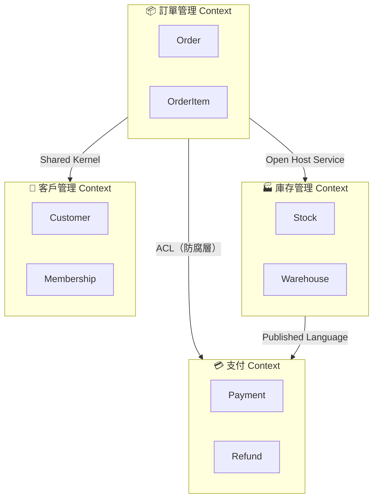
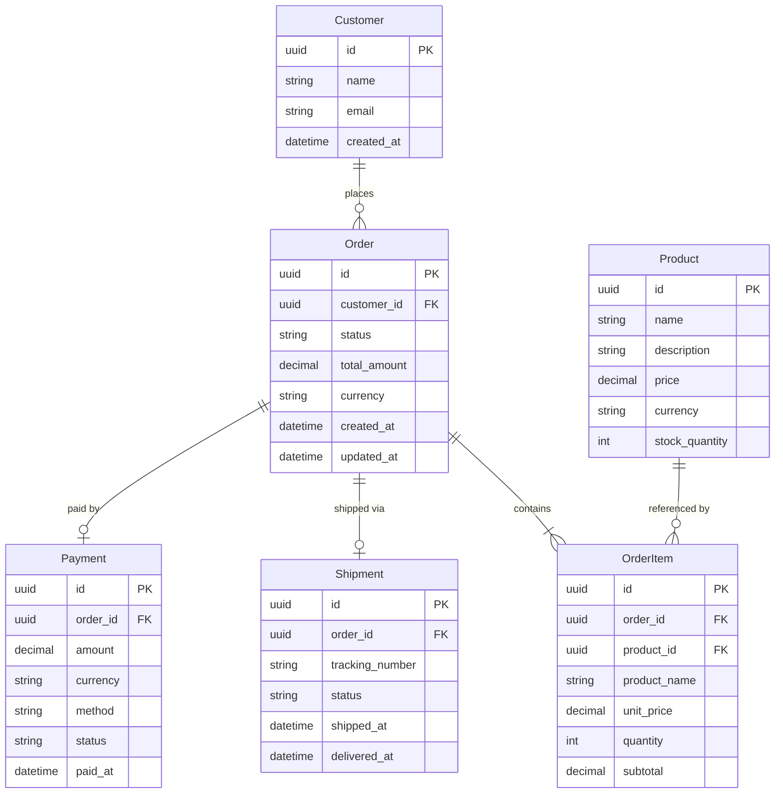
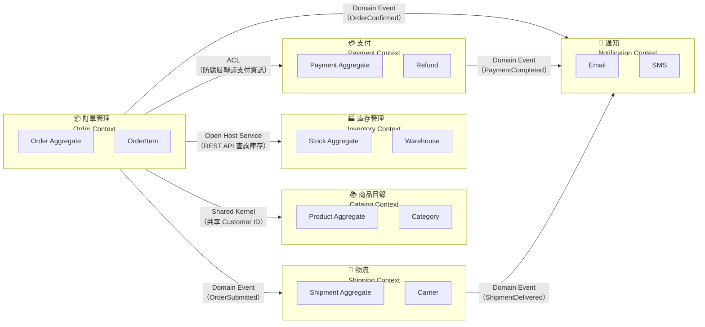
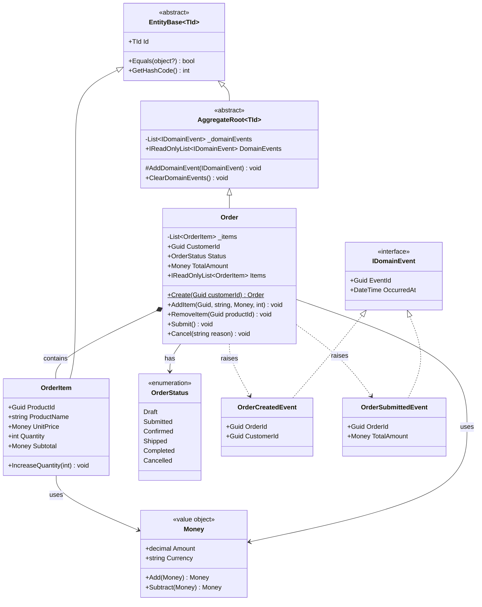

# DDD 領域驅動設計指南

> 本文件為公司內部 Domain-Driven Design 設計指南，適用於具有複雜業務邏輯的專案。
> 程式碼範例以 C# 與 Python 為主。

---

## 1. DDD 核心概念

### 1.1 Bounded Context（限界上下文）

**定義：** Bounded Context 是一個明確的語意邊界，在此邊界內，所有的術語、規則與模型都具有一致且明確的意義。不同的 Bounded Context 之間可能使用相同的名詞，但代表不同的概念。

**如何識別 Bounded Context 的邊界：**

1. **語言邊界：** 當同一個名詞在不同團隊或情境中有不同含義時（例如「帳戶」在會計與會員系統中意義不同），這通常代表不同的 Bounded Context。
2. **業務流程邊界：** 獨立的業務流程（如訂單處理、庫存管理、客戶服務）通常對應到不同的 Bounded Context。
3. **團隊邊界：** 不同團隊負責的領域往往自然形成不同的 Bounded Context。
4. **資料一致性需求：** 需要強一致性的資料通常屬於同一個 Bounded Context。

**Context Map 範例：**



> **整合模式說明：**
>
> | 模式 | 說明 |
> |------|------|
> | **Shared Kernel** | 兩個 Context 共享一小部分模型，需共同維護 |
> | **ACL（Anti-Corruption Layer）** | 透過防腐層隔離外部模型，避免污染自身領域模型 |
> | **Open Host Service** | 提供公開的服務介面供其他 Context 使用 |
> | **Published Language** | 使用共同的語言格式（如 JSON Schema）進行溝通 |

---

### 1.2 Ubiquitous Language（通用語言）

**為什麼重要：**

- 消除開發人員與領域專家之間的溝通歧義。
- 確保程式碼中的命名直接反映業務概念，降低認知負擔。
- 讓新成員能透過閱讀程式碼理解業務邏輯。
- 減少因誤解需求而導致的返工成本。

**如何建立與維護：**

1. **建立術語表（Glossary）：** 在專案 Wiki 或 README 中維護一份術語對照表，包含中英文對照與定義。
2. **與領域專家協作：** 定期與業務人員進行 Event Storming 或 Domain Storytelling 工作坊。
3. **程式碼即文件：** Class、Method、Variable 的命名必須使用通用語言中的術語。
4. **持續演進：** 隨著業務理解深化，允許術語與模型的調整，但需記錄變更原因。

**術語表範例：**

| 中文 | 英文 | 定義 |
|------|------|------|
| 訂單 | Order | 客戶提交的一次購買請求，包含一或多個訂單項目 |
| 訂單項目 | OrderItem | 訂單中的單一商品項，包含數量與單價 |
| 出貨 | Shipment | 將訂單中的商品從倉庫送達客戶的物流行為 |
| 退款 | Refund | 因退貨或取消訂單而將款項退還客戶的行為 |

---

## 2. 戰術設計模式

### 2.1 Entity（實體）

**定義：** Entity 是具有唯一識別碼（Identity）的領域物件。即使其屬性完全相同，只要識別碼不同，就是不同的實體。Entity 具有生命週期，其狀態可隨時間改變。

#### C# 範例

```csharp
// 基底類別
public abstract class Entity<TId> where TId : notnull
{
    public TId Id { get; protected set; }

    protected Entity(TId id)
    {
        Id = id;
    }

    public override bool Equals(object? obj)
    {
        if (obj is not Entity<TId> other)
            return false;

        if (ReferenceEquals(this, other))
            return true;

        return Id.Equals(other.Id);
    }

    public override int GetHashCode() => Id.GetHashCode();

    public static bool operator ==(Entity<TId>? left, Entity<TId>? right)
        => Equals(left, right);

    public static bool operator !=(Entity<TId>? left, Entity<TId>? right)
        => !Equals(left, right);
}

// 實際使用
public class Customer : Entity<Guid>
{
    public string Name { get; private set; }
    public Email Email { get; private set; }
    public DateTime CreatedAt { get; private set; }

    private Customer(Guid id, string name, Email email) : base(id)
    {
        Name = name;
        Email = email;
        CreatedAt = DateTime.UtcNow;
    }

    public static Customer Create(string name, Email email)
    {
        return new Customer(Guid.NewGuid(), name, email);
    }

    public void UpdateName(string newName)
    {
        if (string.IsNullOrWhiteSpace(newName))
            throw new DomainException("客戶名稱不可為空");

        Name = newName;
    }
}
```

#### Python 範例

```python
from __future__ import annotations

import uuid
from abc import ABC
from datetime import datetime, timezone


class Entity(ABC):
    """Entity 基底類別，以 id 作為相等性判斷依據。"""

    def __init__(self, id: uuid.UUID) -> None:
        self._id = id

    @property
    def id(self) -> uuid.UUID:
        return self._id

    def __eq__(self, other: object) -> bool:
        if not isinstance(other, Entity):
            return NotImplemented
        return self._id == other._id

    def __hash__(self) -> int:
        return hash(self._id)


class Customer(Entity):
    def __init__(self, id: uuid.UUID, name: str, email: str) -> None:
        super().__init__(id)
        self.name = name
        self.email = email
        self.created_at = datetime.now(timezone.utc)

    @classmethod
    def create(cls, name: str, email: str) -> Customer:
        return cls(id=uuid.uuid4(), name=name, email=email)

    def update_name(self, new_name: str) -> None:
        if not new_name or not new_name.strip():
            raise ValueError("客戶名稱不可為空")
        self.name = new_name
```

#### 設計原則

- Entity 的建構子應為 `private` 或 `protected`，透過工廠方法（Factory Method）建立。
- 所有狀態變更都應透過明確的行為方法（Behavior Method），而非直接 set 屬性。
- Entity 應包含業務驗證邏輯，確保自身狀態始終有效。

---

### 2.2 Value Object（值物件）

**定義：** Value Object 沒有唯一識別碼，以其屬性值來判斷相等性。Value Object 應為不可變（Immutable），若需修改則建立新的實例。

#### C# 範例

```csharp
// 使用 record 語法（C# 9+），天然不可變且自動實作值相等
public record Money(decimal Amount, string Currency)
{
    public Money Add(Money other)
    {
        if (Currency != other.Currency)
            throw new DomainException("無法加總不同幣別的金額");

        return this with { Amount = Amount + other.Amount };
    }

    public Money Subtract(Money other)
    {
        if (Currency != other.Currency)
            throw new DomainException("無法相減不同幣別的金額");

        if (Amount - other.Amount < 0)
            throw new DomainException("金額不可為負數");

        return this with { Amount = Amount - other.Amount };
    }
}

public record Address(
    string City,
    string District,
    string Street,
    string ZipCode
);

public record Email
{
    public string Value { get; }

    public Email(string value)
    {
        if (string.IsNullOrWhiteSpace(value) || !value.Contains('@'))
            throw new DomainException($"無效的 Email 格式：{value}");

        Value = value.Trim().ToLowerInvariant();
    }
}
```

#### Python 範例

```python
from dataclasses import dataclass


@dataclass(frozen=True)
class Money:
    """不可變的值物件，代表貨幣金額。"""

    amount: float
    currency: str

    def add(self, other: "Money") -> "Money":
        if self.currency != other.currency:
            raise ValueError("無法加總不同幣別的金額")
        return Money(amount=self.amount + other.amount, currency=self.currency)

    def subtract(self, other: "Money") -> "Money":
        if self.currency != other.currency:
            raise ValueError("無法相減不同幣別的金額")
        if self.amount - other.amount < 0:
            raise ValueError("金額不可為負數")
        return Money(amount=self.amount - other.amount, currency=self.currency)


@dataclass(frozen=True)
class Address:
    city: str
    district: str
    street: str
    zip_code: str


@dataclass(frozen=True)
class Email:
    value: str

    def __post_init__(self) -> None:
        if not self.value or "@" not in self.value:
            raise ValueError(f"無效的 Email 格式：{self.value}")
        object.__setattr__(self, "value", self.value.strip().lower())
```

#### 何時使用 Entity vs Value Object

| 判斷依據 | Entity | Value Object |
|----------|--------|--------------|
| 需要追蹤身份？ | ✅ 是 | ❌ 否 |
| 可替換？ | ❌ 否（同 ID 為同一物件） | ✅ 是（值相同即可替換） |
| 可變？ | ✅ 是（透過行為方法修改） | ❌ 否（不可變，需建立新實例） |
| 範例 | Customer, Order, Product | Money, Address, Email, DateRange |

---

### 2.3 Aggregate（聚合）

**定義：** Aggregate 是一組相關的 Entity 與 Value Object 的集合，定義了一致性邊界（Consistency Boundary）。外部只能透過 Aggregate Root 來操作聚合內部的物件。

**Aggregate Root 的職責：**

- 作為外部存取聚合的唯一入口。
- 維護聚合內部的不變量（Invariants）。
- 控制聚合內部物件的生命週期。
- 發出 Domain Event 通知其他聚合。

#### C# 範例

```csharp
public abstract class AggregateRoot<TId> : Entity<TId> where TId : notnull
{
    private readonly List<IDomainEvent> _domainEvents = new();
    public IReadOnlyList<IDomainEvent> DomainEvents => _domainEvents.AsReadOnly();

    protected AggregateRoot(TId id) : base(id) { }

    protected void AddDomainEvent(IDomainEvent domainEvent)
    {
        _domainEvents.Add(domainEvent);
    }

    public void ClearDomainEvents()
    {
        _domainEvents.Clear();
    }
}

public class Order : AggregateRoot<Guid>
{
    private readonly List<OrderItem> _items = new();
    public IReadOnlyList<OrderItem> Items => _items.AsReadOnly();
    public Guid CustomerId { get; private set; }
    public OrderStatus Status { get; private set; }
    public Money TotalAmount => CalculateTotal();

    private Order(Guid id, Guid customerId) : base(id)
    {
        CustomerId = customerId;
        Status = OrderStatus.Draft;
    }

    public static Order Create(Guid customerId)
    {
        var order = new Order(Guid.NewGuid(), customerId);
        order.AddDomainEvent(new OrderCreatedEvent(order.Id, customerId));
        return order;
    }

    public void AddItem(Guid productId, string productName, Money unitPrice, int quantity)
    {
        if (Status != OrderStatus.Draft)
            throw new DomainException("只有草稿狀態的訂單才能新增項目");

        if (quantity <= 0)
            throw new DomainException("數量必須大於零");

        var existingItem = _items.FirstOrDefault(i => i.ProductId == productId);
        if (existingItem is not null)
        {
            existingItem.IncreaseQuantity(quantity);
        }
        else
        {
            _items.Add(new OrderItem(productId, productName, unitPrice, quantity));
        }
    }

    public void Submit()
    {
        if (Status != OrderStatus.Draft)
            throw new DomainException("只有草稿狀態的訂單才能提交");

        if (!_items.Any())
            throw new DomainException("訂單至少需要一個項目");

        Status = OrderStatus.Submitted;
        AddDomainEvent(new OrderSubmittedEvent(Id, TotalAmount));
    }

    private Money CalculateTotal()
    {
        if (!_items.Any())
            return new Money(0, "TWD");

        return _items
            .Select(i => i.Subtotal)
            .Aggregate((a, b) => a.Add(b));
    }
}

public class OrderItem : Entity<Guid>
{
    public Guid ProductId { get; private set; }
    public string ProductName { get; private set; }
    public Money UnitPrice { get; private set; }
    public int Quantity { get; private set; }
    public Money Subtotal => new(UnitPrice.Amount * Quantity, UnitPrice.Currency);

    internal OrderItem(Guid productId, string productName, Money unitPrice, int quantity)
        : base(Guid.NewGuid())
    {
        ProductId = productId;
        ProductName = productName;
        UnitPrice = unitPrice;
        Quantity = quantity;
    }

    internal void IncreaseQuantity(int amount)
    {
        if (amount <= 0)
            throw new DomainException("增加數量必須大於零");

        Quantity += amount;
    }
}

public enum OrderStatus
{
    Draft,
    Submitted,
    Confirmed,
    Shipped,
    Completed,
    Cancelled
}
```

#### Python 範例

```python
from __future__ import annotations

import uuid
from datetime import datetime, timezone
from enum import Enum


class OrderStatus(Enum):
    DRAFT = "draft"
    SUBMITTED = "submitted"
    CONFIRMED = "confirmed"
    SHIPPED = "shipped"
    COMPLETED = "completed"
    CANCELLED = "cancelled"


class OrderItem(Entity):
    def __init__(
        self,
        product_id: uuid.UUID,
        product_name: str,
        unit_price: Money,
        quantity: int,
    ) -> None:
        super().__init__(id=uuid.uuid4())
        self.product_id = product_id
        self.product_name = product_name
        self.unit_price = unit_price
        self.quantity = quantity

    @property
    def subtotal(self) -> Money:
        return Money(
            amount=self.unit_price.amount * self.quantity,
            currency=self.unit_price.currency,
        )

    def increase_quantity(self, amount: int) -> None:
        if amount <= 0:
            raise ValueError("增加數量必須大於零")
        self.quantity += amount


class Order(Entity):
    def __init__(self, id: uuid.UUID, customer_id: uuid.UUID) -> None:
        super().__init__(id)
        self.customer_id = customer_id
        self.status = OrderStatus.DRAFT
        self._items: list[OrderItem] = []
        self._domain_events: list[object] = []

    @property
    def items(self) -> tuple[OrderItem, ...]:
        return tuple(self._items)

    @property
    def domain_events(self) -> tuple[object, ...]:
        return tuple(self._domain_events)

    @classmethod
    def create(cls, customer_id: uuid.UUID) -> Order:
        order = cls(id=uuid.uuid4(), customer_id=customer_id)
        order._domain_events.append(OrderCreatedEvent(order_id=order.id))
        return order

    def add_item(
        self,
        product_id: uuid.UUID,
        product_name: str,
        unit_price: Money,
        quantity: int,
    ) -> None:
        if self.status != OrderStatus.DRAFT:
            raise ValueError("只有草稿狀態的訂單才能新增項目")
        if quantity <= 0:
            raise ValueError("數量必須大於零")

        existing = next((i for i in self._items if i.product_id == product_id), None)
        if existing:
            existing.increase_quantity(quantity)
        else:
            self._items.append(OrderItem(product_id, product_name, unit_price, quantity))

    def submit(self) -> None:
        if self.status != OrderStatus.DRAFT:
            raise ValueError("只有草稿狀態的訂單才能提交")
        if not self._items:
            raise ValueError("訂單至少需要一個項目")

        self.status = OrderStatus.SUBMITTED
        self._domain_events.append(OrderSubmittedEvent(order_id=self.id))

    def clear_domain_events(self) -> None:
        self._domain_events.clear()
```

#### 設計原則

- **聚合應盡量小：** 只包含必須在同一個交易中維持一致性的物件。
- **跨聚合引用使用 ID：** 不要直接持有其他 Aggregate 的物件參考，改用其 ID。
- **一個交易只修改一個 Aggregate：** 若需跨 Aggregate 操作，使用 Domain Event 進行最終一致性。
- **透過 Aggregate Root 操作：** 外部不可直接存取或修改聚合內部的 Entity。

---

### 2.4 Domain Event（領域事件）

**定義：** Domain Event 代表領域中已發生的重要事實。它是不可變的，用於在 Aggregate 之間或 Bounded Context 之間傳遞狀態變化。

**用途：**

- 實現聚合之間的最終一致性。
- 觸發副作用（如發送通知、更新讀取模型）。
- 作為系統間整合的契約。
- 記錄業務行為的審計軌跡。

#### C# 範例（MediatR INotification 風格）

```csharp
// 事件介面
public interface IDomainEvent : INotification
{
    Guid EventId { get; }
    DateTime OccurredAt { get; }
}

// 事件基底類別
public abstract record DomainEventBase : IDomainEvent
{
    public Guid EventId { get; } = Guid.NewGuid();
    public DateTime OccurredAt { get; } = DateTime.UtcNow;
}

// 具體事件
public record OrderCreatedEvent(Guid OrderId, Guid CustomerId) : DomainEventBase;

public record OrderSubmittedEvent(Guid OrderId, Money TotalAmount) : DomainEventBase;

public record OrderCancelledEvent(Guid OrderId, string Reason) : DomainEventBase;

// 事件處理器
public class OrderSubmittedEventHandler : INotificationHandler<OrderSubmittedEvent>
{
    private readonly IEmailService _emailService;
    private readonly IInventoryService _inventoryService;

    public OrderSubmittedEventHandler(
        IEmailService emailService,
        IInventoryService inventoryService)
    {
        _emailService = emailService;
        _inventoryService = inventoryService;
    }

    public async Task Handle(OrderSubmittedEvent notification, CancellationToken cancellationToken)
    {
        // 發送訂單確認信
        await _emailService.SendOrderConfirmationAsync(notification.OrderId);

        // 通知庫存服務預留庫存
        await _inventoryService.ReserveStockAsync(notification.OrderId);
    }
}
```

#### Python 範例

```python
from __future__ import annotations

import uuid
from dataclasses import dataclass, field
from datetime import datetime, timezone
from typing import Callable


@dataclass(frozen=True)
class DomainEvent:
    """領域事件基底類別。"""

    event_id: uuid.UUID = field(default_factory=uuid.uuid4)
    occurred_at: datetime = field(default_factory=lambda: datetime.now(timezone.utc))


@dataclass(frozen=True)
class OrderCreatedEvent(DomainEvent):
    order_id: uuid.UUID = field(default_factory=uuid.uuid4)
    customer_id: uuid.UUID = field(default_factory=uuid.uuid4)


@dataclass(frozen=True)
class OrderSubmittedEvent(DomainEvent):
    order_id: uuid.UUID = field(default_factory=uuid.uuid4)


# 簡易事件發佈器
class DomainEventPublisher:
    def __init__(self) -> None:
        self._handlers: dict[type, list[Callable]] = {}

    def subscribe(self, event_type: type, handler: Callable) -> None:
        self._handlers.setdefault(event_type, []).append(handler)

    async def publish(self, event: DomainEvent) -> None:
        for handler in self._handlers.get(type(event), []):
            await handler(event)


# 使用範例
publisher = DomainEventPublisher()


async def on_order_submitted(event: OrderSubmittedEvent) -> None:
    print(f"訂單 {event.order_id} 已提交，開始處理庫存預留")


publisher.subscribe(OrderSubmittedEvent, on_order_submitted)
```

#### 事件發布與訂閱模式

```
┌──────────────┐     Domain Event      ┌──────────────────┐
│  Aggregate   │ ──────────────────────▶│  Event Dispatcher │
│  (Publisher) │                        └────────┬─────────┘
└──────────────┘                                 │
                                    ┌────────────┼────────────┐
                                    ▼            ▼            ▼
                              ┌──────────┐ ┌──────────┐ ┌──────────┐
                              │ Handler1 │ │ Handler2 │ │ Handler3 │
                              │ 發送通知 │ │ 更新庫存 │ │ 寫入日誌 │
                              └──────────┘ └──────────┘ └──────────┘
```

**建議做法：**

1. **行程內（In-Process）：** 使用 MediatR（C#）或自訂 Publisher（Python）在同一行程內發布與處理事件。
2. **跨行程（Out-of-Process）：** 使用 Message Queue（如 RabbitMQ、Azure Service Bus、Kafka）進行跨服務的事件傳遞。
3. **Outbox Pattern：** 將事件與業務資料在同一交易中寫入資料庫，再由背景工作排程發送，確保可靠傳遞。

---

### 2.5 Domain Service（領域服務）

**何時使用：** 當業務邏輯不自然地屬於任何一個 Entity 或 Value Object 時，尤其是涉及多個 Aggregate 協作的操作。

> ⚠️ **注意：** 不要過度使用 Domain Service。如果邏輯可以放在 Entity 或 Value Object 中，優先放在那裡。Domain Service 應是最後的選擇。

#### C# 範例

```csharp
// 轉帳服務：涉及兩個 Account Aggregate
public class TransferService
{
    private readonly IAccountRepository _accountRepository;

    public TransferService(IAccountRepository accountRepository)
    {
        _accountRepository = accountRepository;
    }

    public async Task TransferAsync(
        Guid fromAccountId,
        Guid toAccountId,
        Money amount,
        CancellationToken cancellationToken = default)
    {
        var fromAccount = await _accountRepository.GetByIdAsync(fromAccountId, cancellationToken)
            ?? throw new DomainException($"找不到轉出帳戶：{fromAccountId}");

        var toAccount = await _accountRepository.GetByIdAsync(toAccountId, cancellationToken)
            ?? throw new DomainException($"找不到轉入帳戶：{toAccountId}");

        fromAccount.Withdraw(amount);
        toAccount.Deposit(amount);

        await _accountRepository.UpdateAsync(fromAccount, cancellationToken);
        await _accountRepository.UpdateAsync(toAccount, cancellationToken);
    }
}

// 定價服務：需要外部折扣規則
public class PricingService
{
    private readonly IDiscountPolicy _discountPolicy;

    public PricingService(IDiscountPolicy discountPolicy)
    {
        _discountPolicy = discountPolicy;
    }

    public Money CalculatePrice(Order order, Customer customer)
    {
        var baseTotal = order.TotalAmount;
        var discount = _discountPolicy.CalculateDiscount(customer, baseTotal);
        return baseTotal.Subtract(discount);
    }
}
```

#### Python 範例

```python
class TransferService:
    """跨 Aggregate 的轉帳領域服務。"""

    def __init__(self, account_repository: AccountRepository) -> None:
        self._account_repo = account_repository

    async def transfer(
        self,
        from_account_id: uuid.UUID,
        to_account_id: uuid.UUID,
        amount: Money,
    ) -> None:
        from_account = await self._account_repo.get_by_id(from_account_id)
        if from_account is None:
            raise ValueError(f"找不到轉出帳戶：{from_account_id}")

        to_account = await self._account_repo.get_by_id(to_account_id)
        if to_account is None:
            raise ValueError(f"找不到轉入帳戶：{to_account_id}")

        from_account.withdraw(amount)
        to_account.deposit(amount)

        await self._account_repo.update(from_account)
        await self._account_repo.update(to_account)


class PricingService:
    """定價領域服務，結合折扣政策計算最終價格。"""

    def __init__(self, discount_policy: DiscountPolicy) -> None:
        self._discount_policy = discount_policy

    def calculate_price(self, order: Order, customer: Customer) -> Money:
        base_total = order.total_amount
        discount = self._discount_policy.calculate_discount(customer, base_total)
        return base_total.subtract(discount)
```

---

### 2.6 Repository Pattern（儲存庫模式）

**定義：** Repository 在 Domain 層定義介面，在 Infrastructure 層提供實作。它為 Aggregate Root 提供類似集合的存取方式，隱藏底層資料存取細節。

**規範：一個 Aggregate Root 對應一個 Repository。** 不應為聚合內部的 Entity 建立獨立的 Repository。

#### C# 範例

```csharp
// Domain 層：介面定義
public interface IRepository<T> where T : AggregateRoot<Guid>
{
    Task<T?> GetByIdAsync(Guid id, CancellationToken cancellationToken = default);
    Task<IReadOnlyList<T>> GetAllAsync(CancellationToken cancellationToken = default);
    Task AddAsync(T entity, CancellationToken cancellationToken = default);
    Task UpdateAsync(T entity, CancellationToken cancellationToken = default);
    Task DeleteAsync(T entity, CancellationToken cancellationToken = default);
}

public interface IOrderRepository : IRepository<Order>
{
    Task<IReadOnlyList<Order>> GetByCustomerIdAsync(
        Guid customerId, CancellationToken cancellationToken = default);
    Task<IReadOnlyList<Order>> GetByStatusAsync(
        OrderStatus status, CancellationToken cancellationToken = default);
}

// Infrastructure 層：EF Core 實作
public class OrderRepository : IOrderRepository
{
    private readonly AppDbContext _dbContext;

    public OrderRepository(AppDbContext dbContext)
    {
        _dbContext = dbContext;
    }

    public async Task<Order?> GetByIdAsync(Guid id, CancellationToken cancellationToken = default)
    {
        return await _dbContext.Orders
            .Include(o => o.Items)
            .FirstOrDefaultAsync(o => o.Id == id, cancellationToken);
    }

    public async Task<IReadOnlyList<Order>> GetAllAsync(CancellationToken cancellationToken = default)
    {
        return await _dbContext.Orders
            .Include(o => o.Items)
            .ToListAsync(cancellationToken);
    }

    public async Task AddAsync(Order entity, CancellationToken cancellationToken = default)
    {
        await _dbContext.Orders.AddAsync(entity, cancellationToken);
        await _dbContext.SaveChangesAsync(cancellationToken);
    }

    public async Task UpdateAsync(Order entity, CancellationToken cancellationToken = default)
    {
        _dbContext.Orders.Update(entity);
        await _dbContext.SaveChangesAsync(cancellationToken);
    }

    public async Task DeleteAsync(Order entity, CancellationToken cancellationToken = default)
    {
        _dbContext.Orders.Remove(entity);
        await _dbContext.SaveChangesAsync(cancellationToken);
    }

    public async Task<IReadOnlyList<Order>> GetByCustomerIdAsync(
        Guid customerId, CancellationToken cancellationToken = default)
    {
        return await _dbContext.Orders
            .Include(o => o.Items)
            .Where(o => o.CustomerId == customerId)
            .ToListAsync(cancellationToken);
    }

    public async Task<IReadOnlyList<Order>> GetByStatusAsync(
        OrderStatus status, CancellationToken cancellationToken = default)
    {
        return await _dbContext.Orders
            .Include(o => o.Items)
            .Where(o => o.Status == status)
            .ToListAsync(cancellationToken);
    }
}
```

#### Python 範例

```python
from abc import ABC, abstractmethod


class Repository(ABC):
    """Repository 抽象介面。"""

    @abstractmethod
    async def get_by_id(self, id: uuid.UUID) -> Entity | None:
        ...

    @abstractmethod
    async def add(self, entity: Entity) -> None:
        ...

    @abstractmethod
    async def update(self, entity: Entity) -> None:
        ...

    @abstractmethod
    async def delete(self, entity: Entity) -> None:
        ...


class OrderRepository(ABC):
    """Order Aggregate Root 的 Repository 介面。"""

    @abstractmethod
    async def get_by_id(self, id: uuid.UUID) -> Order | None:
        ...

    @abstractmethod
    async def get_by_customer_id(self, customer_id: uuid.UUID) -> list[Order]:
        ...

    @abstractmethod
    async def get_by_status(self, status: OrderStatus) -> list[Order]:
        ...

    @abstractmethod
    async def add(self, order: Order) -> None:
        ...

    @abstractmethod
    async def update(self, order: Order) -> None:
        ...

    @abstractmethod
    async def delete(self, order: Order) -> None:
        ...


# Infrastructure 層：SQLAlchemy 實作
from sqlalchemy.ext.asyncio import AsyncSession
from sqlalchemy import select


class SqlAlchemyOrderRepository(OrderRepository):
    """使用 SQLAlchemy 實作 Order Repository。"""

    def __init__(self, session: AsyncSession) -> None:
        self._session = session

    async def get_by_id(self, id: uuid.UUID) -> Order | None:
        stmt = select(OrderModel).where(OrderModel.id == id)
        result = await self._session.execute(stmt)
        row = result.scalar_one_or_none()
        return self._to_domain(row) if row else None

    async def get_by_customer_id(self, customer_id: uuid.UUID) -> list[Order]:
        stmt = select(OrderModel).where(OrderModel.customer_id == customer_id)
        result = await self._session.execute(stmt)
        return [self._to_domain(row) for row in result.scalars()]

    async def get_by_status(self, status: OrderStatus) -> list[Order]:
        stmt = select(OrderModel).where(OrderModel.status == status.value)
        result = await self._session.execute(stmt)
        return [self._to_domain(row) for row in result.scalars()]

    async def add(self, order: Order) -> None:
        model = self._to_model(order)
        self._session.add(model)
        await self._session.flush()

    async def update(self, order: Order) -> None:
        model = self._to_model(order)
        await self._session.merge(model)
        await self._session.flush()

    async def delete(self, order: Order) -> None:
        stmt = select(OrderModel).where(OrderModel.id == order.id)
        result = await self._session.execute(stmt)
        model = result.scalar_one()
        await self._session.delete(model)
        await self._session.flush()

    def _to_domain(self, model: OrderModel) -> Order:
        """將 ORM Model 轉換為 Domain Entity。"""
        ...

    def _to_model(self, order: Order) -> OrderModel:
        """將 Domain Entity 轉換為 ORM Model。"""
        ...
```

---

## 3. Mermaid 圖表範例

### 3.1 ER Diagram 範例

以下為訂單管理系統的領域模型 ER 圖：



---

### 3.2 Context Map 範例

以下展示一個電商平台中多個 Bounded Context 之間的關係與整合模式：



---

### 3.3 Class Diagram 範例

以下展示 Order Aggregate 的內部結構：



---

## 4. 設計決策指引

### 何時使用 DDD vs 簡單 CRUD

| 情境 | 建議做法 |
|------|----------|
| 業務邏輯簡單，主要為資料的 CRUD | 直接使用 CRUD + Service Layer，不需 DDD |
| 業務規則複雜，有多種狀態轉換與驗證 | 使用 DDD 戰術模式（Entity, Value Object, Aggregate） |
| 多團隊協作，業務領域龐大 | 使用 DDD 戰略模式（Bounded Context, Context Map） |
| 原型或 MVP 階段 | 先 CRUD，待業務確定後再重構為 DDD |
| 核心領域（Core Domain） | 必須使用 DDD，投入最多設計精力 |
| 通用子領域（Generic Subdomain） | 可使用現成方案或簡單實作 |
| 支撐子領域（Supporting Subdomain） | 視複雜度決定，通常簡化版 DDD 即可 |

### Aggregate 邊界劃分原則

1. **真正的不變量（True Invariants）：** 只有必須在同一交易中保持一致的物件才應放在同一個 Aggregate 中。
2. **小 Aggregate 原則：** 優先設計小的 Aggregate，透過 Domain Event 實現跨 Aggregate 的協作。
3. **引用使用 ID：** Aggregate 之間透過 ID 引用而非物件引用，避免載入過多資料。
4. **最終一致性優先：** 考慮業務是否真的需要即時一致性，許多場景可以接受最終一致性。
5. **並行存取考量：** Aggregate 越大，並行衝突的機會越高。

### Event Sourcing 何時考慮

> Event Sourcing 並非 DDD 的必要元素，僅在以下場景考慮：

- **完整審計需求：** 需要記錄所有狀態變更的歷史（如金融交易）。
- **時間旅行查詢：** 需要查詢某個時間點的系統狀態。
- **複雜的事件驅動架構：** 系統本身已大量使用事件驅動模式。
- **CQRS 搭配使用：** 讀寫模型差異極大時，Event Sourcing 可與 CQRS 搭配。

> ⚠️ Event Sourcing 會大幅增加系統複雜度，請確保收益大於成本後再採用。

---

## 5. CR 審查檢查清單

在進行 Code Review 時，請依照以下清單檢查 DDD 實作的正確性：

| # | 檢查項目 | 說明 | 通過 |
|---|----------|------|------|
| 1 | **Ubiquitous Language** | 程式碼中的命名是否使用領域通用語言？ | ☐ |
| 2 | **Entity 識別碼** | Entity 是否有唯一識別碼？相等性是否基於 ID？ | ☐ |
| 3 | **Value Object 不可變** | Value Object 是否為 Immutable？是否以值相等？ | ☐ |
| 4 | **Aggregate 邊界** | Aggregate 邊界是否合理？是否過大或過小？ | ☐ |
| 5 | **Aggregate Root 入口** | 外部是否僅透過 Aggregate Root 操作聚合？ | ☐ |
| 6 | **跨 Aggregate 引用** | Aggregate 之間是否使用 ID 引用（而非物件引用）？ | ☐ |
| 7 | **Repository 對應** | 是否只為 Aggregate Root 建立 Repository？ | ☐ |
| 8 | **Domain 層純淨** | Domain 層是否無基礎設施依賴（DB、HTTP 等）？ | ☐ |
| 9 | **業務邏輯位置** | 業務邏輯是否在 Domain 層而非 Application/Infrastructure 層？ | ☐ |
| 10 | **行為方法** | Entity 是否透過行為方法修改狀態（非直接 set）？ | ☐ |
| 11 | **Domain Event** | 重要的業務行為是否發出 Domain Event？ | ☐ |
| 12 | **驗證邏輯** | 業務規則驗證是否在 Domain 層執行？ | ☐ |
| 13 | **Factory Method** | 複雜物件的建立是否使用 Factory Method？ | ☐ |
| 14 | **Domain Service 必要性** | Domain Service 是否僅用於跨 Aggregate 的邏輯？ | ☐ |
| 15 | **交易邊界** | 一個交易是否只修改一個 Aggregate？ | ☐ |
