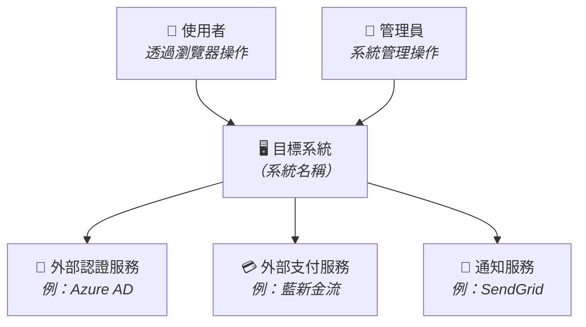
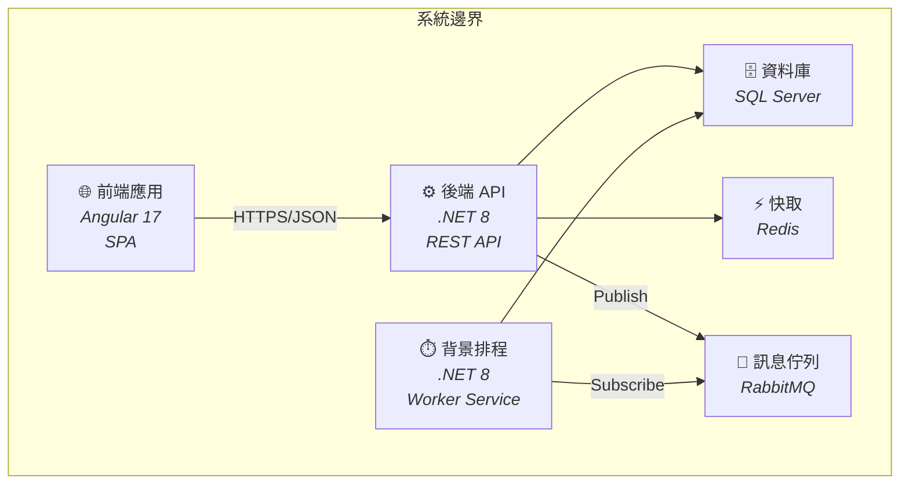
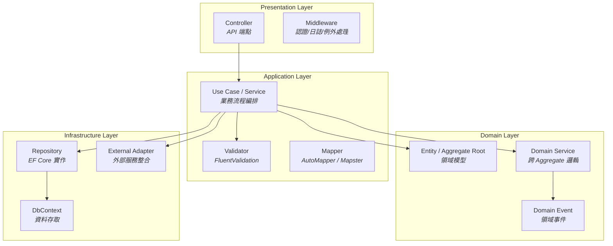
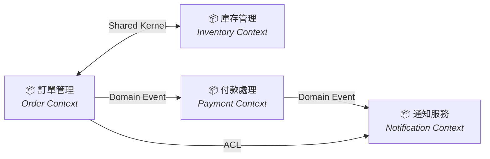
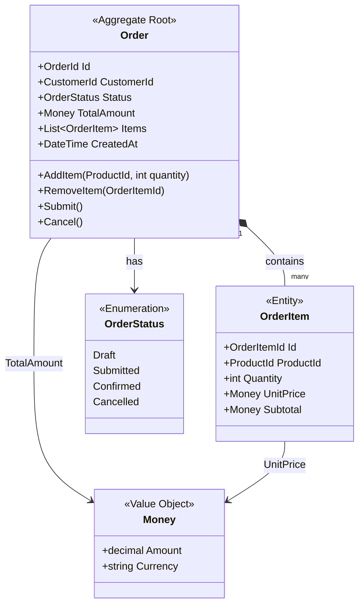
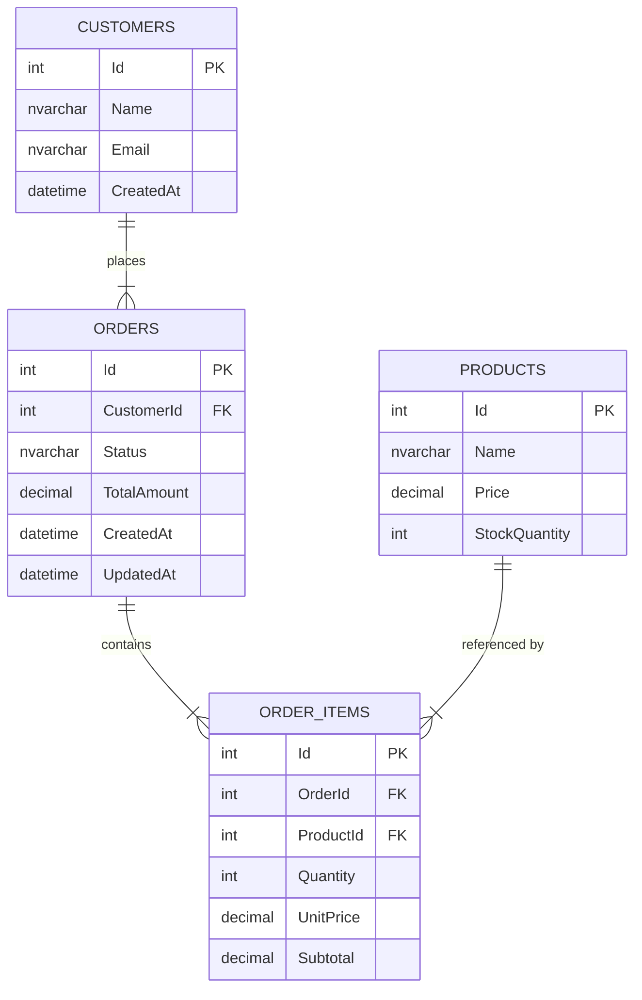
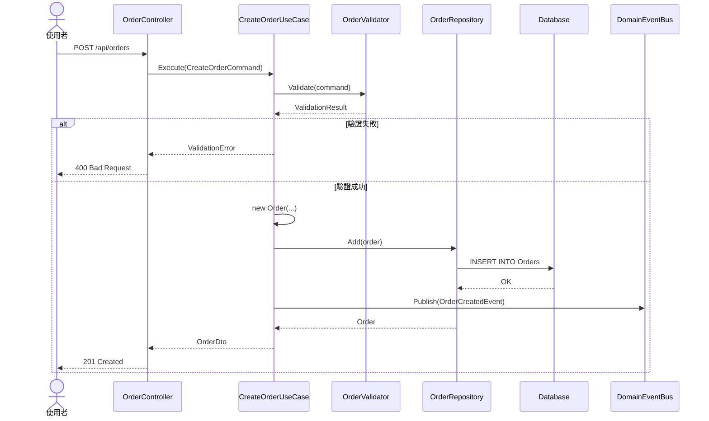
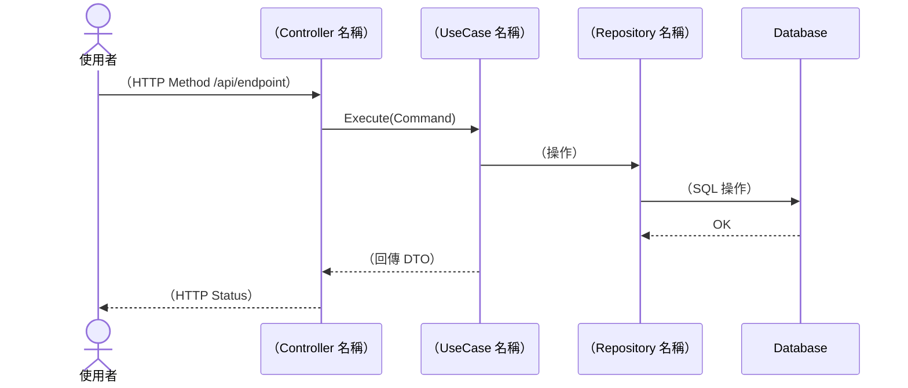

# 功能需求設計書（FRD）

> 📐 **使用說明**：本範本由 Architect Skill（AI）根據已審核通過的 `spec.md` 產出架構設計文件。完整流程請將本檔與需求規格書、執行計畫放在同一需求工作區，例如 `docs/{NNN}-{需求簡述}/FRD.md`。所有 `%% 佔位符` 標記的 Mermaid 圖表區段與 `（...）` 標記的文字區段，皆須替換為實際專案內容。

---

## 1. 文件資訊

| 欄位           | 內容                             |
| -------------- | -------------------------------- |
| 對應需求規格書 | [spec.md](./spec.md)             |
| 對應執行計畫   | [plan.md](./plan.md)             |
| 架構師         | Architect Skill（AI）            |
| 建立日期       | YYYY-MM-DD                       |
| 最後更新       | YYYY-MM-DD                       |
| 審核狀態       | [ ] 待審核 [ ] 已通過 [ ] 需修改 |

> 📐 **指引**：「對應需求規格書」請填入同一需求工作區中的 `spec.md` 相對路徑或連結；審核狀態以勾選方式標示（`[x]`）。

---

## 1.5 規範基線（Standards Baseline）

> 📐 **指引**：此區段由 Architect Skill 的 Phase 0（規範前置載入）自動產出。列出本次架構設計所載入的所有內部規範，以及從規範中提取的、**直接影響架構設計決策**的關鍵約束。後續所有設計決策、ADR 與 Task 描述都須以此為基線。

### 適用規範清單

| 類別     | 規範文件                                | 關鍵約束摘要                                                                                        |
| -------- | --------------------------------------- | --------------------------------------------------------------------------------------------------- |
| 架構原則 | `standards/clean-architecture.md`       | （摘要：如依賴方向 外層→內層、Domain Layer 禁止引用任何技術框架）                                   |
| DDD 建模 | `standards/ddd-guidelines.md`           | （摘要：如 Aggregate 保持小而聚焦、跨 Context 使用 ACL）                                            |
| 設計模式 | `standards/design-patterns.md`          | （摘要：如本專案適用的模式候選及選用理由）                                                          |
| SOLID    | `standards/solid-principles.md`         | （摘要：如 DIP 應用於 Repository 介面、ISP 限制介面粒度）                                           |
| 前端規範 | `standards/coding-standard-frontend.md` | （摘要：如框架選型原則、Web First、Table First、圖表套件、AI 開發要求）— **前端專案必填，不限框架** |
| 語言規範 | `standards/coding-standard-{lang}.md`   | （摘要：如命名慣例、必須啟用的語言功能、禁止的寫法）                                                |
| 框架規範 | `frameworks/{name}/contributing.md`     | （摘要：如強制基底類別、繼承深度限制、初始化順序、禁止行為）                                        |

> 📐 **指引**：僅列出本專案**實際適用**的規範。「關鍵約束摘要」欄位須從規範原文中**提取具體條目**，而非泛泛描述。此表也作為 Phase 5 品質自檢的對照基準。

---

## 2. 架構概述

### 2.1 系統概述

（1–2 段文字描述整體架構方向、核心設計理念，以及系統要解決的關鍵技術挑戰。）

> 📐 **指引**：從 `spec.md` 的功能範圍出發，說明系統的整體架構風格（如 Clean Architecture、Microservices、Modular Monolith），並簡述選擇該風格的原因。

### 2.2 技術棧選擇

| 層級     | 技術選型           | 版本 | 選用理由     |
| -------- | ------------------ | ---- | ------------ |
| 後端     | （例：.NET 8）     | x.x  | （簡述理由） |
| 前端     | （例：Angular 17） | x.x  | （簡述理由） |
| 資料庫   | （例：SQL Server） | x.x  | （簡述理由） |
| 快取     | （例：Redis）      | x.x  | （簡述理由） |
| 訊息佇列 | （例：RabbitMQ）   | x.x  | （簡述理由） |
| 其他     | （依需要增列）     | —    | —            |

> 📐 **指引**：技術選型須與公司核准的技術清單一致。若需引入新技術，請在 ADR 中記錄決策理由。

### 2.3 架構決策記錄（ADR）

| ADR 編號 | 標題         | 決策           | 理由                 | 替代方案             | 依據規範                 |
| -------- | ------------ | -------------- | -------------------- | -------------------- | ------------------------ |
| ADR-001  | （決策標題） | （採用的方案） | （選擇此方案的理由） | （曾考慮的其他方案） | （引用的規範文件與條目） |
| ADR-002  | （決策標題） | （採用的方案） | （選擇此方案的理由） | （曾考慮的其他方案） | （引用的規範文件與條目） |

> 📐 **指引**：每一項重要的架構決策都應記錄為 ADR，包含背景脈絡、決策內容、理由及被否決的替代方案。至少應涵蓋：架構風格、資料庫選型、認證機制等關鍵決策。「依據規範」欄位須引用 Section 1.5 規範基線中的具體規範條目，確保每個決策可追溯到公司內部規範。

---

## 3. C4 架構圖

### 3.1 Context Diagram（系統脈絡圖）



> 📐 **指引**：Context Diagram 應呈現系統的所有外部互動對象（使用者角色與外部系統）。請從 `spec.md` 的 User Story 與非功能需求中識別所有外部參與者。

### 3.2 Container Diagram（容器圖）



> 📐 **指引**：Container Diagram 應列出系統內的所有可部署單元，包含前端、後端、資料庫、快取、排程等，並標示通訊協定。每個容器需標註使用的技術。

### 3.3 Component Diagram（元件圖）



> 📐 **指引**：Component Diagram 應展示後端 API 容器內的主要元件及其依賴關係。請依據 Clean Architecture 分層，從 Presentation → Application → Domain → Infrastructure 展開。

---

## 4. DDD 領域模型

### 4.1 Bounded Context Map



> 📐 **指引**：Bounded Context Map 須標示各 Context 間的整合模式（Shared Kernel、ACL、Domain Event、Open Host Service 等）。請從 `spec.md` 的功能模組推導出 Bounded Context 劃分。

### 4.2 領域模型 Class Diagram



> 📐 **指引**：Class Diagram 須標示 `<<Aggregate Root>>`、`<<Entity>>`、`<<Value Object>>` 等 DDD 標記。每個 Aggregate 應保持小而聚焦，並明確定義其邊界。

### 4.3 核心 Aggregate 說明

| Aggregate Root | 包含的 Entity / Value Object   | 不變條件（Invariants）                           |
| -------------- | ------------------------------ | ------------------------------------------------ |
| Order          | OrderItem (Entity), Money (VO) | 訂單至少包含一個 OrderItem；TotalAmount 必須 ≥ 0 |
| （其他 AR）    | （列出包含的 Entity / VO）     | （列出不變條件）                                 |

> 📐 **指引**：每個 Aggregate Root 都必須列出其不變條件（業務規則），這些規則將直接對應到 Domain Layer 的驗證邏輯與 Unit Test 案例。

---

## 5. ER Diagram（資料庫模型）



> 📐 **指引**：ER Diagram 須涵蓋所有資料表、主鍵（PK）、外鍵（FK）及關聯關係。資料表命名使用大寫複數（`ORDERS`），欄位命名使用 PascalCase。請確保與 Domain Model 的對應關係明確。

---

## 6. Sequence Diagram（核心流程）

### 6.1 流程一：（名稱，例：建立訂單）



> 📐 **指引**：Sequence Diagram 應涵蓋正常流程與例外流程（使用 `alt/else`）。請為 `spec.md` 中的每個核心 User Story 繪製至少一個 Sequence Diagram。

### 6.2 流程二：（名稱）



> 📐 **指引**：可依需要增加更多流程圖。每個流程圖應對應一個完整的 Use Case，並涵蓋從 API 進入到資料持久化的完整鏈路。

---

## 6.5 UI 版面配置（UI Layout）

> 📐 **指引**：此區段描述每個前端頁面/View 的版面配置。若需求不涉及前端頁面，可標記「N/A」。版型定義參見 `instructions/angular-page-layouts.instructions.md`。

| 頁面/View    | 採用版型      | 區塊配置說明                                       | 特殊備註                 |
| ------------ | ------------- | -------------------------------------------------- | ------------------------ |
| （頁面名稱） | （A/B/C/D/E） | （例：上方查詢區 3 欄橫排，下方 AG-Grid 撐滿高度） | （若需特殊版面，附簡述） |
| （頁面名稱） | （A/B/C/D/E） | （例：nb-card 包裹表單，2 欄排列，footer 靠右）    | —                        |

> 📐 **指引**：
>
> - 每個前端頁面都必須指定一個版型（A-E），不可省略
> - 若無法完全套用標準版型，須在「特殊備註」欄說明偏差及理由
> - @dev 在 Developer Phase 會根據此表選擇對應的 HTML 骨架

---

## 7. API 設計

### 7.1 API 端點清單

| Method | Path                    | 描述         | Request Body       | Response Body       | 狀態碼          |
| ------ | ----------------------- | ------------ | ------------------ | ------------------- | --------------- |
| POST   | /api/orders             | 建立訂單     | CreateOrderRequest | OrderResponse       | 201 / 400 / 401 |
| GET    | /api/orders/{id}        | 取得訂單詳情 | —                  | OrderDetailResponse | 200 / 404       |
| PUT    | /api/orders/{id}        | 更新訂單     | UpdateOrderRequest | OrderResponse       | 200 / 400 / 404 |
| DELETE | /api/orders/{id}        | 取消訂單     | —                  | —                   | 204 / 404       |
| GET    | /api/orders?page=&size= | 查詢訂單列表 | —                  | PagedList\<Order\>  | 200             |

> 📐 **指引**：API 設計須遵循 RESTful 規範。每個端點都要列出可能的 HTTP 狀態碼。分頁查詢統一使用 `page` 與 `size` 參數。

### 7.2 資料傳輸物件（DTO）

```
// 佔位符 - 請替換為實際的 DTO 結構

CreateOrderRequest {
    customerId: int
    items: [
        { productId: int, quantity: int }
    ]
}

OrderResponse {
    id: int
    customerId: int
    status: string
    totalAmount: decimal
    items: [
        { id: int, productId: int, quantity: int, unitPrice: decimal, subtotal: decimal }
    ]
    createdAt: datetime
}
```

> 📐 **指引**：DTO 僅包含 API 層需要的欄位，不應直接暴露 Domain Entity。命名規範：Request 以 `Request` 結尾、Response 以 `Response` 結尾。
