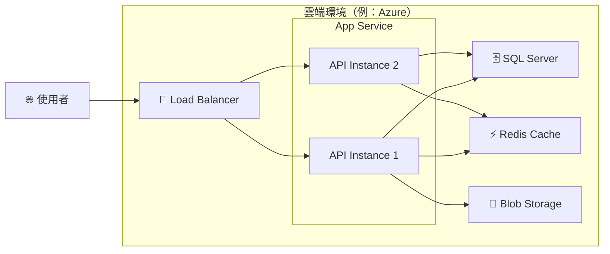
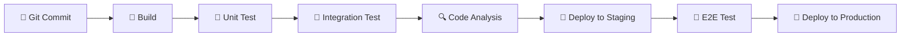

# 執行計畫（Plan）

> 📐 **使用說明**：本範本由 Architect Skill（AI）根據 `FRD.md` 中的架構設計，拆解為可執行的任務計畫。完整流程請將本檔與設計文件放在同一需求工作區，例如 `docs/{NNN}-{需求簡述}/plan.md`。

---

## 1. 文件資訊

| 欄位           | 內容                  |
| -------------- | --------------------- |
| 對應需求規格書 | [spec.md](./spec.md)  |
| 對應設計文件   | [FRD.md](./FRD.md)   |
| 架構師         | Architect Skill（AI） |
| 建立日期       | YYYY-MM-DD            |
| 最後更新       | YYYY-MM-DD            |

> 📐 **指引**：架構設計、DDD 建模、Mermaid 圖表與 API 規格等詳細設計請參閱同工作區的 `FRD.md`。

---

## 8. 工作拆解（Task Breakdown）

> 📐 **指引**：此區段是給 Dev Skill（AI）的工作指令。每個 Task 應足夠小且可獨立開發、測試。依賴關係須明確標示，以便 Dev Skill 決定開發順序。複雜度分為：低（< 2hr）、中（2–4hr）、高（> 4hr）。
>
> ⚠️ **Monorepo 目錄結構約束（前後端同一 repo 時必讀）**：
>
> 若本次開發為 Monorepo（前端 + 後端共存於同一 repo），**必須**採用以下頂層目錄分離：
>
> ```
> project-root/
> ├── frontend/    ← 所有前端 Task 的程式碼路徑前綴
> └── backend/     ← 所有後端 Task 的程式碼路徑前綴
> ```
>
> - 前端 Task 路徑：`frontend/projects/{system}/...`（WEC Angular）或 `frontend/src/...`（React/Vue）
> - 後端 Task 路徑：`backend/main.py`、`backend/PROD/`、`backend/models/`...
> - **禁止**在 repo 根目錄直接放置前後端程式碼
>
> ⚠️ **框架初始化前置 Task（必須優先安排，排在所有其他 Task 之前）**：
>
> - **Angular 專案**：
>   - T-01：「確認 wec-main fork + upstream 設定（`wec-framework-install` skill）」
>   - T-02：「建立系統 library（`wec-system-init` skill：`ng generate library "{system}"` → 註冊至 `app.config.ts`）」
>   - 所有前端功能 Task 均依賴 T-02
>   - **前端 Task 的目錄結構僅規劃 `projects/{system}/src/lib/system/` 內部**，禁止重新規劃 wec-main 外層
> - **Python 專案**：T-01 必須是「初始化 wecpy 設定（建立 `PROD/config.yaml` + `PILOT/config.yaml`）」，所有後端 Task 均依賴此 Task
> - **C# .NET 專案**：T-01 建議包含「iMX.Framework NuGet 引入 + `appsettings.json` 設定」（若使用 iMX.Framework）
>
> ⚠️ **Angular 前端 Task 目錄約束**：
>
> wec-main 是外殼模板，AI **禁止規劃或生成** `angular.json`、`tsconfig.json`、`src/app/`、`src/main.ts` 等外層結構。
> 所有前端功能 Task 的程式碼路徑必須在 `projects/{system}/` 內：
>
> ```
> projects/{system}/src/lib/system/views/{menu-name}/   ← 功能頁面
> projects/{system}/src/lib/system/services/             ← 繼承 DataService 的服務
> projects/{system}/src/lib/{system}.module.ts           ← setView() + setCustomLocalMenu()
> ```
>
> 功能頁面以 `ng generate component system/views/{name} --project={system} --standalone` 建立。
> 服務以 `ng generate service system/services/{name} --project={system}` 建立。

| 編號 | 任務名稱                 | 描述                                                  | 涉及層級       | 配置/設定檔                            | 預估複雜度 | 依賴       |
| ---- | ------------------------ | ----------------------------------------------------- | -------------- | -------------------------------------- | ---------- | ---------- |
| T-01 | 建立 Domain Entity       | 建立 Order Aggregate Root、OrderItem Entity、Money VO | Domain         | 無                                     | 低         | 無         |
| T-02 | 建立 Domain Event        | 定義 OrderCreatedEvent 等領域事件                     | Domain         | 無                                     | 低         | T-01       |
| T-03 | 建立 Application UseCase | 實作 CreateOrderUseCase，包含驗證與領域邏輯調用       | Application    | 無                                     | 中         | T-01       |
| T-04 | 建立 DTO 與 Mapper       | 定義 Request/Response DTO 與對應的 Mapping 設定       | Application    | 無                                     | 低         | T-01       |
| T-05 | 建立 Repository 介面     | 定義 IOrderRepository 介面                            | Domain         | 無                                     | 低         | T-01       |
| T-06 | 實作 EF Core DbContext   | 建立 DbContext、Entity Configuration                  | Infrastructure | `appsettings.json`（ConnectionString） | 中         | T-01       |
| T-07 | 實作 Repository          | 實作 OrderRepository（EF Core）                       | Infrastructure | 無                                     | 中         | T-05, T-06 |
| T-08 | 建立 API Controller      | 實作 OrderController 與路由設定                       | Presentation   | 無                                     | 中         | T-03, T-04 |
| T-09 | 撰寫 Unit Test           | Domain Entity 與 UseCase 的單元測試                   | Test           | 無                                     | 中         | T-01, T-03 |
| T-10 | 撰寫 Integration Test    | Repository 與 API 端點的整合測試                      | Test           | `appsettings.Test.json`                | 高         | T-07, T-08 |

---

## 9. 測試策略

### Unit Test 覆蓋範圍

- **Domain Layer**：所有 Aggregate Root 的不變條件驗證、狀態轉換邏輯
- **Application Layer**：所有 UseCase 的業務流程，使用 Mock Repository
- **覆蓋率目標**：Domain ≥ 90%，Application ≥ 80%

### Integration Test 範圍

- **Repository**：使用 In-Memory Database 或 TestContainers 驗證資料存取
- **API 端點**：使用 `WebApplicationFactory` 進行端對端 API 測試
- **覆蓋率目標**：核心 CRUD 流程 100% 覆蓋

### E2E Test 範圍（如需要）

- **使用者核心流程**：從前端操作到資料庫驗證的完整流程
- **工具**：（例：Playwright / Cypress）
- **覆蓋範圍**：僅針對關鍵商業流程

> 📐 **指引**：測試策略應與工作拆解（Section 8）的 Test 任務對應。請依據專案規模調整覆蓋率目標，並確保核心業務邏輯有充分的測試保護。

---

## 10. 部署與基礎設施

### 部署架構圖



> 📐 **指引**：部署架構圖須呈現所有運行環境的元件配置，包含負載平衡、應用程式實例、資料庫、快取等，並標示網路拓撲。

### CI/CD 流程



> 📐 **指引**：CI/CD 流程須涵蓋從程式碼提交到生產部署的完整流程。請標示每個階段的工具（如 GitHub Actions、Azure DevOps）及觸發條件。

### 環境設定

| 環境        | 用途     | 資料庫             | 備註                |
| ----------- | -------- | ------------------ | ------------------- |
| Development | 本地開發 | LocalDB / SQLite   | 使用 Docker Compose |
| Staging     | 整合測試 | SQL Server（測試） | 自動部署            |
| Production  | 正式環境 | SQL Server（正式） | 需人工審核後部署    |

> 📐 **指引**：每個環境都應列出對應的基礎設施配置與存取方式。機密資訊（連線字串、API Key）統一使用 Secret Manager 管理，不得寫入版本控制。

---

## 變更記錄

| 版本 | 日期       | 變更內容     | 變更人                |
| ---- | ---------- | ------------ | --------------------- |
| 0.1  | YYYY-MM-DD | 初版建立     | Architect Skill（AI） |
| 0.2  | YYYY-MM-DD | （變更描述） | （變更人）            |

> 📐 **指引**：每次架構變更都須記錄。版本號採用 `主版本.次版本` 格式：主版本變更代表重大架構調整，次版本變更代表細部修改。
