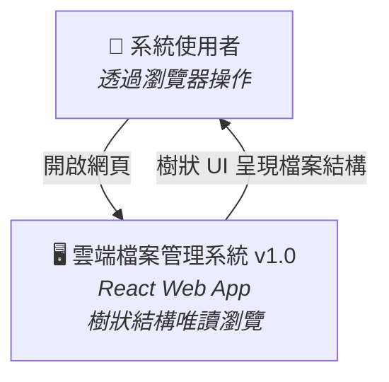
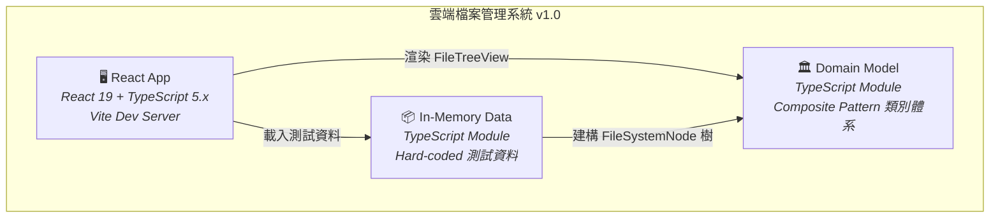
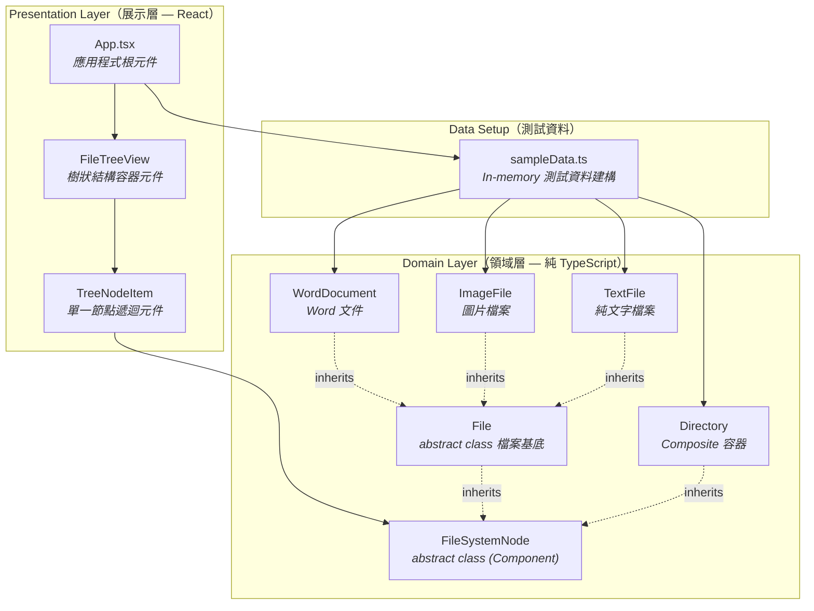
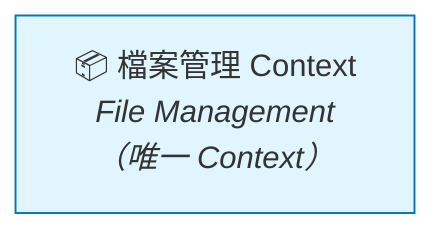
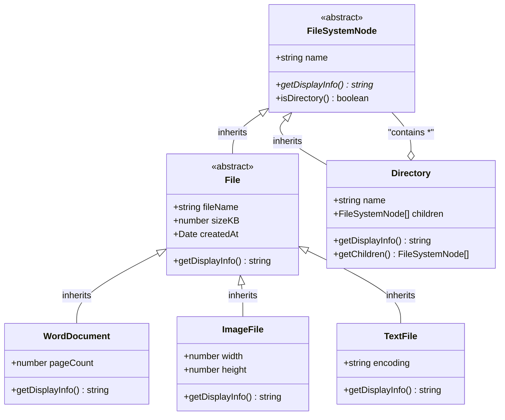
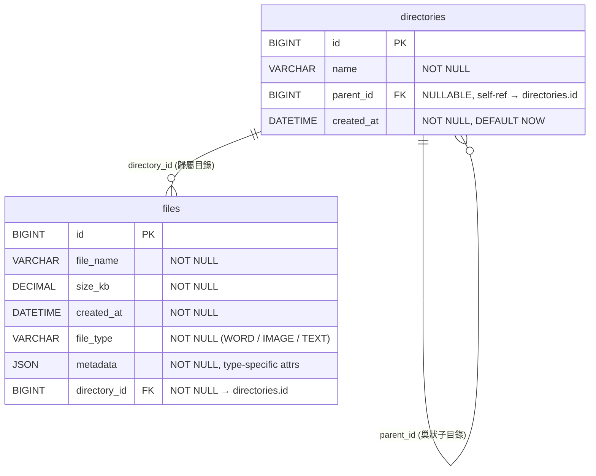
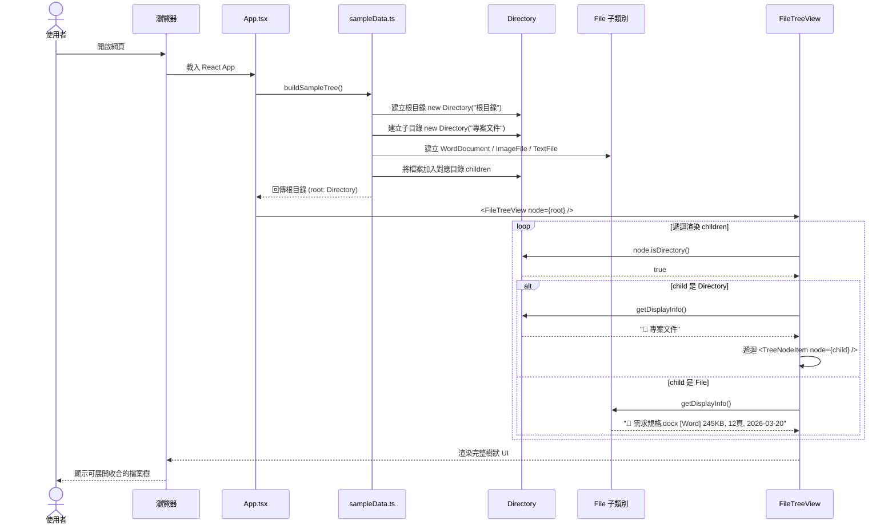
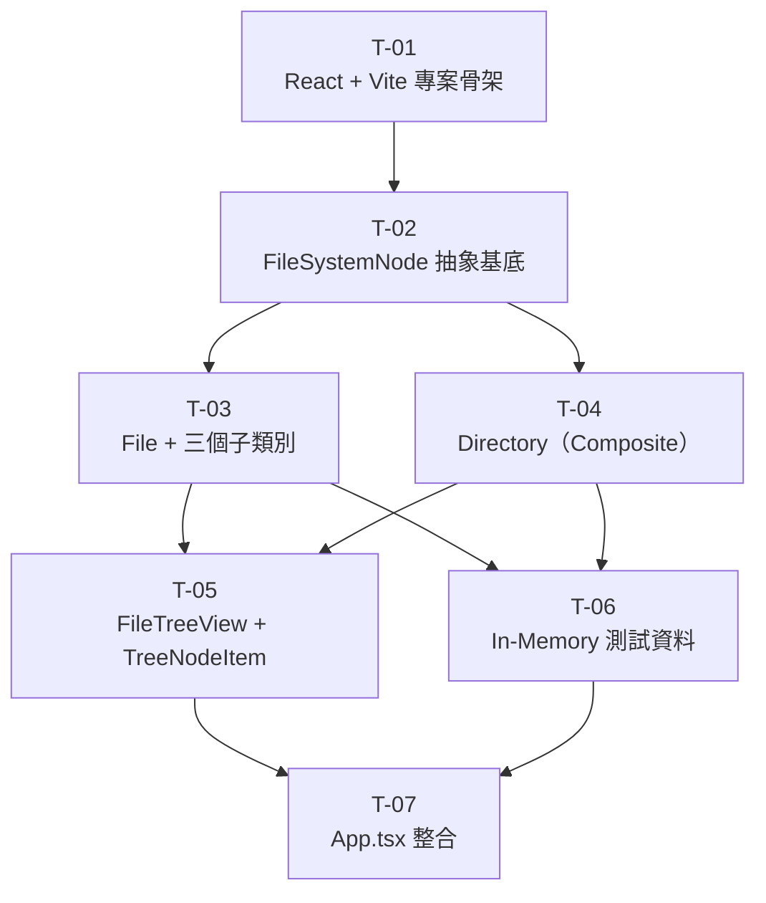

# 架構設計書（Plan）

---

## 1. 文件資訊

| 欄位           | 內容                                           |
| -------------- | ---------------------------------------------- |
| 對應需求規格書 | [spec.md](./spec.md)                           |
| 架構師         | Architect Skill（AI）                          |
| 建立日期       | 2026-03-27                                     |
| 最後更新       | 2026-03-27                                     |
| 審核狀態       | [x] 待審核 &ensp; [ ] 已通過 &ensp; [ ] 需修改 |

---

## 1.5 規範基線（Standards Baseline）

### 適用規範清單

| 類別     | 規範文件                                | 關鍵約束摘要                                                                                                 |
| -------- | --------------------------------------- | ------------------------------------------------------------------------------------------------------------ |
| 架構原則 | `standards/clean-architecture.md`       | 依賴方向由外層→內層；Domain Layer 禁止引用任何技術框架；外層透過 DI 注入內層定義的介面                       |
| DDD 建模 | `standards/ddd-guidelines.md`           | Aggregate 保持小而聚焦、Entity 以唯一 ID 識別、Value Object 不可變、Bounded Context 邊界明確                 |
| 設計模式 | `standards/design-patterns.md`          | 本專案適用 **Composite Pattern**（統一處理樹狀結構）、**Factory Method**（依 file_type 建立對應子類別）      |
| SOLID    | `standards/solid-principles.md`         | OCP：新增檔案類型只需擴展子類別；DIP：業務邏輯依賴抽象介面；SRP：各類別單一職責；LSP：子類別可替換父類別使用 |
| 前端規範 | `standards/coding-standard-frontend.md` | 元件單一職責、狀態管理策略、可存取性（a11y）、響應式設計                                                     |

---

## 2. 架構概述

### 2.1 系統概述

本系統為雲端檔案管理系統 v1.0，核心目標是以 **Composite Pattern** 建立 Domain Model，統一處理「檔案」與「目錄」的樹狀結構，並以 **React Web UI** 呈現可互動的樹狀瀏覽介面。

架構採用精簡版 **Clean Architecture**，分為 Domain Layer（TypeScript 領域模型，純邏輯無框架依賴）與 Presentation Layer（React 元件），因 v1.0 僅使用 In-memory 資料且為唯讀，暫不需要 Application Layer 與 Infrastructure Layer。這保持了最小化設計，同時為 v2.0 的 CRUD + 資料庫整合預留擴展空間。

### 2.2 技術棧選擇

| 層級     | 技術選型                 | 版本       | 選用理由                                                                        |
| -------- | ------------------------ | ---------- | ------------------------------------------------------------------------------- |
| 語言     | TypeScript               | 5.x        | 強型別支援 interface / abstract class 模擬，精準展示 Composite Pattern 繼承體系 |
| UI 框架  | React                    | 19         | 現代前端生態系標準，函數式元件 + Hooks，適合樹狀結構遞迴渲染                    |
| 建構工具 | Vite                     | 6.x        | 極速 HMR，原生支援 TypeScript + React，零配置即可上手                           |
| 樣式     | Tailwind CSS             | 4.x        | Utility-first CSS，快速構建 UI 不需寫自定義 CSS                                 |
| 測試     | Vitest + Testing Library | 3.x / 16.x | Vite 原生測試框架 + React 元件測試標準                                          |
| 資料庫   | 無（v1.0）               | —          | v1.0 使用 In-memory hard-coded 資料；ER Model 已設計，供 v2.0 整合真實資料庫    |

### 2.3 架構決策記錄（ADR）

| ADR 編號 | 標題                       | 決策                                      | 理由                                                                                                                    | 替代方案                          | 依據規範                                                                            |
| -------- | -------------------------- | ----------------------------------------- | ----------------------------------------------------------------------------------------------------------------------- | --------------------------------- | ----------------------------------------------------------------------------------- |
| ADR-001  | 領域模型設計模式           | 採用 **Composite Pattern**                | 統一 `File` 與 `Directory` 為 `FileSystemNode`，使樹狀遍歷邏輯統一處理，符合 OCP                                        | Visitor Pattern、純繼承無共同基底 | `standards/design-patterns.md` §5 Composite；`standards/solid-principles.md` §2 OCP |
| ADR-002  | ER Model 策略              | 採用 **STI + JSON**（僅 2 張表）          | 極簡設計，新增檔案類型零表格變更；`metadata` JSON 存型別專屬屬性，單表查詢效能佳                                        | TPT（5 張表）、EAV（5 張表）      | `standards/ddd-guidelines.md` §2.1 Entity 持久化策略                                |
| ADR-003  | 技術選型                   | 採用 **React 19 + TypeScript 5.x + Vite** | 使用者指定使用現代 React；TypeScript 強型別原生支援 interface/class，適合展示 Composite 繼承體系；Vite 提供極速開發體驗 | Python、C#、Java                  | spec.md §7 技術約束「不限語言」；使用者明確指定 React                               |
| ADR-004  | v1.0 架構分層精簡          | 僅實作 **Domain + Presentation** 兩層     | v1.0 為唯讀 In-memory，無 CRUD 需求；Domain 為純 TypeScript 類別（無框架依賴），Presentation 為 React 元件；v2.0 再擴展 | 完整四層 Clean Architecture       | `standards/clean-architecture.md` §1.1 核心理念（最小化分層）                       |
| ADR-005  | 檔案型別專屬屬性的多型展示 | 各子類別 override `getDisplayInfo()`      | 利用多型讓每種檔案類型自行決定顯示格式，新增類型無需修改既有顯示邏輯                                                    | 集中式 `if-else` / `switch` 判斷  | `standards/solid-principles.md` §2 OCP；`standards/design-patterns.md` §5 Composite |

---

## 3. C4 架構圖

### 3.1 Context Diagram（系統脈絡圖）



> v1.0 無外部系統依賴，使用者透過瀏覽器與 React App 互動。

### 3.2 Container Diagram（容器圖）



### 3.3 Component Diagram（元件圖 — Clean Architecture 分層）



---

## 4. DDD 領域模型

### 4.1 Bounded Context Map

本系統為單一 Bounded Context，因 v1.0 範圍聚焦於檔案管理核心領域，不涉及跨系統整合。



> v2.0 若加入使用者認證、權限管理等功能，可能需要拆分出獨立的 Bounded Context。

### 4.2 領域模型 Class Diagram（Composite Pattern）



**設計模式解析 — Composite Pattern 角色對應：**

| Composite 角色 | 對應類別                                | 說明                                                 |
| -------------- | --------------------------------------- | ---------------------------------------------------- |
| **Component**  | `FileSystemNode`                        | 抽象基底，定義 `getDisplayInfo()` 統一介面           |
| **Leaf**       | `WordDocument`、`ImageFile`、`TextFile` | 葉節點，各自 override 顯示邏輯                       |
| **Composite**  | `Directory`                             | 容器節點，持有 `children: FileSystemNode[]` 組合關係 |

> **TypeScript 實作說明**：TypeScript 不支援真正的 abstract class 在執行時期強制，
> 但可透過 `abstract class` 語法在編譯時期提供接近相同的約束力。
> Domain 類別為純 TypeScript，**禁止**引入任何 React 依賴。

### 4.3 核心 Aggregate 說明

| Aggregate Root | 包含的 Entity / Value Object           | 不變條件（Invariants）                                    |
| -------------- | -------------------------------------- | --------------------------------------------------------- |
| Directory      | FileSystemNode（File 子類別們為 Leaf） | Directory 可包含 0..N 個 children；children 不可為 `null` |
| File（抽象）   | WordDocument / ImageFile / TextFile    | `fileName` 不可為空；`sizeKB` ≥ 0；`createdAt` 不可為空   |

**通用語言（Ubiquitous Language）術語表：**

| 中文         | 英文           | 定義                                                             |
| ------------ | -------------- | ---------------------------------------------------------------- |
| 檔案系統節點 | FileSystemNode | 樹狀結構中的任意節點，可為檔案或目錄（Composite Component）      |
| 檔案         | File           | 所有檔案類型的抽象基底，含共用屬性 fileName / sizeKB / createdAt |
| Word 文件    | WordDocument   | 繼承 File，額外記錄頁數（pageCount）                             |
| 圖片         | ImageFile      | 繼承 File，額外記錄寬度 × 高度（width × height）                 |
| 純文字檔     | TextFile       | 繼承 File，額外記錄編碼格式（encoding）                          |
| 目錄         | Directory      | 可包含多個 FileSystemNode，形成巢狀樹狀結構（Composite 容器）    |
| 樹狀瀏覽     | Tree Display   | 以可展開收合的樹狀 UI 呈現目錄層級與檔案列表                     |

---

## 5. ER Diagram（資料庫模型）

> v1.0 不實作資料庫存取，以下 ER Model 供 v2.0 整合真實資料庫使用。
> 採用 **STI + JSON** 策略，僅 2 張表。



**Domain ↔ ER 對照表：**

| Domain 類別    | ER 表格       | 對應方式                                                  |
| -------------- | ------------- | --------------------------------------------------------- |
| `Directory`    | `directories` | 1:1 對應，`parent_id` 自我參照實現巢狀                    |
| `File`（抽象） | `files`       | 共用屬性 → 獨立欄位；`file_type` 區分子類別               |
| `WordDocument` | `files`       | `file_type='WORD'`，`metadata={"page_count": N}`          |
| `ImageFile`    | `files`       | `file_type='IMAGE'`，`metadata={"width": W, "height": H}` |
| `TextFile`     | `files`       | `file_type='TEXT'`，`metadata={"encoding": "UTF-8"}`      |

---

## 6. Sequence Diagram（核心流程）

### 6.1 流程：樹狀檔案結構瀏覽（React Web UI）



---

## 7. 目錄結構規劃

```
file-management-system/
├── src/
│   ├── domain/                         # Domain Layer — 純 TypeScript 領域模型（禁止 React 依賴）
│   │   ├── FileSystemNode.ts           # FileSystemNode 抽象基底類別
│   │   ├── File.ts                     # File 抽象類別（含共用屬性）
│   │   ├── WordDocument.ts             # WordDocument（頁數）
│   │   ├── ImageFile.ts                # ImageFile（寬×高）
│   │   ├── TextFile.ts                 # TextFile（編碼）
│   │   ├── Directory.ts                # Directory（Composite 容器）
│   │   └── index.ts                    # Domain barrel export
│   ├── data/                           # 測試資料
│   │   └── sampleData.ts              # In-memory 測試資料建構
│   ├── components/                     # Presentation Layer — React 元件
│   │   ├── FileTreeView.tsx            # 樹狀結構容器元件
│   │   └── TreeNodeItem.tsx            # 單一節點遞迴元件（含展開/收合）
│   ├── App.tsx                         # 應用程式根元件
│   ├── App.css                         # 根元件樣式
│   ├── main.tsx                        # Vite 進入點
│   └── index.css                       # 全域樣式（Tailwind 引入）
├── tests/                              # 測試目錄
│   ├── domain/                         # Domain 單元測試
│   │   ├── FileSystemNode.test.ts      # FileSystemNode 繼承體系測試
│   │   └── Directory.test.ts           # Directory composite 行為測試
│   ├── data/
│   │   └── sampleData.test.ts          # 測試資料完整性測試
│   └── components/                     # React 元件測試
│       └── FileTreeView.test.tsx       # 樹狀 UI 渲染測試
├── index.html                          # Vite HTML 進入點
├── vite.config.ts                      # Vite 設定
├── tsconfig.json                       # TypeScript 設定
├── tailwind.config.js                  # Tailwind CSS 設定
├── package.json                        # 依賴管理
└── README.md                           # 專案說明
```

---

## 8. 工作拆解（Task Breakdown）

### T-01：建立 React + TypeScript 專案骨架

| 欄位        | 內容                                              |
| ----------- | ------------------------------------------------- |
| 編號        | T-01                                              |
| 名稱        | 建立 React + TypeScript + Vite 專案骨架           |
| 架構層      | 全域                                              |
| 複雜度      | 低                                                |
| 前置依賴    | 無                                                |
| 配置/設定檔 | `package.json`、`vite.config.ts`、`tsconfig.json` |

**詳細描述：**

1. 使用 `npm create vite@latest file-management-system -- --template react-ts` 建立專案
2. 安裝 Tailwind CSS 4.x（`npm install tailwindcss @tailwindcss/vite`）
3. 安裝測試依賴（`npm install -D vitest @testing-library/react @testing-library/jest-dom jsdom`）
4. 設定 `vite.config.ts` 加入 Tailwind plugin 與 vitest 設定
5. 建立 Section 7 所述的目錄結構（`src/domain/`、`src/data/`、`src/components/`、`tests/`）
6. 設定 `tsconfig.json` 的 `strict: true`，啟用嚴格型別檢查
7. 建立 `README.md`，簡述專案用途

**測試策略：** 驗證 `npm run dev` 可正常啟動、`npx vitest run` 可正常執行。

---

### T-02：實作 FileSystemNode 抽象基底類別

| 欄位        | 內容                                                    |
| ----------- | ------------------------------------------------------- |
| 編號        | T-02                                                    |
| 名稱        | 實作 FileSystemNode 抽象基底類別（Composite Component） |
| 架構層      | Domain                                                  |
| 複雜度      | 低                                                      |
| 前置依賴    | T-01                                                    |
| 配置/設定檔 | 無                                                      |

**詳細描述：**

在 `src/domain/FileSystemNode.ts` 中建立：

```typescript
export abstract class FileSystemNode {
  constructor(public readonly name: string) {}

  abstract getDisplayInfo(): string;

  isDirectory(): boolean {
    return false;
  }
}
```

- 使用 TypeScript `abstract class` 定義抽象方法
- `name` 透過 constructor 初始化，標記為 `readonly`
- `isDirectory()` 預設回傳 `false`，Directory override 為 `true`
- **禁止**引入任何 React 依賴（純 Domain 類別）

**測試策略：** 在 `tests/domain/FileSystemNode.test.ts` 中驗證：

- `FileSystemNode` 無法直接實例化（abstract class）
- 子類別必須實作 `getDisplayInfo()`
- `isDirectory()` 預設回傳 `false`

---

### T-03：實作 File 抽象類別與三個具體子類別

| 欄位        | 內容                                                                            |
| ----------- | ------------------------------------------------------------------------------- |
| 編號        | T-03                                                                            |
| 名稱        | 實作 File 抽象類別及 WordDocument / ImageFile / TextFile 三個具體子類別（Leaf） |
| 架構層      | Domain                                                                          |
| 複雜度      | 中                                                                              |
| 前置依賴    | T-02                                                                            |
| 配置/設定檔 | 無                                                                              |

**詳細描述：**

1. **`src/domain/File.ts` — File 抽象類別**（繼承 `FileSystemNode`）：

```typescript
export abstract class File extends FileSystemNode {
  constructor(
    public readonly fileName: string,
    public readonly sizeKB: number,
    public readonly createdAt: Date,
  ) {
    super(fileName); // name = fileName
  }
}
```

2. **`src/domain/WordDocument.ts`**（繼承 `File`）：

```typescript
export class WordDocument extends File {
  constructor(fileName: string, sizeKB: number, createdAt: Date,
    public readonly pageCount: number) { ... }

  getDisplayInfo(): string {
    return `📄 ${this.fileName} [Word] ${this.sizeKB}KB, ${this.pageCount}頁, ${formatDate(this.createdAt)}`;
  }
}
```

3. **`src/domain/ImageFile.ts`**（繼承 `File`）：

```typescript
export class ImageFile extends File {
  constructor(fileName: string, sizeKB: number, createdAt: Date,
    public readonly width: number, public readonly height: number) { ... }

  getDisplayInfo(): string {
    return `🖼️ ${this.fileName} [圖片] ${this.sizeKB}KB, ${this.width}×${this.height}, ${formatDate(this.createdAt)}`;
  }
}
```

4. **`src/domain/TextFile.ts`**（繼承 `File`）：

```typescript
export class TextFile extends File {
  constructor(fileName: string, sizeKB: number, createdAt: Date,
    public readonly encoding: string) { ... }

  getDisplayInfo(): string {
    return `📝 ${this.fileName} [文字] ${this.sizeKB}KB, ${this.encoding}, ${formatDate(this.createdAt)}`;
  }
}
```

**測試策略：** 在 `tests/domain/FileSystemNode.test.ts` 中驗證：

- 每個子類別的 `getDisplayInfo()` 回傳正確格式
- `File` 不可直接實例化（abstract）
- `isDirectory()` 回傳 `false`
- LSP 驗證：三個子類別皆可作為 `FileSystemNode` 使用
- 屬性唯讀性驗證

---

### T-04：實作 Directory 類別（Composite 容器）

| 欄位        | 內容                                      |
| ----------- | ----------------------------------------- |
| 編號        | T-04                                      |
| 名稱        | 實作 Directory 類別（Composite 容器節點） |
| 架構層      | Domain                                    |
| 複雜度      | 中                                        |
| 前置依賴    | T-02                                      |
| 配置/設定檔 | 無                                        |

**詳細描述：**

在 `src/domain/Directory.ts` 中建立：

```typescript
export class Directory extends FileSystemNode {
  private readonly _children: FileSystemNode[] = [];

  constructor(name: string) {
    super(name);
  }

  getDisplayInfo(): string {
    return `📁 ${this.name}`;
  }

  getChildren(): ReadonlyArray<FileSystemNode> {
    return [...this._children]; // 防禦性複製
  }

  addChild(node: FileSystemNode): void {
    this._children.push(node);
  }

  isDirectory(): boolean {
    return true;
  }
}
```

- `_children` 為 private readonly，防止外部直接修改
- `getChildren()` 回傳 `ReadonlyArray<FileSystemNode>` 的淺複製
- `addChild()` v1.0 僅用於測試資料建構

**測試策略：** 在 `tests/domain/Directory.test.ts` 中驗證：

- Directory 可包含 File 子類別（Leaf）
- Directory 可包含子 Directory（巢狀 Composite）
- `getChildren()` 回傳正確的子節點列表
- 空目錄的 `getChildren()` 回傳空陣列
- `isDirectory()` 回傳 `true`
- 多層巢狀結構（≥ 3 層）可正確建構

---

### T-05：實作 React 樹狀元件（FileTreeView + TreeNodeItem）

| 欄位        | 內容                                         |
| ----------- | -------------------------------------------- |
| 編號        | T-05                                         |
| 名稱        | 實作 FileTreeView 與 TreeNodeItem React 元件 |
| 架構層      | Presentation                                 |
| 複雜度      | 中                                           |
| 前置依賴    | T-03, T-04                                   |
| 配置/設定檔 | 無                                           |

**詳細描述：**

1. **`src/components/FileTreeView.tsx`** — 樹狀結構容器元件：

```tsx
interface FileTreeViewProps {
  root: Directory;
}

export const FileTreeView: React.FC<FileTreeViewProps> = ({ root }) => {
  // 渲染根目錄名稱 + 遞迴渲染所有 children
};
```

2. **`src/components/TreeNodeItem.tsx`** — 單一節點遞迴元件：

```tsx
interface TreeNodeItemProps {
  node: FileSystemNode;
  level: number; // 縮排層級
}

export const TreeNodeItem: React.FC<TreeNodeItemProps> = ({ node, level }) => {
  // 如果是 Directory → 顯示資料夾圖示 + 可展開/收合 + 遞迴渲染 children
  // 如果是 File → 顯示 getDisplayInfo()
};
```

**UI 行為要求：**

- 目錄預設展開，可點擊收合/展開
- 使用 Tailwind CSS 實現縮排（每層 `pl-6`）
- 目錄圖示：📁（展開）/ 📁（收合），搭配 ▶ / ▼ 箭頭
- 檔案類型圖示依 `getDisplayInfo()` 已包含（📄 / 🖼️ / 📝）
- 呼叫每個節點的 `getDisplayInfo()` 取得顯示文字（多型）
- 使用 `useState` 管理展開/收合狀態

**測試策略：** 在 `tests/components/FileTreeView.test.tsx` 中驗證：

- 渲染包含多層巢狀的樹狀結構
- 所有目錄與檔案顯示正確的資訊
- 點擊目錄可收合/展開子節點
- 空目錄仍然正常顯示

---

### T-06：建構 In-Memory 測試資料

| 欄位        | 內容                                             |
| ----------- | ------------------------------------------------ |
| 編號        | T-06                                             |
| 名稱        | 建構 In-Memory 測試資料（模擬 spec.md 範例結構） |
| 架構層      | Data Setup                                       |
| 複雜度      | 低                                               |
| 前置依賴    | T-03, T-04                                       |
| 配置/設定檔 | 無                                               |

**詳細描述：**

在 `src/data/sampleData.ts` 中建立：

```typescript
export function buildSampleTree(): Directory {
  // 建構 spec.md US-003 範例中的完整樹狀結構，回傳根目錄
}
```

測試資料結構（完全對齊 spec.md 範例）：

```
📁 根目錄
├── 📁 專案文件
│   ├── 📄 需求規格.docx [Word] 245KB, 12頁, 2026-03-20
│   ├── 📄 會議紀錄.docx [Word] 89KB, 3頁, 2026-03-22
│   └── 📁 設計圖
│       ├── 🖼️ 架構圖.png [圖片] 1024KB, 1920×1080, 2026-03-21
│       └── 🖼️ 流程圖.jpg [圖片] 512KB, 800×600, 2026-03-23
├── 📁 設定檔
│   ├── 📝 config.txt [文字] 2KB, UTF-8, 2026-03-15
│   └── 📝 readme.txt [文字] 5KB, UTF-8, 2026-03-18
└── 📄 專案計畫.docx [Word] 320KB, 25頁, 2026-03-10
```

**測試策略：** 在 `tests/data/sampleData.test.ts` 中驗證：

- `buildSampleTree()` 回傳一個 Directory
- 根目錄包含 3 個 children（2 個子目錄 + 1 個檔案）
- 「專案文件」子目錄包含 2 個檔案 + 1 個子目錄
- 「設計圖」子目錄包含 2 個 ImageFile
- 各檔案屬性值正確

---

### T-07：整合 App.tsx，完成端到端樹狀呈現

| 欄位        | 內容                                     |
| ----------- | ---------------------------------------- |
| 編號        | T-07                                     |
| 名稱        | 整合 App.tsx，完成端到端樹狀 Web UI 呈現 |
| 架構層      | Presentation                             |
| 複雜度      | 低                                       |
| 前置依賴    | T-05, T-06                               |
| 配置/設定檔 | 無                                       |

**詳細描述：**

在 `src/App.tsx` 中整合：

```tsx
import { buildSampleTree } from "./data/sampleData";
import { FileTreeView } from "./components/FileTreeView";

function App() {
  const root = buildSampleTree();

  return (
    <div className="min-h-screen bg-gray-50 p-8">
      <h1 className="text-2xl font-bold mb-6">📂 雲端檔案管理系統</h1>
      <FileTreeView root={root} />
    </div>
  );
}

export default App;
```

**測試策略：** 端到端驗證：

- 執行 `npm run dev` 開啟瀏覽器可看到完整樹狀 UI
- 顯示內容與 spec.md US-003 範例一致
- 所有目錄層級正確展開
- 各檔案類型顯示正確的專屬屬性
- 目錄可點擊收合/展開

---

### 任務依賴圖



---

## 9. 品質自檢

- [x] 所有 Bounded Context 已識別（單一 Context：檔案管理）
- [x] 每個 Aggregate 有明確不變條件（Directory.children 不為 None、File 屬性約束）
- [x] C4 三層圖表完整（Context、Container、Component；v1.0 無需第四層）
- [x] ER Diagram 涵蓋所有持久化實體（directories + files，STI + JSON 策略）
- [x] 核心業務流程有 Sequence Diagram（樹狀瀏覽流程）
- [x] Task 依賴關係無循環依賴（DAG 驗證通過）
- [x] Clean Architecture 依賴方向正確（Presentation(React) → Domain(純 TypeScript)；無 Infrastructure 層）
- [x] 測試策略已在每個 Task 中說明（Vitest + Testing Library）
- [x] 所有設計決策符合規範基線（SOLID、Composite Pattern、OCP）
- [x] 每個 ADR 已標注「依據規範」欄位
- [x] Composite Pattern 角色對應正確（Component / Leaf / Composite）
- [x] OCP 驗證：新增檔案類型只需新增 File 子類別 + 在 sampleData 中使用，不修改既有類別
- [x] Domain 類別為純 TypeScript，禁止引入 React 依賴（Clean Architecture 依賴規則）
