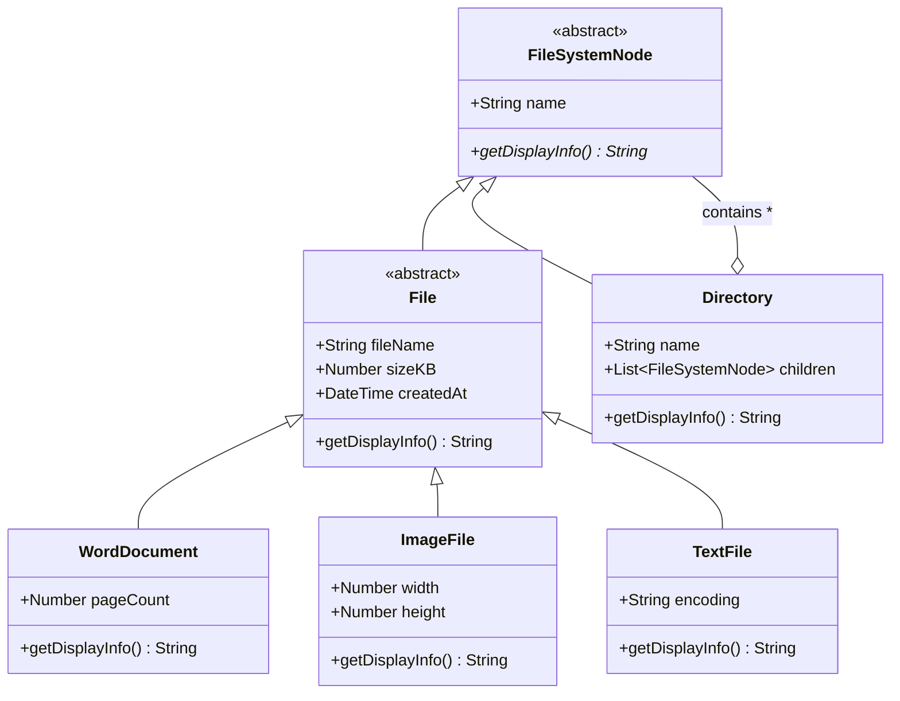
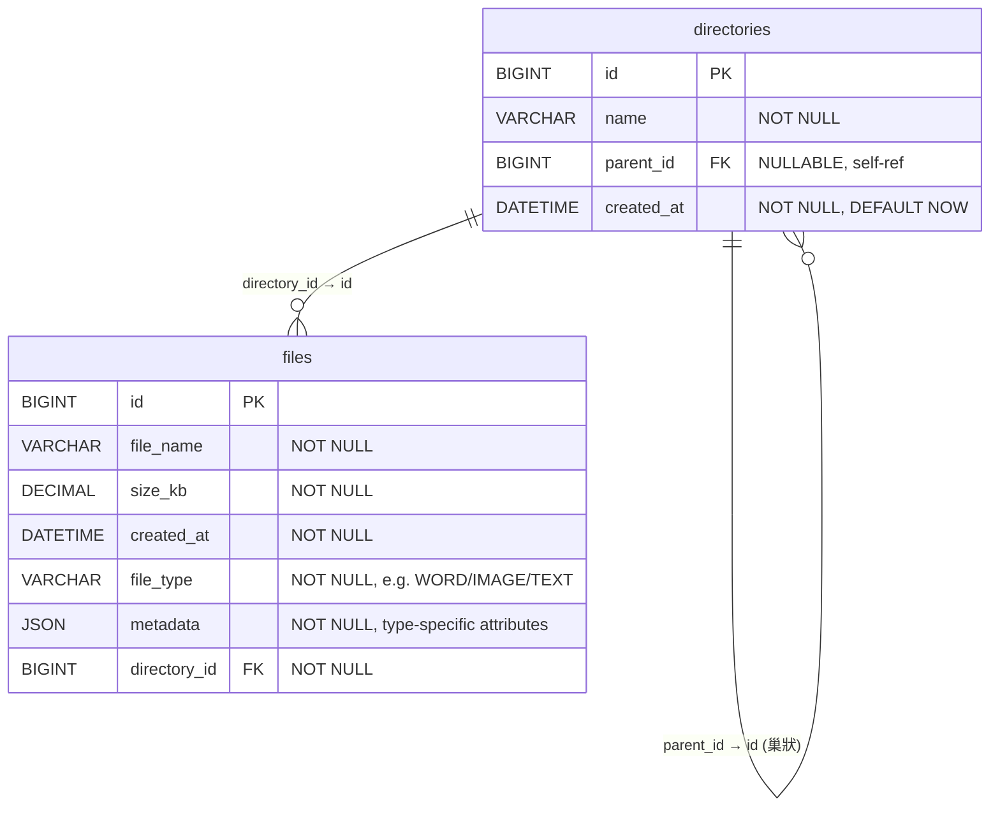

# 需求規格書（Spec）

---

## 1. 專案基本資訊

| 欄位         | 內容                                           |
| ------------ | ---------------------------------------------- |
| 專案名稱     | 雲端檔案管理系統                               |
| 版本號       | v1.0.0                                         |
| 負責人（PM） | AI PM（@pm）                                   |
| 建立日期     | 2026-03-27                                     |
| 最後更新     | 2026-03-27                                     |
| 審核狀態     | [x] 待審核 &ensp; [ ] 已通過 &ensp; [ ] 需修改 |

---

## 2. 背景與目標

### 2.1 業務背景

客戶擁有大量不同類型的檔案需要分類管理，主要包含 Word 文件、圖片與純文字檔三種類型。目前缺乏統一的管理系統，檔案組織依賴傳統的檔案系統，且不同類型的檔案有各自需要記錄的特殊屬性（如 Word 的頁數、圖片的解析度、文字檔的編碼格式），需要一個系統化的方案來進行分類儲存與階層式瀏覽。

### 2.2 專案目標

1. 建立雲端檔案管理系統，支援 Word 文件、圖片、純文字檔三種檔案類型的分類管理。
2. 以「目錄」結構組織檔案，支援無限層級的巢狀子目錄（類似 Windows 檔案總管）。
3. 推導出 Domain Model（UML 類別圖）與 ER Model（資料庫結構），建立清晰的領域知識基礎。
4. 第一版（v1.0）先實作樹狀結構的檔案瀏覽功能（唯讀呈現），不含 CRUD 操作。

### 2.3 成功指標（KPI）

| 指標名稱                  | 目標值               | 衡量方式                      | 評估時間點     |
| ------------------------- | -------------------- | ----------------------------- | -------------- |
| Domain Model 完整度       | 涵蓋所有訪談中的名詞 | 對照訪談紀錄逐項檢核          | 設計階段完成時 |
| ER Model 與 Domain 一致性 | 100% 對應            | ER 表格可完整承載 Domain 屬性 | 設計階段完成時 |
| 樹狀呈現正確性            | 100%                 | 巢狀目錄與檔案正確展開顯示    | 開發完成時     |

---

## 3. 利害關係人

| 角色     | 姓名               | 職責                 | 聯絡方式 |
| -------- | ------------------ | -------------------- | -------- |
| 客戶     | [待確認：客戶姓名] | 提供需求、驗收確認   | （待補） |
| PM       | AI PM              | 需求分析與規格書產出 | —        |
| 開發人員 | [待確認]           | 系統設計與實作       | （待補） |

---

## 4. 功能需求

### 4.1 功能清單總覽

| 編號  | 功能名稱                              | 優先級 | 狀態  |
| ----- | ------------------------------------- | ------ | ----- |
| F-001 | 檔案領域模型定義（Domain Model）      | P0     | Ready |
| F-002 | 資料庫結構設計（ER Model）            | P0     | Ready |
| F-003 | 樹狀檔案結構瀏覽                      | P0     | Ready |
| F-004 | 檔案 CRUD 操作（建立/讀取/更新/刪除） | P1     | Draft |
| F-005 | 目錄 CRUD 操作                        | P1     | Draft |

### 4.2 User Story 詳述

---

#### US-001：定義檔案領域模型

| 欄位     | 內容             |
| -------- | ---------------- |
| 編號     | US-001           |
| 標題     | 定義檔案領域模型 |
| 對應功能 | F-001            |
| 優先級   | P0               |

**描述**

- **角色**：作為開發團隊
- **需求**：我想要有一個清晰的 Domain Model，以 UML 類別圖呈現檔案管理系統的所有領域概念
- **目的**：以便所有團隊成員對系統的核心概念有一致的理解

**領域分析 — 名詞與動詞識別**

從客戶訪談中擷取的核心概念：

**名詞（Nouns → 類別/屬性）：**

| 名詞         | 對應概念       | 說明                                 |
| ------------ | -------------- | ------------------------------------ |
| 檔案         | `File`（抽象） | 所有檔案類型的基底，含共用屬性       |
| Word 文件    | `WordDocument` | 繼承 File，額外記錄頁數              |
| 圖片         | `ImageFile`    | 繼承 File，額外記錄寬度與高度        |
| 純文字檔     | `TextFile`     | 繼承 File，額外記錄編碼格式          |
| 目錄         | `Directory`    | 可包含檔案與子目錄（Composite 結構） |
| 檔名         | `fileName`     | File 的屬性                          |
| 大小（KB）   | `sizeKB`       | File 的屬性                          |
| 建立時間     | `createdAt`    | File 的屬性                          |
| 頁數         | `pageCount`    | WordDocument 的屬性                  |
| 解析度（寬） | `width`        | ImageFile 的屬性                     |
| 解析度（高） | `height`       | ImageFile 的屬性                     |
| 編碼         | `encoding`     | TextFile 的屬性                      |
| 目錄名稱     | `name`         | Directory 的屬性                     |

**動詞（Verbs → 行為/方法）：**

| 動詞       | 對應方法            | 說明                 | 本版實作 |
| ---------- | ------------------- | -------------------- | -------- |
| 分類管理   | 依檔案類型繼承體系  | 透過多型達成分類     | ✅       |
| 組織       | `addChild()`        | 目錄加入檔案或子目錄 | ❌ v2.0  |
| 建立子目錄 | `createSubDir()`    | 在目錄下建立新子目錄 | ❌ v2.0  |
| 放入目錄   | `moveToDirectory()` | 將檔案歸屬到特定目錄 | ❌ v2.0  |
| 呈現       | `display()`         | 樹狀結構展示         | ✅       |

**Domain Model（UML 類別圖 — Mermaid）**

> 設計模式選用：**Composite Pattern** — 統一處理「檔案」與「目錄」的樹狀結構



**類別說明：**

| 類別             | 說明                                                                     |
| ---------------- | ------------------------------------------------------------------------ |
| `FileSystemNode` | 抽象基底類別，代表檔案系統中的任何節點（Composite Pattern 的 Component） |
| `File`           | 抽象檔案類別，包含所有檔案共用屬性（fileName、sizeKB、createdAt）        |
| `WordDocument`   | Word 文件，額外屬性：`pageCount`（頁數）                                 |
| `ImageFile`      | 圖片檔案，額外屬性：`width`（寬度像素）、`height`（高度像素）            |
| `TextFile`       | 純文字檔案，額外屬性：`encoding`（編碼格式，如 UTF-8）                   |
| `Directory`      | 目錄，可包含多個 `FileSystemNode`（檔案或子目錄），形成巢狀樹狀結構      |

**設計決策：**

- 使用 **Composite Pattern** 讓 `Directory` 與 `File` 共享相同基底 `FileSystemNode`，使得樹狀遍歷與顯示邏輯可統一處理。
- `File` 為抽象類別，強制子類別實作各自的 `getDisplayInfo()` 方法，符合 **OCP（開放封閉原則）** — 新增檔案類型只需擴展，不需修改既有程式碼。
- 客戶明確表示「所有檔案都必須放在某個目錄下」→ File 不可獨立存在於 Directory 之外（組合關係）。

**驗收標準（Acceptance Criteria）**

1. **Given** 客戶訪談紀錄中提及的所有名詞，**When** 對照 Domain Model，**Then** 每個名詞都能在模型中找到對應的類別或屬性。
2. **Given** Domain Model 使用 Composite Pattern，**When** 新增一種檔案類型（如 PDF），**Then** 只需新增一個繼承 `File` 的子類別，不需修改既有類別。
3. **Given** UML 類別圖，**When** 檢視繼承與組合關係，**Then** `Directory` 可包含任意 `FileSystemNode`（含 `File` 子類別與子 `Directory`）。

**附註/限制**

- 本版 Domain Model 聚焦於「結構」（名詞），行為方法（動詞）標記為 v2.0 實作。
- `FileSystemNode.name` 為 `Directory` 的名稱欄位；`File` 的名稱使用 `fileName` 以區分語意。

---

#### US-002：設計資料庫 ER Model

| 欄位     | 內容                |
| -------- | ------------------- |
| 編號     | US-002              |
| 標題     | 設計資料庫 ER Model |
| 對應功能 | F-002               |
| 優先級   | P0                  |

**描述**

- **角色**：作為開發團隊
- **需求**：我想要有一個可實作的 ER Model，定義資料庫的表格、欄位與關聯
- **目的**：以便後續能順利建立資料庫並承載 Domain Model 的所有資料

**ER Model（Mermaid ER Diagram）**

> 採用 **STI + JSON（Single Table Inheritance + JSON Metadata）策略** — 僅 2 張表，
> `file_type` 欄位標記類型，`metadata` JSON 欄位儲存型別專屬屬性，新增檔案類型**零表格變更**。



**表格說明：**

| 表格          | 說明                                                                  |
| ------------- | --------------------------------------------------------------------- |
| `directories` | 目錄表，透過 `parent_id` 自我參照實現無限層級巢狀                     |
| `files`       | 檔案表，共用屬性為獨立欄位，型別專屬屬性統一存入 `metadata` JSON 欄位 |

**`metadata` JSON 結構範例：**

| file_type | metadata 內容                               |
| --------- | ------------------------------------------- |
| `WORD`    | `{"page_count": 12}`                        |
| `IMAGE`   | `{"width": 1920, "height": 1080}`           |
| `TEXT`    | `{"encoding": "UTF-8"}`                     |
| `PDF`     | `{"page_count": 30, "is_encrypted": false}` |

**關聯規則：**

- `directories.parent_id` → `directories.id`（自我參照，根目錄的 `parent_id` 為 NULL）
- `files.directory_id` → `directories.id`（NOT NULL，確保每個檔案必須歸屬於一個目錄）

**擴充性範例 — 新增 PDF 類型（直接 INSERT，零結構變更）：**

```sql
INSERT INTO files (file_name, size_kb, created_at, file_type, metadata, directory_id)
VALUES ('report.pdf', 500, NOW(), 'PDF', '{"page_count": 30, "is_encrypted": false}', 1);
```

**設計決策 — 為何選擇 STI + JSON：**

| 面向         | TPT（多子表）     | EAV（5 張表）     | STI + JSON（2 張表）✅       |
| ------------ | ----------------- | ----------------- | ---------------------------- |
| 資料表數量   | 5 張              | 5 張              | **2 張** ✅                  |
| 新增檔案類型 | 新建表 + 改程式碼 | INSERT 3 張表     | 直接 INSERT `files` ✅       |
| 查詢複雜度   | 多表 JOIN         | PIVOT / 多次 JOIN | **單表查詢** ✅              |
| 型別安全     | 強                | 弱                | 中（應用層驗證 JSON schema） |
| DB 支援      | 所有 DB           | 所有 DB           | MySQL 5.7+ / PostgreSQL 9.4+ |

> ⚠️ **Trade-off**：`metadata` 為 JSON 欄位，無法在 DB 層面對內部欄位做 NOT NULL 約束，
> 需在應用層根據 `file_type` 驗證 JSON 結構的完整性。
> 現代資料庫（MySQL / PostgreSQL）皆支援 JSON 欄位索引與查詢。

**驗收標準（Acceptance Criteria）**

1. **Given** ER Model 的 `directories` 表，**When** `parent_id` 為 NULL，**Then** 該目錄為根目錄。
2. **Given** ER Model 的 `files` 表，**When** `directory_id` 為 NOT NULL 約束，**Then** 確保不存在孤立檔案（符合客戶「檔案必須放在目錄下」的要求）。
3. **Given** Domain Model 的所有屬性，**When** 對照 ER Model 欄位，**Then** 共用屬性有獨立欄位，型別專屬屬性存於 `metadata` JSON 中。
4. **Given** `directories` 表的自我參照 FK，**When** 建立多層子目錄（≥ 3 層），**Then** 資料結構可正確儲存與查詢。
5. **Given** 需要新增一種檔案類型（如 PDF），**When** 直接 INSERT 一筆 `file_type='PDF'` 的資料並填入對應 `metadata` JSON，**Then** 系統可正確儲存與顯示，無需修改資料表結構。

**附註/限制**

- 僅 2 張表（`directories` + `files`），關聯關係極簡。
- `metadata` JSON 的結構驗證由應用層負責，依 `file_type` 決定必填欄位。
- 此設計適用於支援 JSON 欄位的現代關聯式資料庫（MySQL 5.7+、PostgreSQL 9.4+、SQL Server 2016+）。

---

#### US-003：樹狀檔案結構瀏覽

| 欄位     | 內容             |
| -------- | ---------------- |
| 編號     | US-003           |
| 標題     | 樹狀檔案結構瀏覽 |
| 對應功能 | F-003            |
| 優先級   | P0               |

**描述**

- **角色**：作為系統使用者
- **需求**：我想要看到目錄與檔案以樹狀結構呈現，類似 Windows 檔案總管的目錄展開效果
- **目的**：以便快速瀏覽所有目錄、子目錄與其中的檔案及其特殊屬性

**功能說明**

- 以樹狀結構顯示所有目錄與檔案
- 目錄以縮排或樹形符號表示層級關係
- 每個檔案根據型別顯示對應的特殊屬性：
  - Word 文件 → 顯示「頁數」
  - 圖片 → 顯示「寬 × 高」解析度
  - 純文字檔 → 顯示「編碼格式」
- 所有檔案顯示共用屬性：檔名、大小（KB）、建立時間

**樹狀呈現範例**

```
📁 根目錄
├── 📁 專案文件
│   ├── 📄 需求規格.docx [Word] 245KB, 12頁, 2026-03-20
│   ├── 📄 會議紀錄.docx [Word] 89KB, 3頁, 2026-03-22
│   └── 📁 設計圖
│       ├── 🖼️ 架構圖.png [圖片] 1024KB, 1920×1080, 2026-03-21
│       └── 🖼️ 流程圖.jpg [圖片] 512KB, 800×600, 2026-03-23
├── 📁 設定檔
│   ├── 📝 config.txt [文字] 2KB, UTF-8, 2026-03-15
│   └── 📝 readme.txt [文字] 5KB, UTF-8, 2026-03-18
└── 📄 專案計畫.docx [Word] 320KB, 25頁, 2026-03-10
```

**驗收標準（Acceptance Criteria）**

1. **Given** 系統中有多層巢狀目錄與不同類型的檔案，**When** 執行樹狀呈現功能，**Then** 所有目錄與檔案正確以樹狀層級結構顯示。
2. **Given** 一個 Word 文件存在於某目錄中，**When** 該檔案在樹狀結構中被顯示，**Then** 同時顯示檔名、大小（KB）、建立時間與頁數。
3. **Given** 一個圖片存在於某目錄中，**When** 該檔案在樹狀結構中被顯示，**Then** 同時顯示檔名、大小（KB）、建立時間與解析度（寬×高）。
4. **Given** 一個純文字檔存在於某目錄中，**When** 該檔案在樹狀結構中被顯示，**Then** 同時顯示檔名、大小（KB）、建立時間與編碼格式。
5. **Given** 目錄 A 包含子目錄 B，子目錄 B 包含子目錄 C，**When** 樹狀呈現，**Then** 層級關係（A → B → C）透過縮排或樹形符號清楚表達。
6. **Given** 一個目錄下沒有任何檔案或子目錄，**When** 樹狀呈現，**Then** 該空目錄仍然正常顯示（不隱藏）。

**附註/限制**

- 本版僅實作「呈現」功能（唯讀），不包含建立、修改、刪除等 CRUD 操作。
- 不限實作語言，可使用任何程式語言以 Console 或 UI 方式輸出。
- 測試資料以 Hard-coded/In-memory 方式建立即可，不需要真實資料庫。

---

## 5. 非功能需求

### 5.1 效能需求

| 項目       | 需求描述                                       |
| ---------- | ---------------------------------------------- |
| 回應時間   | 樹狀呈現載入 ≤ 2 秒（1,000 個節點以內）        |
| 資料處理量 | 初版支援最多 1,000 個檔案節點 + 100 個目錄節點 |

### 5.2 安全需求

| 項目     | 需求描述                                         |
| -------- | ------------------------------------------------ |
| 資料保護 | [待確認：是否需要檔案存取權限控制？初版暫不實作] |

### 5.3 可用性需求

| 項目     | 需求描述                                                |
| -------- | ------------------------------------------------------- |
| 可維護性 | 程式碼須遵循 SOLID 原則，新增檔案類型不需修改既有程式碼 |

### 5.4 相容性需求

| 項目     | 需求描述                                       |
| -------- | ---------------------------------------------- |
| 語言相容 | 不限語言，以能清楚展示 Domain Model 實作為優先 |

---

## 6. 範圍界定

### 6.1 In Scope（本次實作範圍）

- Domain Model 設計與 UML 類別圖產出（F-001）
- ER Model 設計與資料庫表格規劃（F-002）
- 樹狀檔案結構瀏覽功能實作（F-003）— 唯讀呈現
- 支援三種檔案類型：Word 文件、圖片、純文字檔
- 支援無限層級巢狀目錄
- 使用 Composite Pattern 設計

### 6.2 Out of Scope（不在本次範圍）

- 檔案 CRUD 操作（建立、讀取、更新、刪除）
- 目錄 CRUD 操作（建立、移動、刪除目錄）
- 檔案上傳/下載功能
- 使用者認證與權限管理
- 搜尋與篩選功能
- 檔案預覽功能
- 真實資料庫存取（本版使用 In-memory 資料）

### 6.3 未來考量（Future Consideration）

- v2.0：檔案與目錄的 CRUD 操作（F-004、F-005）
- v2.0：整合真實資料庫（依 ER Model 建表）
- v2.0：支援更多檔案類型（PDF、Excel 等 — 透過擴展 `File` 子類別實現）
- v3.0：檔案上傳/下載、搜尋篩選、權限控制
- v3.0：前端 UI 介面（Web）

---

## 7. 技術約束

| 欄位       | 內容                                                                                                      |
| ---------- | --------------------------------------------------------------------------------------------------------- |
| 技術棧     | [ ] .NET 8 + Angular 17 &ensp; [ ] Python + Streamlit &ensp; [x] 其他：不限語言                           |
| 部署環境   | 本機執行即可（Console / Script）                                                                          |
| 資料庫     | 初版不需資料庫（In-memory / Hard-coded 資料）；ER Model 供 v2.0 參考                                      |
| 第三方整合 | 無                                                                                                        |
| 其他限制   | 須使用 Composite Pattern 實作樹狀結構；ER Model 採 STI + JSON 極簡設計（2 張表）；程式碼須符合 SOLID 原則 |

---

## 8. 附件與參考

| 項目         | 連結                            |
| ------------ | ------------------------------- |
| 客戶訪談紀錄 | 見本 spec 第 4.2 節 US-001      |
| UI Mockup    | （不適用，本版為 Console 輸出） |
| API 規格文件 | （不適用）                      |

---

## 變更記錄

| 版本   | 日期       | 變更內容                                        | 變更人 |
| ------ | ---------- | ----------------------------------------------- | ------ |
| v1.0.0 | 2026-03-27 | 初版建立：根據客戶訪談產出 Domain/ER Model 規格 | AI PM  |
