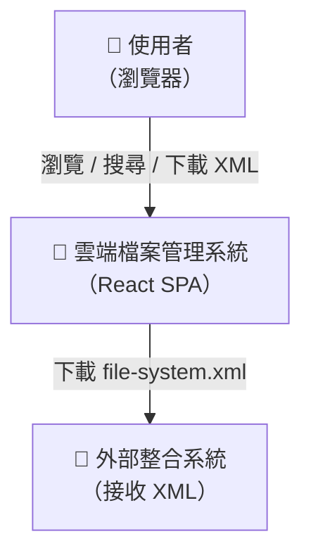
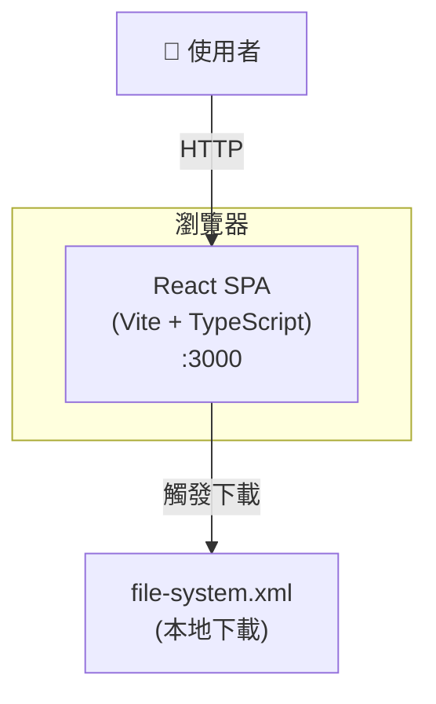
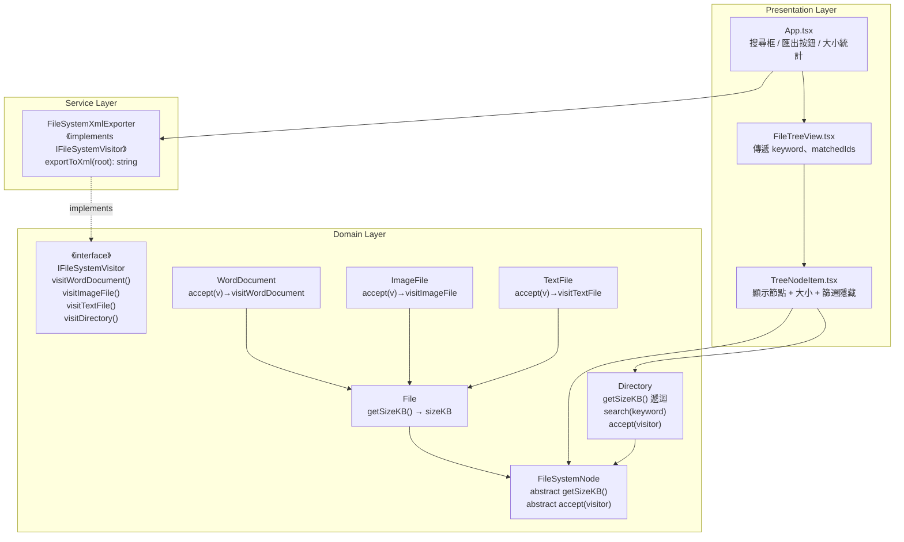
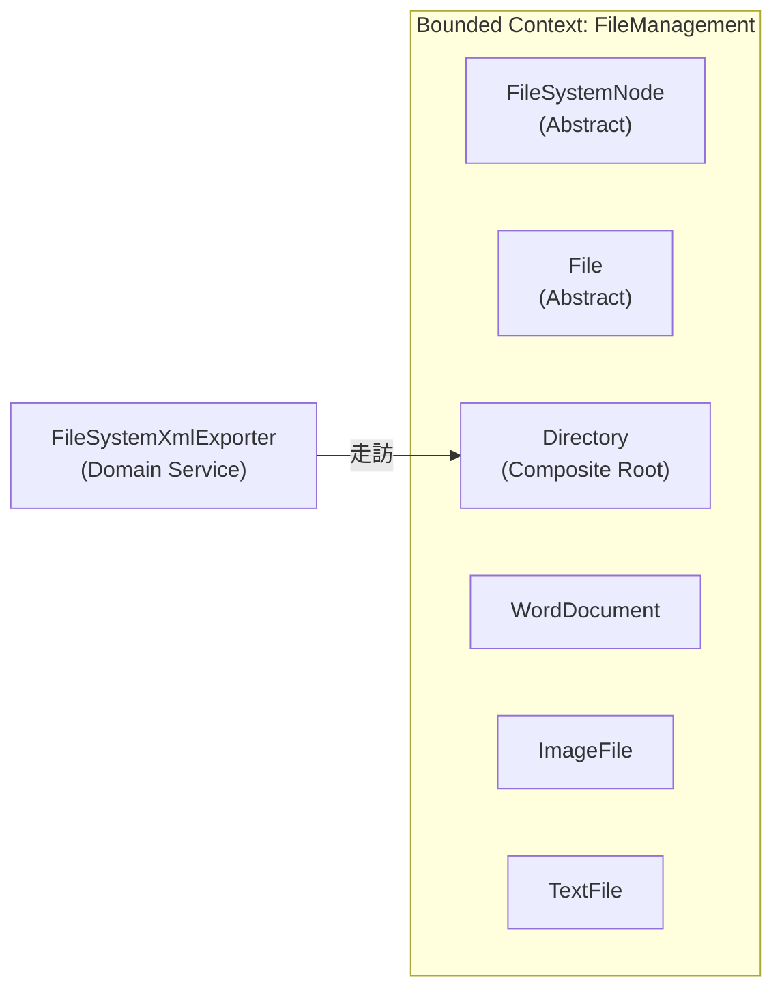
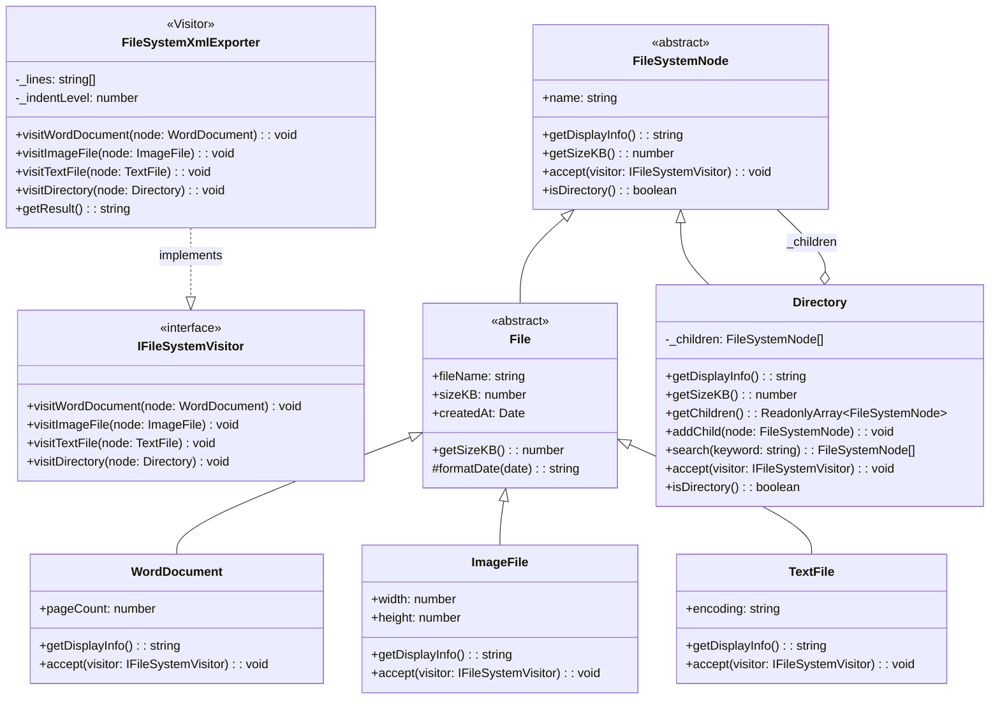

# 功能需求設計文件（FRD）

---

## 0. 規範基線（Phase 0 載入結果）

| 類別     | 規範文件                              | 本專案關鍵約束                                                                                                                                                                                       |
| -------- | ------------------------------------- | ---------------------------------------------------------------------------------------------------------------------------------------------------------------------------------------------------- |
| 架構     | `standards/clean-architecture.md`     | Domain 層不可引用 UI 框架；依賴方向由外向內；業務邏輯不出現在 Presentation 層                                                                                                                        |
| 設計原則 | `standards/solid-principles.md`       | SRP：每個類別單一職責；OCP：新增型別不修改既有類別；DIP：UI 層依賴抽象（方法），非具體實作                                                                                                           |
| 設計模式 | `standards/design-patterns.md`        | Composite Pattern（已使用）：`getSizeKB()` 遞迴加總；**Visitor Pattern（本版新增）**：`FileSystemXmlExporter` 實作 `IFileSystemVisitor`，透過 `accept(visitor)` 多型分派，不以 `instanceof` 判斷型別 |
| 技術棧   | React 18 + TypeScript + Vite + Vitest | 無 Angular WEC 約束；無 Python wecpy 約束；純前端 in-memory 版本                                                                                                                                     |

---

## 1. 文件資訊

| 欄位     | 內容                                           |
| -------- | ---------------------------------------------- |
| 文件名稱 | FRD — 雲端檔案管理系統進階功能 v1.1            |
| 版本     | v1.1.0                                         |
| 對應需求 | [spec.md](./spec.md)                           |
| 建立日期 | 2026-03-27                                     |
| 審核狀態 | [ ] 待審核 &ensp; [ ] 已通過 &ensp; [ ] 需修改 |

---

## 2. 架構概述

本版在既有 Composite Pattern 樹狀架構上擴充三項能力：

1. **計算能力（getSizeKB）**：在 Domain Layer 自上而下遞迴加總，UI 層僅讀取
2. **搜尋能力（search）**：在 Domain Layer 遞迴走訪，UI 層控制顯示邏輯
3. **匯出能力（exportToXml）**：獨立 Service 層，不汙染 Domain

### 分層職責

```
┌─────────────────────────────────────────────┐
│         Presentation Layer（React UI）       │
│  App.tsx：搜尋框 + 大小顯示 + 匯出按鈕       │
│  FileTreeView.tsx：接收關鍵字，傳遞篩選狀態  │
│  TreeNodeItem.tsx：節點顯示 + 大小標注        │
├─────────────────────────────────────────────┤
│         Service Layer（純函式）              │
│  FileSystemXmlExporter.ts：exportToXml()    │
├─────────────────────────────────────────────┤
│  Domain Layer（TypeScript Class）                    │
│  IFileSystemVisitor：Visitor 介面（visitXxx 方法群） │
│  FileSystemNode：abstract getSizeKB(), accept()     │
│  File：getSizeKB() → this.sizeKB                    │
│  Directory：getSizeKB() 遞迴加總、accept()          │
│             search(keyword) 遞迴走訪                 │
└──────────────────────────────────────────────────────┘
```

**依賴方向**：Presentation → Service → Domain（Domain 不依賴任何外層）

---

## 3. C4 架構圖

### 3.1 Context Diagram



### 3.2 Container Diagram



### 3.3 Component Diagram（Clean Architecture 分層）



---

## 4. DDD 領域建模

### 4.1 Bounded Context

本系統為單一 Bounded Context：**FileManagement**（檔案管理）



### 4.2 Domain Model（Class Diagram）



**設計模式標注：**

- `FileSystemNode / Directory` — **Composite Pattern**（Leaf = File 子類別、Composite = Directory）
- `getSizeKB()` — Composite 的遞迴操作標準應用
- `FileSystemXmlExporter` — **Visitor Pattern**：實作 `IFileSystemVisitor` 介面，各具體型別透過 `accept(visitor)` 回呼對應的 `visitXxx()` 方法；新增匯出格式（JSON/CSV）只需新增 Visitor 類別，Domain 節點零修改（符合 OCP）

### 4.3 不變條件（Domain Invariants）

| 元件                 | 不變條件                                 |
| -------------------- | ---------------------------------------- |
| `File`               | `sizeKB ≥ 0`；`fileName` 不為空字串      |
| `Directory`          | `_children` 內不允許 null 元素           |
| `Directory.search()` | 關鍵字為空字串時回傳空陣列（不執行走訪） |

---

## 5. 功能設計詳述

### 5.1 F-101：getSizeKB — 遞迴大小計算

**設計決策（ADR-101）**

| 欄位     | 內容                                                                                                    |
| -------- | ------------------------------------------------------------------------------------------------------- |
| 問題     | 如何計算目錄的大小加總？                                                                                |
| 決策     | 在 `FileSystemNode` 新增 `abstract getSizeKB(): number`                                                 |
| 理由     | 符合 Composite Pattern：Leaf 回傳自身大小，Composite 遞迴加總子節點                                     |
| 依據規範 | `standards/clean-architecture.md` §2.1（Domain 封裝核心規則）；`standards/design-patterns.md` Composite |
| 替代方案 | 在 UI 層計算（違反 SRP，業務邏輯滲入 Presentation）— 已否決                                             |

**實作規格**

```typescript
// FileSystemNode（Abstract）
abstract getSizeKB(): number;

// File（Abstract）— Leaf
getSizeKB(): number {
  return this.sizeKB;
}

// Directory — Composite
getSizeKB(): number {
  return this._children.reduce((sum, child) => sum + child.getSizeKB(), 0);
}
```

**UI 顯示規格**（TreeNodeItem.tsx）

| 大小範圍  | 顯示格式              | 範例                  |
| --------- | --------------------- | --------------------- |
| < 1024 KB | `{name}（{n} KB）`    | `設定檔（7 KB）`      |
| ≥ 1024 KB | `{name}（{n.nn} MB）` | `專案文件（1.60 MB）` |

---

### 5.2 F-102：search — 關鍵字篩選（保留樹狀結構）

**設計決策（ADR-102）**

| 欄位     | 內容                                                                                                |
| -------- | --------------------------------------------------------------------------------------------------- |
| 問題     | 搜尋後需保留樹狀結構，如何決定哪些節點顯示？                                                        |
| 決策     | Domain 的 `search()` 回傳**匹配節點集合（Set）**；UI 層遞迴判斷「祖先節點是否有子孫匹配」來決定顯示 |
| 理由     | Domain 只管「找到什麼」，UI 管「怎麼顯示」— 符合 SRP                                                |
| 依據規範 | `standards/solid-principles.md` §1 SRP；`standards/clean-architecture.md` §1.3 依賴規則             |

**Directory.search() 實作規格**

```typescript
// 遞迴走訪，回傳名稱包含 keyword 的所有節點（不分大小寫）
search(keyword: string): FileSystemNode[] {
  const lower = keyword.toLowerCase();
  const results: FileSystemNode[] = [];
  for (const child of this._children) {
    if (child.name.toLowerCase().includes(lower)) {
      results.push(child);
    }
    if (child.isDirectory()) {
      results.push(...(child as Directory).search(keyword));
    }
  }
  return results;
}
```

**UI 篩選邏輯**（TreeNodeItem.tsx）

```
props: matchedIds: Set<string>（由 App 層 useMemo 計算後傳遞）

節點顯示規則：
  - 葉節點：name in matchedIds → 顯示；否則隱藏
  - 目錄節點：自身或任一子孫在 matchedIds → 顯示；全無 → 隱藏

App.tsx 邏輯：
  1. Enter 觸發 handleSearch()
  2. root.search(keyword) 取得匹配集合
  3. 從匹配節點往上補全祖先 ID（需遍歷確認）
  4. Set 傳給 FileTreeView → TreeNodeItem
```

> **注意**：因 v1 架構以 name 為 key，搜尋 ID 比對以 `name + path` 組合字串為識別鍵（避免同名節點衝突）。

---

### 5.3 F-103：FileSystemXmlExporter — XML 匯出

**設計決策（ADR-103）**

| 欄位     | 內容                                                                                                                                                                   |
| -------- | ---------------------------------------------------------------------------------------------------------------------------------------------------------------------- |
| 問題     | XML 序列化邏輯應如何設計，才能根據節點型別輸出不同屬性，且未來可擴充其他格式？                                                                                         |
| 決策     | 採用正統 **Visitor Pattern**：在 Domain 新增 `IFileSystemVisitor` 介面，各節點實作 `accept(visitor)`；`FileSystemXmlExporter` 作為 Concrete Visitor，獨立於 Service 層 |
| 理由     | 1. 消除 `instanceof` 分派，改用多型（編譯期型別安全）；2. 新增 JSON/CSV 匯出只需新增 Visitor，Domain 零修改（OCP）；3. 序列化關切與 Domain 行為分離（SRP）             |
| 依據規範 | `standards/solid-principles.md` §1 SRP、§2 OCP；`standards/design-patterns.md` Visitor Pattern；`standards/clean-architecture.md` §2 Service 層                        |
| 安全需求 | XML Injection 防護：所有字串值須通過 `escapeXml()` 跳脫（`& < > " '`）                                                                                                 |

**XML Schema v1 設計**

```xml
<?xml version="1.0" encoding="UTF-8"?>
<Directory name="根目錄">
  <Directory name="專案文件">
    <File type="WordDocument" name="需求規格.docx"
          sizeKB="245" createdAt="2026-03-20" pageCount="12" />
    <Directory name="設計圖">
      <File type="ImageFile" name="架構圖.png"
            sizeKB="1024" createdAt="2026-03-21" width="1920" height="1080" />
    </Directory>
  </Directory>
  <File type="TextFile" name="config.txt"
        sizeKB="2" createdAt="2026-03-15" encoding="UTF-8" />
</Directory>
```

**型別屬性對照表**

| 型別           | 必要 attributes                                     |
| -------------- | --------------------------------------------------- |
| `Directory`    | `name`                                              |
| `WordDocument` | `type` `name` `sizeKB` `createdAt` `pageCount`      |
| `ImageFile`    | `type` `name` `sizeKB` `createdAt` `width` `height` |
| `TextFile`     | `type` `name` `sizeKB` `createdAt` `encoding`       |

**安全性設計**

```typescript
// escapeXml：處理 5 個 XML 特殊字元，防止 XML Injection
function escapeXml(value: string): string {
  return value
    .replace(/&/g, "&amp;") // 必須最先處理
    .replace(/</g, "&lt;")
    .replace(/>/g, "&gt;")
    .replace(/"/g, "&quot;")
    .replace(/'/g, "&apos;");
}
```

---

## 6. UI 版面配置

### 6.1 整體版型（A 型：標準工具列 + 主內容）

```
┌─────────────────────────────────────────────────────┐
│ 📂 雲端檔案管理系統                                  │
│ 系統總檔案大小：2.11 MB  [← 全域統計]               │
├─────────────────────────────────────────────────────┤
│ [搜尋框：輸入關鍵字…] [清除] │ [匯出 XML] [按鈕]   │
├─────────────────────────────────────────────────────┤
│                                                     │
│  ▼ 📁 根目錄（2.11 MB）                            │
│    ▼ 📁 專案文件（1.83 MB）                        │
│        📄 需求規格.docx [Word] 245KB, 12頁, ...    │
│        📄 會議紀錄.docx [Word] 89KB, 3頁, ...      │
│      ▶ 📁 設計圖（1.5 MB）                         │
│    ▼ 📁 設定檔（7 KB）                             │
│        📝 config.txt [文字] 2KB, UTF-8, ...        │
│        📝 readme.txt [文字] 5KB, UTF-8, ...        │
│    📄 專案計畫.docx [Word] 320KB, 25頁, ...        │
│                                                     │
└─────────────────────────────────────────────────────┘
```

### 6.2 搜尋結果狀態

```
搜尋「規格」後：

  ▼ 📁 根目錄          ← 祖先節點保留（灰色或正常顯示）
    ▼ 📁 專案文件        ← 祖先節點保留
        📄 需求規格.docx  ← 匹配，醒目顯示（可選）
              ← 隱藏：會議紀錄.docx、設計圖目錄
              ← 隱藏：設定檔目錄（無任何子節點匹配）

找不到時顯示：「找不到包含「xxxxx」的檔案」
```

---

## 7. 架構決策記錄（ADR 摘要）

| ADR 編號 | 決策                                                                    | 依據規範                                    |
| -------- | ----------------------------------------------------------------------- | ------------------------------------------- |
| ADR-101  | `getSizeKB()` 以 Composite Pattern 在 Domain 層實作，**不使用 Visitor** | Clean Arch §2.1、Design Patterns Composite  |
| ADR-102  | `search()` 以 Domain Method 實作，**不使用 Visitor**                    | SOLID SRP §1、Clean Arch §1.3               |
| ADR-103  | Visitor Pattern 實作 XML 匯出（`IFileSystemVisitor` + `accept()`）      | SOLID SRP+OCP §1§2、Design Patterns Visitor |
| ADR-104  | 節點識別使用 `name+path` 組合                                           | 避免同名節點集合比對衝突（現有架構無 UUID） |
| ADR-105  | `escapeXml()` 統一在 Service 層處理                                     | OWASP XML Injection 防護                    |

### ADR-106：三項操作使用不同模式的設計理由

本版刻意採用「混合模式」，每種模式依其適用場景各司其職：

| 操作            | 使用模式                             | 理由                                                                                                                                                               |
| --------------- | ------------------------------------ | ------------------------------------------------------------------------------------------------------------------------------------------------------------------ |
| `getSizeKB()`   | **Composite Pattern**（Domain 方法） | 「目錄知道自己有多大」是 Domain 的固有知識。Composite 遞迴計算（Leaf 回傳 sizeKB，Composite 加總）是此模式的標準應用，未來不存在「需要切換不同計算方式」的擴充需求 |
| `search()`      | **Domain Method**（Directory 方法）  | 「在自身結構內依名稱尋找節點」是目錄的自我行為，結果（節點集合）仍是 Domain 物件；改為 Visitor 需在 `visitDirectory` 內重複相同的遞迴迴圈，無任何收益              |
| `exportToXml()` | **Visitor Pattern**（Service 層）    | XML 格式是**外部整合的關切點**，不屬於 Domain 自身知識；未來可能新增 `exportToJson`、`exportToCsv`，只需新增 Visitor 類別，Domain 節點零修改（符合 OCP）           |

**反面考量（為何不把三個全改成 Visitor）**：若強制統一為 Visitor，`getSizeKB` 的 `visitXxx` 方法群只是複製 Composite 遞迴邏輯，`search` 的 Visitor 實作也需重複相同走訪邏輯，造成 Pattern Overuse（過度套用模式），違反 KISS 原則。
