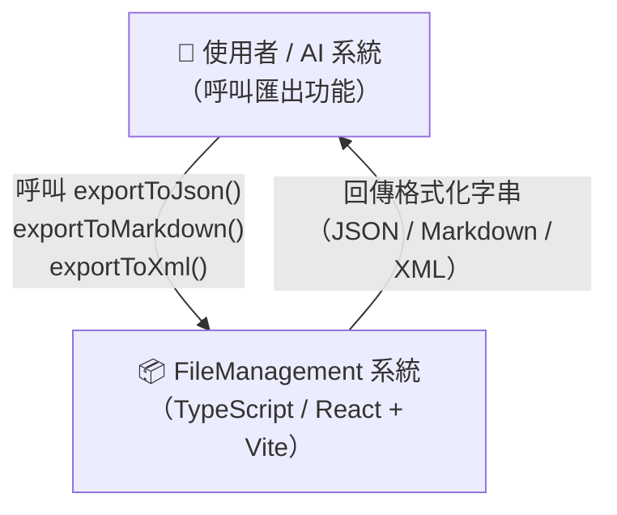
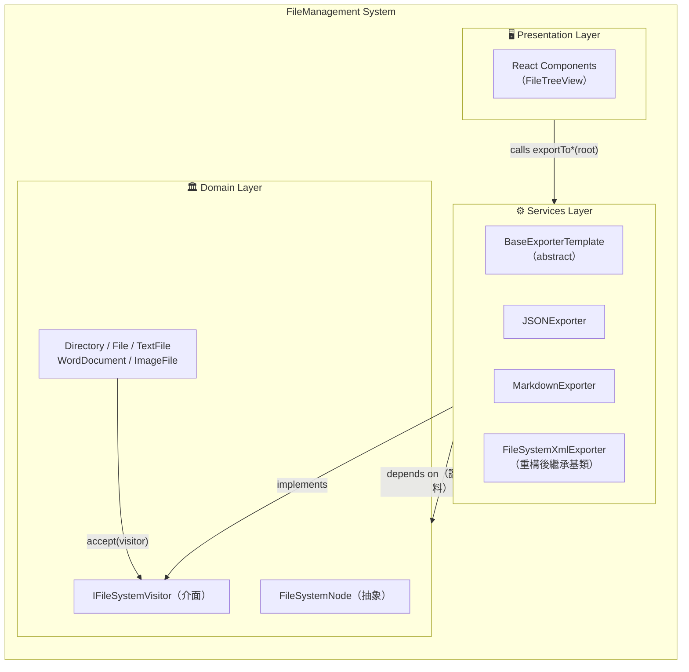
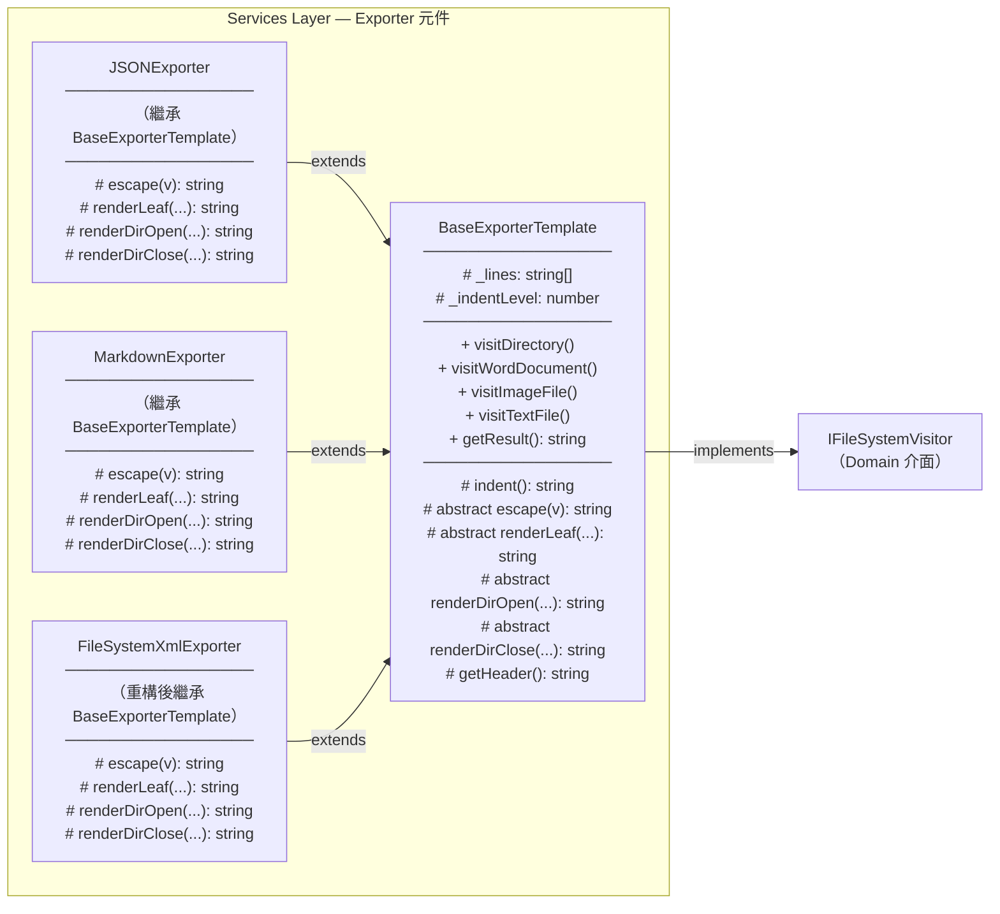
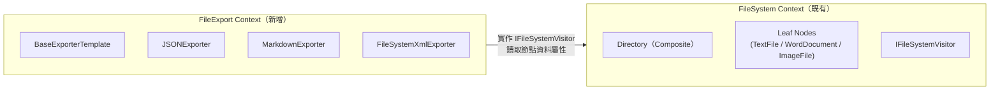
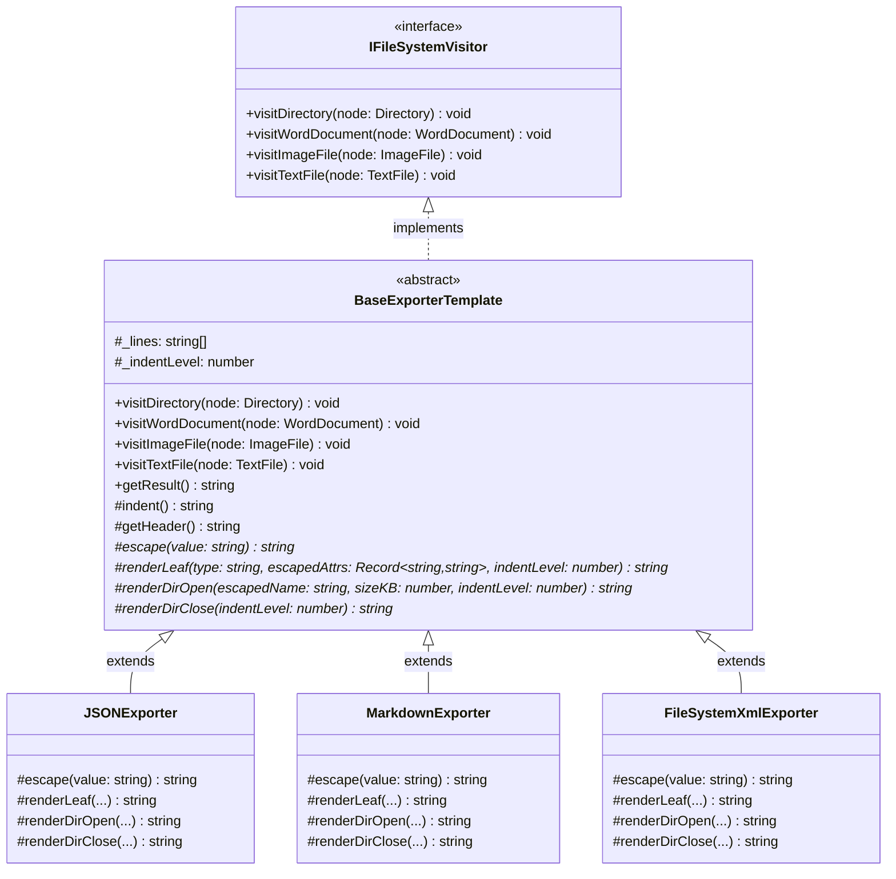
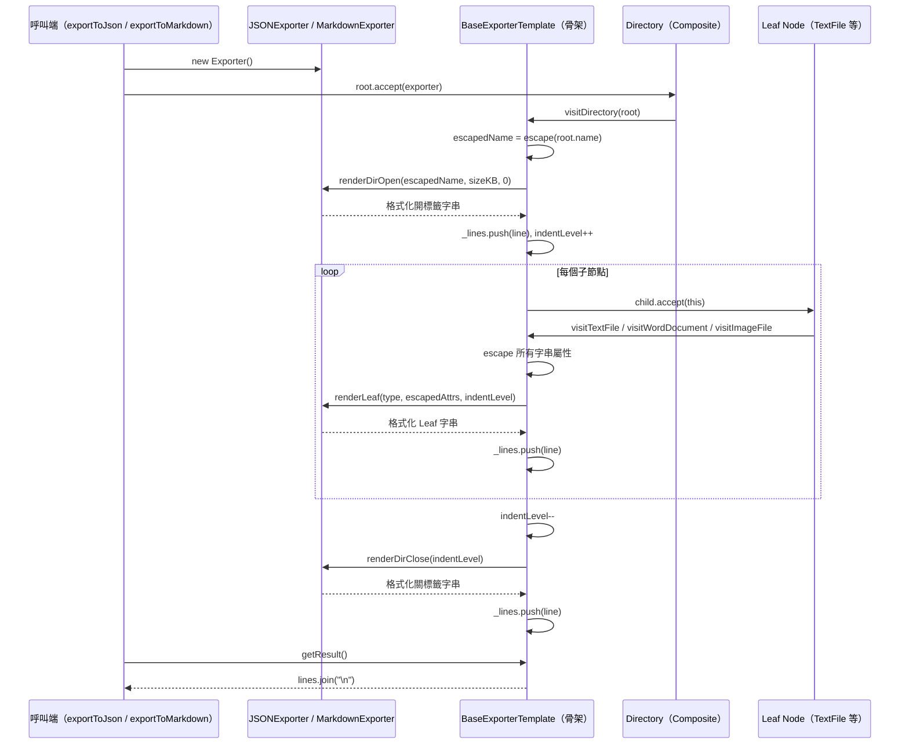

# 功能需求設計書（FRD）

---

## 1. 文件資訊

| 欄位           | 內容                             |
| -------------- | -------------------------------- |
| 對應需求規格書 | [spec.md](./spec.md)             |
| 對應執行計畫   | [plan.md](./plan.md)             |
| 架構師         | Architect Skill（AI）            |
| 建立日期       | 2026-03-27                       |
| 最後更新       | 2026-03-27                       |
| 審核狀態       | [x] 待審核 [ ] 已通過 [ ] 需修改 |

---

## 1.5 規範基線（Standards Baseline）

| 類別     | 規範文件                                | 關鍵約束摘要                                                                                     |
| -------- | --------------------------------------- | ------------------------------------------------------------------------------------------------ |
| 架構原則 | `standards/clean-architecture.md`       | Services 層可依賴 Domain 介面，Domain 層不可依賴 Services；依賴方向由外向內                      |
| 設計模式 | `standards/design-patterns.md`          | Template Method：多步驟固定流程 + 可替換步驟；Visitor：已在 Domain 實作，`accept()` 機制保持不變 |
| SOLID    | `standards/solid-principles.md`         | OCP：新增第 4 種 Exporter 只需新增一個檔案；ISP：抽象 Hook 介面保持粒度適中（< 7 個方法）        |
| 語言規範 | `standards/coding-standard-frontend.md` | TypeScript 5.x；禁止使用 `any`；使用 `abstract class`；模組化 export；readonly 保護私有狀態      |

---

## 2. 架構概述

### 2.1 系統概述

本系統現有以 **Visitor Pattern** 實作的 XML 匯出功能（`FileSystemXmlExporter`），每個 `FileSystemNode` 透過 `accept(visitor)` 進行雙重分派，Visitor 走訪整棵樹。

新的設計目標是在 Visitor 之上疊加 **Template Method Pattern**：

- **「怎麼走（遞迴走訪、縮排管理）」** 與 **「做什麼（格式輸出）」** 分離
- `BaseExporterTemplate` 封裝骨架演算法（字元脫逸、縮排、遞迴觸發），對外暴露抽象 Hook 方法
- `JSONExporter`、`MarkdownExporter`（以及重構後的 `FileSystemXmlExporter`）只實作 Hook，不包含走訪或脫逸邏輯

這種**模式組合（Pattern Composition）**使系統同時受益於 Visitor Pattern 的「操作與結構分離」，以及 Template Method 的「演算法骨架重用」。

### 2.2 技術棧選擇

| 層級         | 技術選型                  | 版本 | 選用理由                                   |
| ------------ | ------------------------- | ---- | ------------------------------------------ |
| 語言         | TypeScript                | 5.x  | 現有專案語言；`abstract class` 支援完整    |
| 前端框架     | React + Vite              | —    | 現有專案框架（本次不涉及 UI 變更）         |
| 測試         | Vitest                    | —    | 現有測試框架                               |
| 設計模式組合 | Template Method + Visitor | —    | Template Method 封裝骨架；Visitor 走訪節點 |

---

## 3. C4 架構圖

### 3.1 C4 Context Diagram



### 3.2 C4 Container Diagram



### 3.3 C4 Component Diagram（Services 層）



---

## 4. 領域建模（DDD）

### 4.1 Bounded Context

本次變更屬於單一 Bounded Context：**FileExport Context**。



### 4.2 領域模型類別圖



### 4.3 骨架演算法設計（Template Method 核心）

`BaseExporterTemplate.visitDirectory()` 是骨架方法，固定演算法步驟：

```
visitDirectory(node: Directory):
  1. 取得 sizeKB（由 Composite 計算）
  2. escapedName = this.escape(node.name)           ← 字元脫逸（基類控制）
  3. line = renderDirOpen(escapedName, sizeKB, _indentLevel)  ← Hook（子類實作）
  4. _lines.push(line)
  5. _indentLevel++                                  ← 縮排管理（基類控制）
  6. for child of node.getChildren(): child.accept(this)  ← 遞迴走訪
  7. _indentLevel--
  8. _lines.push(renderDirClose(_indentLevel))       ← Hook（子類實作）
```

各 Leaf 節點的 `visit*()` 骨架類似：escape 屬性 → 組裝 attrs map → 呼叫 `renderLeaf()` Hook。

---

## 5. API 設計（Public Functions）

本次不新增 HTTP API，只新增 TypeScript 公開函式：

| 函式簽名                                    | 說明                                   |
| ------------------------------------------- | -------------------------------------- |
| `exportToJson(root: Directory): string`     | 回傳 pretty-print JSON 字串            |
| `exportToMarkdown(root: Directory): string` | 回傳 Markdown 縮排列表字串             |
| `exportToXml(root: Directory): string`      | 現有，行為不變；重構後同樣從此函式呼叫 |

---

## 6. 目錄結構設計

### 新增與修改的檔案

```
file-management-system/
└── src/
    └── services/
        ├── exporters/                          ← 新建目錄
        │   ├── BaseExporterTemplate.ts         ← T-01（新增，抽象基類）
        │   ├── JSONExporter.ts                 ← T-02（新增）
        │   └── MarkdownExporter.ts             ← T-03（新增）
        └── FileSystemXmlExporter.ts            ← T-04（修改，繼承基類）P1

tests/
└── services/
    └── exporters/                              ← 新建目錄
        ├── BaseExporterTemplate.test.ts        ← T-05（Stub 子類測試基類行為）
        ├── JSONExporter.test.ts                ← T-05（新增）
        └── MarkdownExporter.test.ts            ← T-05（新增）
```

---

## 7. 架構決策記錄（ADR）

### ADR-001：BaseExporterTemplate 同時實作 IFileSystemVisitor

| 欄位     | 內容                                                                                         |
| -------- | -------------------------------------------------------------------------------------------- |
| 決策     | `BaseExporterTemplate` 直接實作 `IFileSystemVisitor`，子類別繼承時自動具備所有 `visit*` 方法 |
| 理由     | 保持與現有 `accept()` 雙重分派機制的相容性；呼叫端無需知道具體 Exporter 型別                 |
| 替代方案 | 另設獨立走訪機制（放棄 Visitor）；但會破壞既有 Domain API，違反 OCP                          |
| 依據規範 | `solid-principles.md` OCP 原則：不修改既有 Domain 節點的 `accept()` 介面                     |

### ADR-002：Hook 方法設計為 4 個抽象方法

| 欄位     | 內容                                                                                                             |
| -------- | ---------------------------------------------------------------------------------------------------------------- |
| 決策     | 定義 `escape()`, `renderLeaf()`, `renderDirOpen()`, `renderDirClose()` 四個 protected abstract 方法作為開放 Hook |
| 理由     | 粒度足夠細以覆蓋各格式差異，又不超過 ISP 建議的 7 個方法上限；`getHeader()` 為非必要 Hook（有預設實作）          |
| 替代方案 | 將所有格式邏輯合併為單一 `formatNode()` Hook；過度簡化，無法分別控制目錄的開/關標籤                              |
| 依據規範 | `solid-principles.md` ISP 原則：介面方法數量控制；`design-patterns.md` Template Method 適用場景                  |

### ADR-003：JSON pretty-print 的縮排策略

| 欄位     | 內容                                                                                                                     |
| -------- | ------------------------------------------------------------------------------------------------------------------------ |
| 決策     | `JSONExporter` 使用基類的 `_indentLevel` 同步追蹤縮排層級，但輸出的 JSON 結構以手動字串拼接產生（不用 `JSON.stringify`） |
| 理由     | `JSON.stringify` 無法支援邊走訪邊輸出的串流方式；手動拼接可直接利用基類的 `indent()` 工具方法                            |
| 替代方案 | 先走訪建立巢狀物件樹，最後一次性 `JSON.stringify(obj, null, 2)`；簡單但需要額外的物件建構，且無法使用基類骨架            |
| 依據規範 | 本 ADR 為實作細節決策；不違反任何規範約束                                                                                |

### ADR-004：FileSystemXmlExporter 重構列為 P1

| 欄位     | 內容                                                                                        |
| -------- | ------------------------------------------------------------------------------------------- |
| 決策     | XML Exporter 重構為繼承基類列為優先級 P1，核心任務為 P0 的基類 + JSON + Markdown            |
| 理由     | 現有 XML Exporter 有完整測試覆蓋；重構後行為不應改變，但修改既有測試較少風險且可分離 PR     |
| 替代方案 | 同步重構 XML（P0）；增加交付風險                                                            |
| 依據規範 | `solid-principles.md` OCP：現有程式碼如果工作正常，不強制重構；分離 PR 降低既有功能退化風險 |

---

## 8. Sequence Diagram（核心匯出流程）



---

## 9. 字元脫逸規格

各格式的 `escape()` 方法需處理的保留字元：

| 格式     | 需脫逸的字元                              | 脫逸方式                                    |
| -------- | ----------------------------------------- | ------------------------------------------- | ----------- |
| XML      | `&`, `<`, `>`, `"`, `'`                   | `&amp;`, `&lt;`, `&gt;`, `&quot;`, `&apos;` |
| JSON     | `"`, `\`, 控制字元（`\n`, `\r`, `\t` 等） | `\"`, `\\`, `\n`, `\r`, `\t`                |
| Markdown | `` ` ``, `*`, `_`, `[`, `]`, `\`, `#`, `  | `                                           | 加 `\` 前綴 |

---

## 10. Markdown 輸出格式規格

```
- 📁 MyDocuments (120 KB)
  - 📄 report.docx (45 KB, 10 pages)
  - 🖼️ photo.png (60 KB, 1920×1080)
  - 📁 SubFolder (15 KB)
    - 📝 notes.txt (15 KB, UTF-8)
```

- 每層縮排 2 個空格（由基類 `indent()` 提供）
- Emoji 前綴：`📁` Directory、`📄` WordDocument、`🖼️` ImageFile、`📝` TextFile
- 括號內顯示主要屬性（sizeKB + 節點特有屬性）
