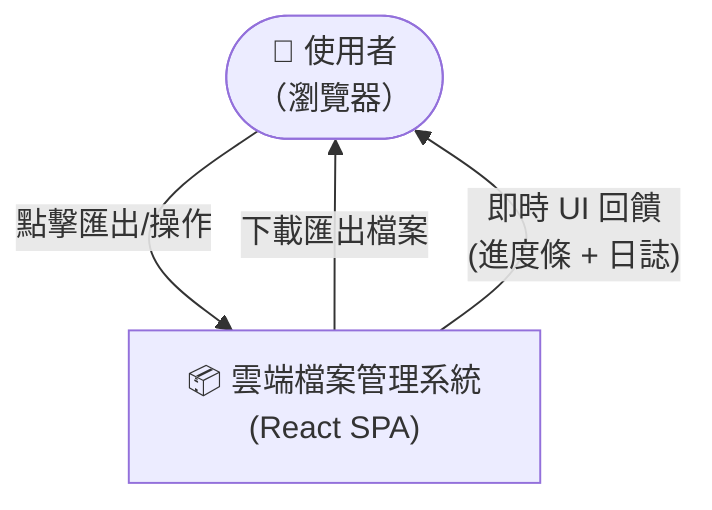
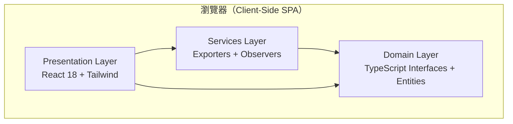
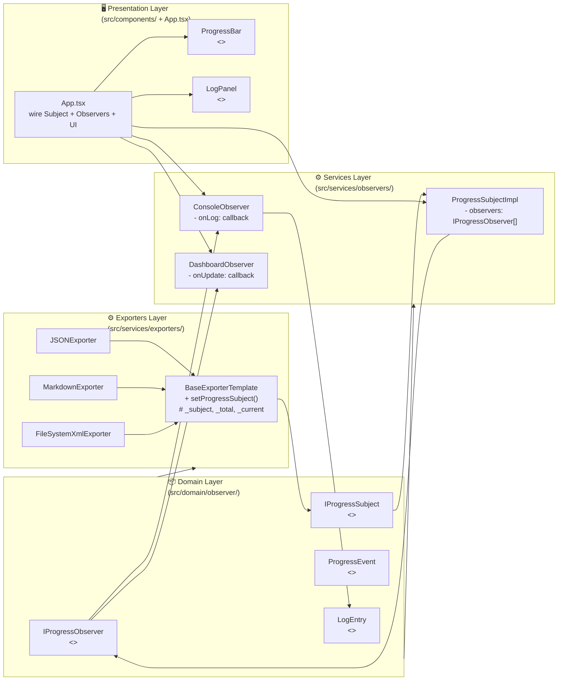
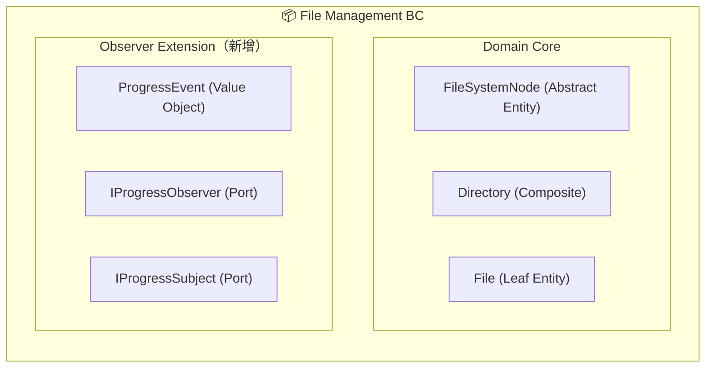
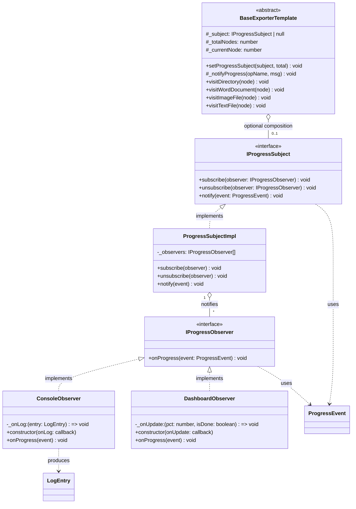
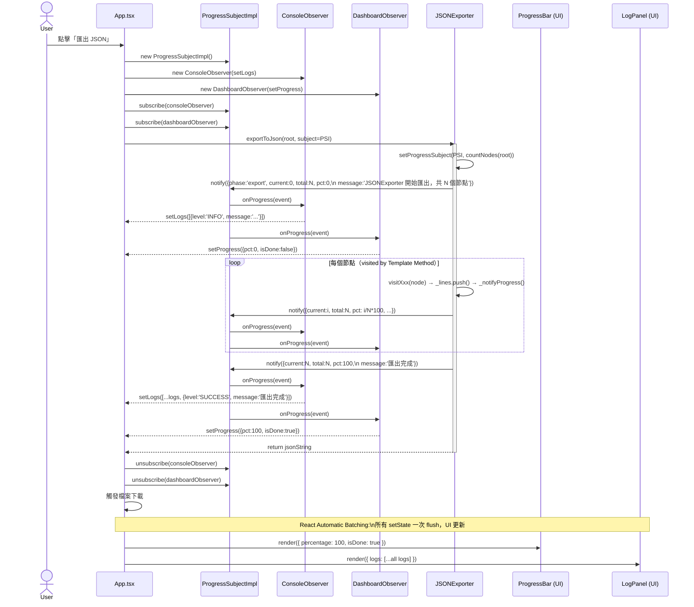
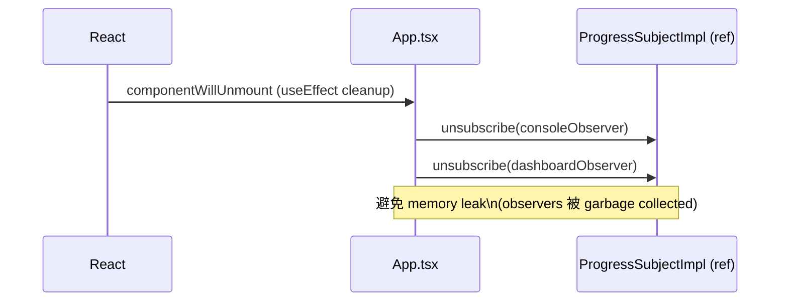

# 功能需求設計文件（FRD）

> **對應需求**：`docs/004-observer-progress/spec.md`
> **版本**：v1.0.0 | **建立日期**：2026-03-30

---

## 1. 規範基線

| 類別     | 規範文件                          | 本次設計適用約束                                                                                           |
| -------- | --------------------------------- | ---------------------------------------------------------------------------------------------------------- |
| 架構     | `standards/clean-architecture.md` | Domain Layer 不可引用 React API；依賴方向由外向內                                                          |
| SOLID    | `standards/solid-principles.md`   | Subject/Observer 僅透過介面互動（DIP）；每個 Observer 單一職責（SRP）；新增 Observer 不修改 Subject（OCP） |
| 設計模式 | `standards/design-patterns.md`    | Observer Pattern：「需要跨層通知事件」— 完全符合適用場景                                                   |
| 語言     | TypeScript / React 18（現有）     | 純 TypeScript 介面放 Domain 層；React `useState` 只在 Presentation 層                                      |

---

## 2. 架構概述

### 2.1 整體設計方針

本次引入 **Observer Pattern** 讓「進度發佈端（Subject）」與「接收端（Observer）」完全解耦。
架構遵循 **Clean Architecture** 分層：

| 層級                     | 職責                             | 本次新增/修改                                                        |
| ------------------------ | -------------------------------- | -------------------------------------------------------------------- |
| **Domain**               | 純 TypeScript 介面與值物件       | `IProgressObserver`, `IProgressSubject`, `ProgressEvent`, `LogEntry` |
| **Application/Services** | 具體 Observer 實作、Subject 實作 | `ProgressSubjectImpl`, `ConsoleObserver`, `DashboardObserver`        |
| **Services/Exporters**   | Template Method 匯出骨架         | `BaseExporterTemplate`（整合 Subject，向後相容）                     |
| **Presentation**         | React 元件、App 整合             | `<ProgressBar />`, `<LogPanel />`, `App.tsx` 修改                    |

### 2.2 設計決策重點

- **Observer 不持有 React state**：所有 Observer 透過 constructor 注入的 callback 與 React 互動（DIP）
- **向後相容**：既有 `exportToJson(root)`、`exportToMarkdown(root)`、`exportToXml(root)` 函式簽章保持不變；subject 為第二個**可選參數**新增
- **P0 同步執行**：匯出操作維持同步，React 因 automatic batching 在操作完成後批次渲染（顯示開始/結束狀態）。每個節點的 `onProgress()` 均被呼叫（可用測試驗證），但 UI 動畫為批次更新
- **節點計數前置**：匯出開始前先以 `countNodes()` 工具函式掃描樹狀結構取得總數，確保 `percentage` 準確

---

## 3. C4 圖表

### 3.1 System Context Diagram



### 3.2 Container Diagram



### 3.3 Component Diagram（Observer 核心）



---

## 4. DDD 領域建模

### 4.1 Bounded Context

本專案屬於單一 Bounded Context：**檔案管理系統（File Management）**。
Observer Pattern 的引入屬於 **Application 層的橫切關注點（cross-cutting concern）**，不改變 Domain 模型的核心邊界。



### 4.2 Value Object：ProgressEvent

`ProgressEvent` 為不可變的值物件，僅描述「某一時刻的進度快照」，不具身份識別（無 ID）：

```typescript
// src/domain/observer/ProgressEvent.ts
interface ProgressEvent {
  readonly phase: "export" | "scan";
  readonly operationName: string; // e.g. "JSONExporter"
  readonly current: number; // 已完成節點數（1-based）
  readonly total: number; // 總節點數
  readonly percentage: number; // 0–100，已四捨五入
  readonly message: string; // 人類可讀，供 Log Panel 顯示
  readonly timestamp: Date;
}
```

### 4.3 Value Object：LogEntry

`LogEntry` 為 ConsoleObserver 轉換後推送給 UI 的顯示物件：

```typescript
// src/domain/observer/LogEntry.ts（含於 index.ts）
interface LogEntry {
  readonly level: "INFO" | "SUCCESS" | "WARNING";
  readonly message: string;
  readonly timestamp: Date;
}
```

---

## 5. 物件關係圖（Observer Pattern Class Diagram）



---

## 6. 序列圖（核心業務流程）

### 6.1 匯出觸發進度流程（P0 同步執行）



### 6.2 元件卸載時的記憶體管理



---

## 7. TypeScript 介面設計（API Contract）

### 7.1 Domain 介面（`src/domain/observer/`）

```typescript
// IProgressObserver.ts
export interface IProgressObserver {
  onProgress(event: ProgressEvent): void;
}

// IProgressSubject.ts
export interface IProgressSubject {
  subscribe(observer: IProgressObserver): void;
  unsubscribe(observer: IProgressObserver): void;
  notify(event: ProgressEvent): void;
}

// ProgressEvent.ts（Value Object）
export interface ProgressEvent {
  readonly phase: "export" | "scan";
  readonly operationName: string;
  readonly current: number;
  readonly total: number;
  readonly percentage: number;
  readonly message: string;
  readonly timestamp: Date;
}

// LogEntry.ts（Value Object，供 ConsoleObserver 使用）
export interface LogEntry {
  readonly level: "INFO" | "SUCCESS" | "WARNING";
  readonly message: string;
  readonly timestamp: Date;
}
```

### 7.2 具體實作簽章（`src/services/observers/`）

```typescript
// ProgressSubjectImpl.ts
export class ProgressSubjectImpl implements IProgressSubject {
  private _observers: IProgressObserver[] = [];
  subscribe(observer: IProgressObserver): void;
  unsubscribe(observer: IProgressObserver): void;
  notify(event: ProgressEvent): void;
}

// ConsoleObserver.ts
export class ConsoleObserver implements IProgressObserver {
  constructor(private readonly _onLog: (entry: LogEntry) => void) {}
  onProgress(event: ProgressEvent): void;
  // 轉換規則：percentage === 100 → SUCCESS；其他 → INFO
}

// DashboardObserver.ts
export class DashboardObserver implements IProgressObserver {
  constructor(
    private readonly _onUpdate: (percentage: number, isDone: boolean) => void,
  ) {}
  onProgress(event: ProgressEvent): void;
}
```

### 7.3 修改後的便利函式（向後相容）

```typescript
// 現有函式保持不變（僅新增可選第二參數）
export function exportToJson(
  root: Directory,
  subject?: IProgressSubject, // ← 可選，不傳時行為與現有完全相同
): string;

export function exportToMarkdown(
  root: Directory,
  subject?: IProgressSubject,
): string;

export function exportToXml(
  root: Directory,
  subject?: IProgressSubject,
): string;

// 新增工具函式
export function countNodes(dir: Directory): number;
```

### 7.4 React 元件 Props

```typescript
// ProgressBar.tsx
interface ProgressBarProps {
  percentage: number; // 0–100
  isDone: boolean; // true 時顯示綠色並在 2s 後隱藏
  operationName?: string; // 顯示文字，如 "正在匯出 JSON..."
}

// LogPanel.tsx
interface LogPanelProps {
  logs: LogEntry[];
  onClear: () => void;
  maxLogs?: number; // 預設 500
}
```

---

## 8. UI 版面配置

```
┌─────────────────────────────────────────────────────┐
│  📂 雲端檔案管理系統              總大小：1.29 MB  │
├─────────────────────────────────────────────────────┤
│  [搜尋框]  [清除]  [XML] [JSON] [Markdown]          │
├─────────────────────────────────────────────────────┤
│  ┌─ ProgressBar ─────────────────────────────────┐  │  ← NEW（操作時顯示，閒置時隱藏）
│  │  正在匯出 JSON...  [████████████░░░░░░] 65%   │  │
│  └───────────────────────────────────────────────┘  │
│                                                     │
│  ┌─ FileTreeView ────────────────────────────────┐  │
│  │  📁 root                                       │  │
│  │    📁 Documents                                │  │
│  │      📄 report.docx                            │  │
│  └───────────────────────────────────────────────┘  │
│                                                     │
│  ┌─ LogPanel ────────────────────────────────────┐  │  ← NEW（頁面底部，可折疊）
│  │  [清除日誌]                                    │  │
│  │  [INFO]    JSONExporter 開始匯出，共 12 個節點 │  │
│  │  [INFO]    處理中：report.docx  (8%)           │  │
│  │  ...                                           │  │
│  │  [SUCCESS] 匯出完成 ✓                          │  │
│  └───────────────────────────────────────────────┘  │
└─────────────────────────────────────────────────────┘
```

---

## 9. 架構決策記錄（ADR）

### ADR-001：Observer callback 注入 vs. 直接持有 React setState

| 欄位         | 內容                                                                                                                                         |
| ------------ | -------------------------------------------------------------------------------------------------------------------------------------------- |
| **決策**     | Observer 透過 constructor 注入 callback，不直接持有 React `setState`                                                                         |
| **原因**     | Domain/Services 層不可引用 React API（Clean Architecture 依賴規則）；callback 注入後 Observer 可在非 React 環境（如 Node.js 測試）中獨立使用 |
| **依據規範** | `standards/clean-architecture.md` §1.3 依賴規則；`standards/solid-principles.md` §5 DIP                                                      |
| **替代方案** | Observer 直接呼叫 `useState` setter — 已排除（違反 DIP，無法單獨測試）                                                                       |

### ADR-002：Subject 以 Composition 注入 BaseExporterTemplate

| 欄位         | 內容                                                                                                                 |
| ------------ | -------------------------------------------------------------------------------------------------------------------- | ------------------------------------------ |
| **決策**     | `BaseExporterTemplate` 持有可選的 `IProgressSubject                                                                  | null`欄位，透過`setProgressSubject()` 設定 |
| **原因**     | 不破壞現有 Template Method 繼承層級；Subject 為可選（不傳時行為完全不變）；符合 "favor composition over inheritance" |
| **依據規範** | `standards/solid-principles.md` §1 SRP（基類不應因 Observer 而改變理由）；OCP（不修改現有子類別）                    |
| **替代方案** | 讓 BaseExporterTemplate 繼承 ProgressSubjectImpl — 已排除（違反 SRP，混合格式化與通知職責）                          |

### ADR-003：P0 採同步執行，React Batching 合併更新

| 欄位         | 內容                                                                                                                                          |
| ------------ | --------------------------------------------------------------------------------------------------------------------------------------------- |
| **決策**     | P0 維持同步匯出；`onProgress()` 逐節點呼叫（可測試驗證），React 自動批次渲染（顯示開始/結束狀態）                                             |
| **原因**     | 同步 Visitor 模式不可在走訪中間插入 `await`；修改為 async 需重構整個遍歷骨架，超出 P0 範圍                                                    |
| **依據規範** | spec.md §5.1 效能需求：「Observer 通知延遲 < 1ms，不阻塞主執行緒」— 同步實作符合此要求                                                        |
| **後續計畫** | P1 可引入 `AsyncTreeTraversal` 工具並搭配 `await Promise.resolve()` 在每個節點後 yield 給 React。Log Panel 因為批次渲染，仍能顯示所有中間訊息 |

### ADR-004：LogPanel 最大筆數 500 + 超出時清除最舊 100 筆

| 欄位         | 內容                                                                            |
| ------------ | ------------------------------------------------------------------------------- |
| **決策**     | `maxLogs` 預設 500；超出時 `slice(-400)` 保留最新 400 筆                        |
| **原因**     | 大量日誌（如掃描數千個節點）若無上限，React state 過大會導致 re-render 效能問題 |
| **依據規範** | spec.md §5.1 非功能需求：「Log Panel 容量：最多 500 條記錄」                    |

### ADR-005：XSS 防護 — LogPanel 使用 textContent 而非 innerHTML

| 欄位         | 內容                                                                                                       |
| ------------ | ---------------------------------------------------------------------------------------------------------- |
| **決策**     | `LogPanel` 的每條日誌使用 `children` 文字節點渲染（React 預設 XSS 防護），不使用 `dangerouslySetInnerHTML` |
| **原因**     | 日誌訊息來源包含檔案名稱（外部資料），可能包含 HTML 特殊字元                                               |
| **依據規範** | spec.md §5.3 安全性需求：「Log Panel 顯示的文字必須做 HTML escape」；OWASP Top 10 A03 注入攻擊             |
