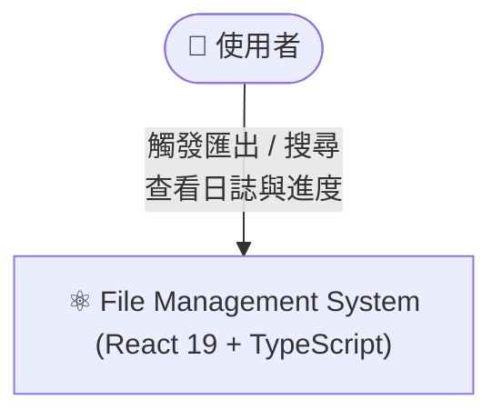
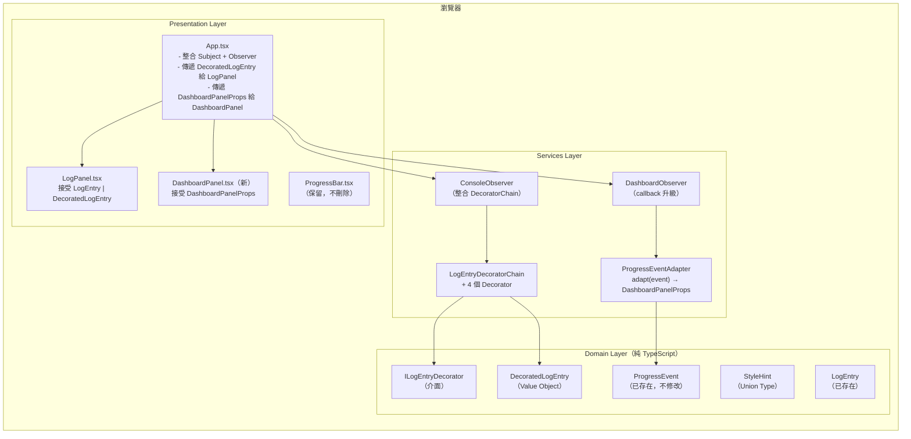
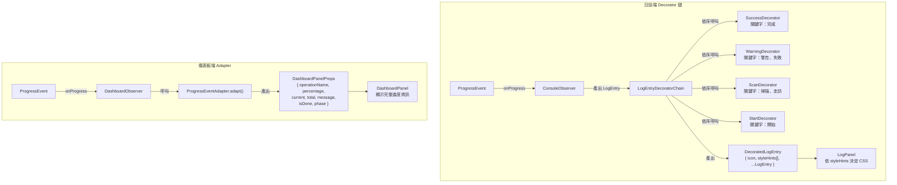
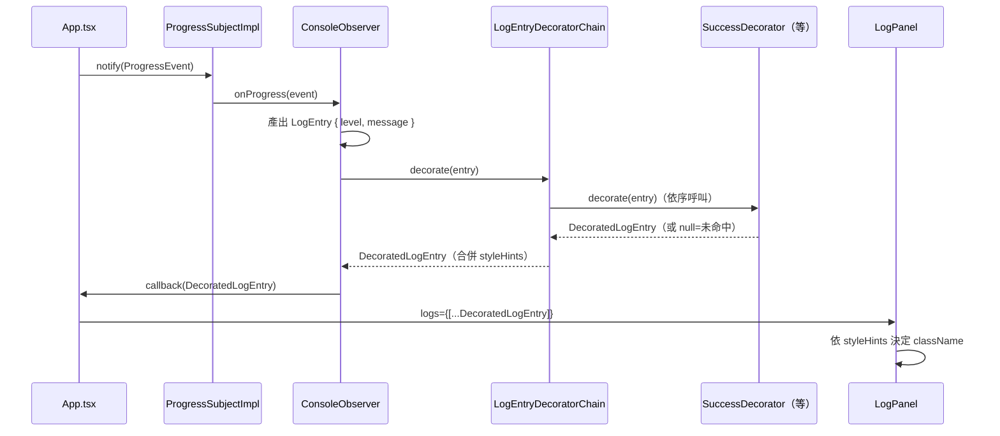
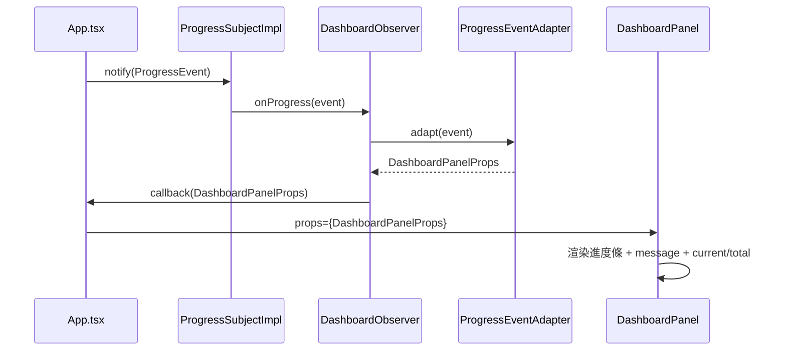

# FRD.md — 005-decorator-adapter

> **功能需求設計文件**  
> **對應 spec**: [spec.md](spec.md)  
> **建立日期**: 2026-03-30  
> **技術棧**: React 19 + TypeScript + Vite + Tailwind CSS 4 + Vitest

---

## 規範基線（Phase 0 載入清單）

| 類別 | 規範文件 | 關鍵約束 |
|------|---------|---------|
| 架構 | `standards/clean-architecture.md` | Domain 不可依賴 Application/Presentation；介面定義在 Domain/Application 層 |
| 設計原則 | `standards/solid-principles.md` | SRP：每個 Decorator 只負責一組關鍵字；OCP：新增關鍵字只需新增 Decorator 類別 |
| 設計模式 | `standards/design-patterns.md` | Decorator Pattern（結構型）：包裝物件新增行為；Adapter Pattern（結構型）：介面轉換 |
| DDD | `standards/ddd-guidelines.md` | LogEntry / DecoratedLogEntry 為 Value Object（不可變、無 ID）；ProgressEvent 為 Domain Event |
| 前端 | `standards/coding-standard-frontend.md` | 元件 Props 介面明確型別；不使用 `dangerouslySetInnerHTML`；emoji 為常數字串 |

---

## 1. 架構概述

### 1.1 整體設計思路

本需求在現有 **Observer Pattern（Subject + ConsoleObserver + DashboardObserver）** 之上，新增兩條「後處理」路徑：

- **Decorator 鏈**（日誌端）：`ConsoleObserver` 產出 `LogEntry` 之後，送入 `LogEntryDecoratorChain` 進行關鍵字比對，輸出帶有 `icon` + `styleHints` 的 `DecoratedLogEntry`，由 `LogPanel` 依據 styleHints 決定 CSS class。
- **Adapter 轉換**（儀表板端）：`DashboardObserver` 接收完整 `ProgressEvent`，透過 `ProgressEventAdapter.adapt()` 轉為 `DashboardPanelProps`，直接傳給全新 `DashboardPanel` 元件，`App.tsx` 無需手動拆解資料。

### 1.2 Clean Architecture 依賴方向

```
Presentation  →  Services  →  Domain
   LogPanel         DecoratorChain    ILogEntryDecorator
   DashboardPanel   Adapters          DecoratedLogEntry
   App.tsx          ConsoleObserver   ProgressEvent

Domain 層永遠不向外依賴 ✅
```

---

## 2. C4 Context Diagram



---

## 3. C4 Container Diagram



---

## 4. C4 Component Diagram（核心路徑）



---

## 5. 領域建模（DDD）

### 5.1 Bounded Context

本需求屬於現有 `FileSystem` Bounded Context 的 **Observer Sub-domain** 擴充，不引入新的 Context 邊界。

### 5.2 Value Objects（新增）

#### `StyleHint`（Union Type）

```typescript
export type StyleHint =
  | 'bold'
  | 'italic'
  | 'color-green'
  | 'color-yellow'
  | 'color-blue'
  | 'color-gray';
```

- **不可變**：Union Type 天然不可變
- **無 ID**：樣式提示不需唯一識別

#### `DecoratedLogEntry`（擴充自 LogEntry）

```typescript
export interface DecoratedLogEntry extends LogEntry {
  readonly icon?: string;          // Unicode emoji 常數，如 "✅"
  readonly styleHints: StyleHint[]; // 可疊加的樣式描述陣列
}
```

- **不可變**：所有欄位 `readonly`
- **不引用任何框架**：純 TypeScript，Domain 層純淨 ✅

#### `DashboardPanelProps`（Adapter 輸出）

```typescript
export interface DashboardPanelProps {
  readonly operationName: string;
  readonly percentage: number;     // 0–100
  readonly current: number;
  readonly total: number;
  readonly message: string;
  readonly isDone: boolean;
  readonly phase: 'export' | 'scan';
}
```

> 注意：`DashboardPanelProps` 定義在 `src/domain/observer/` — 它是 Domain 值物件的 Projection，不是 React Props Type。元件 `DashboardPanel.tsx` 直接使用此型別。

### 5.3 Domain 介面（新增）

#### `ILogEntryDecorator`

```typescript
export interface ILogEntryDecorator {
  decorate(entry: LogEntry): DecoratedLogEntry;
}
```

---

## 6. Sequence Diagrams

### 6.1 日誌端序列（含 Decorator Chain）



### 6.2 儀表板端序列（含 Adapter）



---

## 7. 設計模式決策（ADR）

### ADR-001：Decorator Pattern 在 Domain 層定義介面，Services 層實作

**決策**：`ILogEntryDecorator` 介面放在 `src/domain/observer/`；四個具體 Decorator + Chain 放在 `src/services/decorators/`。

**理由**：
- Domain 層定義「什麼是裝飾」（介面 + VO），Services 層定義「如何裝飾」（關鍵字邏輯）
- 符合 Clean Architecture 依賴規則：Services → Domain ✅
- 新增關鍵字只需新增一個 Decorator 類別，不修改任何現有程式碼（OCP ✅）

**依據規範**：`standards/clean-architecture.md §1.3`、`standards/design-patterns.md §Decorator`、`standards/solid-principles.md §OCP`

---

### ADR-002：Adapter Pattern 在 Services 層，靜態方法實作

**決策**：`ProgressEventAdapter` 為純靜態工具類（無狀態），提供 `adapt(event): DashboardPanelProps`。

**理由**：
- Adapter 無狀態，靜態方法可直接使用，無需實例化
- `DashboardObserver` callback 升級為 `(props: DashboardPanelProps) => void`，`App.tsx` 只需傳入 `(props) => setState(props)` 即可，無需手動解構 `ProgressEvent`（SRP ✅）

**依據規範**：`standards/design-patterns.md §Adapter`、`standards/solid-principles.md §SRP`

---

### ADR-003：Decorator Chain 優先級策略

**決策**：圖標以「第一個命中者為準」，按 SUCCESS > WARNING > SCAN > START 順序排列；styleHints 全部合併（concat，去重）。

**理由**：
- SUCCESS（完成）語意最強，優先顯示綠色 ✅
- styleHints 合併允許一條訊息同時是粗體（SUCCESS）+ 斜體（START），視覺更豐富

**依據規範**：spec.md §FR-03

---

### ADR-004：`DashboardPanel` 取代 `ProgressBar` 在 App.tsx 的使用

**決策**：`App.tsx` 改用 `DashboardPanel`；`ProgressBar` 元件保留（不刪除），可供未來其他場景使用。

**理由**：
- OCP：不破壞現有 `ProgressBar` 元件及其測試
- `DashboardPanel` 顯示更豐富的進度資訊，功能超集於 `ProgressBar`

**依據規範**：spec.md §Out of Scope、`standards/solid-principles.md §OCP`

---

## 8. 目錄結構（變更摘要）

```
file-management-system/src/
├── domain/observer/
│   ├── StyleHint.ts              ← 新增（Union Type VO）
│   ├── DecoratedLogEntry.ts      ← 新增（Value Object）
│   ├── DashboardPanelProps.ts    ← 新增（Adapter 目標介面）
│   ├── ILogEntryDecorator.ts     ← 新增（Decorator 介面）
│   └── index.ts                  ← 更新 barrel export
│
├── services/
│   ├── decorators/               ← 新目錄
│   │   ├── SuccessDecorator.ts
│   │   ├── WarningDecorator.ts
│   │   ├── ScanDecorator.ts
│   │   ├── StartDecorator.ts
│   │   ├── LogEntryDecoratorChain.ts
│   │   └── index.ts
│   ├── adapters/                 ← 新目錄
│   │   ├── ProgressEventAdapter.ts
│   │   └── index.ts
│   └── observers/
│       ├── ConsoleObserver.ts    ← 修改（整合 chain 參數）
│       └── DashboardObserver.ts  ← 修改（callback 升級）
│
└── components/
    └── DashboardPanel.tsx        ← 新增

file-management-system/tests/
├── services/decorators/          ← 新目錄
│   ├── SuccessDecorator.test.ts
│   ├── WarningDecorator.test.ts
│   ├── ScanDecorator.test.ts
│   ├── StartDecorator.test.ts
│   └── LogEntryDecoratorChain.test.ts
├── services/adapters/            ← 新目錄
│   └── ProgressEventAdapter.test.ts
└── components/
    └── DashboardPanel.test.tsx   ← 新增
```

---

## 9. UI 版面配置

### DashboardPanel 視覺設計

```
┌─────────────────────────────────────────────────────┐
│  ⚙️ 匯出 JSON  ·  掃描                              📊 7 / 14 │
│  ▓▓▓▓▓▓▓▓▓▓▓▓▓▓▓▓▓▓▓▓▓░░░░░░░░         48%          │
│  📄 掃描 requirements.docx                            │
└─────────────────────────────────────────────────────┘
```

欄位說明：
- 左上：phase 圖標 + operationName
- 右上：`current / total` 計數
- 中：進度條（藍色進行中 → 綠色完成）
- 左下：percentage 百分比
- 右下：目前 message

### LogPanel 樣式對應表

| styleHints 組合 | CSS 效果 |
|----------------|---------|
| `['color-green', 'bold']` | `text-emerald-600 font-bold` |
| `['color-yellow']` | `text-amber-500` |
| `['color-blue']` | `text-blue-600` |
| `['color-gray', 'italic']` | `text-slate-400 italic` |
| 無 styleHints（LEVEL fallback） | 現有的 LEVEL_CLASS 映射 |
