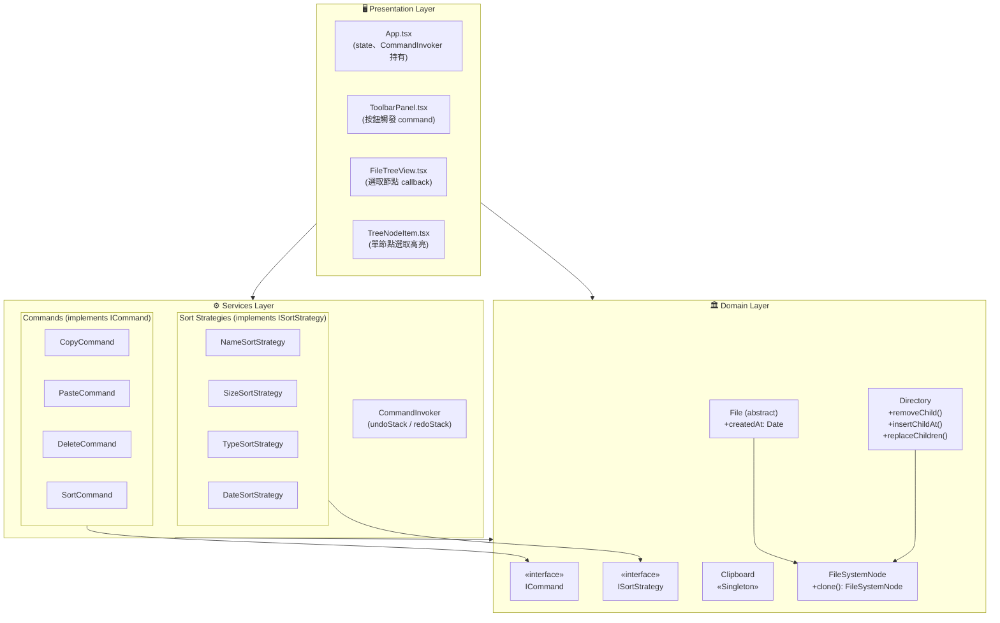
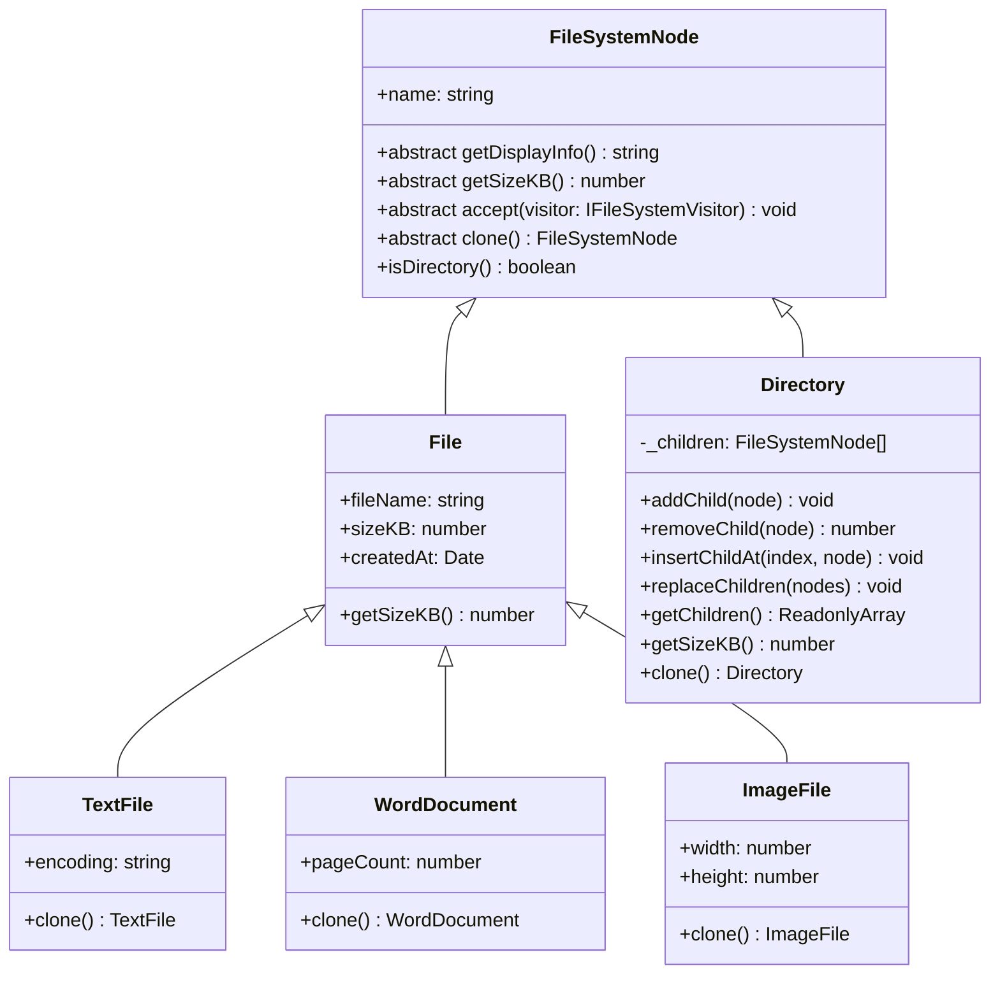
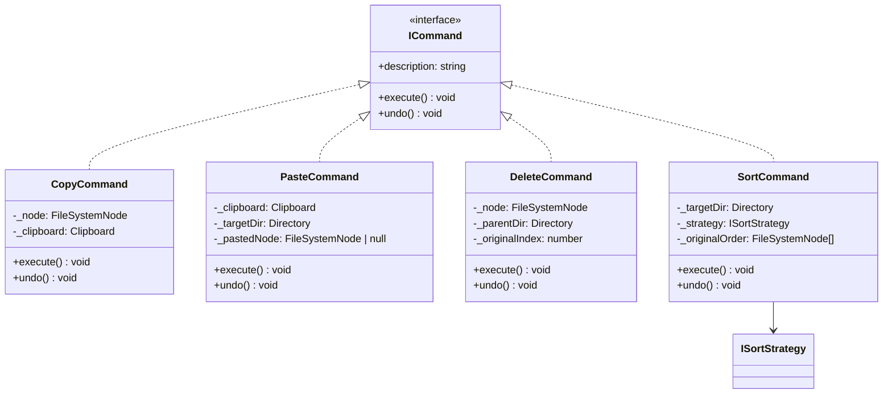
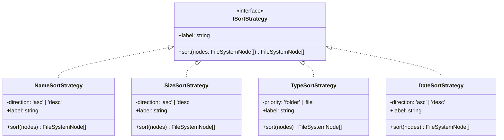
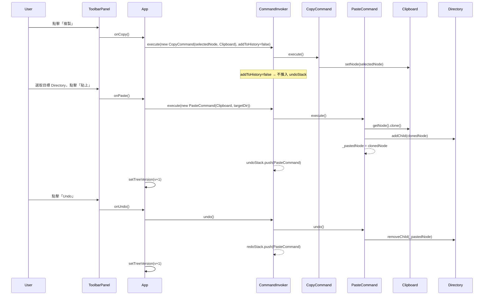
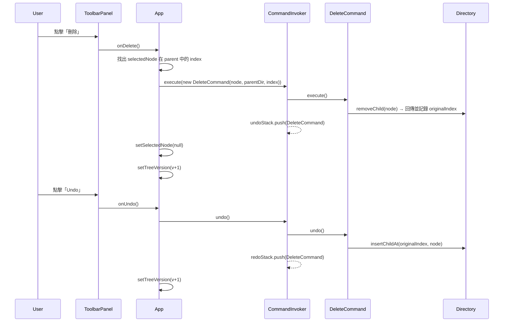
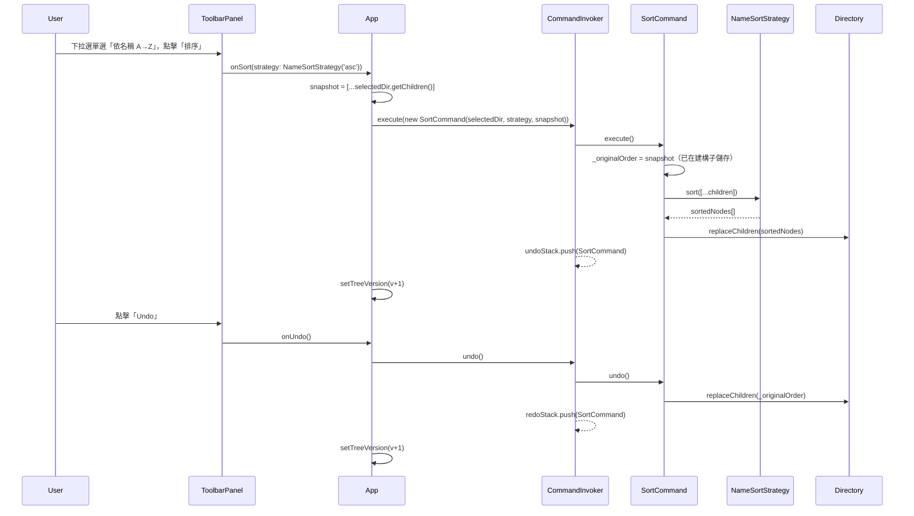

# FRD.md — 006-command-strategy-pattern

> **架構設計文件**  
> **對應需求**: [spec.md](spec.md)  
> **建立日期**: 2026-03-30  
> **技術棧**: React 19 + TypeScript + Vite + Tailwind CSS 4 + Vitest

---

## 規範基線（Phase 0 — Standards Baseline）

| 類別     | 規範文件                                | 影響架構設計的關鍵約束                                                               |
| -------- | --------------------------------------- | ------------------------------------------------------------------------------------ |
| 架構     | `standards/clean-architecture.md`       | Domain ← Services ← Presentation，內層不依賴外層                                     |
| 設計模式 | `standards/design-patterns.md`          | Command 封裝操作並支援 Undo；Strategy 可替換演算法；Singleton 全域共享狀態           |
| SOLID    | `standards/solid-principles.md`         | ICommand / ISortStrategy 介面最小化（ISP）；CommandInvoker 不依賴具體 Command（DIP） |
| 前端     | `standards/coding-standard-frontend.md` | 禁止使用 `any`；TypeScript strict mode；元件職責單一（SRP）                          |

---

## 1. 架構概述

### 1.1 設計目標

在既有 React SPA 的基礎上，新增管理操作層（複製/貼上/刪除/排序），透過 **Command Pattern** 封裝每個可逆操作，實現無限層 Undo/Redo。操作對象為 Domain Layer 的 `FileSystemNode`，所有命令邏輯集中在 Services 層，Presentation 層僅負責觸發命令與更新 UI。

### 1.2 Clean Architecture 依賴方向



---

## 2. 開放問題決策（OI-01 / OI-02）

| Issue                                | 決策結果                                                                                                    |
| ------------------------------------ | ----------------------------------------------------------------------------------------------------------- |
| **OI-01** `fileSize` 來源            | 使用 `node.getSizeKB()`（已存在於 `FileSystemNode`），無需修改抽象類別                                      |
| **OI-01** `lastModified` 來源        | `node instanceof File` 時取 `node.createdAt`；Directory 以 `new Date(0)` 計算（視為最舊），無需修改抽象類別 |
| **OI-02** Directory 大小排序計算方式 | 使用 `getSizeKB()` 遞迴加總，與現有行為一致                                                                 |

---

## 3. Domain 模型變更

### 3.1 新增抽象方法 `clone()`

`FileSystemNode` 新增 `abstract clone(): FileSystemNode`，各具體子類別實作 deep copy。



### 3.2 新增 Domain 介面

**`src/domain/commands/ICommand.ts`**:

```typescript
export interface ICommand {
  readonly description: string;
  execute(): void;
  undo(): void;
}
```

**`src/domain/strategies/ISortStrategy.ts`**:

```typescript
export interface ISortStrategy {
  readonly label: string;
  sort(nodes: FileSystemNode[]): FileSystemNode[];
}
```

### 3.3 Clipboard Singleton

**`src/domain/Clipboard.ts`**:

```typescript
export class Clipboard {
  private static _instance: Clipboard | null = null;
  private _node: FileSystemNode | null = null;

  private constructor() {}

  static getInstance(): Clipboard {
    if (!Clipboard._instance) {
      Clipboard._instance = new Clipboard();
    }
    return Clipboard._instance;
  }

  setNode(node: FileSystemNode): void {
    this._node = node;
  }
  getNode(): FileSystemNode | null {
    return this._node;
  }
  hasNode(): boolean {
    return this._node !== null;
  }
  clear(): void {
    this._node = null;
  }

  /** 僅供測試使用：重置 Singleton 實例 */
  static _resetForTest(): void {
    Clipboard._instance = null;
  }
}
```

---

## 4. 設計模式詳細設計

### 4.1 Command Pattern

#### 類別圖



#### 各 Command 行為規格

| Command         | `execute()`                                                                      | `undo()`                                        | 加入 Undo 堆疊 |
| --------------- | -------------------------------------------------------------------------------- | ----------------------------------------------- | -------------- |
| `CopyCommand`   | `Clipboard.setNode(node)`                                                        | no-op                                           | ❌             |
| `PasteCommand`  | `targetDir.addChild(clipboard.getNode().clone())`                                | `targetDir.removeChild(_pastedNode)`            | ✅             |
| `DeleteCommand` | `parentDir.removeChild(node)` 記錄 `_originalIndex`                              | `parentDir.insertChildAt(_originalIndex, node)` | ✅             |
| `SortCommand`   | 記錄 `_originalOrder`；`targetDir.replaceChildren(strategy.sort([...children]))` | `targetDir.replaceChildren(_originalOrder)`     | ✅             |

> ⚠️ `PasteCommand.execute()` 需記錄實際 clone 結果（`_pastedNode`），供 `undo()` 精確移除。

### 4.2 Strategy Pattern

#### Sort Strategies 類別圖



#### Sort 策略比較規則

| Strategy           | 比較依據                                              | Directory 處理方式 |
| ------------------ | ----------------------------------------------------- | ------------------ |
| `NameSortStrategy` | `node.name`（字母順序）                               | 同規則             |
| `SizeSortStrategy` | `node.getSizeKB()`                                    | 遞迴加總（已存在） |
| `TypeSortStrategy` | `node.isDirectory()`                                  | 本身即分類依據     |
| `DateSortStrategy` | `node instanceof File ? node.createdAt : new Date(0)` | 視為 epoch（最舊） |

### 4.3 CommandInvoker

#### 行為規格

```typescript
export class CommandInvoker {
  private _undoStack: ICommand[] = [];
  private _redoStack: ICommand[] = [];

  execute(cmd: ICommand, addToHistory = true): void {
    cmd.execute();
    if (addToHistory) {
      this._undoStack.push(cmd);
      this._redoStack = []; // 執行新操作清空 Redo
    }
  }

  undo(): void {
    const cmd = this._undoStack.pop();
    if (cmd) {
      cmd.undo();
      this._redoStack.push(cmd);
    }
  }

  redo(): void {
    const cmd = this._redoStack.pop();
    if (cmd) {
      cmd.execute();
      this._undoStack.push(cmd);
    }
  }

  get canUndo(): boolean {
    return this._undoStack.length > 0;
  }
  get canRedo(): boolean {
    return this._redoStack.length > 0;
  }
}
```

> 🔑 `execute(cmd, addToHistory = false)` 用於 `CopyCommand`（不加入歷史記錄）。

---

## 5. 目錄結構

### 新增檔案

```
file-management-system/src/
├── domain/
│   ├── FileSystemNode.ts         ← 修改：新增 abstract clone()
│   ├── Directory.ts              ← 修改：新增 removeChild / insertChildAt / replaceChildren
│   ├── TextFile.ts               ← 修改：實作 clone()
│   ├── WordDocument.ts           ← 修改：實作 clone()
│   ├── ImageFile.ts              ← 修改：實作 clone()
│   ├── Clipboard.ts              ← 新增：Singleton
│   ├── commands/
│   │   ├── ICommand.ts           ← 新增：Command 介面
│   │   └── index.ts              ← 新增：barrel export
│   └── strategies/
│       ├── ISortStrategy.ts      ← 新增：Strategy 介面
│       └── index.ts              ← 新增：barrel export
├── services/
│   ├── CommandInvoker.ts         ← 新增
│   ├── commands/
│   │   ├── CopyCommand.ts        ← 新增
│   │   ├── PasteCommand.ts       ← 新增
│   │   ├── DeleteCommand.ts      ← 新增
│   │   ├── SortCommand.ts        ← 新增
│   │   └── index.ts              ← 新增：barrel export
│   └── strategies/
│       ├── NameSortStrategy.ts   ← 新增
│       ├── SizeSortStrategy.ts   ← 新增
│       ├── TypeSortStrategy.ts   ← 新增
│       ├── DateSortStrategy.ts   ← 新增
│       └── index.ts              ← 新增：barrel export
└── components/
    ├── ToolbarPanel.tsx           ← 新增
    ├── FileTreeView.tsx           ← 修改：傳入 onSelect / selectedNode
    └── TreeNodeItem.tsx           ← 修改：選取高亮 + onClick 冒泡阻止

file-management-system/tests/
├── domain/
│   ├── Clipboard.test.ts         ← 新增
│   └── Directory.extended.test.ts← 新增（新方法 + clone）
├── services/
│   ├── CommandInvoker.test.ts    ← 新增
│   ├── commands/
│   │   ├── CopyCommand.test.ts   ← 新增
│   │   ├── PasteCommand.test.ts  ← 新增
│   │   ├── DeleteCommand.test.ts ← 新增
│   │   └── SortCommand.test.ts   ← 新增
│   └── strategies/
│       ├── NameSortStrategy.test.ts  ← 新增
│       ├── SizeSortStrategy.test.ts  ← 新增
│       ├── TypeSortStrategy.test.ts  ← 新增
│       └── DateSortStrategy.test.ts  ← 新增
└── components/
    └── ToolbarPanel.test.tsx     ← 新增
```

---

## 6. UI 版面配置

### 6.1 ToolbarPanel 版型

工具列放置於 `FileTreeView` 上方，採用 **水平按鈕列（Toolbar Strip）** 版型。

```
┌─────────────────────────────────────────────────────────────────────┐
│  [📋 複製]  [📌 貼上]  [🗑 刪除]  [排序▼ NameA→Z ▾]  [↩ Undo]  [↪ Redo]  │
│  ───────────────────────────────────────────────────────────────── │
│  已選取：需求規格.docx                                                │
└─────────────────────────────────────────────────────────────────────┘
```

**按鈕狀態規則**：

| 按鈕 | enabled 條件                                         |
| ---- | ---------------------------------------------------- |
| 複製 | `selectedNode !== null`                              |
| 貼上 | `Clipboard.hasNode() && selectedNode?.isDirectory()` |
| 刪除 | `selectedNode !== null && selectedParent !== null`   |
| 排序 | `selectedNode?.isDirectory()`                        |
| Undo | `CommandInvoker.canUndo`                             |
| Redo | `CommandInvoker.canRedo`                             |

### 6.2 TreeNodeItem 選取高亮

選取中的節點以藍底高亮（`bg-blue-100 border-l-2 border-blue-500`），點擊節點時觸發 `onSelect(node, parentDir)` callback 向上傳遞。

### 6.3 App.tsx 狀態結構（新增項目）

```typescript
// 新增 --- 節點選取 state
const [selectedNode, setSelectedNode] = useState<FileSystemNode | null>(null);
const [selectedParent, setSelectedParent] = useState<Directory | null>(null);

// 新增 --- 樹狀版本計數器（命令執行後遞增，觸發 FileTreeView 重新渲染）
const [treeVersion, setTreeVersion] = useState(0);

// 新增 --- CommandInvoker 實例（useMemo 避免重建）
const invoker = useMemo(() => new CommandInvoker(), []);
```

---

## 7. 核心業務流程 Sequence Diagrams

### 7.1 複製 → 貼上 → Undo 流程



### 7.2 刪除 → Undo 流程



### 7.3 排序 → Undo 流程



---

## 8. 架構決策記錄（ADR）

### ADR-001：`CopyCommand` 不加入 Undo 堆疊

**現象**：複製操作只記憶節點參考，不改變樹狀態，Undo 複製無實質意義。  
**決策**：透過 `CommandInvoker.execute(cmd, addToHistory = false)` 執行，不推入 undoStack。  
**依據規範**：`standards/solid-principles.md` — SRP，避免 CommandInvoker 需要判斷命令類型；`standards/design-patterns.md` — Command Pattern，Invoker 決策是否記錄歷史。

### ADR-002：`Directory` 保持可變（Mutable），以 `treeVersion` 觸發重渲染

**現象**：Immutable 樹每次操作需深拷貝全樹，效能差；本專案無持久層，不需 Event Sourcing。  
**決策**：`Directory._children` 保持可變；命令 `execute()` / `undo()` 直接 mutate；`App.tsx` 以 `treeVersion` state（`setTreeVersion(v => v + 1)`）觸發重渲染。  
**依據規範**：`standards/clean-architecture.md` — Infrastructure/UI 層負責狀態管理；Domain 聚焦商業規則。

### ADR-003：Sort Strategy 採「一個類別 + 方向參數」設計

**現象**：若每個方向各建一個類別（NameAscStrategy、NameDescStrategy），共需 8 個類別，造成類別爆炸。  
**決策**：4 個 Strategy 類別，各以建構子接受方向參數（`direction: 'asc' | 'desc'` 或 `priority: 'folder' | 'file'`）。  
**依據規範**：`standards/solid-principles.md` — OCP，新增排序欄位只需新增類別；ISP，介面保持最小（只需 `sort()` + `label`）。

### ADR-004：`clone()` 放在 `FileSystemNode` 抽象層

**現象**：`PasteCommand` 需要 deep copy 節點以避免共享參考導致 Undo 後狀態錯誤。  
**決策**：所有子類別實作 `abstract clone(): FileSystemNode`，`Directory.clone()` 遞迴複製子節點。  
**依據規範**：`standards/solid-principles.md` — LSP，所有子類別的 `clone()` 行為語意一致（深複製自身）。

### ADR-005：`selectedParent` 由 `App.tsx` 在選取時計算，而非 `FileSystemNode` 持有 parent 引用

**現象**：若 `FileSystemNode` 持有 `parent` 引用，clone 時需要更新 parent 指向，且雙向引用增加複雜度。  
**決策**：`TreeNodeItem` 的 `onSelect(node, parentDir: Directory | null)` 一起傳遞父目錄，App 儲存 `selectedParent` state。根節點無父目錄，`selectedParent = null`，刪除按鈕在根節點被選取時 disabled。  
**依據規範**：`standards/clean-architecture.md` — Domain 層保持純粹，父子關係由 Presentation 層管理。
