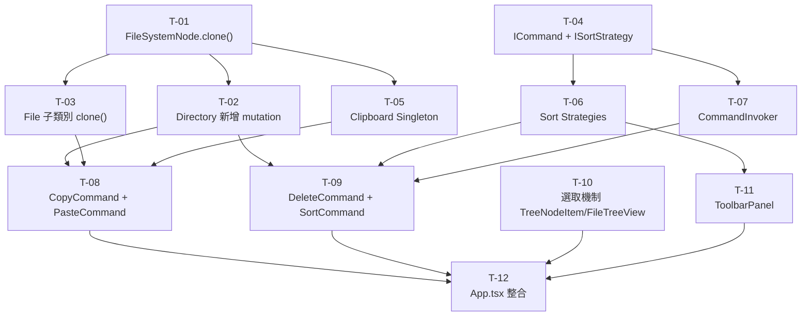

# plan.md — 006-command-strategy-pattern

> **執行計畫文件**  
> **對應設計**: [FRD.md](FRD.md)  
> **對應需求**: [spec.md](spec.md)  
> **建立日期**: 2026-03-31  
> **技術棧**: React 19 + TypeScript + Vite + Tailwind CSS 4 + Vitest

---

## 工作拆解（Task Breakdown）

### T-01：Domain — `FileSystemNode` 新增 `clone()` 抽象方法

**描述**：在 `FileSystemNode` 抽象類別中新增 `abstract clone(): FileSystemNode`，讓 `PasteCommand` 可對任意節點執行深複製，而不需依賴具體子類別型別。

**修改檔案**：

- `src/domain/FileSystemNode.ts`：新增 `abstract clone(): FileSystemNode` 方法簽名

**測試**：無（抽象方法，透過子類別測試覆蓋）

**架構層**：Domain  
**複雜度**：低  
**前置依賴**：無

---

### T-02：Domain — `Directory` 新增三個 mutation 方法

**描述**：新增 `removeChild()`、`insertChildAt()`、`replaceChildren()` 三個方法，供 Command 在 execute / undo 時操作子節點。同時實作 `clone()` 遞迴複製整個目錄樹。

**修改檔案**：

- `src/domain/Directory.ts`：
  - `removeChild(node: FileSystemNode): number` — 移除節點，回傳原始 index（找不到回傳 -1）
  - `insertChildAt(index: number, node: FileSystemNode): void` — 在指定位置插入節點
  - `replaceChildren(nodes: FileSystemNode[]): void` — 整批替換 children（用於 Sort Undo）
  - `clone(): Directory` — 遞迴 new Directory + 對每個 child 呼叫 `child.clone()`

**測試**：`tests/domain/Directory.test.ts` 補充以下情境：

- `removeChild()` → 回傳正確 index；不存在時回傳 -1
- `insertChildAt()` → index=0 插到最前；index=length 等同 push
- `replaceChildren()` → children 完全替換為新陣列
- `clone()` → 回傳新 Directory；修改 clone 的子節點不影響原本

**架構層**：Domain  
**複雜度**：低  
**前置依賴**：T-01

---

### T-03：Domain — File 子類別實作 `clone()`

**描述**：在三個具體 File 子類別中實作 `clone()` 方法，各自以自身建構子參數建立新實例（shallow copy 值型別屬性）。

**修改檔案**：

- `src/domain/TextFile.ts`：`clone(): TextFile` → `new TextFile(this.fileName, this.sizeKB, this.createdAt, this.encoding)`
- `src/domain/ImageFile.ts`：`clone(): ImageFile` → `new ImageFile(this.fileName, this.sizeKB, this.createdAt, this.width, this.height)`
- `src/domain/WordDocument.ts`：`clone(): WordDocument` → `new WordDocument(this.fileName, this.sizeKB, this.createdAt, this.pageCount)`

**測試**：`tests/domain/FileSystemNode.test.ts` 補充各子類別 clone 測試：

- clone 後各屬性值相等
- clone 結果為獨立實例（`!==` 原本）

**架構層**：Domain  
**複雜度**：低  
**前置依賴**：T-01

---

### T-04：Domain — `ICommand` + `ISortStrategy` 介面與 barrel exports

**描述**：在 Domain 層建立兩個薄介面與對應的 barrel export，確保 Services 層依賴介面而非實作。

**新增檔案**：

- `src/domain/commands/ICommand.ts`：

  ```typescript
  export interface ICommand {
    readonly description: string;
    execute(): void;
    undo(): void;
  }
  ```

- `src/domain/commands/index.ts`：barrel export `ICommand`
- `src/domain/strategies/ISortStrategy.ts`：

  ```typescript
  import type { FileSystemNode } from "../FileSystemNode";

  export interface ISortStrategy {
    readonly label: string;
    sort(nodes: FileSystemNode[]): FileSystemNode[];
  }
  ```

- `src/domain/strategies/index.ts`：barrel export `ISortStrategy`

**修改檔案**：

- `src/domain/index.ts`：新增 `export * from './commands'`、`export * from './strategies'`

**測試**：無（純介面，無可測試邏輯）

**架構層**：Domain  
**複雜度**：低  
**前置依賴**：無

---

### T-05：Domain — `Clipboard` Singleton

**描述**：在 Domain 層建立 `Clipboard` Singleton，儲存複製的節點參考，供 `CopyCommand` 寫入、`PasteCommand` 讀取。放在 Domain 層確保 `PasteCommand` 不需感知 Domain 外部依賴。

**新增檔案**：

- `src/domain/Clipboard.ts`：

  ```typescript
  export class Clipboard {
    private static _instance: Clipboard | null = null;
    private _node: FileSystemNode | null = null;

    private constructor() {}

    static getInstance(): Clipboard { ... }

    setNode(node: FileSystemNode): void
    getNode(): FileSystemNode | null
    hasNode(): boolean
    clear(): void

    /** 僅供測試使用，重置 Singleton 狀態 */
    static _resetForTest(): void
  }
  ```

**修改檔案**：

- `src/domain/index.ts`：新增 `export { Clipboard } from './Clipboard'`

**測試**：`tests/domain/Clipboard.test.ts`：

- `getInstance()` 兩次呼叫回傳同一實例
- `setNode()` → `getNode()` 回傳相同節點
- `hasNode()` 空時為 false；設值後為 true
- `clear()` 後 `hasNode()` 為 false
- `_resetForTest()` 後 `getInstance()` 建立新實例

**架構層**：Domain  
**複雜度**：低  
**前置依賴**：T-01

---

### T-06：Services — 四種 Sort Strategy 實作

**描述**：實作四個 `ISortStrategy` 具體類別，各接受方向參數（`direction: 'asc' | 'desc'`；TypeSortStrategy 用 `priority: 'folder' | 'file'`）。排序使用 `Array.prototype.slice().sort()` 確保不改動原陣列。

**新增檔案**：

- `src/services/strategies/NameSortStrategy.ts`：依 `node.name` 字母排序
- `src/services/strategies/SizeSortStrategy.ts`：依 `node.getSizeKB()` 排序
- `src/services/strategies/TypeSortStrategy.ts`：依 `node.isDirectory()` 排序
- `src/services/strategies/DateSortStrategy.ts`：依 `(node instanceof File ? node.createdAt : new Date(0))` 排序
- `src/services/strategies/index.ts`：barrel export 四個類別

**排序規則彙整**：

| 類別               | 建構子參數                     | asc      | desc       |
| ------------------ | ------------------------------ | -------- | ---------- |
| `NameSortStrategy` | `direction: 'asc' \| 'desc'`   | A→Z      | Z→A        |
| `SizeSortStrategy` | `direction: 'asc' \| 'desc'`   | 小→大    | 大→小      |
| `TypeSortStrategy` | `priority: 'folder' \| 'file'` | 檔案優先 | 資料夾優先 |
| `DateSortStrategy` | `direction: 'asc' \| 'desc'`   | 舊→新    | 新→舊      |

**測試**：`tests/services/strategies/` 各一個測試檔：

- 各方向排序結果正確
- 輸入空陣列回傳空陣列
- 不修改原陣列（輸入 `ReadonlyArray` 型別確保）
- `DateSortStrategy`：Directory 排序視為最舊（epoch）

**架構層**：Services  
**複雜度**：低  
**前置依賴**：T-04

---

### T-07：Services — `CommandInvoker`

**描述**：實作 `CommandInvoker`，管理無限層 undoStack / redoStack。提供 `execute(cmd, addToHistory?)` 讓 `CopyCommand` 可不加入歷史記錄。

**新增檔案**：

- `src/services/CommandInvoker.ts`：

  ```typescript
  export class CommandInvoker {
    private _undoStack: ICommand[] = [];
    private _redoStack: ICommand[] = [];

    execute(cmd: ICommand, addToHistory = true): void {
      cmd.execute();
      if (addToHistory) {
        this._undoStack.push(cmd);
        this._redoStack = [];
      }
    }

    undo(): void {
      /* pop undoStack → call undo() → push redoStack */
    }
    redo(): void {
      /* pop redoStack → call execute() → push undoStack */
    }

    get canUndo(): boolean;
    get canRedo(): boolean;
  }
  ```

**測試**：`tests/services/CommandInvoker.test.ts`：

- `execute()` 呼叫 `cmd.execute()`；`canUndo = true`；`canRedo = false`
- `execute(cmd, false)` → `canUndo` 保持 false
- `undo()` 呼叫 `cmd.undo()`；`canRedo = true`；`canUndo` 遞減
- `redo()` 呼叫 `cmd.execute()`；`canUndo = true`
- 執行新命令後 `canRedo = false`（Redo 堆疊清空）
- 空堆疊時 `undo()` / `redo()` 不拋出例外

**架構層**：Services  
**複雜度**：中  
**前置依賴**：T-04

---

### T-08：Services — `CopyCommand` + `PasteCommand`

**描述**：實作 Copy 與 Paste 兩個命令。`CopyCommand.undo()` 為 no-op（呼叫端透過 `addToHistory=false` 確保不進堆疊）。`PasteCommand` 需記錄實際 clone 結果（`_pastedNode`）供 undo 精確移除。

**新增檔案**：

- `src/services/commands/CopyCommand.ts`：

  ```typescript
  export class CopyCommand implements ICommand {
    readonly description = "複製";
    constructor(
      private readonly _node: FileSystemNode,
      private readonly _clipboard: Clipboard,
    ) {}
    execute(): void {
      this._clipboard.setNode(this._node);
    }
    undo(): void {
      /* no-op：不加入 Undo 堆疊 */
    }
  }
  ```

- `src/services/commands/PasteCommand.ts`：

  ```typescript
  export class PasteCommand implements ICommand {
    readonly description = "貼上";
    private _pastedNode: FileSystemNode | null = null;
    constructor(
      private readonly _clipboard: Clipboard,
      private readonly _targetDir: Directory,
    ) {}
    execute(): void {
      const source = this._clipboard.getNode();
      if (!source) throw new Error("Clipboard is empty");
      this._pastedNode = source.clone();
      this._targetDir.addChild(this._pastedNode);
    }
    undo(): void {
      if (this._pastedNode) this._targetDir.removeChild(this._pastedNode);
    }
  }
  ```

- `src/services/commands/index.ts`：barrel export（此 task 先加 Copy + Paste，T-09 補 Delete + Sort）

**測試**：

- `tests/services/commands/CopyCommand.test.ts`：
  - `execute()` → `clipboard.hasNode() === true`
  - `undo()` → 不改變 clipboard 狀態
- `tests/services/commands/PasteCommand.test.ts`：
  - `execute()` → 目標 Directory children 數量 +1；clone 是獨立實例（`!== source`）
  - `undo()` → children 數量恢復原值
  - Clipboard 為空時 `execute()` 拋出例外

**架構層**：Services  
**複雜度**：中  
**前置依賴**：T-02, T-03, T-05

---

### T-09：Services — `DeleteCommand` + `SortCommand`

**描述**：

- `DeleteCommand`：移除節點時記錄 `_originalIndex`（由 `removeChild()` 回傳），undo 時用 `insertChildAt()` 還原位置。
- `SortCommand`：在建構子接受目前的 children 快照作為 `_originalOrder`；execute 用 strategy 排序；undo 用 `replaceChildren()` 還原。

**新增檔案**：

- `src/services/commands/DeleteCommand.ts`：

  ```typescript
  export class DeleteCommand implements ICommand {
    readonly description = "刪除";
    private _originalIndex = -1;
    constructor(
      private readonly _node: FileSystemNode,
      private readonly _parentDir: Directory,
    ) {}
    execute(): void {
      this._originalIndex = this._parentDir.removeChild(this._node);
    }
    undo(): void {
      this._parentDir.insertChildAt(this._originalIndex, this._node);
    }
  }
  ```

- `src/services/commands/SortCommand.ts`：

  ```typescript
  export class SortCommand implements ICommand {
    readonly description = "排序";
    constructor(
      private readonly _targetDir: Directory,
      private readonly _strategy: ISortStrategy,
      private readonly _originalOrder: FileSystemNode[],
    ) {}
    execute(): void {
      this._targetDir.replaceChildren(
        this._strategy.sort([...this._targetDir.getChildren()]),
      );
    }
    undo(): void {
      this._targetDir.replaceChildren(this._originalOrder);
    }
  }
  ```

**修改檔案**：

- `src/services/commands/index.ts`：補充 export `DeleteCommand`、`SortCommand`

**測試**：

- `tests/services/commands/DeleteCommand.test.ts`：
  - `execute()` → 節點不在 children 中；原始 index 正確記錄
  - `undo()` → 節點回到原位
- `tests/services/commands/SortCommand.test.ts`：
  - `execute()` → children 依策略排序
  - `undo()` → children 回到 `_originalOrder`
  - 連續 execute 兩次 → 第二次以目前 children 為輸入（不影響 `_originalOrder`）

**架構層**：Services  
**複雜度**：中  
**前置依賴**：T-02, T-06, T-07

---

### T-10：Presentation — `TreeNodeItem` + `FileTreeView` 選取機制

**描述**：在 `TreeNodeItem` 新增點擊選取回呼（`onClick`），並將「目前選取節點」以 prop 傳入做高亮。`FileTreeView` 向外暴露 `onSelect(node: FileSystemNode, parent: Directory | null)` prop，由 `App.tsx` 接收並儲存。

**修改檔案**：

- `src/components/TreeNodeItem.tsx`：
  - 新增 `onSelect?: (node: FileSystemNode, parent: Directory | null) => void` prop
  - 新增 `selectedNode?: FileSystemNode | null` prop（用於高亮比對）
  - 點擊節點時呼叫 `onSelect(node, parent)` 並 `e.stopPropagation()` 阻止冒泡
  - 選取中節點加上 `bg-blue-100 border-l-2 border-blue-500` 樣式

- `src/components/FileTreeView.tsx`：
  - 新增 `onSelect?: (node: FileSystemNode, parent: Directory | null) => void` prop
  - 新增 `selectedNode?: FileSystemNode | null` prop
  - 向下傳遞 `onSelect` + `selectedNode` + parent 資訊給 `TreeNodeItem`

**測試**：`tests/components/FileTreeView.test.tsx` 補充：

- 點擊節點時 `onSelect` callback 被呼叫，帶正確的 node 與 parent

**架構層**：Presentation  
**複雜度**：低  
**前置依賴**：T-04（需要 `FileSystemNode` 型別）

---

### T-11：Presentation — `ToolbarPanel` 元件

**描述**：建立管理操作工具列，包含複製/貼上/刪除/排序（附下拉）/Undo/Redo 六個操作區域。按鈕 disabled 狀態由 props 傳入，不在元件內部計算業務邏輯（符合 SRP）。

**新增檔案**：

- `src/components/ToolbarPanel.tsx`：

  ```typescript
  interface ToolbarPanelProps {
    selectedNode: FileSystemNode | null;
    canPaste: boolean;
    canUndo: boolean;
    canRedo: boolean;
    onCopy: () => void;
    onPaste: () => void;
    onDelete: () => void;
    onSort: (strategy: ISortStrategy) => void;
    onUndo: () => void;
    onRedo: () => void;
  }
  ```

  排序策略下拉清單以 `SORT_OPTIONS` 常數定義（8 個選項，實例化在模組頂層避免每次渲染重建）：

  ```typescript
  // 定義在元件外部
  const SORT_OPTIONS = [
    { label: "依名稱 A→Z", strategy: new NameSortStrategy("asc") },
    { label: "依名稱 Z→A", strategy: new NameSortStrategy("desc") },
    { label: "依大小 小→大", strategy: new SizeSortStrategy("asc") },
    { label: "依大小 大→小", strategy: new SizeSortStrategy("desc") },
    { label: "依類型 資料夾優先", strategy: new TypeSortStrategy("folder") },
    { label: "依類型 檔案優先", strategy: new TypeSortStrategy("file") },
    { label: "依日期 新→舊", strategy: new DateSortStrategy("desc") },
    { label: "依日期 舊→新", strategy: new DateSortStrategy("asc") },
  ] as const;
  ```

**測試**：`tests/components/ToolbarPanel.test.tsx`：

- 無選取節點時：`複製`、`刪除`、`排序` 按鈕為 disabled
- `canPaste=false` 時：`貼上` 按鈕為 disabled
- `canUndo=false` 時：`Undo` 按鈕為 disabled
- `canRedo=false` 時：`Redo` 按鈕為 disabled
- 點擊「複製」（已啟用）→ `onCopy` 被呼叫
- 點擊「Undo」（已啟用）→ `onUndo` 被呼叫
- 排序下拉選擇「依名稱 A→Z」→ `onSort` 被呼叫，帶 `NameSortStrategy` 實例

**架構層**：Presentation  
**複雜度**：中  
**前置依賴**：T-06

---

### T-12：Presentation — `App.tsx` 整合

**描述**：整合 `selectedNode`、`selectedParent`、`CommandInvoker`、`Clipboard`、`ToolbarPanel` 與更新後的 `FileTreeView`，完成端到端操作流程。

**修改檔案**：

- `src/App.tsx`：
  1. 新增 state：`selectedNode`, `selectedParent`, `treeVersion`
  2. 建立 `CommandInvoker` 實例（`useMemo(() => new CommandInvoker(), [])`）
  3. 取得 `Clipboard.getInstance()`
  4. 實作 handler：
     - `handleCopy()`：`invoker.execute(new CopyCommand(selectedNode!, clipboard), false)`
     - `handlePaste()`：`invoker.execute(new PasteCommand(clipboard, selectedNode as Directory))`
     - `handleDelete()`：`invoker.execute(new DeleteCommand(selectedNode!, selectedParent!))`
     - `handleSort(strategy)`：`invoker.execute(new SortCommand(selectedNode as Directory, strategy, [...selectedNode.getChildren()]))`
     - `handleUndo()`：`invoker.undo()`
     - `handleRedo()`：`invoker.redo()`
     - 每個 handler 結尾呼叫 `setTreeVersion(v => v + 1)`
  5. 計算 `canPaste`：`clipboard.hasNode() && selectedNode?.isDirectory() === true`
  6. `<FileTreeView>` 傳入 `onSelect`、`selectedNode`；`key={treeVersion}` 觸發重渲染
  7. `<ToolbarPanel>` 放置於 `<FileTreeView>` 上方，傳入所有 props

**測試**：`tests/components/ManagementToolbar.test.tsx` 已由 T-11 涵蓋主要邏輯；`App.tsx` 不另寫完整整合測試（UI 整合視覺驗證）

**架構層**：Presentation  
**複雜度**：高（整合多個模組）  
**前置依賴**：T-07, T-08, T-09, T-10, T-11

---

## 任務依賴圖



---

## 測試策略

| 層級                      | 工具                           | 策略                                                        |
| ------------------------- | ------------------------------ | ----------------------------------------------------------- |
| Domain（Unit）            | Vitest                         | 純函數、無 React；`Clipboard._resetForTest()` 確保隔離      |
| Services（Unit）          | Vitest                         | 以真實 Domain 物件（非 mock）測試 Command 邏輯              |
| Strategies（Unit）        | Vitest                         | 境界測試（空陣列、單元素、全同值）；不修改原陣列            |
| Components（Integration） | Vitest + React Testing Library | 以 `render()` + `fireEvent.click()` 驗證按鈕狀態與 callback |

---

## 估計新增測試數量

| 任務                                     | 預估測試案例     |
| ---------------------------------------- | ---------------- |
| T-02（Directory mutation + clone）       | 8                |
| T-03（File clone）                       | 6                |
| T-05（Clipboard）                        | 5                |
| T-06（4 種 Strategy × 各 3 個方向/情境） | 16               |
| T-07（CommandInvoker）                   | 8                |
| T-08（CopyCommand + PasteCommand）       | 7                |
| T-09（DeleteCommand + SortCommand）      | 8                |
| T-10（TreeNodeItem/FileTreeView 選取）   | 3                |
| T-11（ToolbarPanel 按鈕狀態與 callback） | 8                |
| **合計**                                 | **~69 個新測試** |

> 現有測試基準：171 個通過。完成後預估總計：**~240 個**。

---

## 部署架構（不變）

本需求為純前端 SPA 修改，無後端依賴變更，部署架構與 005 相同：

- `vite build` → 靜態檔案
- 不新增環境變數
- 不修改 `vite.config.ts` / `package.json`
