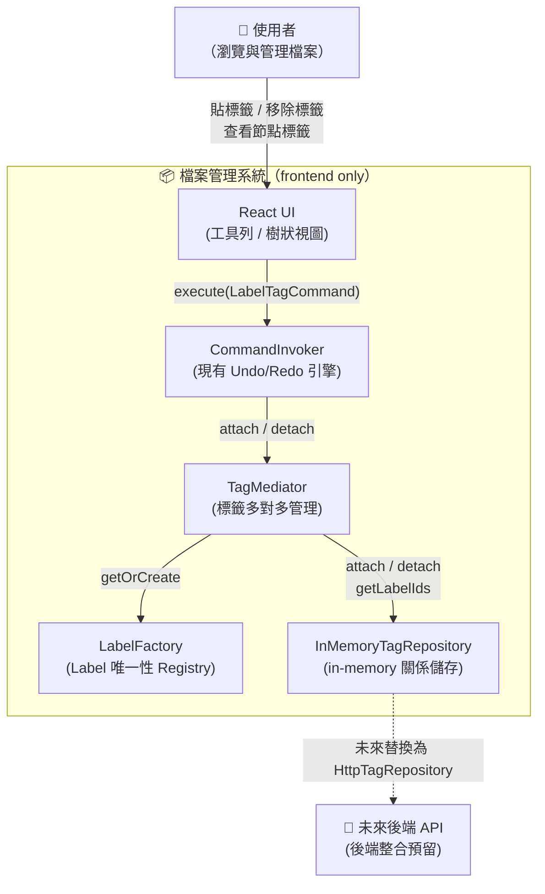
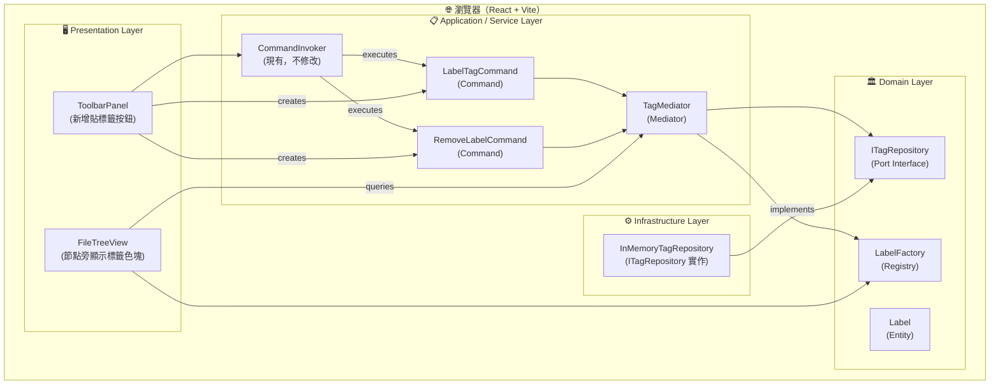
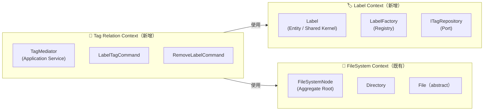
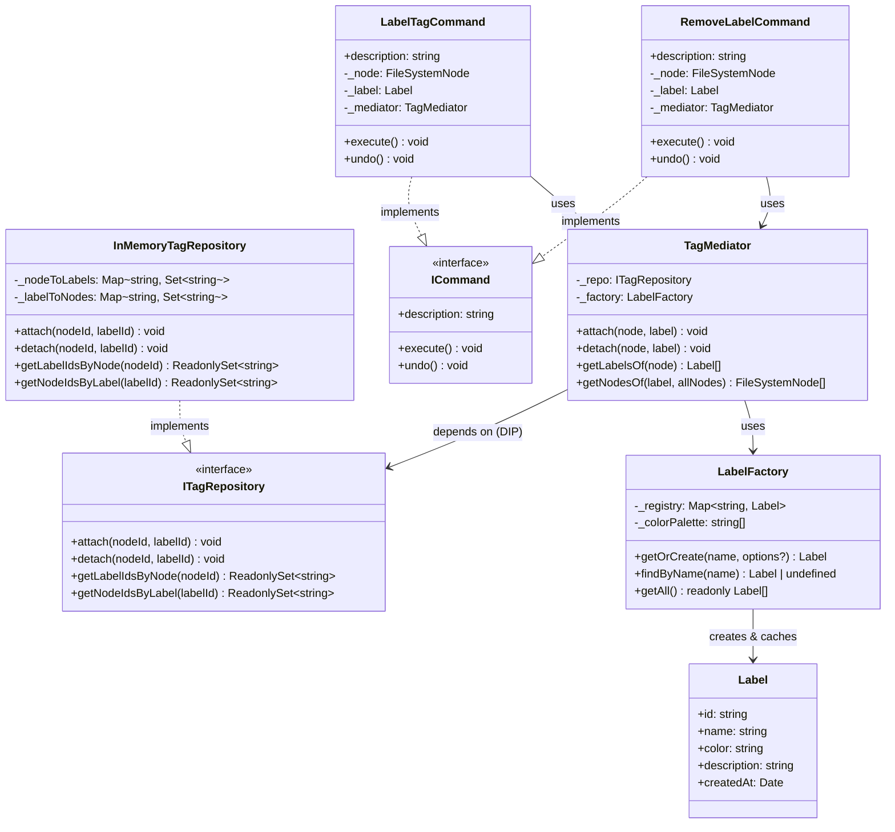
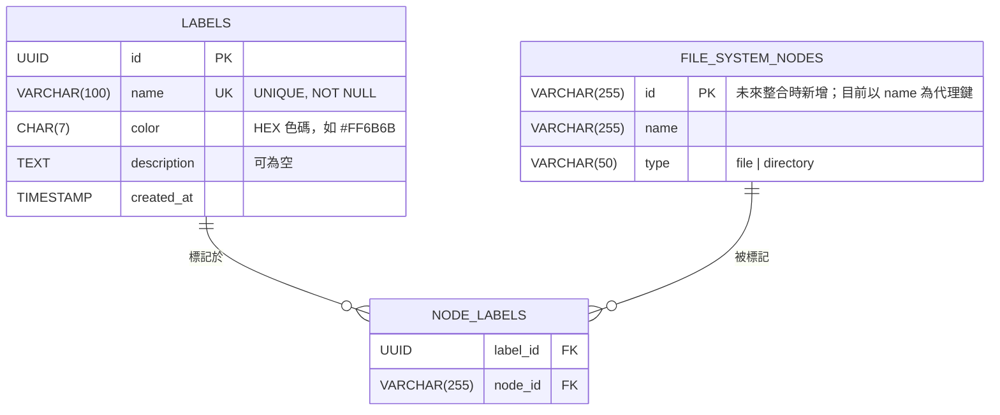
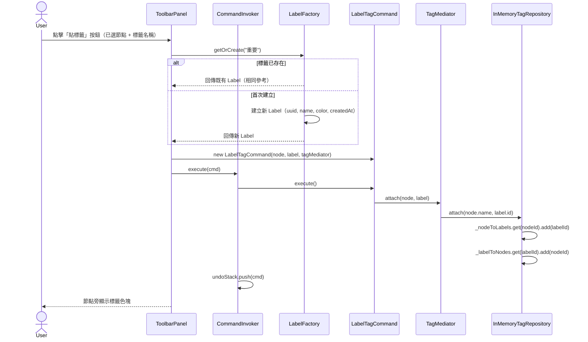
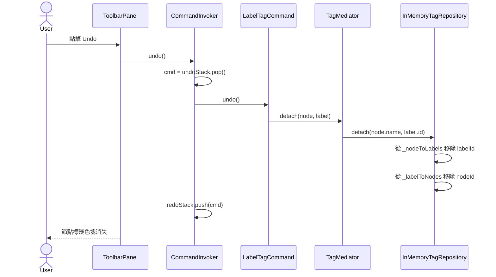

# FRD.md — 007-label-tag-management

> **需求編號**: 007
> **需求簡述**: 標籤管理 — LabelFactory / TagMediator / Command
> **設計日期**: 2026-04-01
> **狀態**: 待審核
> **對應 spec**: [spec.md](./spec.md)

---

## 0. 規範基線（Phase 0）

| 類別     | 規範文件                                | 關鍵約束（本次架構適用）                                                      |
| -------- | --------------------------------------- | ----------------------------------------------------------------------------- |
| 架構     | `standards/clean-architecture.md`       | Domain Layer 禁止引用框架或 Infrastructure；依賴方向由外向內                  |
| 設計模式 | `standards/design-patterns.md`          | Registry/Flyweight（唯一性）、Mediator（多對多集中管理）、Command（可逆操作） |
| SOLID    | `standards/solid-principles.md`         | DIP：TagMediator 依賴 `ITagRepository` 介面而非具體實作                       |
| 語言     | `standards/coding-standard-frontend.md` | TypeScript strict mode、禁用 `any`、完整型別標注                              |

---

## 1. 架構概述

### 1.1 設計模式組合

本功能以三層模式分工：

| 模式                       | 實作類別                                   | 層級                         | 職責                                            |
| -------------------------- | ------------------------------------------ | ---------------------------- | ----------------------------------------------- |
| Registry（Flyweight 變體） | `LabelFactory`                             | Domain                       | 保證相同名稱 Label 共享同一實體（`===` 唯一性） |
| Repository（Port/Adapter） | `ITagRepository` / `InMemoryTagRepository` | Domain Port / Infrastructure | 抽象標籤關係儲存，隔離 in-memory 與未來後端     |
| Mediator                   | `TagMediator`                              | Service（Application）       | 集中管理 Label ↔ FileSystemNode 多對多互動      |
| Command                    | `LabelTagCommand` / `RemoveLabelCommand`   | Service（Application）       | 封裝標籤操作為可逆命令，整合現有 Undo/Redo      |

### 1.2 與現有系統整合點

| 現有元件                   | 整合方式                                              |
| -------------------------- | ----------------------------------------------------- |
| `FileSystemNode` (Domain)  | Command 與 TagMediator 的操作目標（不修改 Node 本身） |
| `ICommand` (Domain Port)   | `LabelTagCommand` / `RemoveLabelCommand` 實作此介面   |
| `CommandInvoker` (Service) | 不修改；直接傳入新 Command 即可使用現有 Undo/Redo     |

---

## 2. C4 Context Diagram



---

## 3. C4 Container Diagram



---

## 4. DDD 建模

### 4.1 Bounded Context



### 4.2 領域模型（Class Diagram）



### 4.3 DDD 元素分類

| 元素                    | 類型                             | 說明                                                                     |
| ----------------------- | -------------------------------- | ------------------------------------------------------------------------ |
| `Label`                 | Value Object（Flyweight）        | 建立後 `Object.freeze()`，嚴格不可變；name 為唯一鍵；id 保留供後端主鍵用 |
| `ITagRepository`        | Domain Port                      | DIP 預留點，不含業務邏輯                                                 |
| `LabelFactory`          | Domain Service（Flyweight Pool） | 維護 Label 共享池，保證唯一性與不可變性，領域不變條件（Invariant）守護者 |
| `TagMediator`           | Application Service              | 跨物件協作（Label ↔ Node），不屬於單一 Aggregate                         |
| `InMemoryTagRepository` | Infrastructure                   | ITagRepository 的 in-memory 實作                                         |
| `LabelTagCommand`       | Application（Command）           | 封裝業務操作，不含持久化邏輯                                             |
| `RemoveLabelCommand`    | Application（Command）           | 同上                                                                     |

**領域不變條件（Invariants）：**

- 相同 `name.trim().toLowerCase()` 的 Label 在同一執行期內必須是同一個物件（由 `LabelFactory` 強制）
- 一個 (nodeId, labelId) 組合在 `ITagRepository` 中最多存在一筆（`attach` 為 idempotent）

---

## 5. ER Diagram（後端資料表預覽）

> 本版本為 in-memory；此 ER 圖為後端整合時的參考設計。



> **注意**：`FILE_SYSTEM_NODES.id` 目前系統中不存在。本版本以 `node.name` 作為代理鍵（nodeId）。
> 後端整合時需同步在 `FileSystemNode` 新增 `id` 欄位。`[架構決策待確認：node.name 作為 nodeId 在同名節點情境下可能衝突，後端整合前需解決]`

---

## 6. Sequence Diagram

### 6.1 貼標籤主流程



### 6.2 Undo 貼標籤



---

## 7. 目錄結構設計

```
file-management-system/src/
├── domain/
│   ├── labels/                          ← 新增（Domain Layer）
│   │   ├── Label.ts                     ← Label 實體
│   │   ├── ITagRepository.ts            ← Port Interface（DIP 預留點）
│   │   ├── LabelFactory.ts              ← Registry Pattern
│   │   └── index.ts
│   └── index.ts                         ← 新增 label exports
│
├── services/
│   ├── TagMediator.ts                   ← 新增（Application Service）
│   ├── repositories/                    ← 新增（Infrastructure）
│   │   ├── InMemoryTagRepository.ts
│   │   └── index.ts
│   └── commands/
│       ├── LabelTagCommand.ts           ← 新增
│       ├── RemoveLabelCommand.ts        ← 新增（P1）
│       └── index.ts                     ← 新增 exports
│
└── components/
    ├── FileTreeView.tsx                 ← 修改：節點旁顯示標籤色塊（read-only）
    └── ToolbarPanel.tsx                 ← 修改：新增「貼標籤」按鈕（P1 UI，暫用 prompt）

tests/
├── domain/
│   └── labels/
│       ├── Label.test.ts
│       └── LabelFactory.test.ts
└── services/
    ├── TagMediator.test.ts
    ├── repositories/
    │   └── InMemoryTagRepository.test.ts
    └── commands/
        ├── LabelTagCommand.test.ts
        └── RemoveLabelCommand.test.ts
```

---

## 8. 架構決策記錄（ADR）

### ADR-001：LabelFactory 使用純 Flyweight Pattern（共享 immutable 實體）

**決策**：Label 物件在建立後透過 `Object.freeze()` 凍結，成為嚴格不可變（immutable）的共享實體。LabelFactory 以模組層級 `const` 輸出單例，內部用 `Map<string, Label>` 維護 Flyweight 池，保證相同名稱只存在唯一物件（`===` 比較為 `true`）。

**情境**：需要保證相同名稱的 Label 在記憶體中共享同一不可變物件。Label 的 `color`、`description` 均為建立時一次性決定，不需要事後修改，因此完全符合純 Flyweight 的不可變前提。

**選項比較**：

| 選項                                 | 優點                             | 缺點                                       |
| ------------------------------------ | -------------------------------- | ------------------------------------------ |
| **純 Flyweight（共享 immutable）✅** | 記憶體最優、物件語意清晰、防誤改 | color/description 建立後不可修改（可接受） |
| Registry（未選）                     | 模組自然隔離、測試時可建立新實例 | Label 並非嚴格 immutable，語意模糊         |
| Singleton class（未選）              | 熟悉的模式                       | 難以測試替換、隱藏依賴                     |

**實作要點**：`LabelFactory.getOrCreate()` 在初次建立 Label 後呼叫 `Object.freeze(label)` 再存入池中；後續取得的永遠是已凍結的同一物件。

**依據規範**：`standards/design-patterns.md` — Flyweight 模式意圖（共享大量細粒度物件）；`standards/solid-principles.md` — SRP（Label 只負責持有不可變狀態）。

---

### ADR-002：TagMediator 依賴 ITagRepository 介面

**決策**：`TagMediator` 建構子注入 `ITagRepository`，預設使用 `InMemoryTagRepository`。

**情境**：spec.md 明確要求「保留設計空間讓未來可以重新整合（後端）」。

**依據規範**：`standards/solid-principles.md` — DIP；`standards/clean-architecture.md` — Port/Adapter 模式隔離基礎設施。

---

### ADR-003：nodeId 使用 node.name 作為代理鍵

**決策**：目前以 `node.name` 作為 nodeId 傳入 `ITagRepository`。

**風險**：同一層目錄下名稱唯一，但跨目錄可能重名。本版本 in-memory 暫接受此限制。

**後端整合前行動**：在 `FileSystemNode` 新增 UUID `id` 欄位，並更新 nodeId 使用方式。

**依據規範**：`[架構決策待確認]`，已標注於 ER Diagram。

---

### ADR-004：LabelTagCommand / RemoveLabelCommand 為對稱設計

**決策**：兩個 Command 互為鏡像（`LabelTag.execute = attach`、`RemoveLabel.execute = detach`），`undo()` 呼叫相反操作。

**理由**：與現有 Command 設計模式完全一致（參照 `DeleteCommand.ts`），降低學習成本。

**依據規範**：`standards/design-patterns.md` — Command Pattern；`standards/solid-principles.md` — OCP（新增操作不修改 `CommandInvoker`）。
