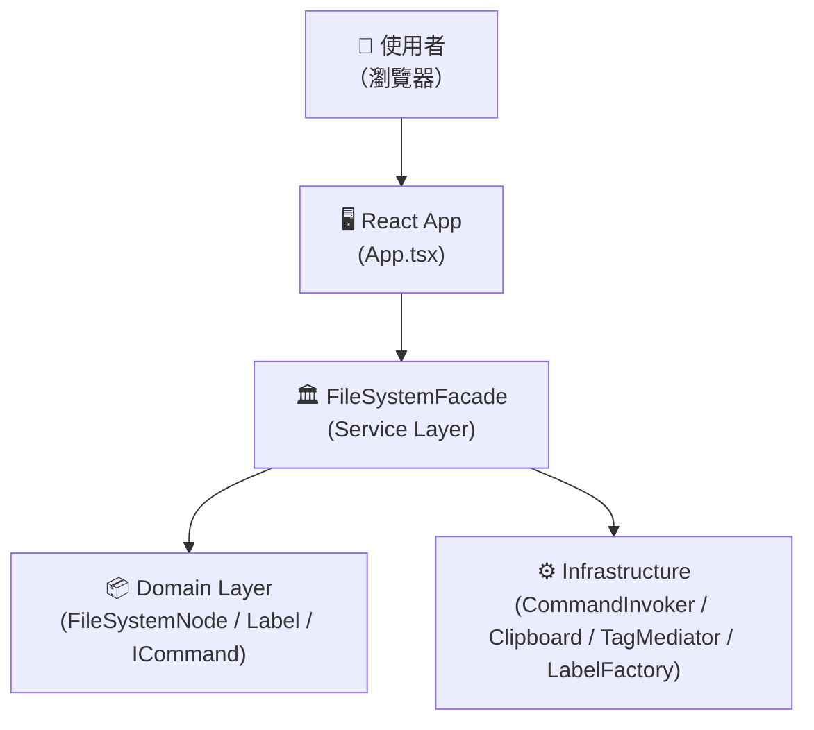
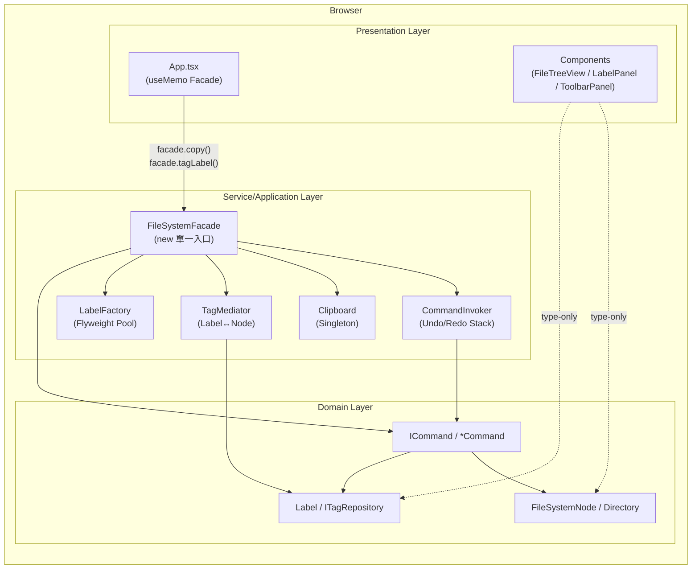
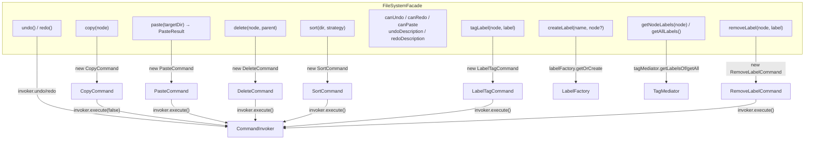
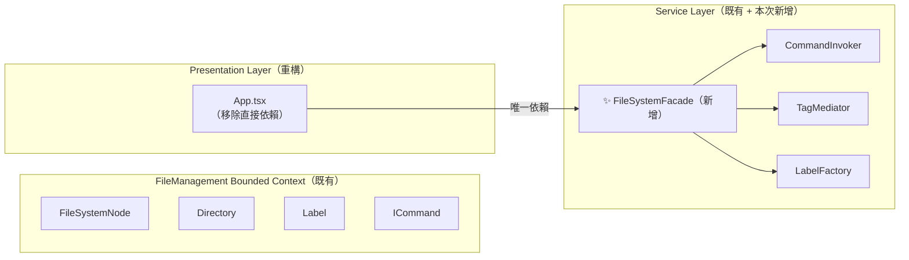
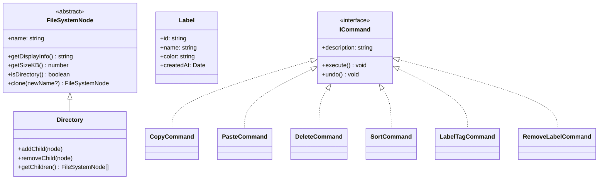
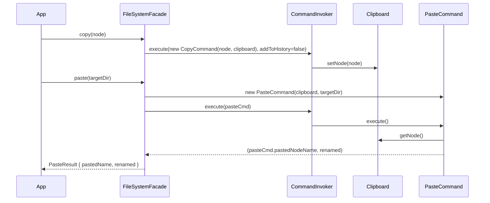
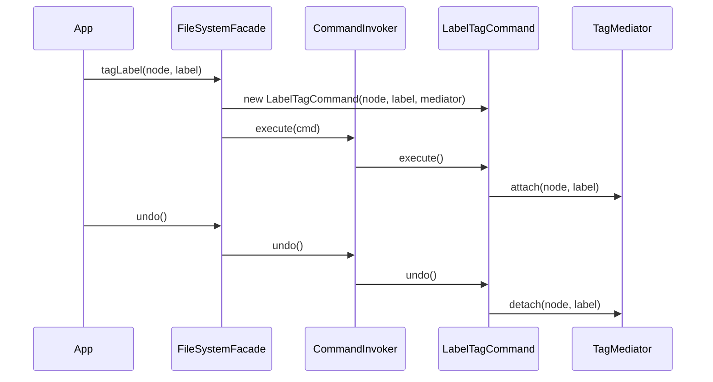
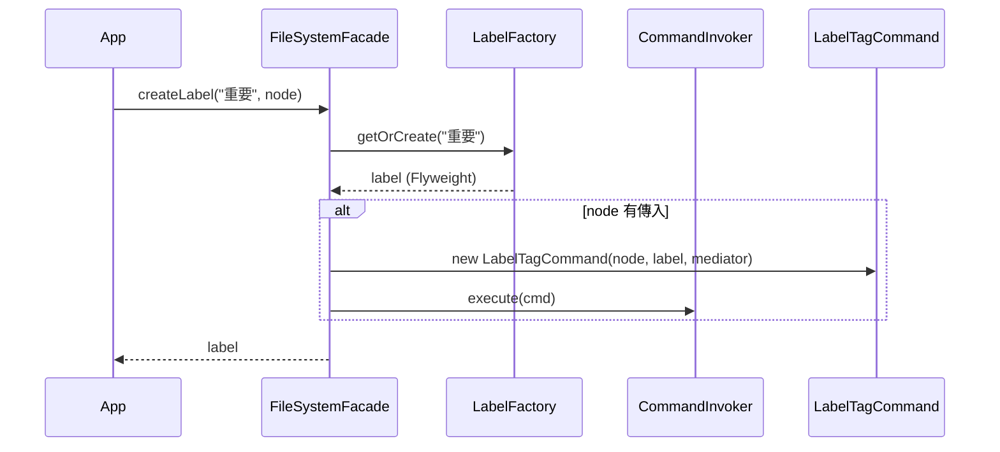

# FRD.md — FileSystemFacade 架構設計文件

> **需求工作區**：`docs/008-filesystem-facade/`
> **對應 spec**：`docs/008-filesystem-facade/spec.md`
> **建立日期**：2026-04-01
> **架構師審核狀態**：待 @dev 執行

---

## 0. 規範基線（Phase 0 載入結果）

| 類別 | 規範文件                                   | 影響本次設計的關鍵約束                                                                         |
| ---- | ------------------------------------------ | ---------------------------------------------------------------------------------------------- |
| 架構 | `standards/clean-architecture.md`          | Facade 屬 Application/Service 層；不得向內依賴 UI (App.tsx)，不得修改 Domain 層                |
| 模式 | `standards/design-patterns.md § 10 Facade` | 封裝子系統複雜協作於一個地方（SRP）；外部只依賴 Facade，不依賴子系統（DIP）                    |
| 原則 | `standards/solid-principles.md`            | Constructor Injection（DIP）；每個方法只做一件事（SRP）；介面穩定，不因子系統變化而改動（OCP） |
| 語言 | `standards/coding-standard-frontend.md`    | TypeScript strict mode；禁止 `any`；export type 優先                                           |

---

## 1. 系統概述

### 1.1 C4 Context Diagram



**核心目標**：App.tsx 只透過 `FileSystemFacade` 操作系統，不直接感知 CommandInvoker / Clipboard / TagMediator / LabelFactory 的存在。

---

### 1.2 C4 Container Diagram



---

### 1.3 C4 Component Diagram（Service Layer 展開）



---

## 2. 領域建模（DDD）

### 2.1 Bounded Context

本需求不新增 Bounded Context，僅在現有 `FileManagement BC` 中加入 Facade：



### 2.2 Domain Model（無異動，供參考）



---

## 3. 架構設計

### 3.1 目錄結構（新增 / 修改範圍）

```
file-management-system/src/
├── services/
│   ├── FileSystemFacade.ts          ✨ 新增 — Facade 主體
│   ├── CommandInvoker.ts            ✅ 不動
│   ├── TagMediator.ts               ✅ 不動
│   ├── commands/                    ✅ 不動
│   ├── repositories/                ✅ 不動
│   └── ...
├── App.tsx                          🔧 重構 — 移除 8+ 個 Command/Pattern import
└── ...

file-management-system/tests/
└── services/
    └── FileSystemFacade.test.ts     ✨ 新增 — 單元測試
```

### 3.2 FileSystemFacade 完整 API 設計

```typescript
// src/services/FileSystemFacade.ts

import type { FileSystemNode } from "../domain/FileSystemNode";
import type { Directory } from "../domain/Directory";
import type { ISortStrategy } from "../domain/strategies/ISortStrategy";
import type { Label } from "../domain/labels/Label";

/** paste() 回傳型別，供 App.tsx 記錄 log */
export type PasteResult = {
  pastedName: string;
  renamed: boolean;
};

export class FileSystemFacade {
  constructor(
    private readonly _invoker: CommandInvoker = new CommandInvoker(),
    private readonly _clipboard: Clipboard = Clipboard.getInstance(),
    private readonly _mediator: TagMediator = tagMediator,
    private readonly _factory: LabelFactory = labelFactory,
  ) {}

  // ── File CRUD ──────────────────────────────────────────────────
  copy(node: FileSystemNode): void;
  paste(targetDir: Directory): PasteResult;
  delete(node: FileSystemNode, parent: Directory): void;
  sort(dir: Directory, strategy: ISortStrategy): void;

  // ── Undo / Redo ────────────────────────────────────────────────
  undo(): void;
  redo(): void;
  get canUndo(): boolean;
  get canRedo(): boolean;
  get undoDescription(): string | undefined;
  get redoDescription(): string | undefined;
  canPaste(selectedNode: FileSystemNode | null): boolean;

  // ── Label / Tag ────────────────────────────────────────────────
  tagLabel(node: FileSystemNode, label: Label): void;
  removeLabel(node: FileSystemNode, label: Label): void;
  createLabel(name: string, node?: FileSystemNode): Label;
  getNodeLabels(node: FileSystemNode): Label[];
  getAllLabels(): readonly Label[];
}
```

> **設計原則**：
>
> - `copy()` 呼叫 `invoker.execute(cmd, false)`（不加歷程，與現行 App.tsx 一致）
> - `paste()` 回傳 `PasteResult`，讓 App.tsx 只用基本型別決定 log 訊息
> - `canPaste(selectedNode)` 封裝「clipboard.hasNode() && selectedNode?.isDirectory()」邏輯
> - 所有 Label 操作透過 `invoker.execute()` 進入 undo 歷程

---

## 4. Sequence Diagrams（核心流程）

### 4.1 Copy → Paste 流程



### 4.2 TagLabel → Undo 流程



### 4.3 CreateLabel（含自動貼標）流程



---

## 5. ADR（架構決策記錄）

### ADR-001：FileSystemFacade 作為純 TypeScript Service Class

| 欄位         | 內容                                                                                                                           |
| ------------ | ------------------------------------------------------------------------------------------------------------------------------ |
| **決策**     | `FileSystemFacade` 為純 TypeScript 類別，不包含任何 React Hook 或 React import                                                 |
| **理由**     | 1. 純 TS 類別可在 Vitest 中直接 `new` 並測試，無需 jsdom / TestBed；2. 符合 Clean Architecture 的 Service 層不依賴 UI 框架原則 |
| **替代方案** | React Hook（`useFileSystemFacade`）—— 捨棄，因 Hook 耦合 React 生命週期，難以在非 React 環境重用                               |
| **依據規範** | `standards/clean-architecture.md`（Service 層不依賴 UI 框架）；`standards/design-patterns.md § 10`（Facade 為純邏輯封裝）      |
| **影響**     | App.tsx 中 `treeVersion` / `labelVersion` 仍自行 `setState`，Facade 不管 React 狀態                                            |

---

### ADR-002：Constructor Injection（所有依賴可覆寫）

| 欄位         | 內容                                                                                                                      |
| ------------ | ------------------------------------------------------------------------------------------------------------------------- |
| **決策**     | `FileSystemFacade` 建構子接受 4 個可選參數（CommandInvoker / Clipboard / TagMediator / LabelFactory），預設值指向模組單例 |
| **理由**     | 測試時可傳入 mock/spy 物件，不依賴模組層級單例；符合 DIP                                                                  |
| **替代方案** | 直接使用模組單例 —— 捨棄，因測試將產生狀態汙染                                                                            |
| **依據規範** | `standards/solid-principles.md § DIP`（依賴抽象，由外部注入）                                                             |
| **影響**     | App.tsx 以 `useMemo(() => new FileSystemFacade(), [])` 持有，保留模組預設依賴                                             |

---

### ADR-003：PasteResult 型別在 Facade 層定義並 export

| 欄位         | 內容                                                                                                                     |
| ------------ | ------------------------------------------------------------------------------------------------------------------------ |
| **決策**     | 定義 `export type PasteResult = { pastedName: string; renamed: boolean }` 於 `FileSystemFacade.ts`                       |
| **理由**     | App.tsx 需要 pastedName / renamed 來組 log 訊息；若直接暴露 PasteCommand 實例，違反「App 不依賴 Command 類別」的設計目標 |
| **替代方案** | 讓 App.tsx 讀取 PasteCommand 的 public property —— 捨棄，違反 Facade 封裝原則                                            |
| **依據規範** | `standards/solid-principles.md § SRP`（Facade 負責型別邊界，App 只拿需要的資料）                                         |

---

### ADR-004：copy() 不加入 Undo 歷程

| 欄位         | 內容                                                                    |
| ------------ | ----------------------------------------------------------------------- |
| **決策**     | `facade.copy(node)` 內部呼叫 `invoker.execute(cmd, addToHistory=false)` |
| **理由**     | 與現行 App.tsx 相同行為；複製不改變檔案系統結構，回溯無實質意義         |
| **替代方案** | 加入歷程 —— 捨棄，保持行為一致                                          |
| **依據規範** | 維持與現行 `CommandInvoker.execute(cmd, false)` 語意相符                |

---

## 6. 影響評估

### 6.1 App.tsx 重構範圍

| 移除的 import                                                                 | 替換為                                                           |
| ----------------------------------------------------------------------------- | ---------------------------------------------------------------- |
| `import { CommandInvoker } from "./services/CommandInvoker"`                  | 移除                                                             |
| `import { Clipboard } from "./domain/Clipboard"`                              | 移除                                                             |
| `import { CopyCommand } from "./services/commands/CopyCommand"`               | 移除                                                             |
| `import { PasteCommand } from "./services/commands/PasteCommand"`             | 移除                                                             |
| `import { DeleteCommand } from "./services/commands/DeleteCommand"`           | 移除                                                             |
| `import { SortCommand } from "./services/commands/SortCommand"`               | 移除                                                             |
| `import { LabelTagCommand } from "./services/commands/LabelTagCommand"`       | 移除                                                             |
| `import { RemoveLabelCommand } from "./services/commands/RemoveLabelCommand"` | 移除                                                             |
| `import { tagMediator } from "./services/TagMediator"`                        | 移除                                                             |
| `import { labelFactory } from "./domain/labels/LabelFactory"`                 | 移除                                                             |
| _(新增)_                                                                      | `import { FileSystemFacade } from "./services/FileSystemFacade"` |
| _(新增)_                                                                      | `import type { PasteResult } from "./services/FileSystemFacade"` |

**保留的 import（type-only domain）：**

- `import type { FileSystemNode } from "./domain/FileSystemNode"` — 保留（型別）
- `import type { Directory } from "./domain/Directory"` — 保留（型別）
- `import type { Label } from "./domain/labels/Label"` — 保留（型別）
- `import type { ISortStrategy } from "./domain/strategies/ISortStrategy"` — 保留（型別）

### 6.2 不受影響的範圍

- Domain 層所有檔案（無任何修改）
- 所有 `*Command.ts` 檔案（無修改）
- `tagMediator.ts` / `LabelFactory.ts` / `CommandInvoker.ts`（無修改）
- 匯出功能（exportToXml / JSON / Markdown）
- 搜尋功能（performSearch / buildMatchedPathsWithProgress）
- Observer / Dashboard / Log 邏輯
- 所有現有測試（305 tests）

---

## 7. 品質自檢

- [x] Bounded Context 已識別（僅在現有 FileManagement BC 新增 Facade）
- [x] C4 三層圖表完整（Context / Container / Component）
- [x] 核心業務流程有 Sequence Diagram（Copy-Paste / TagLabel-Undo / CreateLabel）
- [x] Clean Architecture 依賴方向正確（Presentation → Service → Domain，無反向）
- [x] 所有設計決策符合 Phase 0 規範約束（每個 ADR 有「依據規範」欄位）
- [x] In Scope / Out of Scope 明確（移除範圍與保留範圍均已列出）
- [x] 無 UI / 版面需求（Facade 不涉及 UI 變動）
