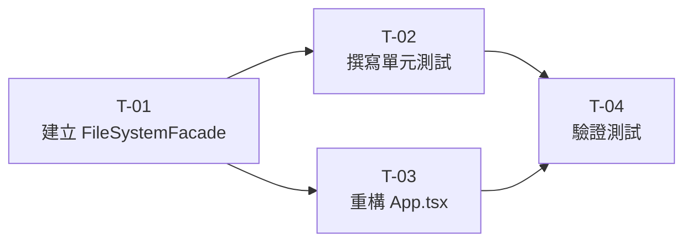

# plan.md — FileSystemFacade 執行計畫

> **需求工作區**：`docs/008-filesystem-facade/`
> **對應設計文件**：[FRD.md](./FRD.md)
> **建立日期**：2026-04-01

---

## Task Breakdown

### T-01：建立 PasteResult 型別與 FileSystemFacade 主體

| 欄位            | 內容                                                                                                                                                                                                                                                                                                                                                                                                                                                                                                                                                                                                                                                                                                                                                                                                                                                                                                                                                                                                                                                                                                                                                                                                                                                                                |
| --------------- | ----------------------------------------------------------------------------------------------------------------------------------------------------------------------------------------------------------------------------------------------------------------------------------------------------------------------------------------------------------------------------------------------------------------------------------------------------------------------------------------------------------------------------------------------------------------------------------------------------------------------------------------------------------------------------------------------------------------------------------------------------------------------------------------------------------------------------------------------------------------------------------------------------------------------------------------------------------------------------------------------------------------------------------------------------------------------------------------------------------------------------------------------------------------------------------------------------------------------------------------------------------------------------------- |
| **名稱**        | 建立 `FileSystemFacade` Service Class 與 `PasteResult` 型別                                                                                                                                                                                                                                                                                                                                                                                                                                                                                                                                                                                                                                                                                                                                                                                                                                                                                                                                                                                                                                                                                                                                                                                                                         |
| **架構層**      | Service / Application Layer                                                                                                                                                                                                                                                                                                                                                                                                                                                                                                                                                                                                                                                                                                                                                                                                                                                                                                                                                                                                                                                                                                                                                                                                                                                         |
| **檔案**        | `src/services/FileSystemFacade.ts`（新增）                                                                                                                                                                                                                                                                                                                                                                                                                                                                                                                                                                                                                                                                                                                                                                                                                                                                                                                                                                                                                                                                                                                                                                                                                                          |
| **詳細描述**    | 1. 於 `src/services/FileSystemFacade.ts` 新增 `export type PasteResult = { pastedName: string; renamed: boolean }` 2. 建立 `FileSystemFacade` class，建構子接受 4 個可選依賴（型別定義見 FRD.md § 3.2）：`_invoker`, `_clipboard`, `_mediator`, `_factory`；預設值分別為 `new CommandInvoker()`、`Clipboard.getInstance()`、`tagMediator`（模組單例）、`labelFactory`（模組單例） 3. 實作 **File CRUD 方法**：`copy(node)` → `invoker.execute(new CopyCommand(...), false)`；`paste(targetDir)` → `invoker.execute(new PasteCommand(...))` 並回傳 `PasteResult`；`delete(node, parent)` → `invoker.execute(new DeleteCommand(...))`；`sort(dir, strategy)` → `invoker.execute(new SortCommand(dir, strategy, snapshot))`（snapshot 需先抓 `dir.getChildren()`） 4. 實作 **Undo/Redo 屬性與方法**：`undo()`, `redo()`, `canUndo`, `canRedo`, `undoDescription`（`string \| undefined`，注意 CommandInvoker 回傳 `string \| null`，需轉換）、`redoDescription`、`canPaste(selectedNode: FileSystemNode \| null): boolean` 5. 實作 **Label 方法**：`tagLabel(node, label)`, `removeLabel(node, label)`, `createLabel(name, node?)`, `getNodeLabels(node)`, `getAllLabels()` 6. 底部加上 `export const fileSystemFacade = new FileSystemFacade()` 模組單例（供跨頁使用） |
| **配置/設定檔** | 無                                                                                                                                                                                                                                                                                                                                                                                                                                                                                                                                                                                                                                                                                                                                                                                                                                                                                                                                                                                                                                                                                                                                                                                                                                                                                  |
| **複雜度**      | 中                                                                                                                                                                                                                                                                                                                                                                                                                                                                                                                                                                                                                                                                                                                                                                                                                                                                                                                                                                                                                                                                                                                                                                                                                                                                                  |
| **前置依賴**    | 無（所有依賴類別已存在）                                                                                                                                                                                                                                                                                                                                                                                                                                                                                                                                                                                                                                                                                                                                                                                                                                                                                                                                                                                                                                                                                                                                                                                                                                                            |

---

### T-02：撰寫 FileSystemFacade 單元測試

| 欄位            | 內容                                                                                                                                                                                                                                                                                                                                                                                                                                                                                                                                                                                                                                                                                                                                                                                                                                                                                                                                                                                                                                                                                                                                                                                                                                                                                                                                                                                                                               |
| --------------- | ---------------------------------------------------------------------------------------------------------------------------------------------------------------------------------------------------------------------------------------------------------------------------------------------------------------------------------------------------------------------------------------------------------------------------------------------------------------------------------------------------------------------------------------------------------------------------------------------------------------------------------------------------------------------------------------------------------------------------------------------------------------------------------------------------------------------------------------------------------------------------------------------------------------------------------------------------------------------------------------------------------------------------------------------------------------------------------------------------------------------------------------------------------------------------------------------------------------------------------------------------------------------------------------------------------------------------------------------------------------------------------------------------------------------------------- |
| **名稱**        | 撰寫 `FileSystemFacade.test.ts` 完整單元測試                                                                                                                                                                                                                                                                                                                                                                                                                                                                                                                                                                                                                                                                                                                                                                                                                                                                                                                                                                                                                                                                                                                                                                                                                                                                                                                                                                                       |
| **架構層**      | Test                                                                                                                                                                                                                                                                                                                                                                                                                                                                                                                                                                                                                                                                                                                                                                                                                                                                                                                                                                                                                                                                                                                                                                                                                                                                                                                                                                                                                               |
| **檔案**        | `tests/services/FileSystemFacade.test.ts`（新增）                                                                                                                                                                                                                                                                                                                                                                                                                                                                                                                                                                                                                                                                                                                                                                                                                                                                                                                                                                                                                                                                                                                                                                                                                                                                                                                                                                                  |
| **詳細描述**    | 每個 test 用 `new FileSystemFacade(invoker, clipboard, mockMediator, mockFactory)` 建立隔離實例（Constructor Injection，不依賴模組單例）  **File CRUD 測試：** - `copy(node)` 應讓 `clipboard.hasNode()` 為 true，且不加入 undo 歷程（`canUndo = false`） - `paste(targetDir)` 應回傳 `{ pastedName, renamed }`、`canUndo = true` - `paste(targetDir)` 同名節點時 `renamed = true`，pastedName 含「複製」 - `delete(node, parent)` 後節點消失於目錄、`canUndo = true` - `sort(dir, strategy)` 後子節點順序改變、`canUndo = true`  **Undo/Redo 測試：** - `paste` 後 `undo()` 應還原（節點消失） - `delete` 後 `undo()` 應還原（節點出現） - `undo()` 後 `redo()` 應重做 - `canUndo / canRedo` 狀態正確 - `undoDescription / redoDescription` 回傳 `string \| undefined`（不回傳 `null`） - `canPaste(dir)` = true 當 clipboard 有節點且 selectedNode 為 Directory - `canPaste(file)` = false 當 selectedNode 為 File - `canPaste(null)` = false  **Label 測試：** - `tagLabel(node, label)` 後 `getNodeLabels(node)` 包含該 label，`canUndo = true` - `removeLabel(node, label)` 後 `getNodeLabels(node)` 不含該 label，`canUndo = true` - `createLabel("新標籤")` 回傳 Label，`getAllLabels()` 長度 +1 - `createLabel("新標籤", node)` 同上且 `getNodeLabels(node)` 包含新標籤、`canUndo = true` - `undo()` 可還原 tagLabel（`getNodeLabels(node)` 為空） |
| **配置/設定檔** | 無                                                                                                                                                                                                                                                                                                                                                                                                                                                                                                                                                                                                                                                                                                                                                                                                                                                                                                                                                                                                                                                                                                                                                                                                                                                                                                                                                                                                                                 |
| **複雜度**      | 中                                                                                                                                                                                                                                                                                                                                                                                                                                                                                                                                                                                                                                                                                                                                                                                                                                                                                                                                                                                                                                                                                                                                                                                                                                                                                                                                                                                                                                 |
| **前置依賴**    | T-01                                                                                                                                                                                                                                                                                                                                                                                                                                                                                                                                                                                                                                                                                                                                                                                                                                                                                                                                                                                                                                                                                                                                                                                                                                                                                                                                                                                                                               |

---

### T-03：重構 App.tsx — 以 Facade 取代直接依賴

| 欄位            | 內容                                                                                                                                                                                                                                                                                                                                                                                                                                                                                                                                                                                                                                                                                                                                                                                                                                                                                                                                                                                                                                                                                                                                                                                                                                                                                                                                                                                                                             |
| --------------- | -------------------------------------------------------------------------------------------------------------------------------------------------------------------------------------------------------------------------------------------------------------------------------------------------------------------------------------------------------------------------------------------------------------------------------------------------------------------------------------------------------------------------------------------------------------------------------------------------------------------------------------------------------------------------------------------------------------------------------------------------------------------------------------------------------------------------------------------------------------------------------------------------------------------------------------------------------------------------------------------------------------------------------------------------------------------------------------------------------------------------------------------------------------------------------------------------------------------------------------------------------------------------------------------------------------------------------------------------------------------------------------------------------------------------------- | ------------------------ | --------------------------------------------------------------------------------------------------------------------------------------------------------------------------------------------------------------------------------------------------------------------------------------------------------------------------------------------------------------------------------------------------------------------------------------------------------- |
| **名稱**        | 重構 `App.tsx`，移除所有 Command / Pattern 直接 import                                                                                                                                                                                                                                                                                                                                                                                                                                                                                                                                                                                                                                                                                                                                                                                                                                                                                                                                                                                                                                                                                                                                                                                                                                                                                                                                                                           |
| **架構層**      | Presentation Layer                                                                                                                                                                                                                                                                                                                                                                                                                                                                                                                                                                                                                                                                                                                                                                                                                                                                                                                                                                                                                                                                                                                                                                                                                                                                                                                                                                                                               |
| **檔案**        | `src/App.tsx`（修改）                                                                                                                                                                                                                                                                                                                                                                                                                                                                                                                                                                                                                                                                                                                                                                                                                                                                                                                                                                                                                                                                                                                                                                                                                                                                                                                                                                                                            |
| **詳細描述**    | **移除的 import（10 行）：** `CommandInvoker`, `Clipboard`, `CopyCommand`, `PasteCommand`, `DeleteCommand`, `SortCommand`, `LabelTagCommand`, `RemoveLabelCommand`, `tagMediator`, `labelFactory`  **新增的 import（2 行）：** `import { FileSystemFacade } from "./services/FileSystemFacade"` `import type { PasteResult } from "./services/FileSystemFacade"`（若 App 需要型別標注）  **保留的 import（type-only）：** `FileSystemNode`, `Directory`, `Label`, `ISortStrategy` 型別 import 均保留  **重構 useMemo：** - 移除 `useMemo(() => new CommandInvoker(), [])` - 移除 `useMemo(() => Clipboard.getInstance(), [])` - 新增 `const facade = useMemo(() => new FileSystemFacade(), [])`  **重構 canUndo / canRedo / canPaste 計算：** - `const canUndo = treeVersion >= 0 && facade.canUndo` - `const canRedo = treeVersion >= 0 && facade.canRedo` - `const canPaste = treeVersion >= 0 && facade.canPaste(selectedNode)`  **重構 handlers（6 個）：** - `handleCopy` → `facade.copy(selectedNode)` - `handlePaste` → `const result = facade.paste(selectedNode as Directory)`，用 `result.pastedName` / `result.renamed` 組 log - `handleDelete` → `facade.delete(selectedNode, selectedParent)` - `handleSort` → `facade.sort(dir, strategy)` - `handleUndo` → `facade.undo()`；log 訊息改從 `facade.undoDescription` 取（注意現為 `string | undefined`，舊為 `string | null`，需處理 falsy 判斷） - `handleRedo`→`facade.redo()`；同上  **重構 Label handlers（4 個）：** - `handleTagLabel`→`facade.tagLabel(node, label)` - `handleRemoveLabel`→`facade.removeLabel(node, label)` - `handleCreateLabel`→`facade.createLabel(name, selectedNode ?? undefined)` - `getNodeLabels`callback →`(node) => facade.getNodeLabels(node)` - `allLabels`useMemo →`facade.getAllLabels()`（labelVersion 仍為依賴） |
| **配置/設定檔** | 無                                                                                                                                                                                                                                                                                                                                                                                                                                                                                                                                                                                                                                                                                                                                                                                                                                                                                                                                                                                                                                                                                                                                                                                                                                                                                                                                                                                                                               |
| **複雜度**      | 中                                                                                                                                                                                                                                                                                                                                                                                                                                                                                                                                                                                                                                                                                                                                                                                                                                                                                                                                                                                                                                                                                                                                                                                                                                                                                                                                                                                                                               |
| **前置依賴**    | T-01                                                                                                                                                                                                                                                                                                                                                                                                                                                                                                                                                                                                                                                                                                                                                                                                                                                                                                                                                                                                                                                                                                                                                                                                                                                                                                                                                                                                                             |

---

### T-04：驗證測試全數通過

| 欄位            | 內容                                                                                                                                                                                                                         |
| --------------- | ---------------------------------------------------------------------------------------------------------------------------------------------------------------------------------------------------------------------------- |
| **名稱**        | 執行 `npm run test`，確認 305 + 新增測試全數通過                                                                                                                                                                             |
| **架構層**      | Test                                                                                                                                                                                                                         |
| **詳細描述**    | 1. 執行 `npm run test`（vitest run） 2. 確認所有既有 305 tests 仍通過（無回歸） 3. 確認 T-02 新增的 FileSystemFacade.test.ts 所有 cases 通過 4. 確認 App.tsx 中 Command / Pattern 直接 import 行數為 0（grep 驗證） |
| **配置/設定檔** | 無                                                                                                                                                                                                                           |
| **複雜度**      | 低                                                                                                                                                                                                                           |
| **前置依賴**    | T-01、T-02、T-03                                                                                                                                                                                                             |

---

## 依賴關係圖

---

## 測試策略

| 層級        | 工具   | 策略                                                                                                                             |
| ----------- | ------ | -------------------------------------------------------------------------------------------------------------------------------- |
| Unit        | Vitest | `new FileSystemFacade(mockInvoker, mockClipboard, mockMediator, mockFactory)` — 依賴清潔隔離                                     |
| Integration | Vitest | 使用真實 CommandInvoker + 真實 Clipboard（`Clipboard._resetForTest()`）+ 真實 TagMediator/LabelFactory（獨立 new）確認流程端到端 |
| Regression  | Vitest | `npm run test` — 305 既有 tests 不得回歸                                                                                         |

---

## 部署

本需求為純前端重構，無新增後端資源或 CI/CD 變更需求：

- 本機開發：`npm run dev`（Vite HMR）
- 測試驗證：`npm run test`（vitest run）
- 無需修改 `vite.config.ts`、`package.json`、`tsconfig.json`
