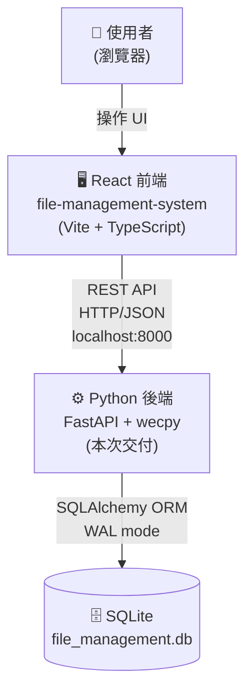
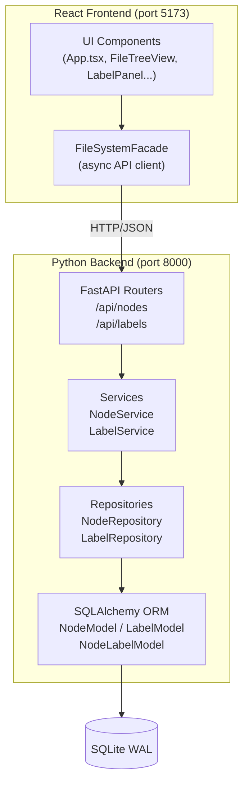
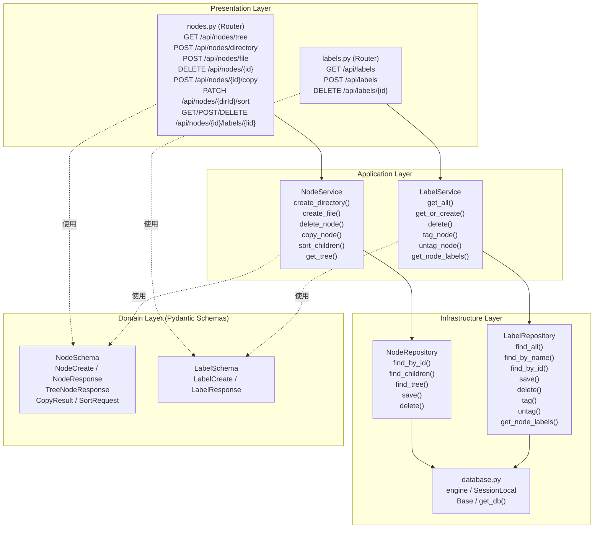
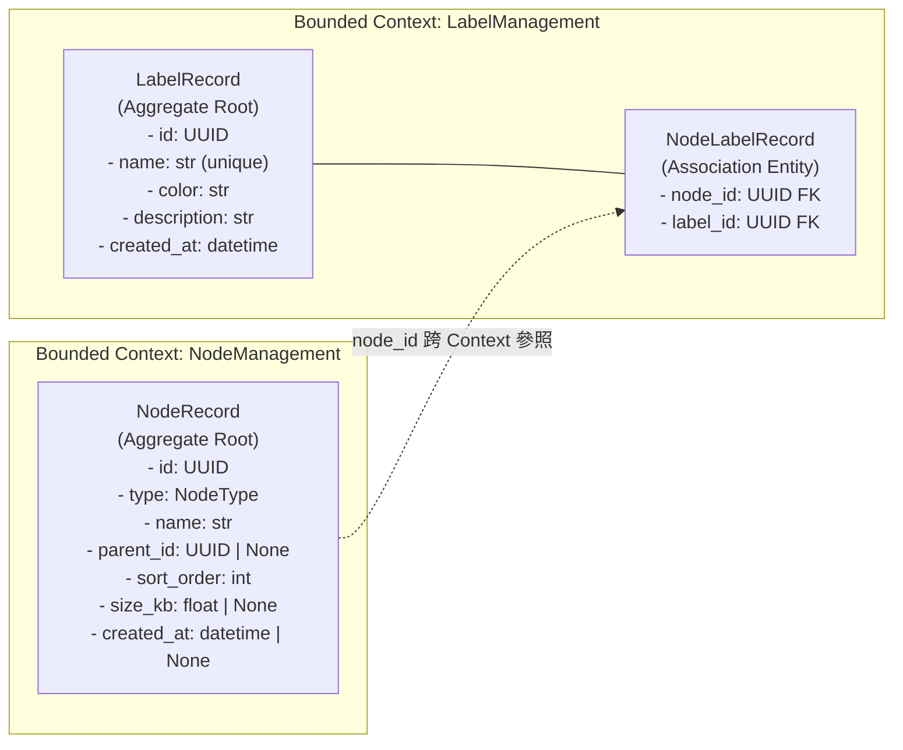
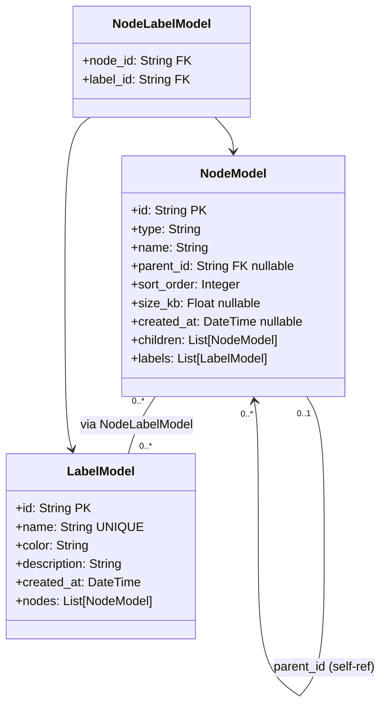
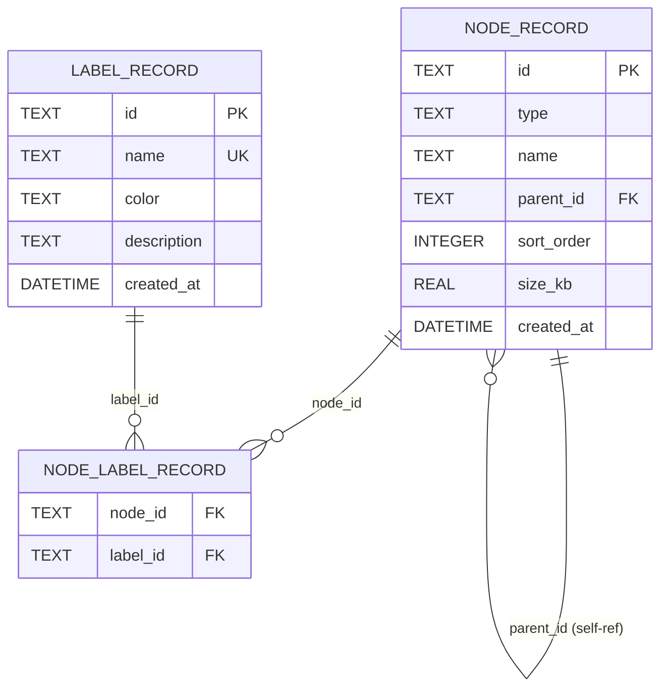
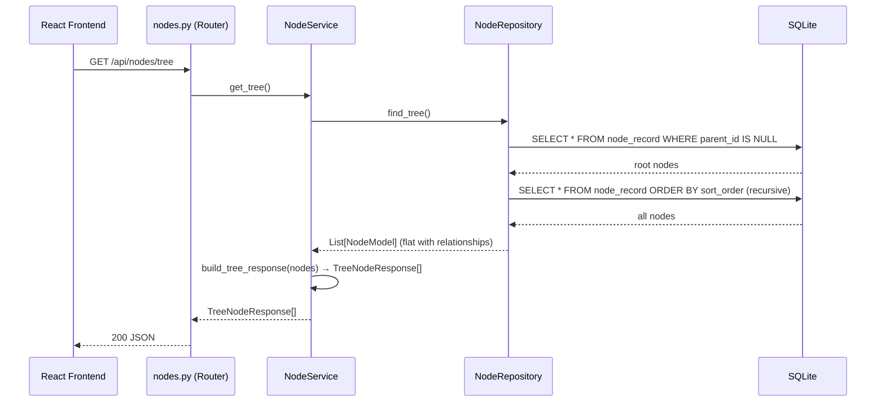
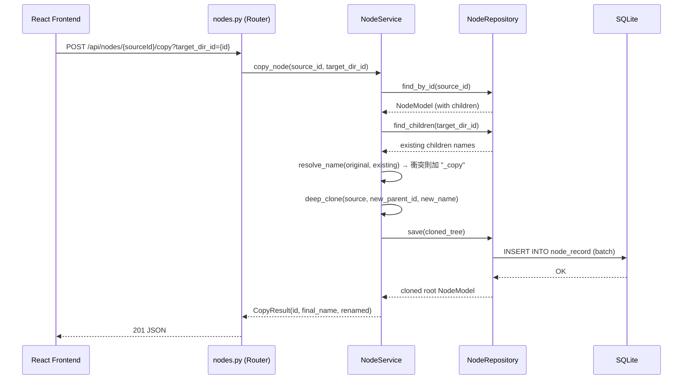
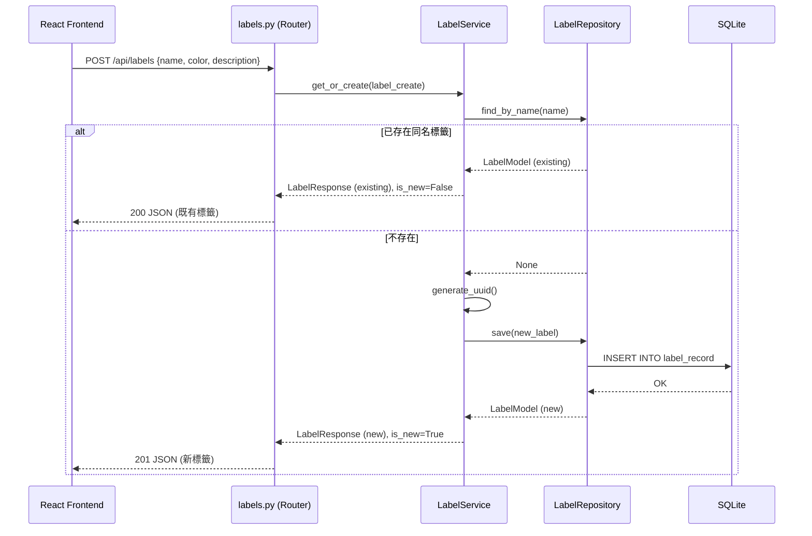

# 功能需求設計書（FRD）— 檔案管理系統後端 API

| 欄位         | 內容                                              |
| ------------ | ------------------------------------------------- |
| 專案名稱     | 檔案管理系統後端 API                              |
| 版本號       | v1.0.0                                            |
| 對應 spec    | [spec.md](./spec.md)                              |
| 負責人       | Copilot @architect                                |
| 建立日期     | 2026-04-01                                        |
| 審核狀態     | [x] 待審核 &ensp; [ ] 已通過 &ensp; [ ] 需修改   |

---

## 1. 規範基線（Phase 0 載入）

| 類別     | 規範文件                              | 關鍵約束                                                                 |
| -------- | ------------------------------------- | ------------------------------------------------------------------------ |
| 架構     | `standards/clean-architecture.md`     | Router → Service → Repository → ORM；Domain 不依賴任何外層框架           |
| 設計模式 | `standards/design-patterns.md`        | Repository Pattern（資料存取抽象）；Facade Pattern（前端整合層）          |
| DDD      | `standards/ddd-guidelines.md`         | Bounded Context：NodeManagement / LabelManagement                        |
| Python   | `standards/coding-standard-python.md` | snake_case 全域、Type Hints 必填、雙引號、SQLAlchemy ORM 參數化查詢       |
| wecpy    | `frameworks/wec-py/contributing.md`   | ConfigManager 連續兩行強制初始化；LogManager 取代 print；PROD/PILOT 目錄 |

---

## 2. 架構概述

本系統採 **Clean Architecture 四層分離**：

```
┌─────────────────────────────────────────────────────────────┐
│  Presentation Layer  ─ FastAPI Router（API 端點定義）         │
├─────────────────────────────────────────────────────────────┤
│  Application Layer   ─ Service（業務邏輯、用例協調）           │
├─────────────────────────────────────────────────────────────┤
│  Infrastructure Layer ─ Repository（SQLAlchemy ORM 封裝）     │
├─────────────────────────────────────────────────────────────┤
│  Domain Layer        ─ Pydantic Schema（值物件、資料合約）     │
└─────────────────────────────────────────────────────────────┘
```

**重要原則：**
- 所有依賴方向由外向內（Presentation → Application → Infrastructure → Domain）
- Domain Schema（Pydantic）不引用 SQLAlchemy；ORM Model 不引用 Pydantic
- Service 透過 Repository 介面（抽象類別）存取資料，不直接操作 ORM Session
- `main.py` 僅負責 App 組裝（DI 連接），不含業務邏輯

---

## 3. C4 架構圖

### 3.1 Context Diagram（系統邊界）



### 3.2 Container Diagram（容器視圖）



### 3.3 Component Diagram（後端元件層次）



---

## 4. Domain 建模（DDD）

### 4.1 Bounded Context



### 4.2 領域模型（ORM）



### 4.3 NodeType 枚舉

```python
class NodeType(str, Enum):
    DIRECTORY = "directory"
    TEXT_FILE = "text_file"
    WORD_DOCUMENT = "word_document"
    IMAGE_FILE = "image_file"
```

**不變條件（Invariants）：**
- `DIRECTORY` 型別：`size_kb = None`，`created_at = None`
- `TEXT_FILE / WORD_DOCUMENT / IMAGE_FILE`：`size_kb > 0`，`created_at` 不可為 None
- `name` 不可為空字串，長度 ≤ 255
- `sort_order` 在同一父節點下唯一且連續

---

## 5. ER Diagram



---

## 6. API 設計

### 6.1 統一回應格式

**成功回應**：直接回傳資料物件或陣列

**錯誤回應**：
```json
{
  "error": "Node not found",
  "code": "NODE_NOT_FOUND"
}
```

**錯誤碼清單：**

| HTTP | code | 說明 |
|------|------|------|
| 400 | `INVALID_INPUT` | Pydantic 驗證失敗 |
| 400 | `INVALID_NODE_TYPE` | 不支援的節點型別 |
| 400 | `INVALID_SORT_STRATEGY` | 不支援的排序策略 |
| 404 | `NODE_NOT_FOUND` | 節點不存在 |
| 404 | `LABEL_NOT_FOUND` | 標籤不存在 |
| 404 | `PARENT_NOT_FOUND` | 父目錄不存在 |
| 409 | `LABEL_DUPLICATE` | 同名標籤（回傳現有，非錯誤） |
| 500 | `INTERNAL_ERROR` | 未預期的伺服器錯誤 |

### 6.2 Nodes API

| Method | Path | Request Body / Query | Response | HTTP |
|--------|------|----------------------|----------|------|
| GET | `/api/nodes/tree` | — | `TreeNodeResponse[]` | 200 |
| POST | `/api/nodes/directory` | `DirectoryCreate` | `NodeResponse` | 201 |
| POST | `/api/nodes/file` | `FileCreate` | `NodeResponse` | 201 |
| DELETE | `/api/nodes/{id}` | — | — | 204 / 404 |
| POST | `/api/nodes/{id}/copy` | `?target_dir_id=` | `CopyResult` | 201 |
| PATCH | `/api/nodes/{dir_id}/sort` | `SortRequest` | `NodeResponse[]` | 200 |
| GET | `/api/nodes/{id}/labels` | — | `LabelResponse[]` | 200 |
| POST | `/api/nodes/{node_id}/labels/{label_id}` | — | — | 201 / 200 |
| DELETE | `/api/nodes/{node_id}/labels/{label_id}` | — | — | 204 |

### 6.3 Labels API

| Method | Path | Request Body | Response | HTTP |
|--------|------|--------------|----------|------|
| GET | `/api/labels` | — | `LabelResponse[]` | 200 |
| POST | `/api/labels` | `LabelCreate` | `LabelResponse` | 201 / 200（同名） |
| DELETE | `/api/labels/{id}` | — | — | 204 / 404 |

### 6.4 Pydantic Schema 清單

```python
# Node Schemas
class DirectoryCreate(BaseModel):
    name: str           # max_length=255
    parent_id: str | None = None

class FileCreate(BaseModel):
    name: str           # max_length=255
    type: NodeType      # text_file / word_document / image_file
    parent_id: str | None = None
    size_kb: float      # > 0
    created_at: datetime | None = None

class NodeResponse(BaseModel):
    id: str
    type: NodeType
    name: str
    parent_id: str | None
    sort_order: int
    size_kb: float | None
    created_at: datetime | None

class TreeNodeResponse(BaseModel):
    id: str
    type: NodeType
    name: str
    size_kb: float | None
    created_at: datetime | None
    children: list["TreeNodeResponse"] = []

class CopyResult(BaseModel):
    id: str
    final_name: str
    renamed: bool

class SortRequest(BaseModel):
    strategy: str       # name_asc / name_desc / size_asc / size_desc

# Label Schemas
class LabelCreate(BaseModel):
    name: str           # max_length=100
    color: str          # hex color e.g. "#FF0000"
    description: str = ""

class LabelResponse(BaseModel):
    id: str
    name: str
    color: str
    description: str
    created_at: datetime
```

---

## 7. Sequence Diagrams（核心流程）

### 7.1 取得完整檔案樹



### 7.2 複製貼上節點



### 7.3 標籤 Flyweight（get_or_create）



---

## 8. 目錄結構

```
backend/
├── PROD/
│   └── config.yaml                   # 正式環境設定
├── PILOT/
│   └── config.yaml                   # 測試環境設定
├── app/
│   ├── __init__.py
│   ├── main.py                       # FastAPI app 組裝 + wecpy 初始化
│   ├── database.py                   # SQLAlchemy engine + SessionLocal + get_db()
│   ├── models/
│   │   ├── __init__.py
│   │   ├── node.py                   # NodeModel（SQLAlchemy，自關聯）
│   │   └── label.py                  # LabelModel + NodeLabelModel + association_table
│   ├── schemas/
│   │   ├── __init__.py
│   │   ├── node.py                   # NodeCreate / NodeResponse / TreeNodeResponse / CopyResult
│   │   └── label.py                  # LabelCreate / LabelResponse
│   ├── repositories/
│   │   ├── __init__.py
│   │   ├── base_repository.py        # AbstractRepository（依賴反轉介面）
│   │   ├── node_repository.py        # NodeRepository(AbstractRepository)
│   │   └── label_repository.py       # LabelRepository(AbstractRepository)
│   ├── services/
│   │   ├── __init__.py
│   │   ├── node_service.py           # NodeService（業務邏輯）
│   │   └── label_service.py          # LabelService（業務邏輯）
│   └── routers/
│       ├── __init__.py
│       ├── nodes.py                  # /api/nodes 路由
│       └── labels.py                 # /api/labels 路由
├── seed.py                           # Seed 腳本（對應 sampleData.ts 資料）
├── requirements.txt
└── tests/
    ├── conftest.py                   # pytest fixtures（test DB、test client）
    ├── unit/
    │   ├── test_node_service.py
    │   └── test_label_service.py
    └── integration/
        ├── test_nodes_api.py
        └── test_labels_api.py
```

---

## 9. 前端整合設計

### 9.1 FileSystemFacade 非同步化

`FileSystemFacade.ts` 的**公共方法簽名改為 async/await**：

```typescript
// 舊（同步）
copy(node: FileSystemNode): void
paste(targetDir: Directory): PasteResult

// 新（非同步）
async loadTree(): Promise<TreeNode[]>
async createDirectory(name: string, parentId: string): Promise<NodeResponse>
async copyNode(sourceId: string, targetDirId: string): Promise<CopyResult>
async deleteNode(id: string): Promise<void>
async sortDirectory(dirId: string, strategy: SortStrategy): Promise<NodeResponse[]>
async getAllLabels(): Promise<LabelResponse[]>
async createLabel(name: string, color: string, desc?: string): Promise<LabelResponse>
async tagNode(nodeId: string, labelId: string): Promise<void>
async untagNode(nodeId: string, labelId: string): Promise<void>
async getNodeLabels(nodeId: string): Promise<LabelResponse[]>
```

### 9.2 In-Memory 命令移除範疇

| 前端元素 | 動作 |
|----------|------|
| `sampleData.ts` | 移除（改由 `GET /api/nodes/tree` 取代） |
| `CommandInvoker` + Command 類別 | **保留**（Undo/Redo 仍在前端記憶體） |
| `Clipboard` (in-memory) | **保留**（paste 操作前的暫存） |
| `FileSystemFacade` Constructor Injection | **調整**：加入 `apiBaseUrl` 設定 |

### 9.3 CORS 設定

後端 `main.py` 需加入：
```python
from fastapi.middleware.cors import CORSMiddleware
app.add_middleware(
    CORSMiddleware,
    allow_origins=["http://localhost:5173"],  # 從 ConfigManager 讀取
    allow_methods=["*"],
    allow_headers=["*"],
)
```

---

## 10. 架構決策記錄（ADR）

### ADR-001：SQLite + WAL 模式

| 欄位 | 內容 |
|------|------|
| **決策** | 使用 SQLite 作為資料庫，啟用 WAL（Write-Ahead Logging）模式 |
| **理由** | 零設定、單檔持久化、符合 PoC 與本機開發需求；WAL 支援並發讀取 |
| **依據規範** | spec.md NFR-5.1：支援 10 個並發請求不產生資料競爭 |
| **取捨** | 不適合多伺服器部署，但 spec 範圍不含此需求；未來可透過 Repository Pattern 替換為 PostgreSQL |

### ADR-002：自關聯 NodeRecord（Adjacency List）

| 欄位 | 內容 |
|------|------|
| **決策** | 使用 Adjacency List 模式（`parent_id` 自關聯）表示樹狀結構 |
| **理由** | SQLite 不支援原生遞迴 CTE 的 SQLAlchemy 簡易封裝；節點數量 ≤ 500（spec 範圍）不需 Nested Set |
| **依據規範** | `standards/clean-architecture.md`：Infrastructure 層可依資料庫特性選擇實作策略 |
| **取捨** | 樹狀查詢需在 Service 層重組；節點超過 10,000 時效能需重新評估 |

### ADR-003：Repository Pattern 封裝 SQLAlchemy

| 欄位 | 內容 |
|------|------|
| **決策** | 定義 `AbstractRepository` 介面，`NodeRepository` / `LabelRepository` 繼承並實作 |
| **理由** | 符合 DIP（Dependency Inversion Principle）；Service 依賴抽象介面，便於 pytest mock |
| **依據規範** | `standards/solid-principles.md` DIP；`standards/clean-architecture.md` Infrastructure → Application 依賴方向 |
| **取捨** | 增加一層抽象，但顯著提升測試性（Service 單元測試可完全 mock Repository） |

### ADR-004：wecpy ConfigManager 管理所有可配置項目

| 欄位 | 內容 |
|------|------|
| **決策** | DB 路徑、CORS origin、SQLite WAL 設定等全部透過 wecpy ConfigManager 讀取 |
| **理由** | wecpy contributing.md 強制要求；禁止 hardcode 敏感設定 |
| **依據規範** | `frameworks/wec-py/contributing.md`：禁止 hardcode；ConfigManager 連續兩行強制 |
| **取捨** | 無明顯缺點；增加環境切換彈性（PROD/PILOT） |

### ADR-005：Flyweight 語義在後端實作

| 欄位 | 內容 |
|------|------|
| **決策** | `POST /api/labels` 採用 `get_or_create` 語義，同名標籤不重複建立 |
| **理由** | 對應前端 `LabelFactory` 的 Flyweight Pattern；保持前後端行為一致性 |
| **依據規範** | spec.md US-005 驗收標準 3；`standards/design-patterns.md` Flyweight 應用 |
| **取捨** | `name` 欄位加 UNIQUE 約束；`POST /api/labels` 在同名時回傳 HTTP 200 而非 201 |

---

*品質自檢：*
- [x] 兩個 Bounded Context 已識別（NodeManagement / LabelManagement）
- [x] Aggregate Root 已定義（NodeRecord / LabelRecord）；不變條件已列出
- [x] C4 三層圖表完整（Context / Container / Component）
- [x] ER Diagram 涵蓋所有持久化實體
- [x] 三個核心流程有 Sequence Diagram
- [x] Clean Architecture 依賴方向正確
- [x] 所有設計決策符合 Phase 0 規範約束
- [x] 每個 ADR 已標注「依據規範」欄位
- [x] 前端整合設計章節完整（非同步化、移除範疇、CORS）
