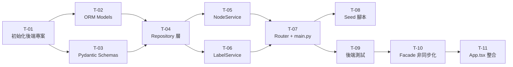

# 執行計畫（plan.md）— 檔案管理系統後端 API

| 欄位     | 內容                 |
| -------- | -------------------- |
| 專案名稱 | 檔案管理系統後端 API |
| 版本號   | v1.0.0               |
| 對應設計 | [FRD.md](./FRD.md)   |
| 對應需求 | [spec.md](./spec.md) |
| 建立日期 | 2026-04-01           |

---

## Task 清單

### T-01：初始化後端專案結構與 wecpy 設定

| 欄位                               | 內容                                                                                                                                                                      |
| ---------------------------------- | ------------------------------------------------------------------------------------------------------------------------------------------------------------------------- |
| **名稱**                           | 初始化後端專案結構與 wecpy 設定                                                                                                                                           |
| **架構層**                         | Infrastructure（設定 / 環境）                                                                                                                                             |
| **詳細描述**                       | 在專案根目錄建立 `backend/` 目錄，初始化 Python 虛擬環境，安裝依賴套件，建立 wecpy 強制設定檔，建立 `requirements.txt`，建立 `backend/app/__init__.py` 與空白 `main.py`。 |
| **建立檔案**                       | `backend/PROD/config.yaml`、`backend/PILOT/config.yaml`、`backend/requirements.txt`、`backend/app/__init__.py`、`backend/app/main.py`（骨架）                             |
| **設定檔內容（config.yaml 格式）** | `database.url`、`database.wal_mode`、`cors.allow_origins`、`app.debug`                                                                                                    |
| **複雜度**                         | 低                                                                                                                                                                        |
| **前置依賴**                       | 無                                                                                                                                                                        |

**wecpy 初始化強制順序（main.py）：**

```python
# 必須最先連續兩行
from wecpy.config_manager import ConfigManager
ConfigManager("config.yaml")

# 其後才可 import 其他模組
from wecpy.log_manager import LogManager
from fastapi import FastAPI
# ...
```

**requirements.txt 清單：**

```
fastapi>=0.110.0
uvicorn[standard]>=0.27.0
sqlalchemy>=2.0.0
pydantic>=2.6.0
httpx>=0.27.0   # async test client
pytest>=7.4.0
pytest-mock>=3.12.0
pytest-asyncio>=0.23.0
pytest-cov>=4.1.0
wecpy  # 從內部 Nexus 安裝
```

---

### T-02：建立 SQLAlchemy ORM Model 與 Database 連線

| 欄位         | 內容                                                                                                                                                                                  |
| ------------ | ------------------------------------------------------------------------------------------------------------------------------------------------------------------------------------- |
| **名稱**     | 建立 SQLAlchemy ORM Model 與 Database 連線設定                                                                                                                                        |
| **架構層**   | Infrastructure（ORM Domain）                                                                                                                                                          |
| **詳細描述** | 實作 `database.py`（engine + SessionLocal + Base + `get_db()`），建立 `NodeModel`、`LabelModel`、`NodeLabelModel` ORM 類別，啟用 WAL mode，建立 `association_table`（many-to-many）。 |
| **建立檔案** | `backend/app/database.py`、`backend/app/models/node.py`、`backend/app/models/label.py`、`backend/app/models/__init__.py`                                                              |
| **複雜度**   | 中                                                                                                                                                                                    |
| **前置依賴** | T-01                                                                                                                                                                                  |

**NodeModel 關鍵設計：**

```python
class NodeModel(Base):
    __tablename__ = "node_record"
    id: Mapped[str] = mapped_column(String, primary_key=True, default=lambda: str(uuid4()))
    type: Mapped[str] = mapped_column(String(30), nullable=False)
    name: Mapped[str] = mapped_column(String(255), nullable=False)
    parent_id: Mapped[str | None] = mapped_column(String, ForeignKey("node_record.id"), nullable=True)
    sort_order: Mapped[int] = mapped_column(Integer, default=0)
    size_kb: Mapped[float | None] = mapped_column(Float, nullable=True)
    created_at: Mapped[datetime | None] = mapped_column(DateTime, nullable=True)
    children: Mapped[list["NodeModel"]] = relationship("NodeModel", back_populates="parent")
    labels: Mapped[list["LabelModel"]] = relationship("LabelModel", secondary="node_label_record", back_populates="nodes")
```

**WAL 模式啟用（database.py）：**

```python
@event.listens_for(engine, "connect")
def set_wal_mode(dbapi_conn, _):
    dbapi_conn.execute("PRAGMA journal_mode=WAL")
```

---

### T-03：建立 Pydantic Schema 層

| 欄位         | 內容                                                                                                                                                                                                                                                                              |
| ------------ | --------------------------------------------------------------------------------------------------------------------------------------------------------------------------------------------------------------------------------------------------------------------------------- |
| **名稱**     | 建立 Pydantic Request / Response Schema                                                                                                                                                                                                                                           |
| **架構層**   | Domain（Schema 定義）                                                                                                                                                                                                                                                             |
| **詳細描述** | 實作 `schemas/node.py`（`DirectoryCreate`, `FileCreate`, `NodeResponse`, `TreeNodeResponse`, `CopyResult`, `SortRequest`）與 `schemas/label.py`（`LabelCreate`, `LabelResponse`）。所有 Schema 使用 Pydantic v2 `model_config = ConfigDict(from_attributes=True)` 支援 ORM 轉換。 |
| **建立檔案** | `backend/app/schemas/node.py`、`backend/app/schemas/label.py`、`backend/app/schemas/__init__.py`                                                                                                                                                                                  |
| **複雜度**   | 低                                                                                                                                                                                                                                                                                |
| **前置依賴** | T-01                                                                                                                                                                                                                                                                              |

**NodeType 枚舉（放在 schemas/node.py）：**

```python
class NodeType(str, Enum):
    DIRECTORY = "directory"
    TEXT_FILE = "text_file"
    WORD_DOCUMENT = "word_document"
    IMAGE_FILE = "image_file"
```

---

### T-04：實作 Repository 層

| 欄位         | 內容                                                                                                                                                                                                                                                                                                                                                      |
| ------------ | --------------------------------------------------------------------------------------------------------------------------------------------------------------------------------------------------------------------------------------------------------------------------------------------------------------------------------------------------------- |
| **名稱**     | 實作 AbstractRepository 介面與 NodeRepository / LabelRepository                                                                                                                                                                                                                                                                                           |
| **架構層**   | Infrastructure（Repository）                                                                                                                                                                                                                                                                                                                              |
| **詳細描述** | 建立 `base_repository.py`（ABC `AbstractRepository`），實作 `NodeRepository`（`find_by_id`, `find_children`, `find_tree`, `save`, `delete`, `bulk_save`）與 `LabelRepository`（`find_all`, `find_by_name`, `find_by_id`, `save`, `delete`, `tag_node`, `untag_node`, `get_node_labels`）。所有 DB 操作使用 SQLAlchemy Session，透過 `get_db()` 依賴注入。 |
| **建立檔案** | `backend/app/repositories/base_repository.py`、`backend/app/repositories/node_repository.py`、`backend/app/repositories/label_repository.py`、`backend/app/repositories/__init__.py`                                                                                                                                                                      |
| **複雜度**   | 高                                                                                                                                                                                                                                                                                                                                                        |
| **前置依賴** | T-02, T-03                                                                                                                                                                                                                                                                                                                                                |

**NodeRepository 方法簽名：**

```python
class NodeRepository:
    def __init__(self, db: Session) -> None: ...
    def find_by_id(self, node_id: str) -> NodeModel | None: ...
    def find_children(self, parent_id: str) -> list[NodeModel]: ...
    def find_tree(self) -> list[NodeModel]: ...  # 回傳所有節點（flat），Service 重組樹
    def save(self, node: NodeModel) -> NodeModel: ...
    def bulk_save(self, nodes: list[NodeModel]) -> None: ...
    def delete(self, node: NodeModel) -> None: ...  # 遞迴刪除子節點
```

---

### T-05：實作 NodeService 業務邏輯

| 欄位         | 內容                                                                                                                                                                                                                                                                                                                                           |
| ------------ | ---------------------------------------------------------------------------------------------------------------------------------------------------------------------------------------------------------------------------------------------------------------------------------------------------------------------------------------------- |
| **名稱**     | 實作 NodeService（樹狀結構 CRUD 業務邏輯）                                                                                                                                                                                                                                                                                                     |
| **架構層**   | Application（Service）                                                                                                                                                                                                                                                                                                                         |
| **詳細描述** | 實作以下方法：`get_tree()` → 取得並重組樹狀回應、`create_directory(data)` → 新增目錄節點、`create_file(data)` → 新增檔案節點、`delete_node(id)` → 遞迴刪除節點及其子節點與標籤關聯、`copy_node(source_id, target_dir_id)` → 遞迴深複製節點並解決名稱衝突（加 `_copy`）、`sort_children(dir_id, strategy)` → 依策略重排 `sort_order` 並持久化。 |
| **建立檔案** | `backend/app/services/node_service.py`、`backend/app/services/__init__.py`                                                                                                                                                                                                                                                                     |
| **複雜度**   | 高                                                                                                                                                                                                                                                                                                                                             |
| **前置依賴** | T-04                                                                                                                                                                                                                                                                                                                                           |

**名稱衝突解決邏輯：**

```python
def _resolve_name(base_name: str, existing_names: set[str]) -> tuple[str, bool]:
    if base_name not in existing_names:
        return base_name, False
    candidate = f"{base_name}_copy"
    i = 2
    while candidate in existing_names:
        candidate = f"{base_name}_copy_{i}"
        i += 1
    return candidate, True
```

**排序策略（策略字串 → 排序 key）：**

```python
SORT_STRATEGIES: dict[str, tuple[str, bool]] = {
    "name_asc":  ("name",    False),
    "name_desc": ("name",    True),
    "size_asc":  ("size_kb", False),
    "size_desc": ("size_kb", True),
}
```

---

### T-06：實作 LabelService 業務邏輯

| 欄位         | 內容                                                                                                                                                                                                                                                                                                                   |
| ------------ | ---------------------------------------------------------------------------------------------------------------------------------------------------------------------------------------------------------------------------------------------------------------------------------------------------------------------- |
| **名稱**     | 實作 LabelService（標籤 Flyweight 與節點關聯邏輯）                                                                                                                                                                                                                                                                     |
| **架構層**   | Application（Service）                                                                                                                                                                                                                                                                                                 |
| **詳細描述** | 實作以下方法：`get_all()` → 取得所有標籤、`get_or_create(data)` → Flyweight 語義（同名則回傳既有，回傳 `(LabelResponse, is_new: bool)`）、`delete(id)` → 刪除標籤及所有關聯、`tag_node(node_id, label_id)` → 幂等新增關聯、`untag_node(node_id, label_id)` → 移除關聯、`get_node_labels(node_id)` → 取得節點所有標籤。 |
| **建立檔案** | `backend/app/services/label_service.py`                                                                                                                                                                                                                                                                                |
| **複雜度**   | 中                                                                                                                                                                                                                                                                                                                     |
| **前置依賴** | T-04                                                                                                                                                                                                                                                                                                                   |

---

### T-07：建立 FastAPI Router 層與 main.py 組裝

| 欄位         | 內容                                                                                                                                                                                                                                                      |
| ------------ | --------------------------------------------------------------------------------------------------------------------------------------------------------------------------------------------------------------------------------------------------------- |
| **名稱**     | 建立 FastAPI Router 與 App 組裝                                                                                                                                                                                                                           |
| **架構層**   | Presentation（Router）                                                                                                                                                                                                                                    |
| **詳細描述** | 實作 `routers/nodes.py`（12 個端點）與 `routers/labels.py`（3 個端點），完成 `main.py`（App 組裝：ConfigManager 初始化 → LogManager → FastAPI instance → CORS Middleware → Router 掛載 → 建立 DB 表格）。加入統一 Exception Handler（回傳標準錯誤格式）。 |
| **建立檔案** | `backend/app/routers/nodes.py`、`backend/app/routers/labels.py`、`backend/app/routers/__init__.py`、`backend/app/main.py`（完整版）                                                                                                                       |
| **複雜度**   | 中                                                                                                                                                                                                                                                        |
| **前置依賴** | T-05, T-06                                                                                                                                                                                                                                                |

**main.py 骨架：**

```python
# 必須最先連續兩行 (wecpy 強制)
from wecpy.config_manager import ConfigManager
ConfigManager("config.yaml")

from wecpy.log_manager import LogManager
from fastapi import FastAPI, Request
from fastapi.middleware.cors import CORSMiddleware
from fastapi.responses import JSONResponse

from app.database import engine, Base
from app.routers import nodes, labels

log = LogManager.get_logger()

app = FastAPI(title="File Management API")

# CORS
config = ConfigManager.get_instance()
app.add_middleware(
    CORSMiddleware,
    allow_origins=config.get("cors.allow_origins"),
    allow_methods=["*"],
    allow_headers=["*"],
)

# Exception handler
@app.exception_handler(Exception)
async def global_exception_handler(request: Request, exc: Exception):
    log.error(f"Unhandled error: {exc}")
    return JSONResponse(status_code=500, content={"error": str(exc), "code": "INTERNAL_ERROR"})

# Routes
app.include_router(nodes.router, prefix="/api")
app.include_router(labels.router, prefix="/api")

# Create tables
Base.metadata.create_all(bind=engine)
```

---

### T-08：建立 Seed 腳本

| 欄位            | 內容                                                                                                                                                                                |
| --------------- | ----------------------------------------------------------------------------------------------------------------------------------------------------------------------------------- |
| **名稱**        | 建立 Seed 腳本（對應前端 sampleData.ts）                                                                                                                                            |
| **架構層**      | Infrastructure（資料初始化）                                                                                                                                                        |
| **詳細描述**    | 實作 `backend/seed.py`，讀取前端 `sampleData.ts` 的等效資料結構，透過 Repository 將初始節點樹與標籤預先插入資料庫。執行方式：`python seed.py`。應為幂等操作（重複執行不重複插入）。 |
| **建立檔案**    | `backend/seed.py`                                                                                                                                                                   |
| **配置/設定檔** | 無（使用既有 config.yaml）                                                                                                                                                          |
| **複雜度**      | 低                                                                                                                                                                                  |
| **前置依賴**    | T-07                                                                                                                                                                                |

---

### T-09：後端單元測試與整合測試

| 欄位         | 內容                                                                                                                                                                                                                          |
| ------------ | ----------------------------------------------------------------------------------------------------------------------------------------------------------------------------------------------------------------------------- |
| **名稱**     | 撰寫後端 pytest 單元測試與整合測試                                                                                                                                                                                            |
| **架構層**   | Test                                                                                                                                                                                                                          |
| **詳細描述** | 建立 `tests/conftest.py`（`test_db` fixture 使用 SQLite in-memory、`test_client` fixture 使用 `httpx.AsyncClient`），實作 Service 層單元測試（mock Repository）與 Router 整合測試（真實 DB 但 in-memory）。目標覆蓋率 ≥ 80%。 |
| **建立檔案** | `backend/tests/conftest.py`、`backend/tests/unit/test_node_service.py`、`backend/tests/unit/test_label_service.py`、`backend/tests/integration/test_nodes_api.py`、`backend/tests/integration/test_labels_api.py`             |
| **複雜度**   | 高                                                                                                                                                                                                                            |
| **前置依賴** | T-07                                                                                                                                                                                                                          |

**conftest.py 關鍵 fixture：**

```python
@pytest.fixture
def db_session():
    engine = create_engine("sqlite:///:memory:", connect_args={"check_same_thread": False})
    Base.metadata.create_all(engine)
    with Session(engine) as session:
        yield session
    Base.metadata.drop_all(engine)

@pytest.fixture
async def client(db_session):
    app.dependency_overrides[get_db] = lambda: db_session
    async with AsyncClient(app=app, base_url="http://test") as c:
        yield c
    app.dependency_overrides.clear()
```

**測試案例覆蓋（節選）：**

- `test_get_tree_empty` — 空 DB 回傳 []
- `test_create_directory` — POST /api/nodes/directory 回傳 201
- `test_delete_node_cascades_children` — 刪除目錄時子節點一併刪除
- `test_copy_node_name_conflict` — 同名時自動加 `_copy`
- `test_sort_children_name_asc` — 排序後 sort_order 正確
- `test_create_label_flyweight` — 同名第二次回傳 200 不重複建立
- `test_tag_node_idempotent` — 重複 POST 節點標籤不建立重複記錄

---

### T-10：前端 FileSystemFacade 非同步化改造

| 欄位         | 內容                                                                                                                                                                                                                                                                                                                   |
| ------------ | ---------------------------------------------------------------------------------------------------------------------------------------------------------------------------------------------------------------------------------------------------------------------------------------------------------------------- |
| **名稱**     | 改造前端 FileSystemFacade 為非同步 API 呼叫                                                                                                                                                                                                                                                                            |
| **架構層**   | Presentation（前端服務層）                                                                                                                                                                                                                                                                                             |
| **詳細描述** | 修改 `file-management-system/src/services/FileSystemFacade.ts`：(1) 新增 `apiBaseUrl` 設定（預設 `http://localhost:8000`）；(2) 將 file CRUD 方法改為 async/await fetch 呼叫；(3) 保留 `CommandInvoker` Undo/Redo 邏輯（不呼叫後端）；(4) 暴露新方法 `loadTree()`；(5) 加入統一錯誤處理（fetch 失敗拋出 `ApiError`）。 |
| **修改檔案** | `file-management-system/src/services/FileSystemFacade.ts`                                                                                                                                                                                                                                                              |
| **新增檔案** | `file-management-system/src/services/ApiError.ts`                                                                                                                                                                                                                                                                      |
| **複雜度**   | 高                                                                                                                                                                                                                                                                                                                     |
| **前置依賴** | T-09                                                                                                                                                                                                                                                                                                                   |

---

### T-11：前端 App.tsx 整合 API 資料來源

| 欄位         | 內容                                                                                                                                                                                                                                                                                                                        |
| ------------ | --------------------------------------------------------------------------------------------------------------------------------------------------------------------------------------------------------------------------------------------------------------------------------------------------------------------------- |
| **名稱**     | 整合前端 App.tsx — 移除 sampleData 並接入後端 API                                                                                                                                                                                                                                                                           |
| **架構層**   | Presentation（React Component）                                                                                                                                                                                                                                                                                             |
| **詳細描述** | 修改 `App.tsx`：(1) 移除 `import { sampleData }` 並以 `useEffect(() => { facade.loadTree().then(...) }, [])` 取代初始資料；(2) 所有 handler 由同步改為 async（使用 React `useCallback` + `async`）；(3) 新增 `isLoading`、`serverError` state，在 loading 時顯示骨架畫面，伺服器錯誤時顯示 Error Banner；(4) 更新相關測試。 |
| **修改檔案** | `file-management-system/src/App.tsx`、`file-management-system/tests/components/` 相關測試                                                                                                                                                                                                                                   |
| **複雜度**   | 高                                                                                                                                                                                                                                                                                                                          |
| **前置依賴** | T-10                                                                                                                                                                                                                                                                                                                        |

---

## 任務依賴圖



---

## 測試策略

| 類型             | 工具                       | 覆蓋目標                                             |
| ---------------- | -------------------------- | ---------------------------------------------------- |
| Service 單元測試 | pytest + pytest-mock       | NodeService / LabelService 全方法（mock Repository） |
| API 整合測試     | pytest + httpx AsyncClient | 所有 12 個 Node 端點 + 3 個 Label 端點               |
| 覆蓋率           | pytest-cov                 | 後端 ≥ 80%                                           |
| 前端單元測試     | Vitest                     | FileSystemFacade async 方法（mock fetch）            |
| 前端整合測試     | Vitest + MSW（可選）       | App.tsx loadTree / error state                       |

---

## 部署架構（本機開發）

```bash
# 後端啟動
cd backend
export IMX_ENV=PILOT
uvicorn app.main:app --reload --port 8000

# 前端啟動
cd file-management-system
npm run dev   # port 5173
```

## 估算複雜度總覽

| Task     | 複雜度 | 預估工時 |
| -------- | ------ | -------- |
| T-01     | 低     | 0.5h     |
| T-02     | 中     | 1h       |
| T-03     | 低     | 0.5h     |
| T-04     | 高     | 2h       |
| T-05     | 高     | 2h       |
| T-06     | 中     | 1h       |
| T-07     | 中     | 1.5h     |
| T-08     | 低     | 0.5h     |
| T-09     | 高     | 3h       |
| T-10     | 高     | 2h       |
| T-11     | 高     | 2h       |
| **合計** |        | **~16h** |
