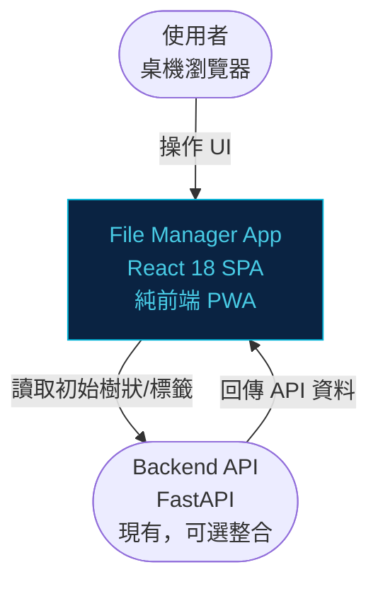
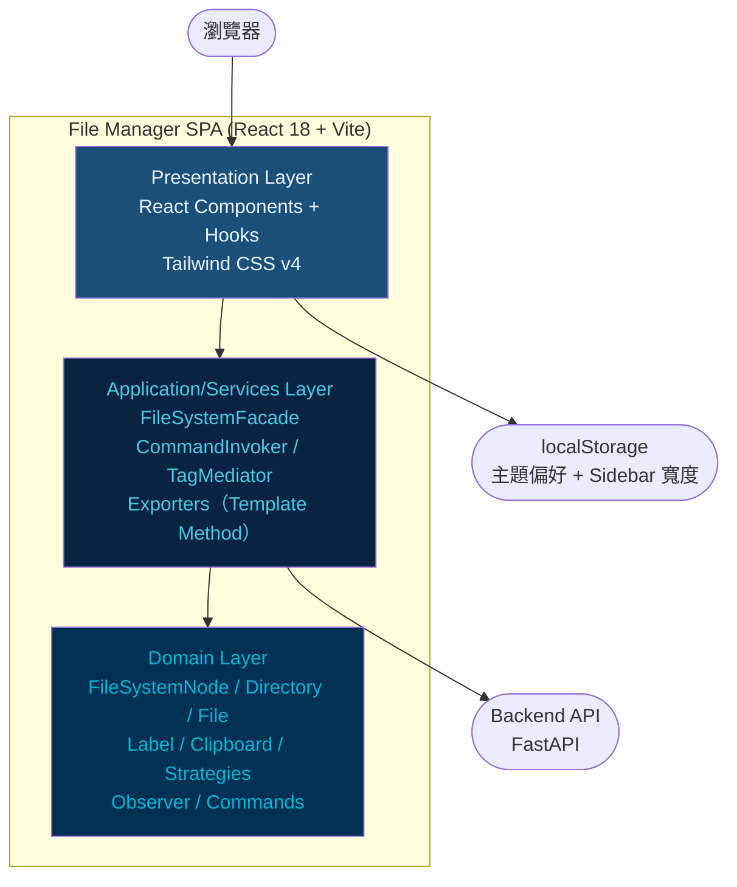
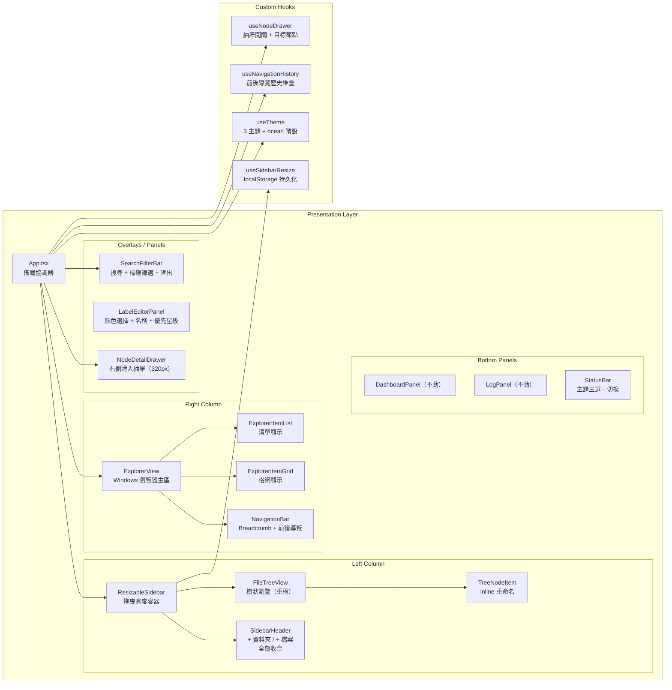
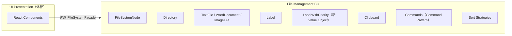
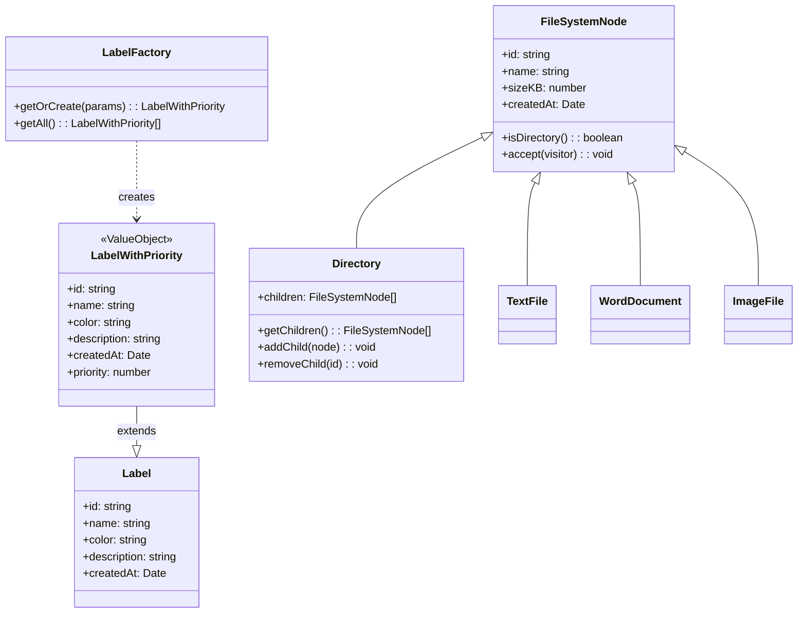
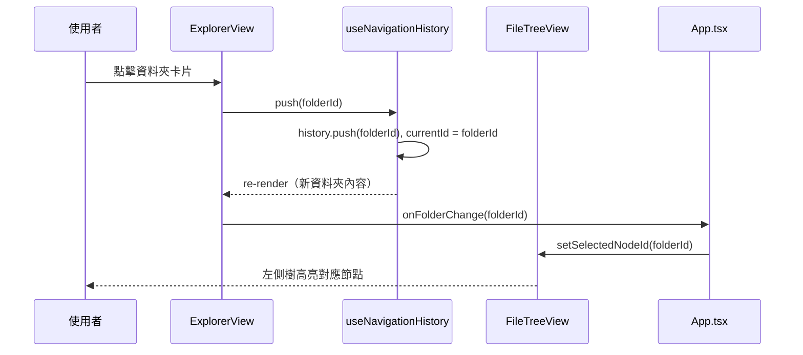
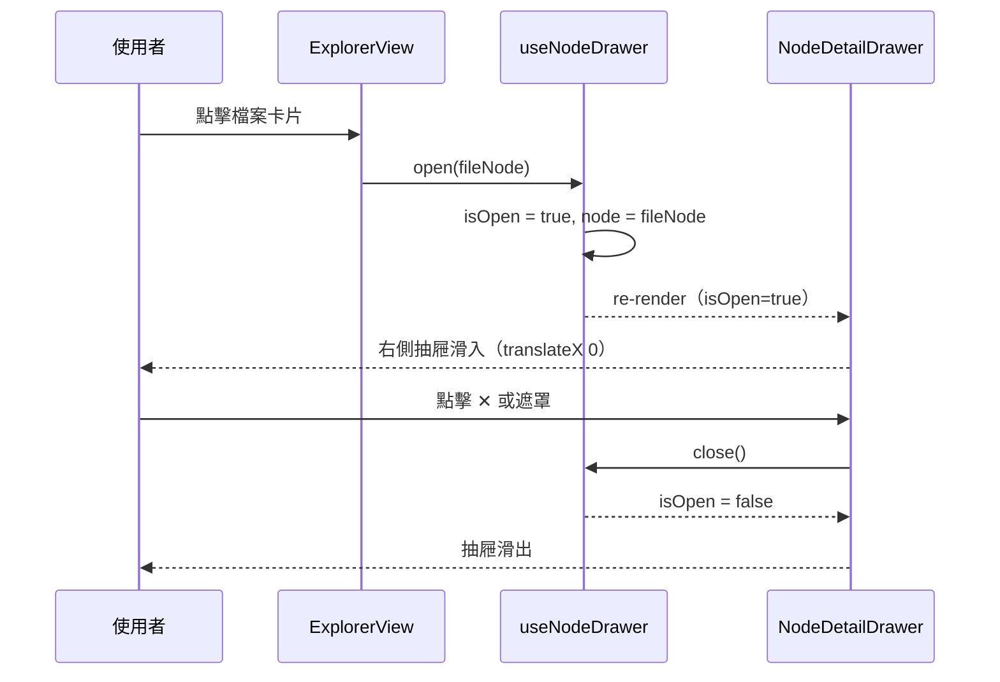
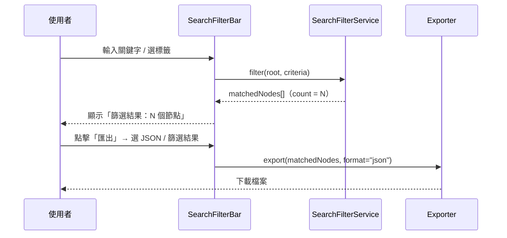
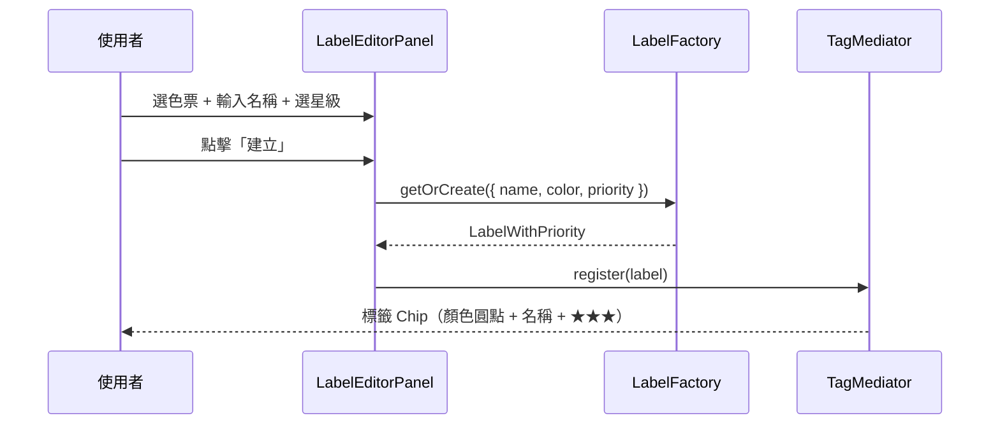

# FRD.md — UI 大改版：深海水族風格 + 探索式檔案瀏覽

- **需求編號**：010
- **文件版本**：v1.0（2026-04-01）
- **對應規格書**：[spec.md](./spec.md)
- **架構師**：GitHub Copilot（Claude Sonnet 4.6）

---

## 0. 規範基線（Architecture Standards Baseline）

| 類別     | 規範文件                                | 本次設計約束摘要                                                                      |
| -------- | --------------------------------------- | ------------------------------------------------------------------------------------- |
| 架構     | `standards/clean-architecture.md`       | Presentation → Application → Domain；Domain 層不引用 React/Tailwind                   |
| 設計原則 | `standards/solid-principles.md`         | `Label` 新增欄位用擴充新類別（OCP）；匯出格式新增不修改骨架（OCP + Template Method）  |
| 設計模式 | `standards/design-patterns.md`          | Hook Pattern（React）、Template Method（Exporter）、Command（操作）、Observer（進度） |
| 前端標準 | `standards/coding-standard-frontend.md` | React 18 + TypeScript；Web First；Tailwind CSS v4；模組化元件設計                     |

---

## 1. 系統架構概述

### 1.1 現有架構

```
Presentation       Application/Services          Domain
──────────────     ────────────────────────      ────────────
App.tsx            FileSystemFacade              FileSystemNode
FileTreeView        CommandInvoker                Directory / File variants
LabelPanel          TagMediator                  Label（Flyweight）
ToolbarPanel        Exporters（Template Method）  Clipboard
BreadcrumbBar       Commands（Command Pattern）   Strategies / Observer
StatusBar           Observers / Decorators
useTheme（hook）
```

### 1.2 本次改版目標架構

```
Presentation                     Application/Services         Domain
─────────────────────────────    ─────────────────────────   ─────────────────
App.tsx（佈局協調）              FileSystemFacade（擴充）     FileSystemNode（不動）
├── ResizableSidebar              CommandInvoker（不動）       Directory（不動）
│   ├── SidebarHeader（新增）     TagMediator（不動）          LabelWithPriority（新增VO）
│   └── FileTreeView（重構）      Exporters（擴充）            Label（不動）
├── ExplorerView（新增）           ├── BaseExporterTemplate     Clipboard（不動）
│   ├── NavigationBar（新增）     ├── JSONExporter（不動）
│   ├── ExplorerItemGrid（新增）  ├── MarkdownExporter→改命名    Hooks（新增）
│   └── ExplorerItemList（新增）  └── PlainTextExporter（新增） ├── useNavigationHistory
├── NodeDetailDrawer（新增）      SearchFilterService（新增）  ├── useSidebarResize
├── LabelEditorPanel（新增）                                   └── useNodeDrawer
├── SearchFilterBar（重構）
├── DashboardPanel（不動）
├── LogPanel（不動）
└── StatusBar（擴充：主題三選一）
```

---

## 2. C4 Context Diagram



> ⚠️ 本次改版為純前端 UI 層改版，後端 API 整合維持現狀，新增/刪除節點僅更新前端狀態（不持久化）。

---

## 3. C4 Container Diagram



---

## 4. C4 Component Diagram（Presentation Layer 分解）



---

## 5. 領域建模（DDD）

### 5.1 Bounded Context

本系統為單一 Bounded Context：**File Management**。



### 5.2 Domain Model



> **OCP 決策（ADR-04）**：`Label` 現有結構不變（避免破壞現有測試），改以 `LabelWithPriority extends Label` 新增 `priority` 欄位，`LabelFactory` 更新為建立 `LabelWithPriority`。

---

## 6. UI 版面配置

### 6.1 整體佈局架構

```
┌──────────────────────────────────────────────────────────┐
│  Header Bar（App 標題 + 主題切換三選一）                    │
├──────────────────────────────────────────────────────────┤
│  SearchFilterBar（關鍵字搜尋 + 標籤篩選 + 匯出按鈕）        │
├───────────────────────┬──────────────────────────────────┤
│  ResizableSidebar     │  ExplorerView                    │
│  ├─ SidebarHeader    │  ├─ NavigationBar                │
│  │  [+資料夾][+檔案] │  │   [←][→] 根目錄 > 子資料夾  │
│  │  [全部收合]       │  │                               │
│  └─ FileTreeView     │  └─ ExplorerItemGrid / List      │
│     （樹狀導覽）     │     （資料夾/檔案 卡片/清單）    │
│                       │                                  │
│  200–400px（可拖曳）  │  剩餘寬度（flex-1）             │
├───────────────────────┴──────────────────────────────────┤
│  [Dashboard] [Log] 切換按鈕（底部可折疊）                  │
│  DashboardPanel / LogPanel                               │
├──────────────────────────────────────────────────────────┤
│  StatusBar（節點統計 + 主題選擇）                          │
└──────────────────────────────────────────────────────────┘

                                        ┌─ NodeDetailDrawer ─┐
                                        │  [✕]               │
                                        │  節點名稱           │
                                        │  類型 / 屬性        │
                                        │  標籤 Chip          │
                                        └────────────────────┘
                                        320px，右側滑入，overlay
```

### 6.2 元件詳細規格

#### ResizableSidebar

- 寬度範圍：200px–400px
- Resize Handle：Sidebar 右邊緣，寬 4px，hover 時顯示拖曳游標
- 實作：`mousedown` → 記錄起點 → `mousemove` → 更新 CSS `width` → `mouseup` → 寫入 `localStorage`
- Hook：`useSidebarResize(defaultWidth: 288)`

#### SidebarHeader

- 三個 icon-only 按鈕：`NewFolderIcon`、`NewFileIcon`、`CollapseAllIcon`
- 每個按鈕有 `aria-label` + tooltip
- 新增時，在目前選取節點下增加 inline input（`TreeNodeItem` 進入 `editing` 模式）

#### ExplorerView

- 上方：`NavigationBar`（麵包屑 + 前後按鈕）
- 主區：`ExplorerItemGrid`（格網，預設）或 `ExplorerItemList`（清單）
- 右上：Grid/List 切換按鈕
- 點擊資料夾 → 呼叫 `navigationHistory.push(folderId)` → 更新當前節點
- 點擊檔案 → `nodeDrawer.open(node)`

#### NavigationBar

- `[←]` `[→]` 按鈕（disabled 當 history 邊界）
- 麵包屑：根節點 > 父資料夾 > 當前資料夾
- 每個麵包屑節點可點擊（快速跳轉）

#### NodeDetailDrawer

- 定位：`fixed right-0 top-0 h-full w-80 z-50`
- 動畫：`transform: translateX(100%)` → `translateX(0)`（150ms ease-out）
- 遮罩（Overlay）：點擊關閉
- 內容：節點名稱、類型圖示、建立時間、大小、標籤列表

#### LabelEditorPanel

- 觸發：`SidebarHeader` 的標籤管理入口 或 `NodeDetailDrawer` 的「管理標籤」
- 顏色色票：10 個預設色（深海主題：`#00B4D8`, `#48CAE4`, `#0077B6`, `#023E8A`, `#FF8C69`, `#90E0EF`, `#ADE8F4`, `#CAF0F8`, `#FF6B6B`, `#51CF66`）+ 自訂 HEX Input
- 星級選擇：5 個 `★` 圖示，點擊設定 1–5 優先等級

#### SearchFilterBar

- 位置：Header 下方全寬工具列
- 包含：`<input>` 關鍵字搜尋 + 標籤篩選 Chip（現有 `LabelFilterBar` 整合進來）
- 右側：篩選結果計數 + 「匯出」按鈕
- 匯出按鈕 dropdown：XML / JSON / 純文字（三選一）+ 「範圍：篩選結果 / 全部」

---

## 7. 技術設計細節

### 7.1 useTheme 擴充

```typescript
// 現有
export type Theme = "light" | "dark" | "system";

// 更新後
export type Theme = "light" | "dark" | "ocean";
// - 移除 "system"（簡化，不再監聽 prefers-color-scheme）
// - 預設值改為 "ocean"
// - localStorage key 保持 "cfm-theme"
// - document.documentElement setAttribute("data-theme", theme)
// - CSS 新增 [data-theme="ocean"] 區塊
```

### 7.2 useNavigationHistory Hook

```typescript
interface NavigationHistory {
  currentId: string; // 當前資料夾 ID
  canGoBack: boolean;
  canGoForward: boolean;
  push(id: string): void; // 進入資料夾
  goBack(): void;
  goForward(): void;
  breadcrumb: FileSystemNode[]; // 路徑堆疊（用於麵包屑）
}
```

### 7.3 useSidebarResize Hook

```typescript
interface SidebarResize {
  width: number; // 目前寬度 (px)
  handleMouseDown(e: MouseEvent): void; // Resize Handle 的 mousedown 處理器
}
// 寬度存入 localStorage key: "cfm-sidebar-width"
// 預設寬度: 288px
```

### 7.4 useNodeDrawer Hook

```typescript
interface NodeDrawer {
  isOpen: boolean;
  node: FileSystemNode | null;
  open(node: FileSystemNode): void;
  close(): void;
}
```

### 7.5 PlainTextExporter（新增）

```typescript
// 繼承 BaseExporterTemplate（Template Method Pattern）
// 輸出格式：
// root/
//   folder-a/
//     file-a.txt (12 KB)
//   file-b.jpg (256 KB)
class PlainTextExporter extends BaseExporterTemplate { ... }
```

### 7.6 SearchFilterService（新增 Application Service）

```typescript
interface FilterCriteria {
  keyword: string;
  labelId: string | null;
}

class SearchFilterService {
  filter(root: FileSystemNode, criteria: FilterCriteria): FileSystemNode[];
  // 回傳符合條件的節點陣列（flat list，不含父節點結構）
}
```

### 7.7 Ocean CSS 主題（新增）

```css
[data-theme="ocean"] {
  --bg-app: #0a1628;
  --bg-surface: #0d2137;
  --bg-hover: #1a3a5c;
  --text-primary: #e8f4fd;
  --text-secondary: #90caf9;
  --border: rgba(0, 180, 216, 0.3);
  --accent: #00b4d8;
  --accent-hover: #48cae4;
  --glow: 0 0 8px rgba(0, 180, 216, 0.3);
  /* 邊框發光效果 */
}
```

---

## 8. 核心業務 Sequence Diagrams

### 8.1 進入資料夾（ExplorerView 導覽）



### 8.2 點擊檔案 → 開啟 Side Drawer



### 8.3 篩選後匯出



### 8.4 建立標籤（LabelEditorPanel）



---

## 9. 架構決策記錄（ADR）

| #      | 問題                        | 決策                                                              | 依據規範                                                           | 影響                                                                 |
| ------ | --------------------------- | ----------------------------------------------------------------- | ------------------------------------------------------------------ | -------------------------------------------------------------------- |
| ADR-01 | 點擊檔案後詳情顯示方式      | Side Drawer（右側滑入 320px，overlay）                            | `clean-architecture.md`：Presentation 互動不影響 Application 層    | 新增 `NodeDetailDrawer` + `useNodeDrawer`；右側主區寬度不變          |
| ADR-02 | Ocean 主題獨立 or 取代 Dark | 獨立第三主題 `"ocean"`，設為預設；`"system"` 主題同時移除（簡化） | `solid-principles.md`：OCP，新增主題不修改現有邏輯；新增 CSS block | `useTheme` 型別更新；CSS 新增 `[data-theme="ocean"]`；UI 三選一      |
| ADR-03 | Sidebar 拖曳寬度列入範圍    | 是（P1），原生 mousedown/mousemove 實作                           | `coding-standard-frontend.md`：避免過度依賴非主流套件              | 新增 `useSidebarResize` hook；不引入 dnd-kit                         |
| ADR-04 | Label 加 priority 欄位策略  | `LabelWithPriority extends Label`（OCP 擴充）                     | `solid-principles.md`：OCP，不修改現有 Label；現有測試 0 破壞      | `LabelFactory` 更新建立 `LabelWithPriority`；現有 Label 測試不需修改 |
| ADR-05 | 匯出篩選流程設計            | `SearchFilterService`（新 Application Service）回傳 flat 節點陣列 | `clean-architecture.md`：Application Service 協調 Domain           | `SearchFilterBar` 呼叫 Service；Exporter 接收節點陣列                |
