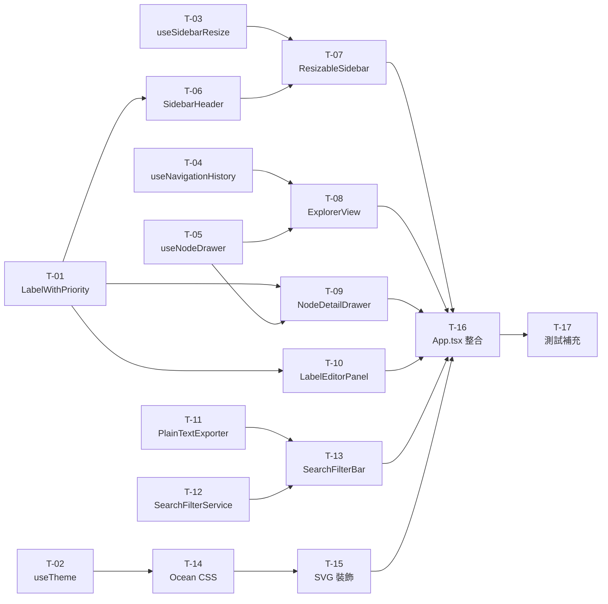

# plan.md — UI 大改版執行計畫

- **需求編號**：010
- **文件版本**：v1.0（2026-04-01）
- **對應設計文件**：[FRD.md](./FRD.md)
- **對應規格書**：[spec.md](./spec.md)

---

## 8. 工作拆解（Task Breakdown）

### 分組概覽

```
Group A：基礎設施（Domain + Hooks）→ T-01 ~ T-04
Group B：主框架佈局（Sidebar + Explorer）→ T-05 ~ T-09
Group C：功能增強（Drawer + Label + SearchExport）→ T-10 ~ T-13
Group D：視覺主題（Ocean Theme + 裝飾）→ T-14 ~ T-15
Group E：整合 + 測試 → T-16 ~ T-18
```

依賴關係：A 全部 → B 可並行 → C（T-10 依賴 T-07，T-11 依賴 T-01）→ D → E

---

### T-01：擴充 Label Domain — 新增 LabelWithPriority

| 欄位            | 內容                                                                                          |
| --------------- | --------------------------------------------------------------------------------------------- |
| **架構層**      | Domain                                                                                        |
| **路徑**        | `src/domain/labels/LabelWithPriority.ts`（新增）、`src/domain/labels/LabelFactory.ts`（修改） |
| **配置/設定檔** | 無                                                                                            |
| **複雜度**      | 低                                                                                            |
| **前置依賴**    | 無                                                                                            |

**詳細描述：**

1. 新增 `src/domain/labels/LabelWithPriority.ts`：
   ```typescript
   export class LabelWithPriority extends Label {
     constructor(
       id: string,
       name: string,
       color: string,
       description: string,
       createdAt: Date,
       public readonly priority: number, // 1–5
     ) {
       super(id, name, color, description, createdAt);
     }
   }
   ```
2. 更新 `LabelFactory.getOrCreate()` 簽名接受可選 `priority?: number`（預設 1），建立 `LabelWithPriority` 而非 `Label`
3. 更新 `src/domain/labels/index.ts` 匯出 `LabelWithPriority`
4. **測試**：`tests/domain/LabelWithPriority.test.ts` — 驗證 priority 欄位繼承、LabelFactory 建立正確型別

---

### T-02：擴充 useTheme — 三主題 + ocean 預設

| 欄位            | 內容                                    |
| --------------- | --------------------------------------- |
| **架構層**      | Presentation（Hook）                    |
| **路徑**        | `src/hooks/useTheme.ts`（修改）         |
| **配置/設定檔** | 無（localStorage key `cfm-theme` 不變） |
| **複雜度**      | 低                                      |
| **前置依賴**    | 無                                      |

**詳細描述：**

1. 將 `Theme` 型別改為 `"light" | "dark" | "ocean"`（移除 `"system"`）
2. 預設值改為 `"ocean"`：`return saved ?? "ocean"`
3. `useEffect` 邏輯改為：`root.setAttribute("data-theme", theme)`（不再需要 MediaQuery 監聽）
4. 移除 `isDark` 回傳值（或保留向後相容：`isDark = theme === "dark"`）
5. **測試**：`tests/hooks/useTheme.test.ts` — 驗證預設 ocean、三值切換、localStorage 行為

---

### T-03：新增 useSidebarResize Hook

| 欄位            | 內容                                    |
| --------------- | --------------------------------------- |
| **架構層**      | Presentation（Hook）                    |
| **路徑**        | `src/hooks/useSidebarResize.ts`（新增） |
| **配置/設定檔** | localStorage key：`cfm-sidebar-width`   |
| **複雜度**      | 中                                      |
| **前置依賴**    | 無                                      |

**詳細描述：**

```typescript
export function useSidebarResize(defaultWidth = 288) {
  const [width, setWidth] = useState(() => {
    const saved = localStorage.getItem("cfm-sidebar-width");
    return saved ? parseInt(saved) : defaultWidth;
  });

  const handleMouseDown = useCallback(
    (e: React.MouseEvent) => {
      const startX = e.clientX;
      const startW = width;
      const onMove = (me: MouseEvent) => {
        const next = Math.max(200, Math.min(400, startW + me.clientX - startX));
        setWidth(next);
      };
      const onUp = (me: MouseEvent) => {
        const final = Math.max(
          200,
          Math.min(400, startW + me.clientX - startX),
        );
        localStorage.setItem("cfm-sidebar-width", String(final));
        document.removeEventListener("mousemove", onMove);
        document.removeEventListener("mouseup", onUp);
      };
      document.addEventListener("mousemove", onMove);
      document.addEventListener("mouseup", onUp);
    },
    [width],
  );

  return { width, handleMouseDown };
}
```

**測試**：`tests/hooks/useSidebarResize.test.ts` — 初始值讀取、min/max 邊界、localStorage 寫入

---

### T-04：新增 useNavigationHistory Hook

| 欄位            | 內容                                        |
| --------------- | ------------------------------------------- |
| **架構層**      | Presentation（Hook）                        |
| **路徑**        | `src/hooks/useNavigationHistory.ts`（新增） |
| **配置/設定檔** | 無                                          |
| **複雜度**      | 中                                          |
| **前置依賴**    | 無                                          |

**詳細描述：**

```typescript
export function useNavigationHistory(rootNode: FileSystemNode) {
  // history: string[]（節點 ID 路徑堆疊）
  // pointer: number（當前位置）
  // currentNode: FileSystemNode | null
  // canGoBack: pointer > 0
  // canGoForward: pointer < history.length - 1
  // push(id): 清除 pointer+1 之後的紀錄，push 新 id，pointer++
  // goBack(): pointer--
  // goForward(): pointer++
  // breadcrumb: FileSystemNode[]（從 root 到 currentNode 的路徑）
}
```

**測試**：`tests/hooks/useNavigationHistory.test.ts` — push/goBack/goForward 邊界、麵包屑路徑

---

### T-05：新增 useNodeDrawer Hook

| 欄位            | 內容                                 |
| --------------- | ------------------------------------ |
| **架構層**      | Presentation（Hook）                 |
| **路徑**        | `src/hooks/useNodeDrawer.ts`（新增） |
| **配置/設定檔** | 無                                   |
| **複雜度**      | 低                                   |
| **前置依賴**    | 無                                   |

**詳細描述：**

```typescript
export function useNodeDrawer() {
  const [isOpen, setIsOpen] = useState(false);
  const [node, setNode] = useState<FileSystemNode | null>(null);
  const open = (n: FileSystemNode) => {
    setNode(n);
    setIsOpen(true);
  };
  const close = () => setIsOpen(false);
  return { isOpen, node, open, close };
}
```

**測試**：`tests/hooks/useNodeDrawer.test.ts` — open/close/node 狀態

---

### T-06：重構 FileTreeView → 拆出 SidebarHeader

| 欄位            | 內容                                                                                                                             |
| --------------- | -------------------------------------------------------------------------------------------------------------------------------- |
| **架構層**      | Presentation                                                                                                                     |
| **路徑**        | `src/components/SidebarHeader.tsx`（新增）、`src/components/FileTreeView.tsx`（修改）、`src/components/TreeNodeItem.tsx`（修改） |
| **配置/設定檔** | 無                                                                                                                               |
| **複雜度**      | 中                                                                                                                               |
| **前置依賴**    | T-01                                                                                                                             |

**詳細描述：**

1. 新增 `SidebarHeader.tsx`：
   - Props：`onAddFolder`, `onAddFile`, `onCollapseAll: () => void`
   - 三個 icon 按鈕（SVG）+ aria-label + tooltip
2. `FileTreeView.tsx` 修改：
   - 加入 `collapseAll` state 控制（受 SidebarHeader 驅動）
   - 節點樹展開/收合動畫（CSS transition height/opacity，150ms）
3. `TreeNodeItem.tsx` 修改：
   - 加入 `isEditing` prop：顯示 inline `<input>` 取代節點名稱
   - `onNameConfirm(name)`, `onEditCancel()` 回調
   - inline input 按 Enter → confirm；Esc → cancel
4. **測試**：`tests/components/SidebarHeader.test.tsx`、`tests/components/TreeNodeItem.editing.test.tsx`

---

### T-07：新增 ResizableSidebar 元件

| 欄位            | 內容                                          |
| --------------- | --------------------------------------------- |
| **架構層**      | Presentation                                  |
| **路徑**        | `src/components/ResizableSidebar.tsx`（新增） |
| **配置/設定檔** | 無                                            |
| **複雜度**      | 中                                            |
| **前置依賴**    | T-03、T-06                                    |

**詳細描述：**

```tsx
// ResizableSidebar：flex column 容器
// - 左側主體（width = useSidebarResize().width px）
// - 右側 Resize Handle：div，w-1 cursor-col-resize
//   onMouseDown → useSidebarResize().handleMouseDown
// - children: SidebarHeader + FileTreeView
```

**測試**：`tests/components/ResizableSidebar.test.tsx` — 渲染、resize handle 存在

---

### T-08：新增 ExplorerView 元件群

| 欄位            | 內容                                                                                                                                                                                |
| --------------- | ----------------------------------------------------------------------------------------------------------------------------------------------------------------------------------- |
| **架構層**      | Presentation                                                                                                                                                                        |
| **路徑**        | `src/components/ExplorerView.tsx`（新增）、`src/components/NavigationBar.tsx`（新增）、`src/components/ExplorerItemGrid.tsx`（新增）、`src/components/ExplorerItemList.tsx`（新增） |
| **配置/設定檔** | 無                                                                                                                                                                                  |
| **複雜度**      | 高                                                                                                                                                                                  |
| **前置依賴**    | T-04、T-05                                                                                                                                                                          |

**詳細描述：**

**NavigationBar（新增）：**

```tsx
// Props: history（useNavigationHistory 回傳值）
// 顯示：[←disabled?][→disabled?] 麵包屑（root > a > b > current）
// 每個麵包屑可點擊（onNavigate(id)）
```

**ExplorerItemGrid（新增）：**

```tsx
// Props: nodes: FileSystemNode[], onFolderEnter, onFileClick
// 渲染：grid-cols-4 gap-3
// 資料夾：圖示 + 名稱 + 子項目數
// 檔案：圖示（依類型）+ 名稱 + 大小
// hover 效果：bg-hover
```

**ExplorerItemList（新增）：**

```tsx
// 與 Grid 相同 props，但以單行清單呈現（包含更多屬性欄位）
```

**ExplorerView（新增）：**

```tsx
// Props: rootNode, selectedNodeId, onFolderChange, onFileSelect, nodeDrawer
// State: viewMode: "grid" | "list"（useState）
// 整合 NavigationBar + ExplorerItemGrid/List + Grid/List 切換按鈕
// 點擊資料夾 → navigationHistory.push + onFolderChange
// 點擊檔案 → nodeDrawer.open
```

**測試**：`tests/components/NavigationBar.test.tsx`、`tests/components/ExplorerView.test.tsx`

---

### T-09：新增 NodeDetailDrawer 元件

| 欄位            | 內容                                          |
| --------------- | --------------------------------------------- |
| **架構層**      | Presentation                                  |
| **路徑**        | `src/components/NodeDetailDrawer.tsx`（新增） |
| **配置/設定檔** | 無                                            |
| **複雜度**      | 中                                            |
| **前置依賴**    | T-05、T-01                                    |

**詳細描述：**

```tsx
// Props: isOpen, node, onClose, getLabels
// 定位: fixed right-0 top-0 h-full w-80 z-50
// 動畫: CSS transition transform（translateX 100% → 0）
// 遮罩: fixed inset-0 bg-black/40（onClick → onClose）
// 內容：節點名稱、類型 icon、建立時間、大小
//        標籤列表：LabelWithPriority chip（顏色圓點 + 名稱 + {priority}★）
// 關閉：✕ 按鈕 + 點擊遮罩
```

**測試**：`tests/components/NodeDetailDrawer.test.tsx` — open/close 動畫 class、內容渲染

---

### T-10：新增 LabelEditorPanel 元件

| 欄位            | 內容                                                                                                |
| --------------- | --------------------------------------------------------------------------------------------------- |
| **架構層**      | Presentation                                                                                        |
| **路徑**        | `src/components/LabelEditorPanel.tsx`（新增）、`src/components/LabelPanel.tsx`（修改：整合 editor） |
| **配置/設定檔** | 無                                                                                                  |
| **複雜度**      | 中                                                                                                  |
| **前置依賴**    | T-01                                                                                                |

**詳細描述：**

**LabelEditorPanel（新增）：**

```tsx
// Props: onSave(name, color, priority), onCancel, initialLabel?（編輯模式）
// 顏色色票：10 個預設 + HEX input（controlled）
// 名稱輸入：maxLength=20
// 星級選擇：[★][★][★][★][★]，點擊設定 1–5（filled vs outline）
// 「建立/更新」+ 「取消」按鈕
```

**LabelPanel.tsx 修改：**

- 標籤 Chip 點擊 → 開啟 `LabelEditorPanel`（編輯模式）
- 標籤 Chip 顯示更新：色點 + 名稱 + `{n}★`

**測試**：`tests/components/LabelEditorPanel.test.tsx` — 色票選取、星級選取、建立/編輯 flow

---

### T-11：新增 PlainTextExporter + 更新匯出 API

| 欄位            | 內容                                                                                             |
| --------------- | ------------------------------------------------------------------------------------------------ |
| **架構層**      | Application（Services/Exporters）                                                                |
| **路徑**        | `src/services/exporters/PlainTextExporter.ts`（新增）、`src/services/exporters/index.ts`（更新） |
| **配置/設定檔** | 無                                                                                               |
| **複雜度**      | 低                                                                                               |
| **前置依賴**    | 無                                                                                               |

**詳細描述：**

```typescript
// PlainTextExporter extends BaseExporterTemplate
// visitDirectory: 輸出「{indent}{name}/」
// visitTextFile / visitWordDocument / visitImageFile: 「{indent}{name} ({sizeKB} KB)」
// 使用 "  " 縮排（每層 2 空格）
```

**更新 `exporters/index.ts`** — 匯出 `exportToPlainText` 便利函式

**測試**：`tests/services/exporters/PlainTextExporter.test.ts`

---

### T-12：新增 SearchFilterService

| 欄位            | 內容                                          |
| --------------- | --------------------------------------------- |
| **架構層**      | Application（Services）                       |
| **路徑**        | `src/services/SearchFilterService.ts`（新增） |
| **配置/設定檔** | 無                                            |
| **複雜度**      | 中                                            |
| **前置依賴**    | 無                                            |

**詳細描述：**

```typescript
export interface FilterCriteria {
  keyword: string; // 空字串 = 不篩選關鍵字
  labelId: string | null; // null = 不篩選標籤
}

export class SearchFilterService {
  constructor(
    private getLabels: (node: FileSystemNode) => LabelWithPriority[],
  ) {}

  filter(root: FileSystemNode, criteria: FilterCriteria): FileSystemNode[] {
    // DFS 走訪，回傳符合條件的 FileSystemNode flat 陣列
    // keyword: node.name 包含（case insensitive）
    // labelId: node 的 labels 包含 labelId
    // 若兩個條件都有 → AND 邏輯
  }
}
```

**測試**：`tests/services/SearchFilterService.test.ts` — keyword 搜尋、label 篩選、AND 邏輯、空結果

---

### T-13：重構 SearchFilterBar 元件 + 整合匯出

| 欄位            | 內容                                                                                                             |
| --------------- | ---------------------------------------------------------------------------------------------------------------- |
| **架構層**      | Presentation                                                                                                     |
| **路徑**        | `src/components/SearchFilterBar.tsx`（新增/重構）、`src/components/LabelFilterBar.tsx`（整合至 SearchFilterBar） |
| **配置/設定檔** | 無                                                                                                               |
| **複雜度**      | 中                                                                                                               |
| **前置依賴**    | T-11、T-12                                                                                                       |

**詳細描述：**

```tsx
// Props: root, labels, getLabels, onFilterChange, availableLabels
// 左側：<input> 關鍵字搜尋（onChange → SearchFilterService.filter）
// 中間：標籤篩選 Chip 列（整合 LabelFilterBar 邏輯）
// 右側：「篩選結果：{count} 個節點」+ 匯出下拉
//   匯出下拉：XML / JSON / 純文字 + 範圍（篩選結果 / 全部）
//   若 count === 0 → 匯出按鈕 disabled
```

**測試**：`tests/components/SearchFilterBar.test.tsx`

---

### T-14：實作 Ocean CSS 主題

| 欄位            | 內容                    |
| --------------- | ----------------------- |
| **架構層**      | Presentation（Styling） |
| **路徑**        | `src/index.css`（修改） |
| **配置/設定檔** | 無                      |
| **複雜度**      | 中                      |
| **前置依賴**    | T-02                    |

**詳細描述：**

在 `src/index.css` 新增 `[data-theme="ocean"]` CSS 區塊：

```css
[data-theme="ocean"] {
  --bg-app: #0a1628;
  --bg-surface: #0d2137;
  --bg-hover: #1a3a5c;
  --bg-selected: #1e4d7a;
  --text-primary: #e8f4fd;
  --text-secondary: #90caf9;
  --text-muted: #5b8db8;
  --border: rgba(0, 180, 216, 0.25);
  --border-strong: rgba(0, 180, 216, 0.5);
  --accent: #00b4d8;
  --accent-hover: #48cae4;
  --accent-text: #0a1628;
  --danger: #ff6b6b;
  --success: #51cf66;
  --glow-sm: 0 0 6px rgba(0, 180, 216, 0.2);
  --glow: 0 0 12px rgba(0, 180, 216, 0.35);
  --sidebar-border: 1px solid rgba(0, 180, 216, 0.2);
}
```

同步更新各元件使用 CSS 變數（確保 ocean 主題正確套用）。

**測試**：`tests/theme/oceanTheme.test.ts` — CSS 變數值驗證（jsdom）

---

### T-15：加入 SVG 海洋裝飾元素

| 欄位            | 內容                                                                                                       |
| --------------- | ---------------------------------------------------------------------------------------------------------- |
| **架構層**      | Presentation                                                                                               |
| **路徑**        | `src/assets/ocean-bubbles.svg`（新增）、`src/assets/ocean-wave-strip.svg`（新增）、`src/index.css`（修改） |
| **配置/設定檔** | 無                                                                                                         |
| **複雜度**      | 低                                                                                                         |
| **前置依賴**    | T-14                                                                                                       |

**詳細描述：**

1. `ocean-bubbles.svg`：3–5 個半透明圓形氣泡（opacity 0.15–0.3）
2. `ocean-wave-strip.svg`：底部波紋分隔線（Sidebar/主區分隔）
3. `index.css`：
   - `[data-theme="ocean"] .sidebar-bottom::after { background-image: url('@/assets/ocean-bubbles.svg'); ... }`
   - `[data-theme="ocean"] .main-divider { border-image: url('@/assets/ocean-wave-strip.svg'); ... }`
4. 裝飾僅在 `[data-theme="ocean"]` 下啟用，不影響 light/dark 主題

---

### T-16：更新 App.tsx 整合新佈局

| 欄位            | 內容                                                                         |
| --------------- | ---------------------------------------------------------------------------- |
| **架構層**      | Presentation                                                                 |
| **路徑**        | `src/App.tsx`（重構）、`src/components/StatusBar.tsx`（修改：三主題切換 UI） |
| **配置/設定檔** | 無                                                                           |
| **複雜度**      | 高                                                                           |
| **前置依賴**    | T-02 ~ T-15 全部                                                             |

**詳細描述：**

**App.tsx 佈局重構：**

```
App.tsx
├── <header>：標題 + ThemeSwitcher（三選一）
├── SearchFilterBar（全寬工具列）
├── <main class="flex flex-1">
│   ├── ResizableSidebar（useSidebarResize）
│   │   ├── SidebarHeader（onAddFolder, onAddFile, onCollapseAll）
│   │   └── FileTreeView（selectedId 雙向同步 ExplorerView）
│   └── ExplorerView（useNavigationHistory, useNodeDrawer）
├── NodeDetailDrawer（useNodeDrawer）
├── Bottom Panels（DashboardPanel / LogPanel toggle，不動）
└── StatusBar（主題切換移至 header，或保留此處）
```

**StatusBar.tsx 修改：**

- 主題切換改為三個 Icon 按鈕：☀️ / 🌙 / 🌊

**測試**：`tests/App.integration.test.tsx` — 端對端整合測試（ResizableSidebar ↔ ExplorerView 同步）

---

### T-17：補充現有測試 + 更新受影響測試

| 欄位            | 內容                      |
| --------------- | ------------------------- |
| **架構層**      | Test                      |
| **路徑**        | `tests/` 各受影響測試檔案 |
| **配置/設定檔** | 無                        |
| **複雜度**      | 中                        |
| **前置依賴**    | T-16                      |

**詳細描述：**

受影響的現有測試需更新：

- `tests/hooks/useTheme.test.ts` → 更新 `"system"` 相關 case 為 `"ocean"`
- `tests/components/LabelPanel.test.tsx` → 更新 Chip 顯示格式（加 priority 星星）
- `tests/components/ToolbarPanel.test.tsx` → 確認匯出按鈕行為符合新 SearchFilterBar

新增整合測試 spec：

- 覆蓋率目標：新增 hooks ≥ 90%、新增 components ≥ 80%

---

## 9. 測試策略

### 9.1 測試分層

| 層次               | 工具                            | 涵蓋範圍                                                                                        |
| ------------------ | ------------------------------- | ----------------------------------------------------------------------------------------------- |
| Unit（Domain）     | Vitest                          | Label/LabelWithPriority、LabelFactory                                                           |
| Unit（Hooks）      | Vitest + @testing-library/react | useTheme、useSidebarResize、useNavigationHistory、useNodeDrawer                                 |
| Unit（Components） | Vitest + RTL                    | SidebarHeader、ExplorerView、NavigationBar、NodeDetailDrawer、LabelEditorPanel、SearchFilterBar |
| Unit（Services）   | Vitest                          | PlainTextExporter、SearchFilterService                                                          |
| Integration        | Vitest + RTL                    | App.tsx 端對端（Sidebar 同步、Drawer 開關、匯出 flow）                                          |

### 9.2 覆蓋率目標

- 新增 Domain 類別：≥ 95%
- 新增 Hooks：≥ 90%
- 新增 Components：≥ 80%
- 新增 Services：≥ 90%

---

## 10. 部署架構

本系統為純前端 SPA，無部署架構變更：

- **Build**：`npm run build`（Vite）→ `dist/` 靜態檔案
- **Dev**：`npm run dev`（localhost:5173）
- **靜態資源**：`src/assets/` 中的 SVG 裝飾元素由 Vite 打包至 `dist/assets/`
- **localStorage 欄位新增**：
  - `cfm-theme`：`"light" | "dark" | "ocean"`（現有，預設值改變）
  - `cfm-sidebar-width`：數字字串（新增）

---

## 附錄：Task 依賴圖


